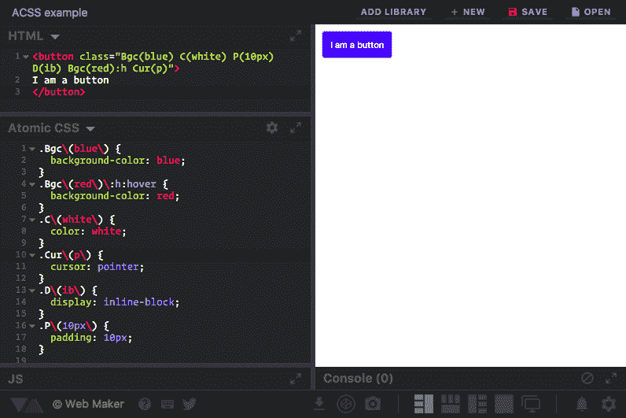

# 如何在团队中用 ACSS 编写更好的 CSS——一个动态的原子 CSS 库

> 原文：<https://www.freecodecamp.org/news/acss-a-dynamic-atomic-css-library-402dff9756e0/>

kushagra gour

# 如何在团队中用 ACSS 编写更好的 CSS——一个动态的原子 CSS 库


Photo by [Štefan Štefančík](https://unsplash.com/photos/UCZF1sXcejo?utm_source=unsplash&utm_medium=referral&utm_content=creditCopyText) on [Unsplash](https://unsplash.com/?utm_source=unsplash&utm_medium=referral&utm_content=creditCopyText)

编写好的级联样式表(CSS)是困难的，在有多个开发人员编写 CSS 的团队中会变得更加困难。

通过这篇文章，我试图向你介绍一种写(或不写…我们会看到)CSS 的方法。这种方法解决了当今团队中写得很差的 CSS 所面临的几乎所有问题。

但首先，让我设定一些我的文章成立的基本条件。

#### 本文假设了几个条件:

1.  你在一个团队中工作，团队中有多个开发人员编写 CSS。
2.  除非有自动化工具，否则指导方针很难实施。
3.  设计师是自由鸟。重新设计时有发生。

在这种情况下，**我将提出一个银弹解决方案，来解决我们面临的几乎所有由糟糕的 CSS 造成的问题**(记住，CSS 并不坏。写得不好的 CSS 就是)。让我们从这些问题开始。

> **免责声明**:我绝不是本文所述解决方案的附属机构。我只是一个感受到团队中糟糕 CSS 之痛的开发人员，并希望与其他开发人员分享我对如何克服它的想法。这篇文章可能听起来很有推广性，但这只是因为我很高兴能把它带给大家。

### 问题#1:命名类很困难

***开发者 1(编码时)*** *:看起来像是一个头，让我用`.header`选择器。*

***开发者 2(在拉请求)*** *:* T *他的不是头。对我来说它看起来像一个标题。此外，我们不能只称它为“header ”,因为这个元素不够通用。姑且称之为`.panel-header`或者更好的`.panel-title`。*

想出有意义的名字是最难解决的问题。这也是最难学的一点，因为你无法知道什么是“有意义的”名字。你只能举一些没有意义的例子，这只能有所帮助。此外，这不仅仅是“有意义”。CSS 中的类也需要确保它们将来不会与其他类名冲突，因为新开发人员可能会对他的类使用相同或相似的名称。

#### **可用解决方案:**

*   [**BEM**](https://en.bem.info/methodology/)**——**像 BEM 这样的命名约定的存在在一定程度上解决了这个问题。但最终它是一个指导方针(我们都知道遵循指导方针是多么容易)。BEM 可能会阻止你去完全特设，但你仍然需要想出一个组件的初始类名。
*   原子类(Atomic classes)——如今另一种用原子类实现完全原子化的常见方法。只做一件事的小班。例如[超光速粒子](http://tachyons.io/)。将它们混合搭配，获得你需要的东西。这是完全“跳过命名”的一个很好的步骤，但是如果将来某个特定的事物不存在类呢？如何根据我的设计定制现有的原子类？不管我是否使用它们，所有的类总是加载到我的页面上吗？我们需要更多的东西。

### 问题#2:选择器优势

CSS 开发人员需要不断意识到的另一件事是，他们的 CSS 中的特殊性不会失控。如果你有很长的复杂的选择器，你的 CSS 变得不可预测，难以维护和调试。Harry Roberts 写了很多文章，讨论为什么这样不好，以及 T2 如何解决这个问题。

#### **可用解决方案:**

这个问题的最佳解决方案是简单地将您的选择器限制在一个类中。没有链接，没有嵌套，没有 id。上面提到的 BEM 命名和原子类都会在 CSS 中产生单一的类选择器，因此有助于解决这个问题。

### 问题#3:未使用的 CSS 怎么办？

CSS 是呈现阻塞的，因此只同步加载页面的关键 CSS 而异步加载其余的 CSS 是非常重要的。出于同样的原因，通过剥离未使用的 CSS 来防止 CSS 膨胀也变得很重要。

#### **可用解决方案:**

[很多](https://github.com/purifycss/purifycss) [工具](https://github.com/giakki/uncss)吹嘘提取出一个页面用过的 CSS。但是随着单页应用的出现，这变得比以往更加困难。我不确定它们的可靠性和效率如何，但是仍然需要对你的 CSS 进行额外的后期处理。

### 问题#4:重构

***开发者 1*** *:这个 CSS 变得相当乱。我认为我们应该重构它。*

***开发者 2*** *:你觉得你修改的这个选择器可能也会用在 X 页上吗？你检查过了吗？*

***开发者 1*** *:哎呀妈的！你是正确的…我错过了。X 页太重要了，不能碰。你知道为什么开发者在两个页面上使用相同的类吗？*

***开发商 2*** *:不知道。他离开了公司。让我们让 CSS 保持原样:(*

我在这里没什么好说的了。那段对话解释了一切。

如果要我总结以上问题，我会说写出好的(可伸缩的、可读的、可维护的)CSS 是绝对可能的。然而，在一个庞大的团队中这样做是极其困难的。即使你试图在团队中把它做好，也需要有人不断努力来执行所有的最佳实践。

> 在一个团队中，最不明显但完美的解决方案是——停止编写 CSS！

“等等，你说什么？那不可能！”。你可能会这么想，但是让我给你介绍一些东西。

### 一体化解决方案— ACSS(雾化器)

ACSS (源自 Atomic CSS)是一个基于组件的框架，通过 Yahoo！而 [**雾化器**](https://github.com/acss-io/atomizer) 是一个实际上促进这一点的工具。我再解释一下。但在此之前，让我告诉你如何在 ACSS 中做造型。

> 为了遵循本文中的代码示例，我建议您在 Chrome 浏览器上安装 Web Maker (一个支持编写 ACS 而无需任何构建设置的前端平台)。

现在假设你有一个按钮，需要用通常的填充、背景、颜色等属性来设计。这是它在 ACSS 中的样子:

```
<button class="Bgc(blue) C(white) P(10px) D(ib) Cur(p) Bgc(red):h"> I am a button</button>
```

**一个建议——不要通过第一次看这个语法就做出判断。**继续读，给它时间，讨论，然后决定。标签上的类可能看起来不同，但是你会同意它们做什么在很大程度上是可猜测的。这是一个按钮，上面有*蓝色*T1、*白色*T2、*10px*T3、*内嵌块* `**d**isplay`、*指针* `**cur**sor`，悬停时变为*红色* `background-color`。

如果你已经安装了 [Web Maker](https://webmakerapp.com) ，点击浏览器右上角的 Web Maker 图标打开它。将上面的 HTML 粘贴到 HTML 代码窗格中，并在 CSS 代码窗格中选择**原子 CSS** 作为模式。一旦你这样做了，你会在 CSS 代码窗格中看到一些自动生成的 CSS，就像这样:



你看到的 CSS 是我上面提到的*雾化器*工具生成的。基本上，它读取 HTML(或任何文件)，从中检测 ACSS 类，并为这些检测到的类生成 CSS。所以你只需用你想使用的适当的类编写 HTML，CSS 就自动生成了！

现在我们知道了如何在 ACSS 中进行样式设计，让我们看看它是如何成为你的团队所能拥有的最好的 CSS 方法。

#### 内联，但不是内联？

如你所见，我们总是在标签上写类。这就是我所说的内嵌样式。但请不要把它与[](https://www.codecademy.com/articles/html-inline-styles)****【内联文体】混淆。**与内联样式不同，我们的内联类在一个可缓存的样式表中转换成实际的 CSS 类。所以基本上我们得到了和内联样式一样的能力(快速写东西)，但是仍然得到完全有效的原子 CSS 作为输出。**

#### **不再命名！？**

**我绝对喜欢的优点。你永远不需要为一个类想一个好的、有语义的、不冲突的名字。**

**有一句非常著名的谚语说:**

> **计算机科学只有两个硬东西:缓存失效和事物命名。— **菲尔·卡尔顿****

#### **超级简单的更新和重构**

**转到 HTML 并更改类来更新一些样式。从任何地方移除任何类，而不用担心破坏其他地方的任何东西。**

#### **没有一个字节未使用的 CSS？**

**因为 Atomizer 从您实际使用的类中生成 CSS，所以您的样式表中永远不会有未使用的 CSS。这不就是我们一直在寻找的疯狂表演吗？还有一个工具可以让你检查一个网站能从 ACSS 中获益多少—[https://atomize-io.herokuapp.com/](https://atomize-io.herokuapp.com/)**

#### **没有针对新开发人员的指南？**

**作为 CSS 入门的一部分，你需要给新开发人员的只是一个 ACSS 的语法指南和一个类引用链接——https://acss.io/reference 的 T2。在这个页面中，您可以轻松地在 ACSS 类中搜索任何属性:value。当你不断使用它的时候，甚至这个惯例也会嵌入你的记忆中。**

**此外，还有一个由 [Pankaj Parashar](https://twitter.com/pankajparashar) 开发的漂亮的小[可视化代码扩展](https://marketplace.visualstudio.com/items?itemName=pankaj-parashar.atomizer)，它在编辑器中自动建议这些类。所以这个扩展甚至不需要引用。开发人员入职已完成！**

**除了这些优点之外，ACSS 还有几个优点。**

*   **我们通常在应用程序中使用相同的旧属性/值对。因此， [**生成的样式表在某个点**](https://medium.com/@johnpolacek/by-the-numbers-a-year-and-half-with-atomic-css-39d75b1263b4) 之后基本上停止增长。因为每个惟一的属性/值对在最终的样式表中只出现一次。**
*   **由于上述原因，您实际上可以在多个产品的套件中使用相同的样式表，因为它不会太大。所有产品都使用相同的缓存 CSS 样式表！**
*   **感觉像做梦一样的拉请求。想象一下在你看不到请求的地方拉请求。css 文件。不再检查类的意义或特殊性冲突。因为你知道应该存在的正确的原子 CSS 将被生成。那岂不是仙境？**

### **打破神话**

**互联网上出现了许多关于 ACS 的神话。这是因为对框架的浅薄评价和第一眼的判断。**

#### **它与内嵌样式相同。很糟糕！**

**不，不是的。上面我们已经看到了。它肯定和内联样式一样强大，但是没有继承它的缺点。**

#### **很难一遍又一遍地编写所有这些相同的类。**

**是的，它是。ACSS 说这是一个基于组件的框架。如果你没有模板化你的每一个组件，并且已经在复制 HTML，比如说每次都创建一个按钮，ACSS 不适合你。**

**例如，您应该使用抽象的按钮组件来创建按钮，如下所示:**

```
`<MyButton primary>Hello World</MyButton>`
```

**它应该被编译成这样:**

```
`<button type="button" class="D(ib) P(20px) Cur(p) Bgc(blue) Bgc(red):h">Hello World</button>`
```

#### **这些课程毫无意义**

**我同意它们是不同的，乍看起来可能令人厌恶。但是每个原子类框架都有自己的命名惯例。相信我，ACSS 有最好的命名规则。[阅读更多关于他们为什么选择这样的命名](https://github.com/thierryk/ACSS-QA/blob/master/why-atomizer-did-not-use-more-readable-class-names.md)的信息。**

**我想引用哈里·罗伯特的文章中的一段话:**

> **反对 BEM 的一个常见论点是它很丑；我敢说，如果你回避纯粹基于外观的代码，那么你就没有抓住要点。除非代码变得不必要的难以维护，或者确实更加难以阅读，那么也许你*在使用它之前需要三思，但是如果它“只是看起来奇怪”但是有一个有效的目的，那么在放弃它之前绝对应该充分考虑它。— **哈利·罗伯特*****

**但是现在，我们使用 BEM 来使我们的代码库变得合理。**

#### **我将不能在 ACSS 中做 X 事情**

**你会惊讶地发现，仅仅通过 ACSS 提供的课程，一切皆有可能。伪元素、flexbox、媒体查询，应有尽有。他们想出的做所有这些事情的惯例简直太棒了！尽管有些事情在 ACSS 中还不可能实现，比如 CSS 网格，但是你总是可以[开一个问题或者贡献给 Atomizer](https://github.com/acss-io/atomizer/issues) 。**

### **最后**

**如果你理解在团队中编写和管理 CSS 的痛苦，我请求你尝试一下 ACSS。记住，使用 ACSS 并不意味着你不能写普通的 CSS。工具应该用在最有效的地方。如果有什么东西你觉得普通 CSS 更适合，你一定要用它。**

**此外，ACSS 并不是唯一采用这种方法的公司。还有类似的选择，如[吹干 CSS](http://blowdrycss.readthedocs.io/en/latest/) 、[细胞 CSS](http://cellcss.com/) 等，每一个都带来了他们自己的风格来实现同样的事情。**

**如果你有任何关于 ACSS 的问题，你可以在[推特](https://twitter.com/thierrykoblentz)上 ping [来自 ACSS 团队的蒂埃里·科布伦茨](https://twitter.com/thierrykoblentz)。[在他维护的 FAQ 汇编](https://github.com/thierryk/ACSS-QA/)上提问或者[在 Gitter](https://gitter.im/acss-io/atomizer) 上加入雾化器小组。或者放入这篇文章的评论。**

**最后，我要感谢[蒂埃里·科布伦茨](https://twitter.com/thierrykoblentz)和[吉滕德拉·维亚斯](https://twitter.com/jitendravyas)审阅这篇文章。**

**如果你喜欢这篇文章，用鼓掌来表达你的爱？？在文章上。也请在 Twitter 上关注我，在那里我会分享更多的前端文章和我的附带项目。**

### **更多阅读**

*   **[https://www . smashingmagazine . com/2013/10/challenged-CSS-best-practices-atomic-approach/](https://www.smashingmagazine.com/2013/10/challenging-css-best-practices-atomic-approach/)——Thierry Koblentz**
*   **雾化器 GitHub repo—[https://github.com/acss-io/atomizer](https://github.com/acss-io/atomizer)**
*   **ACSS 文档—[https://acss.io/quick-start.html](https://acss.io/quick-start.html)**
*   **蒂埃里编译的 ACSS 常见问题—[https://github.com/thierryk/ACSS-QA](https://github.com/thierryk/ACSS-QA)**
*   **ACSS 游乐场—[https://webmakerapp.com](https://webmakerapp.com)**