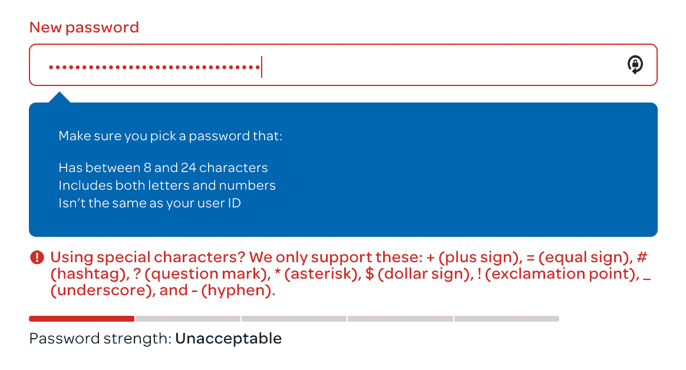
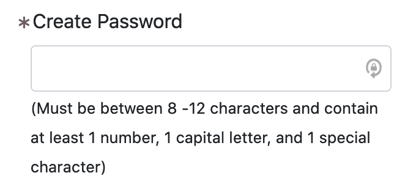

# 如何创建一个真正安全的密码

> 原文：<https://www.freecodecamp.org/news/actually-secure-passwords/>

我非常厌倦看到任意的密码规则，每个网络或移动应用程序都不一样。这就好像这些应用程序没有遵循一个标准，只是制定了自己的规则，而这些规则并不是基于良好的安全实践。

我经常看到这样的密码输入要求:

Apparently, my password is 'unacceptable' for AT&T because it's more than 24 characters long...

12 characters is an arbitrary number! This website actually wants you to be less secure.

是谁想出了这样一个主意:你需要一个只有某些普通人不可能记住的符号的短密码？

XKCD 在这里提出了一个很好的观点:

## 更安全的密码

几十年前，人们建议使用包含数字和符号的更复杂的密码，以使它们更安全。这不再是安全专业人士的建议——甚至那些曾经推荐更复杂密码的人现在也说这种做法已经过时了。

安全测试表明，让密码更安全的最佳方法是简单地让密码更长，并为每个应用程序或网站使用唯一的密码。它们甚至不需要很花哨或者完全随机。但是您应该使用密码管理器来生成它们。

我推荐使用 [1Password](https://1password.com/) (浏览器) [Encryptr](https://spideroak.com/encryptr/) (桌面)，或者 [RoboForm](https://www.roboform.com/) (浏览器)。然后，你只需要记住一个密码，并让密码管理器为你使用的每个应用程序或网站生成一个唯一的密码。

### 更多信息

*   这里是安全研究员特洛伊·亨特关于创建密码的最佳实践的完整列表。
*   如果你想深入了解密码强度评估，我强烈推荐丹尼尔·惠勒在 Dropbox 的演讲。

## 结论

记住，设置更长的密码，通过阅读特洛伊·亨特的文章来自学，并使用密码管理器。

我希望你喜欢这篇简短的文章。请在评论中告诉我您的反馈或其他建议。

以下是您联系我的方式:

*   gwenf@protonmail.com
*   [https://gwenfaraday.com](https://gwenfaraday.com)
*   [法拉第学院 YouTube 频道](https://www.youtube.com/channel/UCxA99Yr6P_tZF9_BgtMGAWA)