# 如何给 React 项目添加一个完美的数据库钩子

> 原文：<https://www.freecodecamp.org/news/add-a-database-hook-to-react-and-react-native/>

## 介绍

React 是创建有状态接口的最佳库之一，也是我们所知的互联网的重要组成部分。

包括 Twitter、脸书、Instagram 和 Airbnb 在内的许多 web 应用程序都依赖这个库来为数十亿用户提供有状态的跨平台应用程序。它仍然是同类图书馆中最受欢迎的。

## 反应钩–游戏规则改变者

React 16.8 引入了一个叫做*钩子*的**新开发模式**。这个新特性将库带到了一个全新的地方，使得在函数而不是类的上下文中编写和理解组件比以往任何时候都更容易。

请看这张 Gif 图,从开发者的角度来看，这些功能组件的效率究竟有多高:

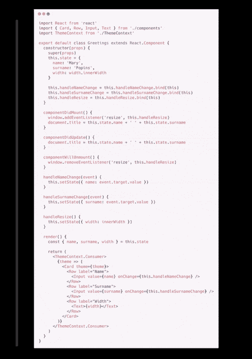

Twitter: Pavel @prchdk

React 中有各种类型的钩子，这是有原因的。不同的任务需要不同的钩子，从存储变量到记忆函数。

这些钩子中的许多都具有所谓的*依赖数组*的特性。钩子监视数组中变量的变化，如果观察到任何变化，它将重新运行。

以`useEffect`挂钩为例。当组件第一次挂载时，以及每当依赖关系数组中的有状态变量发生变化时，该挂钩都会运行:

```
const [count, setCount] = useState(0);

useEffect(() => {
  console.log(count); 
}, [count]);
```

在上面的代码片段中，`count`将在两种情况下被记录:

1.  当组件首次安装时
2.  当使用`setCount`改变`count`的值时

尽管关于钩子还有很多东西要深入研究，但是理解上面的概念对于本文的其余部分是必不可少的。这是因为在其中，我们将演示如何使用这个依赖数组来自动重新获取中央数据，类似于它如何重新运行`useEffect`钩子。

## 数据库设置

React 应用程序的几乎每个生产实例都会在某个时候使用数据库，无论是存储用户信息、业务信息还是 API 数据。

在 React 或 React 本机应用程序中实现数据库的方法有很多，但是有一些特定的方法可以很好地与 React 编程模式集成，特别是*钩子*。

在 React 应用的各种托管解决方案中，您会发现使用[无服务器架构](https://easybase.io/about/2021/01/30/What-Is-a-Serverless-Application/)的好处最大。我可以写无服务器架构的所有好处，但那也可以是一篇独立的文章。仅举几个例子:

*   按需自动扩展
*   超级易于部署
*   忘记服务器管理和维护
*   更多时间用于 UI/UX
*   成本费用变为 0

下面演示的方法将无服务器应用程序开发的所有优势与一个定制挂钩结合起来，该挂钩与 React 编程生态系统完美地配合工作。

对于那些想知道的人来说，是的，下面介绍的库也适用于面向移动优先开发者的 React Native。

我们将最终拥有一个名为`useReturn`的钩子，它将总是返回一个给定查询的新实例。它看起来会像下面这样:

```
const [minRating, setMinRating] = useState(0);
const { frame } = useReturn(() => /* Your query */, [minRating])

return <div>{frame.map(ele => <Card {...ele} />)}</div>
```

不要担心这会儿语无伦次。在几分钟内，您将能够完美地适应您的用例。

注意，在这个例子中，`frame`实例是数据库中的一组记录，它将在两种情况下被更新:

1.  `minRating`(或依赖数组中的任何内容)发生变化
2.  数据库的另一个实例(`db`)创建、更新或删除数据

## 反应设置

本节将简要演示如何创建一个 React 项目。如果你已经熟悉了，请随意跳到下一部分。

React 的开发团队创建了一个名为`create-react-app`的易用脚本。唯一的先决条件是你的机器已经安装了`node`和`npm`，这是你无论如何都需要的。

因此，如果你还没有这些软件包，请按照这里的指示快速安装它们。

在希望放置新项目的目录中打开命令提示符或终端。运行以下命令:

```
# npx create-react-app serverless-app
```

该过程完成后，进入`serverless-app`目录，并像这样启动项目:

```
# cd serverless-app
# npm run start
```

这将创建一个应用程序的本地实例，当位于`src/`文件夹中的文件被编辑时，该实例将自动重新加载(称为*热加载*)。应该会自动弹出一个浏览器窗口。如果没有，请打开您的网络浏览器，前往`http://localhost:3000`。

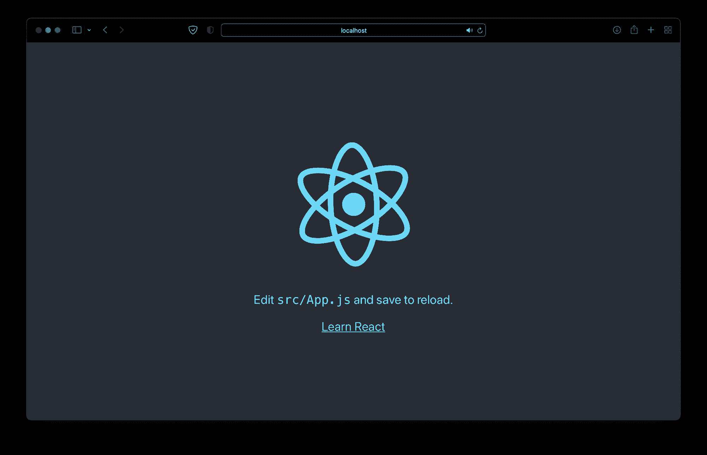

## Easybase 设置

让我们通过进入我们的项目目录并执行`npm install easybase-react`来安装一个名为`easybase-react`的库。这是我们在这个演示中唯一需要的依赖项。

接下来，在 [easybase.io](https://easybase.io) 创建一个账户(可以使用免费层)。

登录后，使用“ **+ Create** ”按钮创建一个新表。让我们将它命名为*我的表*，并给它三列:评级(数字)、海报(图像)和标题(字符串)。

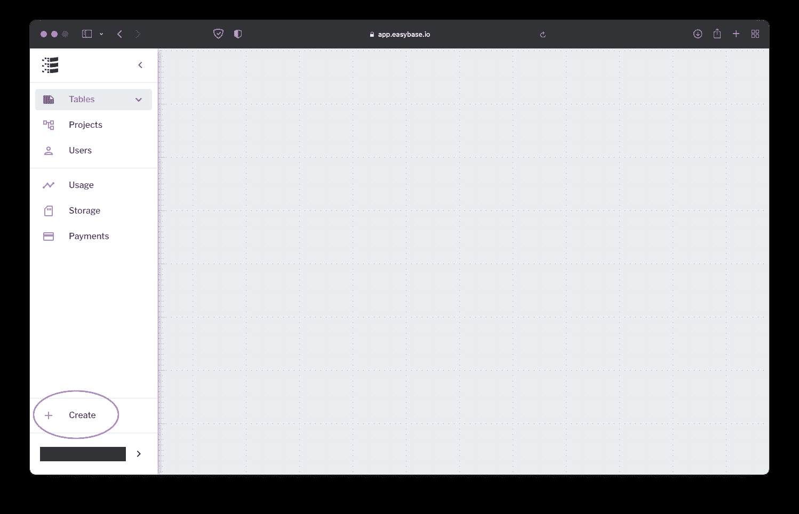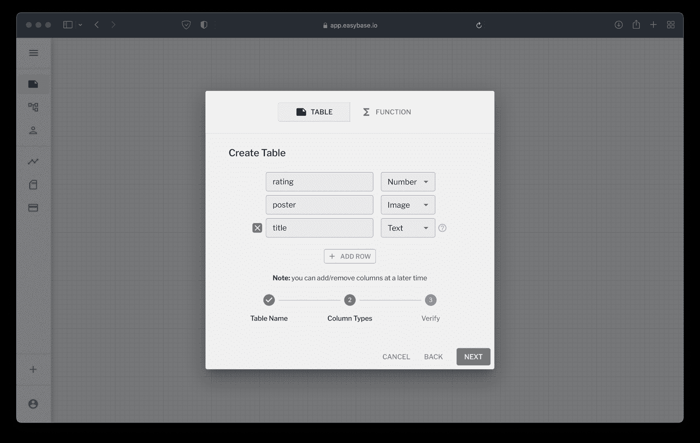

点击*下一个*，完成下一个表格的创建。它会自动弹出，但是您也可以展开左侧抽屉中的*桌子*按钮来选择它。


出于演示目的，让我们添加一个示例行，以便在 React 应用程序中显示它。使用表格左上角的“ **+** ”按钮添加新行。

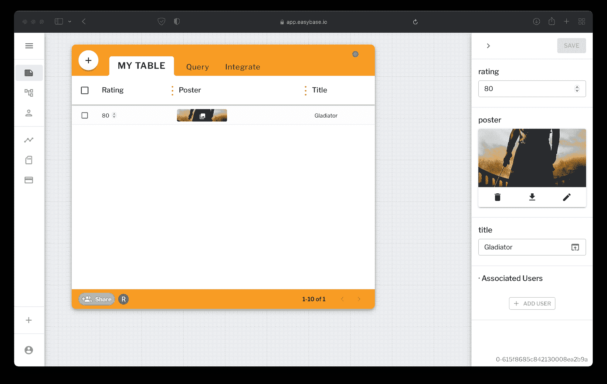

我的示例将以电影数据为特色，但是您可以随意使用最适合您的应用程序的任何类型的数据。

在我们回到代码之前的最后一步是在 Easybase 接口中创建一个新的*项目*。这将为我们提供一个配置文件，使我们的应用程序能够安全地访问数据库。保持此配置文件为私有，因为它包含可用于访问您的数据的凭据。

在左手边的抽屉里头为'**项目>创建项目**。


转到*权限*。点击您的表名，使未登录>的**用户能够读取、写入**。

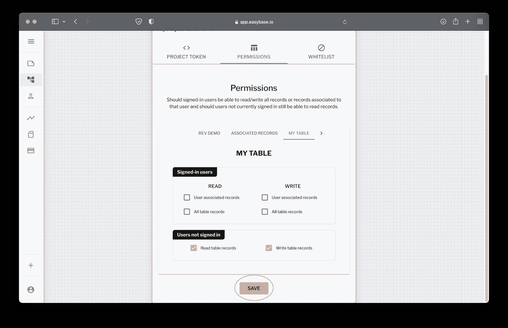

**别忘了点击“保存”。**

最后，转到*项目令牌*选项卡并下载您的定制配置令牌。

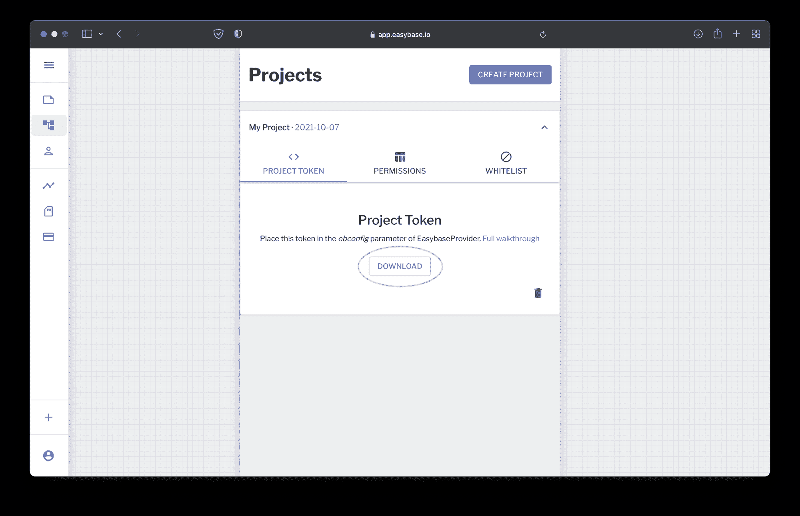

将这个标记放在 React 项目中的`App.js`旁边，这样结构如下所示:

```
├ ...
├ ebconfig.js
├ App.css
├ App.js
├ index.js
└ ...
```

现在让我们回到代码上来。在 React 项目中打开`src/index.js`文件。首先，从我们之前安装`easybase-react`包中导入*EasybaseProvider***和**我们的自定义`ebconfig.js`令牌。然后，用`<EasybaseProvider ebconfig={ebconfig} >`包裹`<App />`:

```
import React from 'react';
import ReactDOM from 'react-dom';
import './index.css';
import App from './App';
import reportWebVitals from './reportWebVitals';
import ebconfig from './ebconfig'; // Add this
import { EasybaseProvider } from 'easybase-react'; // Add this

ReactDOM.render(
  <React.StrictMode>
    <EasybaseProvider ebconfig={ebconfig}> {/* <-- */}
      <App />
    </EasybaseProvider> {/* <-- */}
  </React.StrictMode>,
  document.getElementById('root')
);
```

不要忘记在 *ebconfig* 道具中传递你的配置文件。

这种被称为*提供者模式*的设置为 React 项目中的所有组件提供了对该提供者的上下文的有效访问，这是跨组件组织状态的最佳方式(加上它是本机支持的)。在我们的例子中，这是一个名为`useEasybase`的钩子。

### 使用 Easybase 挂钩

至此，项目配置完成。转到`src/App.js`，删除导入和`App`函数中的所有内容。

现在，让我们用`easybase-react`包来设置我们的第一个组件。对于`[useEasybase](https://easybase.io/docs/easybase-react/interfaces/types_types.contextvalue.html)`[(附:有很多)](https://easybase.io/docs/easybase-react/interfaces/types_types.contextvalue.html)的任何属性，这个过程可以在你的项目中重复。

首先，从`easybase-react`包中导入`useEasybase`。让我们这样抓住`useReturn`、`db`、`e`:

```
import { useEasybase } from 'easybase-react';

function App() {
  const { useReturn, db, e } = useEasybase();
  return (

  );
}

export default App;
```

你可能想知道——这些功能是什么？

`db`–顾名思义，该功能允许我们访问数据库。它是这样工作的:

```
let records = await db('MY TABLE').return().all()
```

这是一个非常简单的例子，但是`db`函数非常强大。[点击此处了解更多信息。](https://easybase.github.io/EasyQB/)

`e`–这代表*表达式*。在`db`函数中使用它来构建`db`的`.where`函数中的查询。以`e.eq("column_name", value)`的形式使用 [`eq`(等于)](https://easybase.github.io/EasyQB/docs/operations.html#equal)[`neq`(不等于)](https://easybase.github.io/EasyQB/docs/operations.html#not-equal)[`lt`(小于)](https://easybase.github.io/EasyQB/docs/operations.html#less-than)[`or`(或语句)](https://easybase.github.io/EasyQB/docs/operations.html#or)[等众多](https://easybase.github.io/EasyQB/docs/operations.html)。这将查询*列名*等于*值*的记录。

现在我们可以使用*表达式*进行复合查询:

```
let records = await db('MY TABLE').return(e.avg('rating')).where(e.or(e.like('title', 'T%'), e.lt('rating', 80))).all();

// e.avg = Return the average of 'rating' where:
//   e.or = OR statement on: 
//     e.like = string matching pattern [title starts with 'T'] 
//     e.lt = less than [rating < 80]
```

你可以使用更多的操作，包括强大的聚合器。

最后，这是之前提到的那个钩子。它通过包装`db`函数来工作。钩子自动订阅`db`中的变化。最重要的是，它将为我们提供对有状态数据阵列的访问，称为`frame`。

```
const { useReturn, db, e } = useEasybase();
const { frame } = useReturn(() => db().return()
  .where(e.gt('rating', minRating)) // Where rating > minRating     
  .limit(limit),                    // Limit query length 
[minRating, limit]); // Also returns some helpers: 
                     //   'error' - any
                     //   'loading' - boolean
                     //   'manualFetch' - async function
                     //   'unsubscribe' - function
```

**不要在`useReturn`钩子中使用`.all`或`.one`，**这是自动处理的。欲了解更多信息，[请看这里的文档](https://easybase.io/docs/easybase-react/interfaces/types_types.contextvalue.html#usereturn)。

### 第一部分

让我们在我们的空`src/App.js`中使用这些函数如下:

```
import { useEasybase } from "easybase-react";

function App() {
  const { useReturn, db, e } = useEasybase();
  const { frame } = useReturn(() => db("MY TABLE").return(), []);

  return (
    <div>{frame.map(ele => JSON.stringify(ele))}</div>
  );
}

export default App;
```

作为演示，这将简单地显示当前表中的单个记录的字符串表示:

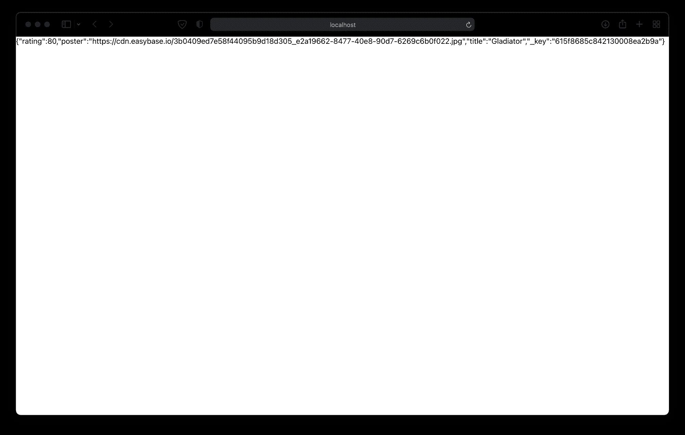

**恭喜，您的数据库已经上线并正常工作。**现在，让我们实现一个名为`<Card />`的定制组件，它将在 UI 中为我们的记录提供一些结构(可以随意将这些组件放在单独的文件中进行组织):

```
function Card({ rating, poster, title, _key }) {
  const cardStyle = {
    display: "inline-block",
    margin: 10,
    padding: 10,
    borderRadius: 10,
    background: "#eaeaea",
    minWidth: 200,
  };

  return (
    <div style={cardStyle}>
      
      <h2>{title}</h2>
      <h4>Rating: {rating}</h4>
    </div>
  );
}

function App() {
  const { useReturn, db, e } = useEasybase();
  const { frame } = useReturn(() => db("MY TABLE").return(), []);

  return (
    <div style={{ textAlign: "center", display: "inline-block" }}>
      {frame.map(ele => <Card {...ele} />)}
    </div>
  );
}
```

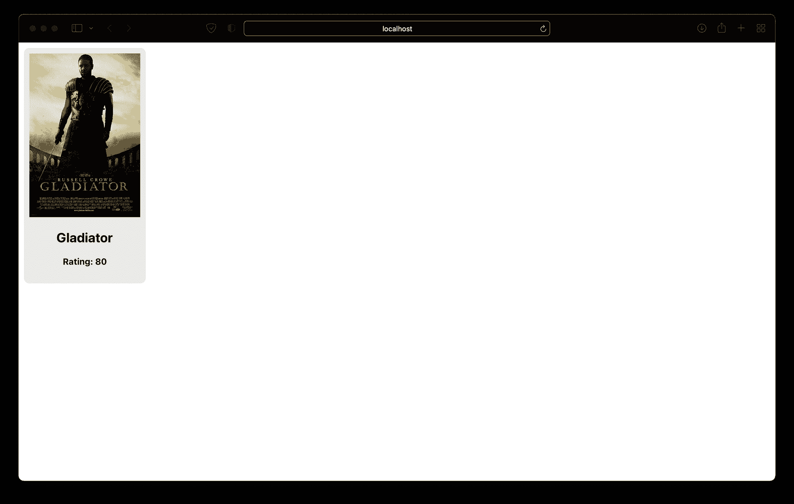

那看起来好多了。为了简洁起见，我将保持我的样式简单。请随意给这个项目你自己的样子！

您可以看到，`<Card />`使用原始记录中的所有属性作为其道具，外加一个名为 _ *key* 的道具。*_key* 是与其他属性一起返回的每个记录的唯一标识符。这对于查询和更新特定记录将非常有用。稍后会详细介绍。

### 插入记录

现在，让我们快速实现一种向数据库添加新卡的方法。这也将演示当我们添加一个包含不同组件的记录时，`useReturn`钩子如何自动刷新。

在我们*映射*帧数组后，显示一个新的按钮:

```
// ...

function AddCardButton() {
  const addCardStyle = {
    background: "#ea55aa",
    display: "inline-block",
    width: 200,
    borderRadius: 10,
    cursor: "pointer",
  };

  return (
    <div style={addCardStyle}>
      <h2 style={{ color: "#fff" }}>Add Card</h2>
    </div>
  );
}

function App() {
  const { useReturn, db, e } = useEasybase();
  const { frame } = useReturn(() => db("MY TABLE").return(), []);

  return (
    <div style={{ textAlign: "center", display: "inline-block" }}>
      {frame.map(ele => <Card {...ele} />)}
      <AddCardButton /> {/* <- New button */}
    </div>
  );
}
```

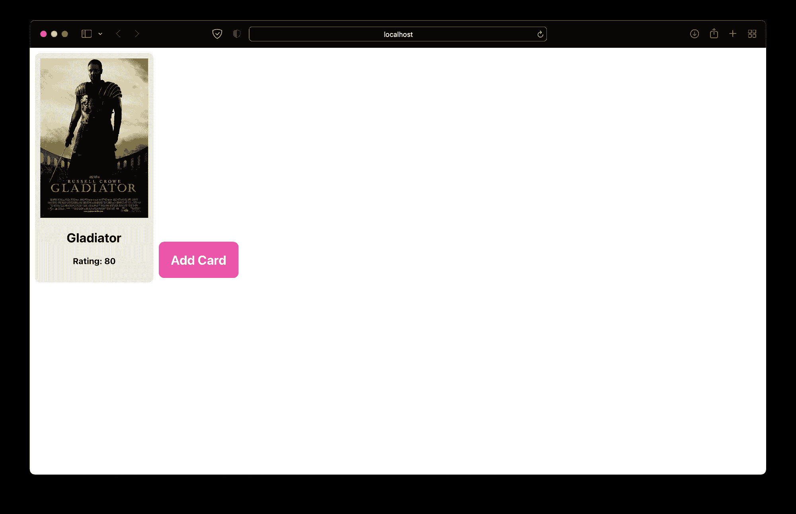

在 React 或 React 本机应用程序中，有许多不同的方法来收集用户输入。在这种情况下，我将使用内置的`[prompt](https://developer.mozilla.org/en-US/docs/Web/API/Window/prompt)`函数，但是您也可以使用表单、对话框等等。

一旦我们收集了新记录的详细信息，使用`db`功能上传它们。所以，让我们再次使用那个`[useEasybase](https://easybase.io/docs/easybase-react/interfaces/types_types.contextvalue.html)`钩子。我们将使用`[.insert](https://easybase.github.io/EasyQB/docs/insert_queries.html#insert)`，而不是`.return`(稍后我们将探讨上传图像)。

在代码中，其实现可能如下所示:

```
function AddCardButton() {
  // ...

  const { db } = useEasybase();
  async function addCardClick() {
    let title = prompt("Please enter a movie title");
    let rating = prompt("Please enter the rating for this movie");
    if (!rating || !title) {
      return;
    }

    db("MY TABLE")
      .insert({ title, rating: Number(rating) })
      .one();
  }

  return (
    <div style={addCardStyle} onClick={addCardClick}> {/* <- onClick */}
      <h2 style={{ color: "#fff" }}>Add Card</h2>
    </div>
  );
}
```

单击新建按钮并输入一些值。

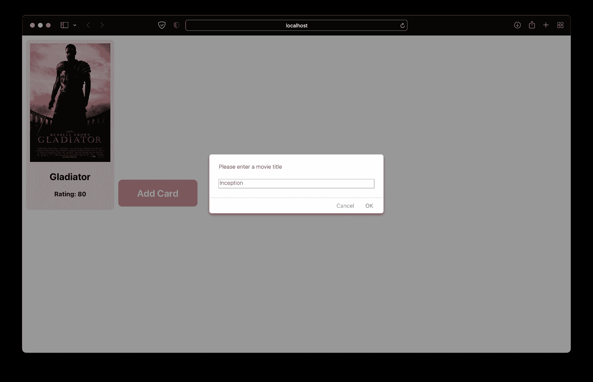

又来了，新纪录！

最后，我们用`[setImage](https://easybase.io/docs/easybase-react/interfaces/types_types.contextvalue.html#setimage)`函数添加对应的图像，来自`useEasybase`。媒体(图像、视频、文件)被视为不同于其他值，需要*上传*，而不是*插入*。

在这里，我们最终可以使用 **_key** 属性来惟一地标识当前记录。那个属性也常用`db.set`、`db.delete`等等。

当用户点击一张图片(或空白图片空间)时，他们将能够上传一张新的图片。`useReturn`将再次显示它会自动刷新新数据。

回到`<Card />`组件，并把那个`useEasybase`钩子带进来。使用*隐藏*输入也是让图像看起来像文件输入的常用技巧:

```
function Card({ rating, poster, title, _key }) {
  // ...

  const { setImage } = useEasybase();
  async function onFileChange(e) {
    if (e.target.files[0]) {
      await setImage(_key, "poster", e.target.files[0], "MY TABLE");
    }
  }

  return (
    <div style={cardStyle}>
      <input id={"fileInput" + _key} hidden type="file" onChange={onFileChange} />
       document.getElementById("fileInput" + _key).click()}
      />
      <h2>{title}</h2>
      <h4>Rating: {rating}</h4>
    </div>
  );
}
```

现在，点击一个`<Card />`图像会弹出一个文件选择器。使用选择器从您机器上传图像。

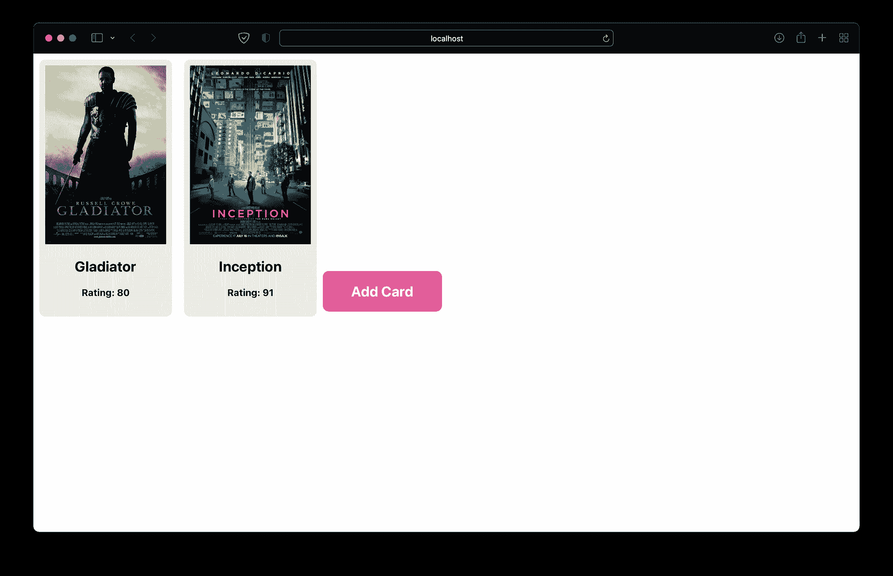

**管用！**上传的图片将通过 Easybase CDN 提供，并附在您的记录中。`frame`应该会自动显示出来。

请注意，这些变化也反映在 Easybase web 应用程序中:

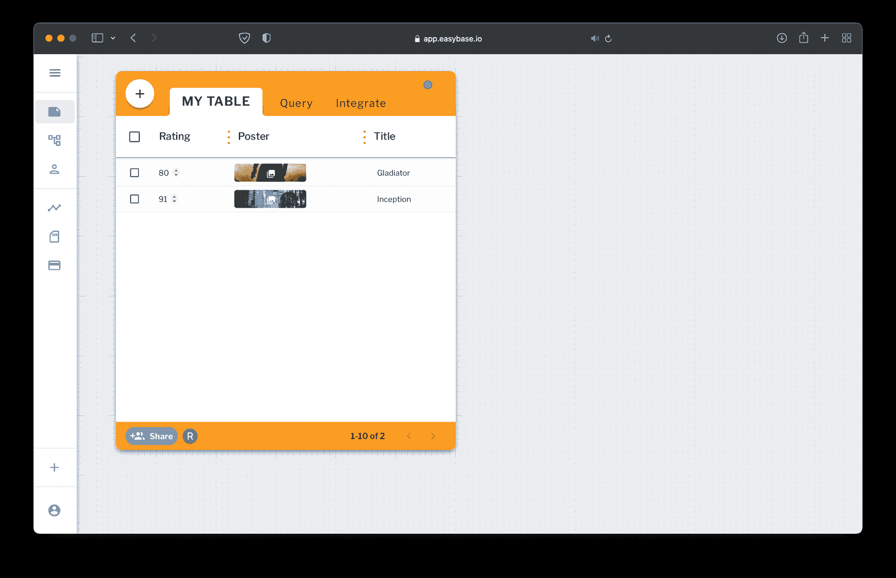

### 询问

让我们再添加一个组件来演示如何使用`useReturn`钩子的*依赖数组*。

作为演示，我将实现一个数字输入，当它发生变化时，会更新在`useReturn`钩子中使用的查询。

通常，您将在这些有状态查询的`db.where`函数中使用一个*表达式*。这里有一个简单的例子，包装根`<App />`并添加一个受控输入。请注意新的 *ratingMin* 变量:

```
import { useEasybase } from "easybase-react";

// ...

function App() {
  const [ratingMin, setRatingMin] = useState(0); // <- for new input
  const { useReturn, db, e } = useEasybase();
  const { frame } = useReturn(() => db("MY TABLE").return(), []);

  return (
    <div>
      <div style={{ textAlign: "center", display: "inline-block" }}>
        {frame.map(ele => <Card {...ele} />)}
        <AddCardButton />
      </div>
      <p>
        Rating filter:
        <input
          type="number"
          value={ratingMin} // controlled input
          onChange={e => setRatingMin(Number(e.target.value))}
        />
      </p>
    </div>
  );
}
```

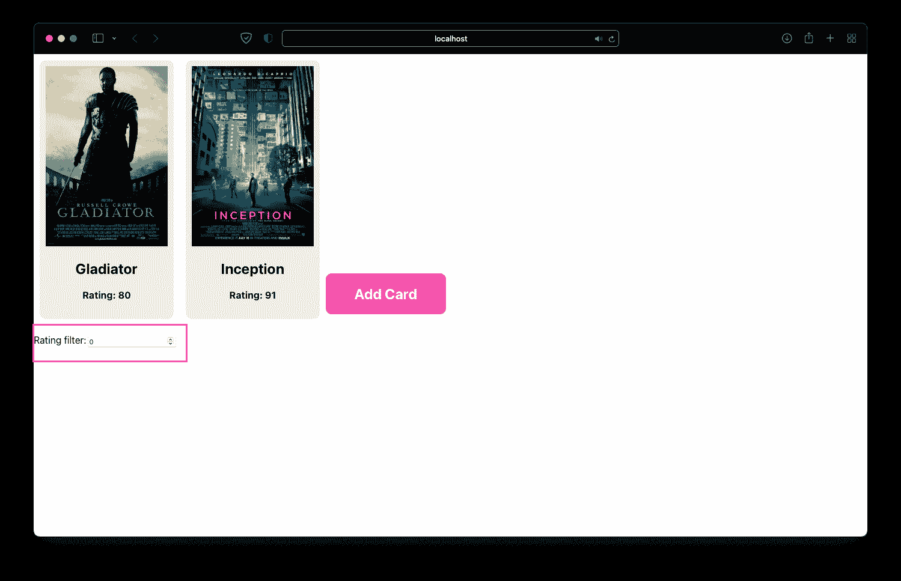

剩下要做的就是在`db`函数**中使用 *ratingMin* ，并**将其放入*依赖数组*。我们将使用`e.gte('rating', ratingMin)`来查询“评级”(列名)大于或等于`ratingMin`的记录:

```
function App() {
  const [ratingMin, setRatingMin] = useState(0); // <- for new input
  const { useReturn, db, e } = useEasybase();
  const { frame } = useReturn(
    () => db("MY TABLE").return().where(e.gte("rating", ratingMin)),
    [ratingMin]
  );
  // ...
}
```

就这样，您的`frame`响应状态变化并相应地更新查询:

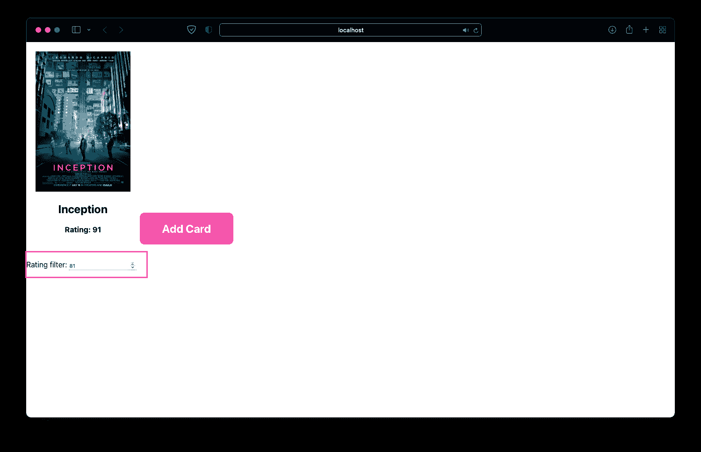

您可以添加任意多的记录。

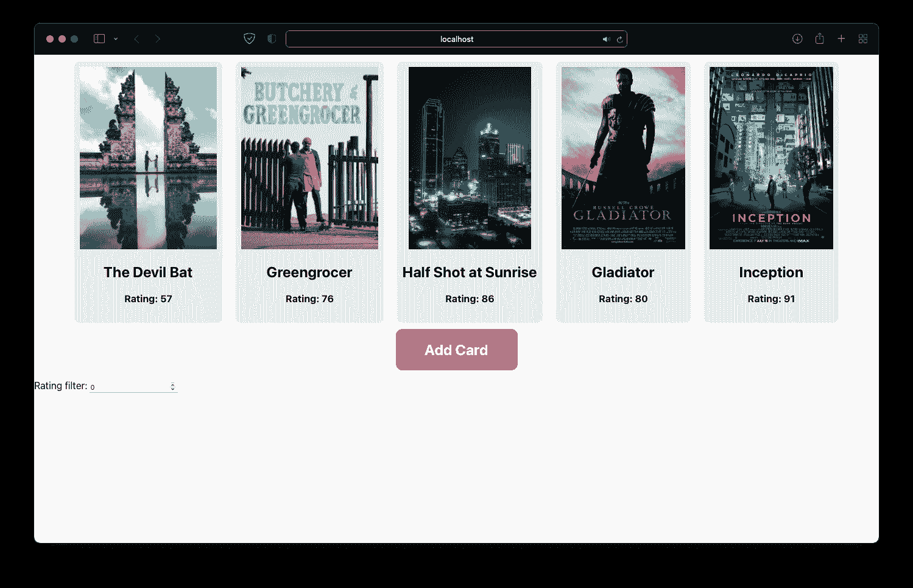

所有这些更改都将与您的远程数据库同步。专业提示:如果你有几千甚至几万条记录，使用`[.limit](https://easybase.github.io/EasyQB/docs/select_queries.html#limit)`和`[.offset](https://easybase.github.io/EasyQB/docs/select_queries.html#offset)`来实现分页。

## 结论

这个 [`easybase-react`](https://github.com/easybase/easybase-react) 包提供了很多有用的功能，你可能会觉得很有帮助，尤其是在用户认证和数据库方面。

如果你想用 React 和 React Native 看看这个库的所有功能，[看看这个演练](https://easybase.io/react/)。

本文中的[查询构建器](https://easybase.github.io/EasyQB/)的功能类似于 Firebase 数据库中使用的语法，并且非常灵活。例如，一个高级用例是选择带有*聚合器*的列，比如`[e.min](https://easybase.github.io/EasyQB/docs/operations.html#minimum)`和`[e.max](https://easybase.github.io/EasyQB/docs/operations.html#maximum)`。

此外，如果您的应用程序中有一些更复杂的业务逻辑，可以尝试一下`[dbEventListener](https://easybase.io/docs/easybase-react/interfaces/types_types.contextvalue.html#dbeventlistener)`处理程序。每当`db`实例运行任何查询时，它都会运行一个回调函数。它也是从`useEasybase`钩子返回的。

**感谢阅读！**这是对反应友好的有状态数据库钩子和*无服务器编程*的简单介绍，无服务器编程是个人和小型团队中流行的编程架构。

这种流行来自于没有传统的后端设置，而传统的后端设置需要大量的成本、时间和管理开销。

我希望这个演练有助于那些对部署生产就绪 React/React 本机应用程序感兴趣的人熟悉 Easybase 的`useReturn`钩子。