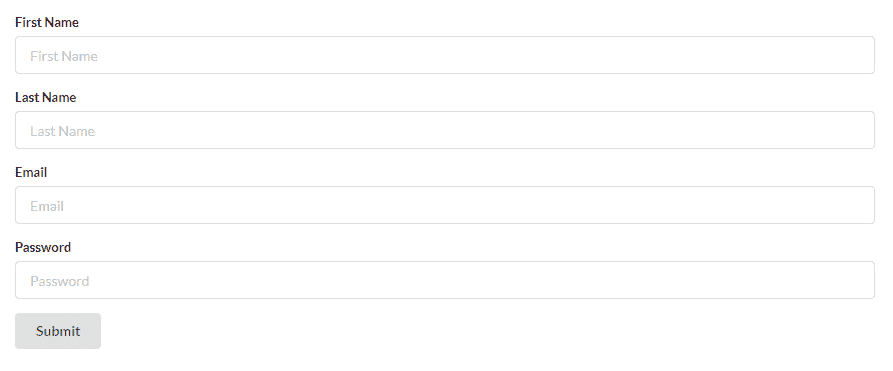
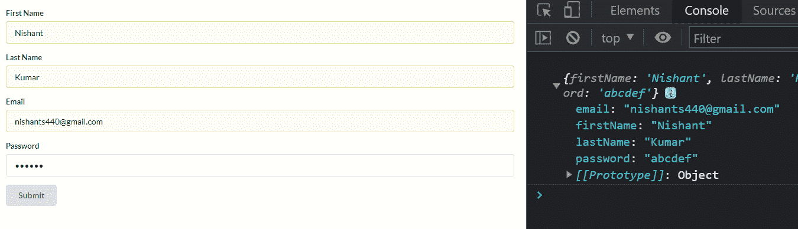
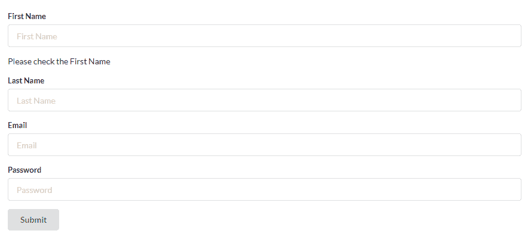
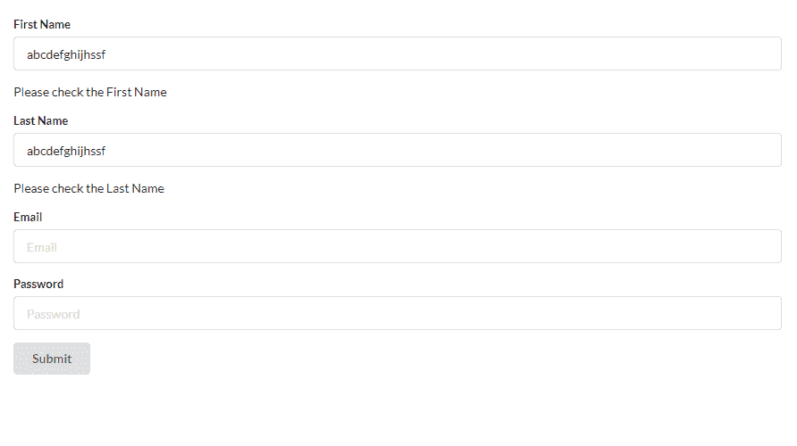
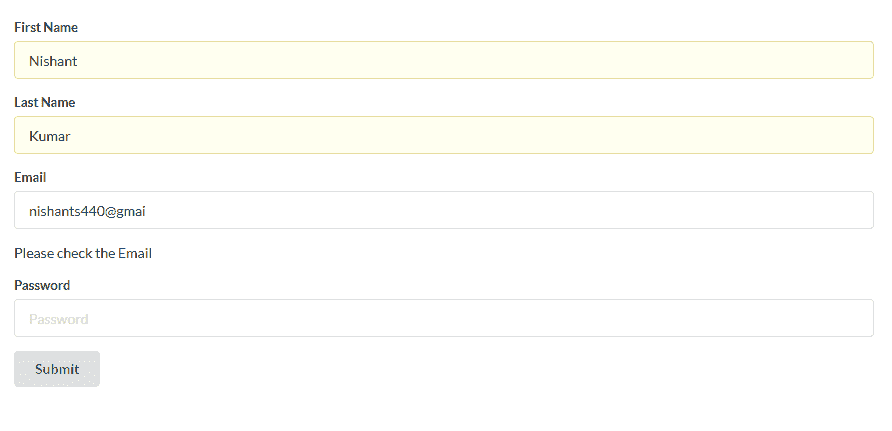
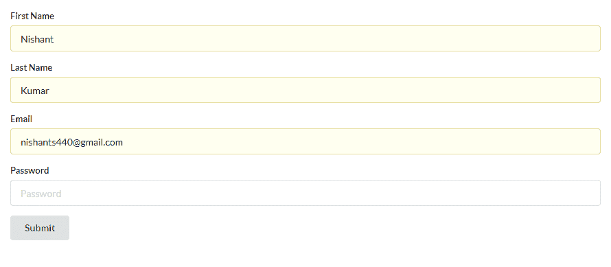
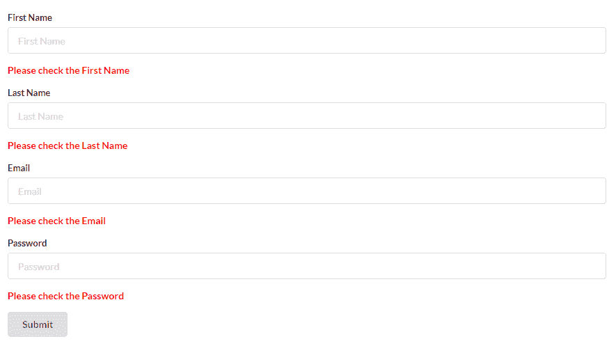

# 如何使用 React 挂钩表单在 React 表单中添加表单验证

> 原文：<https://www.freecodecamp.org/news/add-form-validation-in-react-app-with-react-hook-form/>

创建带有适当验证的表单可能很困难，也很成问题。但是在这篇博文中，我将用简单明了的方式向你展示如何做到这一点。

我们将学习如何使用 React 和 React Hook Form 在表单中添加验证。

## 如何在 React 中创建表单

我们将从使用语义 UI 库创建表单开始。因此，让我们使用以下命令之一来安装它:

```
yarn add semantic-ui-react semantic-ui-css
## Or NPM
npm install semantic-ui-react semantic-ui-css
```

安装完成后，需要将包导入 index.js 文件，这是应用程序的主入口文件。

```
import 'semantic-ui-css/semantic.min.css'
```

然后我们需要一个有四个字段的表单。所以，让我们用下面的代码创建它:

```
import React from 'react';
import { Form, Button } from 'semantic-ui-react';

export default function FormValidation() {
    return (
        <div>
            <Form>
                <Form.Field>
                    <label>First Name</label>
                    <input placeholder='First Name' type="text" />
                </Form.Field>
                <Form.Field>
                    <label>Last Name</label>
                    <input placeholder='Last Name' type="text" />
                </Form.Field>
                <Form.Field>
                    <label>Email</label>
                    <input placeholder='Email' type="email" />
                </Form.Field>
                <Form.Field>
                    <label>Password</label>
                    <input placeholder='Password' type="password" />
                </Form.Field>
                <Button type='submit'>Submit</Button>
            </Form>
        </div>
    )
} 
```

我们现在有表格了。它有四个字段，分别是名字、姓氏、电子邮件和密码。它还有一个提交按钮，用户可以提交表单。



### 如何安装 React 钩子窗体

要安装[反作用钩形](https://react-hook-form.com/)，使用以下命令:

```
npm install react-hook-form
```

如果您想了解更多关于这个库的信息，可以阅读文档。我们可以将它用于 React web 和 React Native 应用程序。

这里我们需要做的第一件事是从输入字段中获取数据，并将它们显示到控制台中。我们需要首先导入包:

```
import { useForm } from "react-hook-form";
```

然后，我们需要在我们的应用程序中析构 **`useForm`** 对象，如下所示:

```
const { register, handleSubmit, formState: { errors } } = useForm();
```

现在，我们将使用对象 **`useForm`** 的 **`register`** 属性来注册我们的表单字段。大概是这样的:

```
<Form.Field>
                    <label>First Name</label>
                    <input
                        placeholder='First Name'
                        type="text"
                        {...register("firstName")}
                    />
                </Form.Field>
```

现在“名字”表单字段有了“名字”的关键字。如你所见，我们已经在**寄存器**中声明了它。对所有其他字段重复此操作。

```
import React from 'react';
import { Form, Button } from 'semantic-ui-react';
import { useForm } from "react-hook-form";

export default function FormValidation() {
    const { register, handleSubmit, formState: { errors } } = useForm();
    return (
        <div>
            <Form>
                <Form.Field>
                    <label>First Name</label>
                    <input
                        placeholder='First Name'
                        type="text"
                        {...register("firstName")}
                    />
                </Form.Field>
                <Form.Field>
                    <label>Last Name</label>
                    <input
                        placeholder='Last Name'
                        type="text"
                        {...register("lastName")}
                    />
                </Form.Field>
                <Form.Field>
                    <label>Email</label>
                    <input
                        placeholder='Email'
                        type="email"
                        {...register("email")}
                    />
                </Form.Field>
                <Form.Field>
                    <label>Password</label>
                    <input
                        placeholder='Password'
                        type="password"
                        {...register("password")}
                    />
                </Form.Field>
                <Button type='submit'>Submit</Button>
            </Form>
        </div>
    )
} 
```

这是到目前为止的全部代码。四个字段，都已注册。

现在，在表单上，我们需要创建一个`onSubmit`事件。这意味着如果我们单击底部的 Submit 按钮，我们的表单数据应该被提交。

```
<Form onSubmit={handleSubmit(onSubmit)}>
```

我们还需要在 Submit 上创建一个函数，当 submit 按钮被点击或按下时，它将执行一些特定的操作。

```
const { register, handleSubmit, formState: { errors } } = useForm();
const onSubmit = (data) => {
  console.log(data);
}
```

因此，如果我们单击 submit 按钮，我们输入的数据将显示在控制台中。



## 如何在表单中添加验证

现在，到了最后也是最期待的一步。让我们添加验证。

让我们从名字字段开始。我们将使用 required 和 maxLength 属性，这些属性非常简单明了。

*   **必填**表示该字段为必填。
*   **MaxLength** 表示我们输入的字符的最大长度。

```
<input
  placeholder='First Name'
  type="text"
  {...register("firstName", { required: true, maxLength: 10 })}
/>
```

因此，将`required`设置为真，将`maxLength`设置为 10。然后，如果我们提交表单时没有输入名字，或者如果字符数超过 10，就会抛出一个错误。

但是我们也需要添加错误消息本身。在名字表单字段后添加以下错误消息。

```
{errors.firstName && <p>Please check the First Name</p>}
```

在这里，它会抛出一个错误。所以，让我们来看看发生了什么。



您可以在“名字”字段后看到错误，上面写着“请检查名字”。

对姓氏重复该过程。



输入超过 10 个字符也会引发错误。

现在，我们需要为电子邮件和密码字段添加验证。在这里，我们将使用另一个属性叫做 **`Pattern`** 。模式将包含一个正则表达式值，它将根据表单中输入的数据进行检查。

```
pattern: /^(([^<>()\[\]\\.,;:\s@"]+(\.[^<>()\[\]\\.,;:\s@"]+)*)|(".+"))@((\[[0-9]{1,3}\.[0-9]{1,3}\.[0-9]{1,3}\.[0-9]{1,3}\])|(([a-zA-Z\-0-9]+\.)+[a-zA-Z]{2,}))$/ 
```

这就是正则表达式模式的样子。很难理解，但这是电子邮件验证的一种模式。让我们在应用程序中使用它。

```
<Form.Field>
                    <label>Email</label>
                    <input
                        placeholder='Email'
                        type="email"
                        {...register("email", 
                        { 
                            required: true,  
                            pattern: /^(([^<>()\[\]\\.,;:\s@"]+(\.[^<>()\[\]\\.,;:\s@"]+)*)|(".+"))@((\[[0-9]{1,3}\.[0-9]{1,3}\.[0-9]{1,3}\.[0-9]{1,3}\])|(([a-zA-Z\-0-9]+\.)+[a-zA-Z]{2,}))$/ 
                        })}
                    />
                </Form.Field>
```

在电子邮件表单字段中，添加此模式。



输入错误的电子邮件格式会引发错误。但是当我们输入正确的格式时，错误就会消失。



让我们对密码表单字段进行同样的操作。对于密码字段，我们的条件是它应该包含一个大写字母，一个小写字母，字符数应该在 6 到 15 之间。如果我们输入的值没有通过这些检查，它将抛出一个错误。

```
 <Form.Field>
                    <label>Password</label>
                    <input
                        placeholder='Password'
                        type="password"
                        {...register("password", { 
                            required: true, 
                            pattern: /^(?=.*\d)(?=.*[a-z])(?=.*[A-Z]).{6,15}$/
                        })}
                    />
                </Form.Field>
                {errors.password && <p>Please check the Password</p>}
```

现在，我们的所有四个表单字段都完成了。

```
import React from 'react';
import { Form, Button } from 'semantic-ui-react';
import { useForm } from "react-hook-form";

export default function FormValidation() {
    const { register, handleSubmit, formState: { errors } } = useForm();
    const onSubmit = (data) => {
        console.log(data);
    }
    return (
        <div>
            <Form onSubmit={handleSubmit(onSubmit)}>
                <Form.Field>
                    <label>First Name</label>
                    <input
                        placeholder='First Name'
                        type="text"
                        {...register("firstName", { required: true, maxLength: 10 })}
                    />
                </Form.Field>
                {errors.firstName && <p>Please check the First Name</p>}
                <Form.Field>
                    <label>Last Name</label>
                    <input
                        placeholder='Last Name'
                        type="text"
                        {...register("lastName", { required: true, maxLength: 10 })}
                    />
                </Form.Field>
                {errors.lastName && <p>Please check the Last Name</p>}
                <Form.Field>
                    <label>Email</label>
                    <input
                        placeholder='Email'
                        type="email"
                        {...register("email",
                            {
                                required: true,
                                pattern: /^(([^<>()\[\]\\.,;:\s@"]+(\.[^<>()\[\]\\.,;:\s@"]+)*)|(".+"))@((\[[0-9]{1,3}\.[0-9]{1,3}\.[0-9]{1,3}\.[0-9]{1,3}\])|(([a-zA-Z\-0-9]+\.)+[a-zA-Z]{2,}))$/
                            })}
                    />
                </Form.Field>
                {errors.email && <p>Please check the Email</p>}
                <Form.Field>
                    <label>Password</label>
                    <input
                        placeholder='Password'
                        type="password"
                        {...register("password", {
                            required: true,
                            pattern: /^(?=.*\d)(?=.*[a-z])(?=.*[A-Z]).{6,15}$/
                        })}
                    />
                </Form.Field>
                {errors.password && <p>Please check the Password</p>}
                <Button type='submit'>Submit</Button>
            </Form>
        </div>
    )
} 
```

下面是完整的代码，供大家参考。我们还可以给我们的错误消息添加一些样式，比如:



## **结论**

现在您知道了如何在 React 表单中添加验证。注意，React 钩子形式只在函数组件中起作用，在类组件中不起作用。

你可以在我的 YouTube 频道上查看我的视频[让我们使用 React 和 React Hook Form](https://www.youtube.com/watch?v=7Jc5t9XEQIg&t=904s&ab_channel=Cybernatico) 在表单中添加验证。

而这里有 [GitHub](https://github.com/nishant-666/React-Form-Validation-) 上的完整代码供你参考。

> 快乐学习。