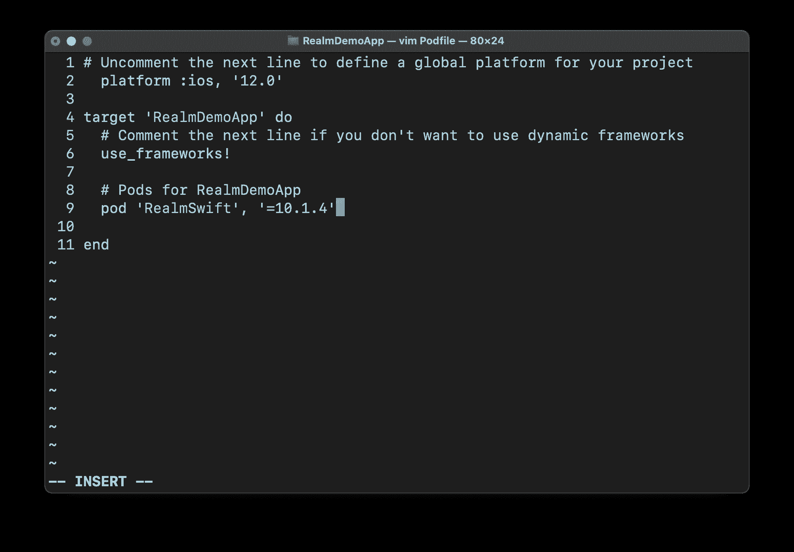
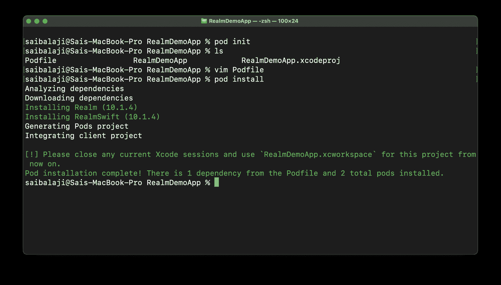
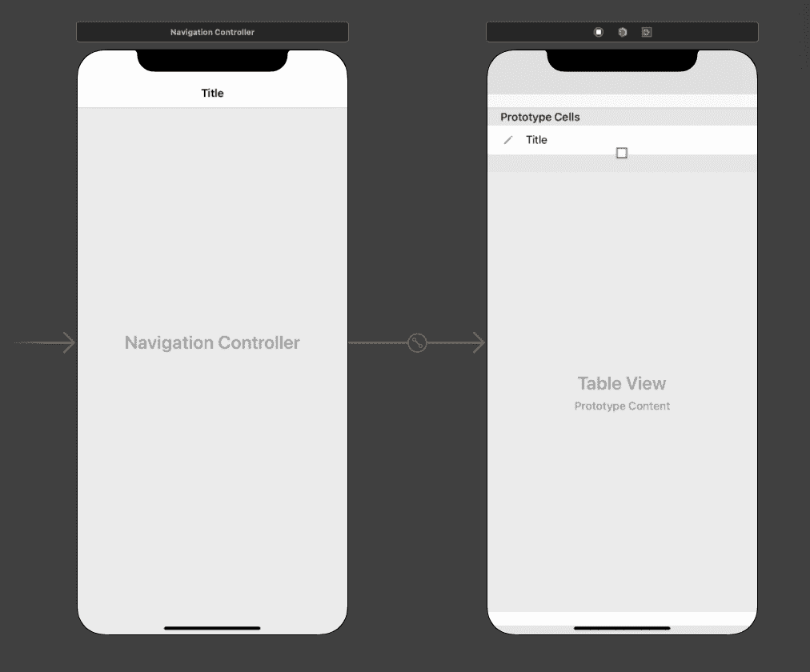
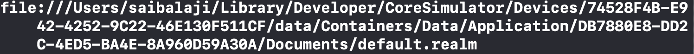
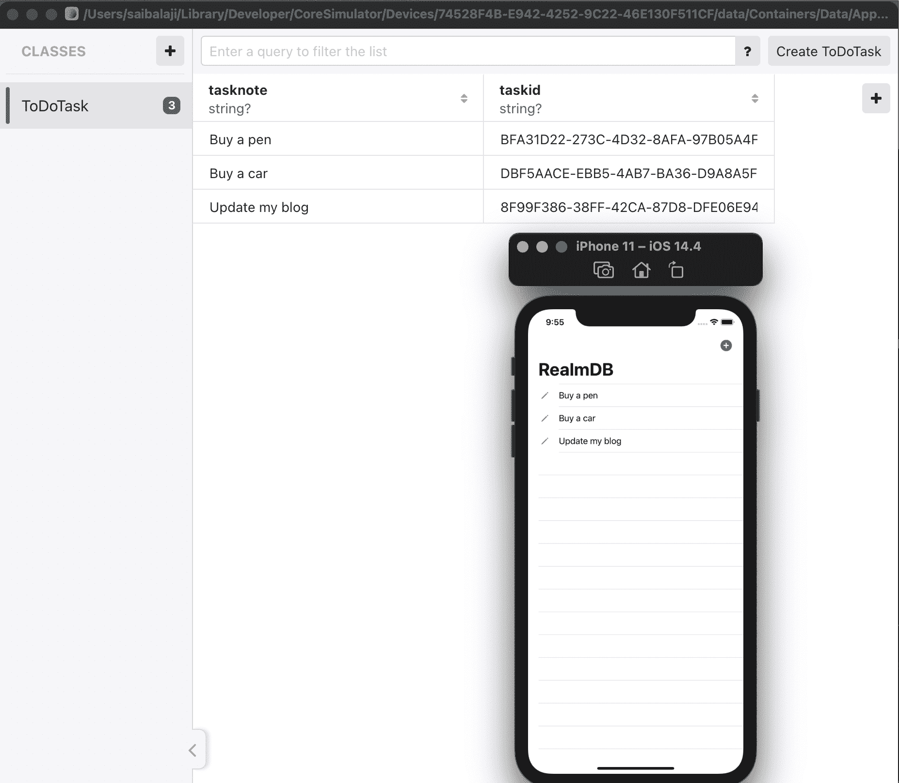

# 如何使用 Swift 将领域数据库添加到 iOS CRUD 应用程序

> 原文：<https://www.freecodecamp.org/news/add-realm-database-to-ios-crud-app-with-with-swift/>

大家好！在本文中，我们将学习如何将领域数据库添加到 iOS 应用程序中。

我们将创建一个简单的 ToDo 应用程序，以便您可以学习如何在 Realm 数据库中执行 CRUD(创建、读取、更新、删除)操作。

## 什么是境界？


Realm 是一个开发人员友好且易于使用的开源移动数据库。你也可以用它来替代 iOS 应用中的核心数据。

Realm 是一个跨平台的移动数据库，这意味着您可以在原生 Android 和 iOS 应用程序中使用它，也可以在使用 React Native 创建的跨平台应用程序中使用它。它支持 Objective-C、Swift、Java、Kotlin、C#和 JavaScript。

## 如何在您的 iOS 项目中设置领域

我们可以使用 SPM(Swift 包管理器)、Cocoa Pods 或 Carthage 将 Realm 添加到我们的 iOS 项目中。在这里，我们将使用 Cocoa Pods 将 Realm Pod 添加到我们的 iOS 项目中。

1.  打开 Xcode，用 UIKit 和 Swift 创建一个空白的 iOS app 项目，不使用核心数据。
2.  现在关闭 Xcode 并打开终端。使用终端导航到您的项目目录。
3.  运行以下命令创建 PodFile。

```
pod init
```

4.现在，当您列出目录的内容时，您可以看到有一个新的 Podfile。使用任何文本编辑器打开文件(这里我使用了 Vim)。编辑您的 Podfile，使其看起来类似于下图。保存并关闭 Podfile。



现在我们已经为领域数据库指定了依赖项，我们可以通过运行以下命令来安装依赖项:

```
pod install 
```



如您所见，我们已经成功地在 iOS 项目中添加了 Realm DB 依赖项。现在运行下面的命令在 Xcode 中打开我们的项目。

```
open YOUR_APP_NAME.xcworkspace
```

注:打开 Xcode 后，请确保通过按 Command+B 来构建项目。

## 如何在 Realm 中设计你的用户界面

我们将保持我们的应用程序的用户界面简单。打开 Main.storyboard，通过添加一个带有原型单元格的表格视图，创建一个简单的 UI，如下所示。然后嵌入一个导航控制器，并在 ViewController.swift 文件中为 tableview 创建 IBOutlets:



## 如何在 Realm 中创建数据模型

在我们的 ToDo 应用程序中，每个任务都有一个任务名称和一个任务 id。我们将创建一个模型类来表示 todo 任务。在项目导航器中，右键单击并创建一个新的 Swift 文件，并添加以下代码。

```
import Foundation
import RealmSwift

class ToDoTask:Object
{
    @objc dynamic var tasknote: String?
    @objc dynamic var taskid: String?
}
```

我们创建了一个名为 ToDoTask 的模型类。它继承了 Object 类，这是 RealmDB 附带的一个类。这个类处理将使用这个模型类创建的数据保存到数据库中的所有底层过程。

我们还添加了两个属性:`tasknote`，这是要完成的任务，和`taskid`——都是 string 类型。`@objc`表示您的 Swift 代码对目标 C 可见，而`dynamic`表示您希望使用目标 C 的动态分派。

## 基本 CRUD 应用程序功能

我们的应用程序将执行以下功能:

1.  使用 AlertViewController 从用户处获取输入。
2.  将输入添加到数据库和表视图中。
3.  允许用户编辑他们的输入。
4.  轻扫以删除一行，从而从表格视图和数据库中移除数据。
5.  从数据库中获取所有数据(如果有)并在表格视图中显示。

### 如何使用 AlertViewController 从用户处获取输入

打开`ViewController.swift`并将下面的代码添加到`ViewDidLoad()`方法中。创建一个名为`addTask()`的新函数，并添加代码来显示带有文本框的警报视图控制器，以获取用户的输入。

现在，当按下右栏按钮时，它将调用`addTask()`函数，该函数将显示带有文本字段的`alertviewcontroller`以获取用户输入。

```
navigationItem.rightBarButtonItem = UIBarButtonItem(image: .add, style: .done, target: self, action: #selector(addTask))

navigationController?.navigationBar.prefersLargeTitles = true

title = "RealmDB"
```

```
@objc
    func addTask()
    { 
        let ac = UIAlertController(title: "Add Note", message: nil, preferredStyle: .alert)

        ac.addTextField(configurationHandler: .none)

        ac.addAction(UIAlertAction(title: "Add", style: .default, handler: { (UIAlertAction) in

              if let text = ac.textFields?.first?.text
            {
                print(text)
            }

        }))
        ac.addAction(UIAlertAction(title: "Cancel", style: .cancel, handler: nil))
        present(ac, animated: true, completion: nil)
    }
```

### 如何将输入添加到数据库和表视图中

要将数据保存到 Realm 中，首先我们需要获得 Realm 的一个实例，通过它我们可以访问 CRUD 操作所需的所有方法。在`ViewController.swift`文件中创建一个 Realm 类型的属性，并在`viewDidLoad()`方法中初始化它。

```
 var realmDB: Realm!
```

```
 override func viewDidLoad() {
        super.viewDidLoad()

        navigationItem.rightBarButtonItem = UIBarButtonItem(image: .add, style: .done, target: self, action: #selector(addTask))
        navigationController?.navigationBar.prefersLargeTitles = true
        title = "RealmDB"

        realmDB = try! Realm()

    }
```

创建一个我们的数据模型(ToDoTask)类型的空数组。这个数组将保存需要添加到表视图和数据库中的所有任务。

现在，在`addTask()`函数内部修改 Add action 闭包，以便它获取用户输入并为该输入创建一个随机 ID。然后将它添加到我们的数组中，并保存到数据库中。

```
var tasks = [ToDoTask]()
```

```
 if let text = ac.textFields?.first?.text
            {
            	//Add data to data model array
                let t = ToDoTask()
                t.taskid = UUID().uuidString
                t.tasknote = text
                self.tasks.append(t)

                //Add data to database
                try! self.realmDB.write {
                    self.realmDB.add(t)
                }
                //Update table view UI
                self.tasktv.reloadData()
            }
```

现在，当您运行应用程序时，数据将保存在数据库中。但是它不会显示在表视图中，因为我们还没有实现委托方法。

让 ViewController 类实现`UITableViewDelegate`和`UITableViewDataSource`协议，并添加协议存根。

现在在`numberOfRowsInSection`方法中，返回 tasks 数组的计数，它给出了要添加到表视图中的行数。这等于任务数组中的元素数量。

```
 func tableView(_ tableView: UITableView, numberOfRowsInSection section: 
 Int) -> Int 
 {
        return tasks.count;
 }
```

接下来我们需要做的是指定每一行的内容。我们可以使用`cellForRowAt` delegate 方法来做到这一点。这里，我们使用 storyboard 中提到的标识符将一个单元格出队，并将标签文本指定为 tasks 数组元素 tasknote 属性。

```
 func tableView(_ tableView: UITableView, cellForRowAt indexPath: IndexPath) -> UITableViewCell {
        if let cell = tableView.dequeueReusableCell(withIdentifier: "cell")
        {
            cell.textLabel?.text = tasks[indexPath.row].tasknote
            return cell
        }
        return UITableViewCell()
    }
```

### 如何允许用户编辑他们的输入

现在，我们必须允许用户编辑他们输入的任务，并更新数据库和 UI 中的更改。我们可以使用类似的方法从用户那里获得输入。实现`didSelectRowAt` delegate 方法，该方法将在用户点击表格视图行时被调用。

添加下面的代码，显示一个带有文本视图的`AlertViewController`。然后用输入的文本更新单元格的内容，同时更新数据库内容。

```
func tableView(_ tableView: UITableView, didSelectRowAt indexPath: IndexPath) {

        let tasktomodify = tasks[indexPath.row]
        let ac = UIAlertController(title: "Update task", message: nil, preferredStyle: .alert)

        ac.addTextField(configurationHandler: .none)
        ac.addAction(UIAlertAction(title: "Ok", style: .default, handler: { (UIAlertAction) in
            if let text = ac.textFields?.first?.text
            {
                if(!text.isEmpty)
                {
                try! self.realmDB.write({
                    tasktomodify.tasknote = text
                })
                self.tasktv.reloadData()
                }
            }
        }))

        present(ac, animated: true, completion: nil)
    }
```

### 如何滑动以删除行&从表格视图和数据库中移除数据

这里，我们将在表视图中实现一个滑动删除功能，以便用户可以删除他们的任务。但是在幕后，当用户滑动删除一个表视图行时，它应该从数据库、数据模型数组中删除数据，并更新表视图的 UI。

我们可以通过实现**commit editing style**delegate 方法并添加以下代码来实现这一点:

```
 func tableView(_ tableView: UITableView, commit editingStyle: UITableViewCell.EditingStyle, forRowAt indexPath: IndexPath) {
        if editingStyle == .delete
        {
            let tasktoDelete = tasks[indexPath.row]
            try! realmDB.write({
                realmDB.delete(tasktoDelete)
                self.tasks.remove(at: indexPath.row)
                self.tasktv.deleteRows(at: [indexPath], with: .fade)
            })
        }
    }
```

### 如何从数据库中获取所有数据(如果有)并在表格视图中显示

现在我们要实现最后一个操作，Read。每当用户启动应用程序时，它应该从数据库中获取数据(如果数据存在)并在表格视图中显示它。

为此，我们可以在视图控制器 swift 文件中创建一个函数`getTodo`，并在其中添加以下代码:

```
func getTodos()
    {
       //Get all the data from the database
        let notes = realmDB.objects(ToDoTask.self)

        //Clear the model data array to prevent duplicates
        self.tasks.removeAll()

        /*If the fetched data is not empty then add it to model data array and update the UI */
        if(!notes.isEmpty)
        {
        for n in notes
        {

            self.tasks.append(n)

        }
            self.tasktv.reloadData()
        }

    }
```

## 额外提示:如何在 iOS 模拟器中查看数据库内容

现在，当你运行你的应用程序时，你可以看到它像预期的那样工作。但是我们如何检查数据是否真的存储在数据库中呢？我们可以使用一个名为 MongoDB Realm Studio 的应用程序，通过它我们可以查看模拟器的 Realm 数据库中存储的数据。

> 请注意，此方法仅在您使用 iOS 模拟器测试应用程序时有效

在`viewDidLoad()`方法中，添加下面一行代码，它将打印我们应用程序的实际文件路径:

```
 print(realmDB.configuration.fileURL!)
```



现在复制控制台中打印的文件路径，打开终端，并运行以下命令:

```
open REALM_FILE_PATH_HERE 
```

> 在运行上述命令之前，请确保您已经从浏览器下载了 MongoDB Realm Studio。

现在它会在 MongoDB Realm Studio 中打开 app 的 RealmFile。这将以表格形式显示存储在数据库中的数据。

如果您通过编辑或删除任务来更改数据，这些更改将反映在 MongoDB Realm Studio 应用程序中:



恭喜你！你做了一个简单的应用程序，在 iOS 应用程序中实现 CRUD 操作。