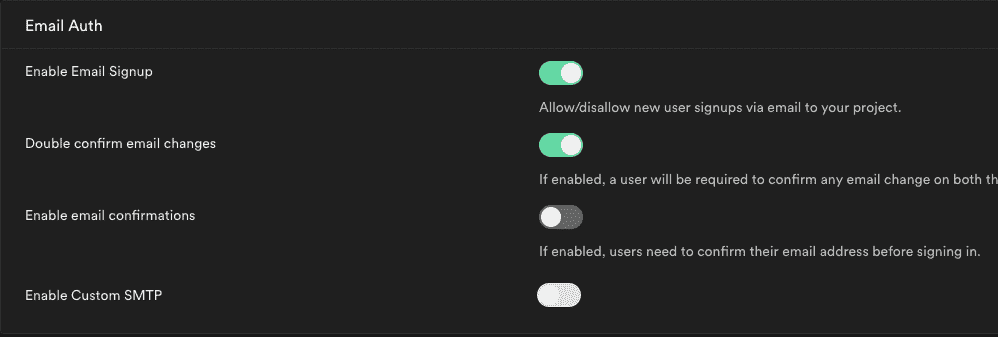
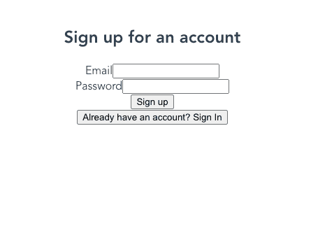
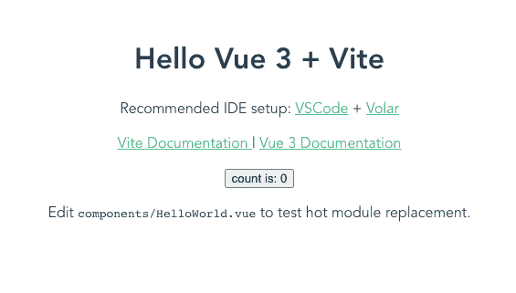
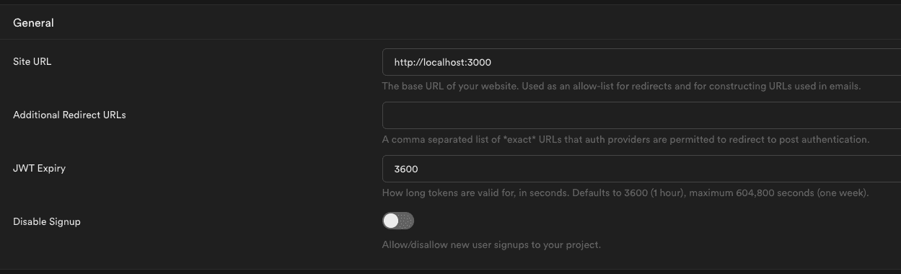
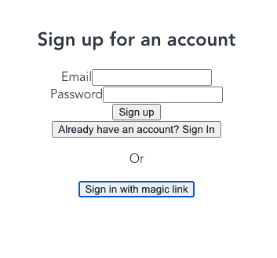
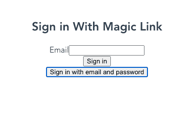

# 如何向 Vue 应用程序添加 Supabase 身份验证

> 原文：<https://www.freecodecamp.org/news/add-supabase-authentication-to-vue/>

在这篇文章中，我们将通过使用 Supabase 和 Vue 3 来设置认证。

这也适用于 Vue 2，但是您需要移动一些东西来使用 options API。我用的是 Vue 3，因为它现在是默认版本。

只是提醒一下——这里不会涉及太多的样式，所以重点放在 Supabase 认证上。

## 先决条件

你应该熟悉 JavaScript，并且有一些使用 Vue 3 的经验。有一些 Supabase 的经验会有所帮助，但不是必要的。

如果你需要快速回顾一下 Supabase，你可以看看我以前的一篇文章,在那里我讲述了如何开始使用它。

你还需要在你的机器上安装 [Node.js](https://nodejs.org/en/) 和 NPM。

## 入门指南

在开始使用 Supabase 构建数据库之前，让我们先构建一些前端。

我们需要做的第一件事是建立我们的项目。在您的终端和您希望此项目所在的文件夹中，运行以下命令:

```
npm init vite@latest vue-supabase-auth --template vue
```

Initialize a new Vite with Vue 3 project

这将在名为`vue-supabase-auth`的文件夹中用 Vue 3 初始化一个新的 Vite 项目。

在您选择的代码编辑器中打开它，并打开`src`文件夹中的`App.vue`文件。当我初始化项目时，Vite 将脚本标签放在模板标签之上。我个人的偏好是将模板标签移动到顶部，但这不是必须的。

## 向应用程序添加身份验证

下一步是为我们的应用程序添加身份验证。Supabase 让我们能够以多种不同的方式认证用户。

我们将介绍如何设置基本的电子邮件/密码认证，以及使用“神奇链接”进行认证。一个“神奇链接”只是一个发送到用户邮箱的链接，当点击它时，会把他们带到你的应用程序并让他们登录。

### 获得一个超级账户

如果你还没有，你需要在 [Supabase](https://app.supabase.io) 上注册一个账户。它要求你注册 GitHub，所以如果你没有 GitHub 账户，你也应该注册一个。

登录后，您将单击绿色按钮“新建项目”，并选择登录时创建的默认组织。我的名字叫“briancbarrow 的组织”

这将弹出一个对话框，您可以在其中提供一些关于该项目的信息。我将它命名为`basic-auth`，给它一个强密码，然后我将选择区域`West US (North California)`，因为它离我最近。

一旦项目完成设置，进入认证->设置并禁用“启用电子邮件确认。”对于本教程来说，这只是让事情变得更顺利一点。



Showing the "Enable email confirmations" setting disabled

### 在 Vue 项目中设置 Supabase

首先，我们需要运行`npm install @supabase/supabase-js`来让 JavaScript 包与 Supabase 集成。

然后我们需要在项目的`src`文件夹中创建一个`supabase.js`文件。其中应包含以下内容:

```
import { createClient } from '@supabase/supabase-js'

const supabaseUrl = import.meta.env.VITE_SUPABASE_URL
const supabaseAnonKey = import.meta.env.VITE_SUPABASE_ANON_KEY

export const supabase = createClient(supabaseUrl, supabaseAnonKey)
```

正如您在上面的代码中看到的，我们需要设置一些包含 Supabase 键的环境变量。在项目的根目录下创建一个`.env.local`文件，并添加`VITE_SUPABASE_URL`和`VITE_SUPABASE_ANON_KEY`。您可以在 Supabase 项目的仪表板上找到您的 url 和 anon_key。

您的`.env.local`文件将如下所示:

```
VITE_SUPABASE_URL=YOUR_SUPABASE_URL
VITE_SUPABASE_ANON_KEY=YOUR_SUPABASE_ANON_KEY
```

我们还想为整个应用程序所需的数据创建一个中心存储，如用户信息。在`src`文件夹中创建一个`store.js`文件，并用以下代码填充它:

```
import { reactive } from "vue";

export const store = {
  state: reactive({
    user: {},
  }),
};
```

### 创建登录和注册组件

Supabase 认证将`signIn`和`signUp`过程分开，所以我们需要对它们进行不同的处理。我决定创建两个独立的组件，只是为了让事情在我的脑海中更清晰一些。

在 components 文件夹中创建一个`SignUp.vue`文件，并添加以下代码:

```
<template>
  <div>
    <h2>Sign up for an account</h2>
    <form @submit.prevent="handleSignup">
      <div>
        <label for="email">Email</label>
        <input id="email" type="email" v-model="email" />
      </div>
      <div>
        <label for="password">Password</label>
        <input id="password" type="password" v-model="password" />
      </div>
      <div>
        <button type="submit">Sign up</button>
      </div>
    </form>
  </div>
</template>

<script>
import { ref } from "vue";
import { supabase } from "../supabase";

export default {
  setup() {
    const email = ref("");
    const password = ref("");

    const handleSignup = async () => {
      try {
        // Use the Supabase provided method to handle the signup
        const { error } = await supabase.auth.signUp({
          email: email.value,
          password: password.value,
        });
        if (error) throw error;
      } catch (error) {
        alert(error.error_description || error.message);
      }
    };

    return {
      email,
      password,
      handleSignup,
    };
  },
};
</script> 
```

现在创建一个`SignIn.vue`文件并添加下面的代码。唯一的区别是被调用的方法名，并且标记中的文本略有不同。

```
<template>
  <div>
    <h2>Sign in to your account</h2>
    <form @submit.prevent="handleSignin">
      <div>
        <label for="email">Email</label>
        <input id="email" type="email" v-model="email" />
      </div>
      <div>
        <label for="password">Password</label>
        <input id="password" type="password" v-model="password" />
      </div>
      <div>
        <button type="submit">Sign in</button>
      </div>
    </form>
  </div>
</template>

<script>
import { ref } from "vue";
import { supabase } from "../supabase";

export default {
  setup() {
    const email = ref("");
    const password = ref("");

    const handleSignin = async () => {
      try {
        // Use the Supabase provided method to handle the signin
        const { error } = await supabase.auth.signIn({
          email: email.value,
          password: password.value,
        });
        if (error) throw error;
      } catch (error) {
        alert(error.error_description || error.message);
      }
    };

    return {
      email,
      password,
      handleSignin,
    };
  },
};
</script> 
```

现在我们想为这两个组件创建一个包装器组件。用下面的代码创建一个名为`Auth.vue`的文件:

```
<template>
  <div>
    <sign-up v-if="isSignUp" />
    <sign-in v-else />
    <button @click="isSignUp = !isSignUp">
      {{
        isSignUp
          ? "Already have an account? Sign In"
          : "Don't have an account yet? Sign Up"
      }}
    </button>
  </div>
</template>

<script>
import { ref } from "vue";
import SignUp from "./SignUp.vue";
import SignIn from "./SignIn.vue";
export default {
  components: { SignUp, SignIn },
  setup() {
    const isSignUp = ref(true);

    return {
      isSignUp,
    };
  },
};
</script>

<style scoped></style> 
```

这仅允许用户在`SignIn`和`SignUp`视图之间切换。现在再次打开`App.vue`，将代码更新为:

```
<template>
  <!-- Check if user is available in the store, if not show auth compoenent -->
  <Auth v-if="!store.state.user" />
  <!-- If user is available, show the Hello World component -->
  <HelloWorld v-else msg="Hello Vue 3 + Vite" />
</template>

<script>
import Auth from "./components/Auth.vue";
import HelloWorld from "./components/HelloWorld.vue";

import { store } from "./store";
import { supabase } from "./supabase";

export default {
  components: {
    HelloWorld,
    Auth,
  },
  setup() {
    // we initially verify if a user is logged in with Supabase
    store.state.user = supabase.auth.user();
    // we then set up a listener to update the store when the user changes either by logging in or out
    supabase.auth.onAuthStateChange((event, session) => {
      if (event == "SIGNED_OUT") {
        store.state.user = null;
      } else {
        store.state.user = session.user;
      }
    });

    return {
      store,
    };
  },
};
</script>

<style>
#app {
  font-family: Avenir, Helvetica, Arial, sans-serif;
  -webkit-font-smoothing: antialiased;
  -moz-osx-font-smoothing: grayscale;
  text-align: center;
  color: #2c3e50;
  margin-top: 60px;
}
</style> 
```

如果用户没有登录，这将显示`Auth`组件，否则将显示我们最初设置的`HelloWorld.vue`。



Sign up form

使用您创建的电子邮件和密码注册，然后您应该会再次看到 HelloWorld 组件。



Hello World component showing after sign up

### 如何注销

注销相对简单。在 HelloWorld 组件内部，将以下内容添加到 template 标记的底部:

```
<button @click="signOut">Sign Out</button>
```

然后将 HelloWorld 上的脚本标记更新为:

```
<script setup>
import { ref } from "vue";
import { supabase } from "../supabase";

defineProps({
  msg: String,
});

const count = ref(0);
async function signOut() {
  const { error } = await supabase.auth.signOut();
}
</script>
```

你可以看到我们现在正在导入之前创建的`supabase`文件，然后创建一个`signOut`方法，该方法在单击按钮时被调用。

### 使用 Magic Link 认证

Supabase 还能向用户发送一个神奇的电子邮件链接，用户点击该链接，它就会带用户进入应用程序并登录。它发送的链接会将他们重定向到您的网站，所以我们需要确保我们的 Supabase 设置中有正确的重定向 URL。

导航到项目的 Supabase 仪表板中的 Auth -> Settings 页面，并确保 localhost URL 在`Site URL`框中。



Make sure your site url matches where it should redirect to on login

#### 创建 MagicLink 组件

在 components 文件夹中创建一个名为`MagicLink.vue`的新文件，并添加以下代码:

```
<template>
  <div>
    <h2>Sign in With Magic Link</h2>
    <form @submit.prevent="handleMagicLink">
      <div>
        <label for="email">Email</label>
        <input id="email" type="email" v-model="email" />
      </div>
      <div>
        <button type="submit">Sign in</button>
      </div>
    </form>
  </div>
</template>

<script>
import { ref } from "vue";
import { supabase } from "../supabase";

export default {
  setup() {
    const email = ref("");

    const handleMagicLink = async () => {
      try {
        // We call the signIn method from Supabase to send the magic link. We only pass it the email though.
        const { error } = await supabase.auth.signIn({
          email: email.value,
        });
        if (error) throw error;
      } catch (error) {
        alert(error.error_description || error.message);
      }
    };

    return {
      email,
      handleMagicLink,
    };
  },
};
</script> 
```

这个组件和`SignIn`组件非常相似。它使用相同的方法，但要获得神奇的链接，我们只需传入电子邮件。

现在我们需要更新`Auth.vue`来使用`MagicLink`组件。将`Auth.vue`更新如下:

```
<template>
  <div>
    <!-- v-if logic to determine which auth component to show -->
    <sign-up v-if="isSignUp && !useMagicLink" />
    <sign-in v-else-if="!isSignUp && !useMagicLink" />
    <magic-link v-else />
    <div v-if="!useMagicLink">
      <button v-if="!useMagicLink" @click="isSignUp = !isSignUp">
        {{
          isSignUp
            ? "Already have an account? Sign In"
            : "Don't have an account yet? Sign Up"
        }}
      </button>
      <p>Or</p>
    </div>
    <button @click="toggleMagicLink">
      {{
        useMagicLink
          ? "Sign in with email and password"
          : "Sign in with magic link"
      }}
    </button>
  </div>
</template>

<script>
import { ref } from "vue";
import SignUp from "./SignUp.vue";
import SignIn from "./SignIn.vue";
import MagicLink from "./MagicLink.vue";
export default {
  components: { SignUp, SignIn, MagicLink },
  setup() {
    const isSignUp = ref(true);
    const useMagicLink = ref(false);

    function toggleMagicLink() {
      useMagicLink.value = !useMagicLink.value;
    }

    return {
      isSignUp,
      useMagicLink,

      toggleMagicLink,
    };
  },
};
</script>

<style scoped></style> 
```

现在，默认情况下，身份验证页面应该如下所示:



Default Auth view

如果用户点击“使用魔法链接登录”按钮，它应该是这样的:



Auth view when signing in with magic link

如果您输入您的电子邮件并点击“登录”，您应该会收到一封带有神奇链接的电子邮件。点击那个链接，你应该作为一个登录用户被重定向到应用程序，在那里你会看到 HelloWorld 视图。

## 摘要

Supabase 使得设置认证相对容易。他们还使用 Google、Apple、Github 等社交提供商提供身份验证。

对于我的基本项目，我喜欢保持简单，坚持使用电子邮件/密码登录，或者只是让 Supabase 发送一个神奇的链接来登录。