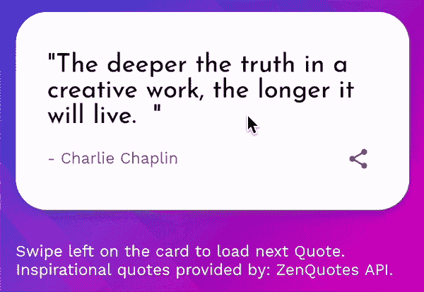
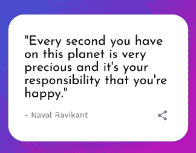
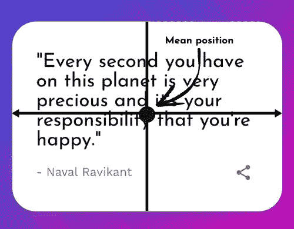
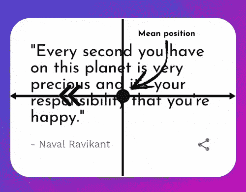
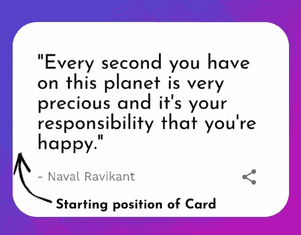
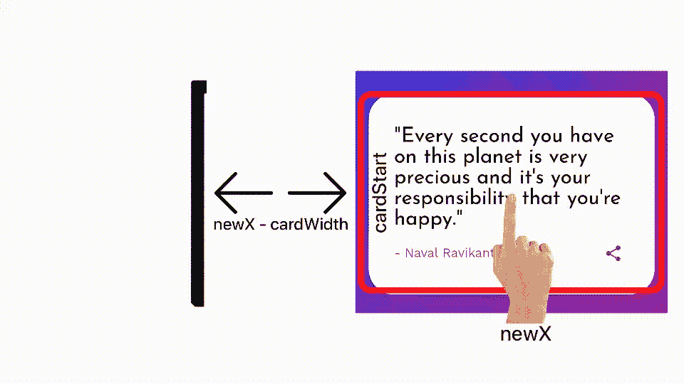

# 如何在 Android 应用程序中向卡片视图添加刷卡动画

> 原文：<https://www.freecodecamp.org/news/add-swipe-animations-to-a-card-view-in-android-app/>

如果你正在开发一个 Android 应用，你应该考虑添加动画。他们可以改善你的应用程序的用户体验，提高用户的忠诚度。

如今，如果你看到一个没有动画的应用程序，它可能会觉得奇怪和过时。由于互动体验是一种新的规范，你会想办法让你的应用程序与众不同。

## 我们将在这里建造什么

现在，如果你只有一些基本的东西，比如报价分享应用程序(这是我们在这里要做的)，似乎很难让你的应用程序脱颖而出。很难吸引用户并保持他们的兴趣。

当然，您可以只添加两个简单的按钮来加载下一个/上一个报价，然后就到此为止。但这是非常基本的，任何应用程序都可以做到这一点！即使你只是在构建一个简单的附带项目，也没有好的 UX 的取舍:)

因此，我们在本教程中要做的是放下按钮，取而代之的是用户可以向左刷卡的逻辑。当他们刷得足够远时，应用程序会加载一张有新报价的新卡。

在这篇文章的最后，你将学会如何制作一个真正平滑的动画卡片，用户可以刷卡执行你选择的任何动作。这是它如何工作的演示:



很神奇，对吧？让我们开始吧！

## 先决条件

在本教程中，我们将使用 Kotlin 作为我们应用程序的编程语言——但是你可以很容易地将代码翻译成 Java，它将同样工作。

作为参考，这是我们希望启用刷卡功能的报价卡。



它是一个安卓系统，有一堆 T1 和一个 T2。加载新报价时还会显示一个`ProgressBar`。

我们不会为用户界面编写 XML 代码。您可以[从 GitHub 仓库获得我在这里使用的布局](https://github.com/gouravkhunger/QuotesApp/blob/main/app/src/main/res/layout/fragment_quote.xml)，或者构建您自己的布局。

如果你想查看的话，这是我们报价应用程序的完整代码。它使用了 MVVM 设计模式，但是本文并不依赖于应用程序的业务逻辑所使用的模式，因为我们只是在 UI 部分工作。

现在，我们已经准备好制作这个令人敬畏的滑动界面了！

## 如何在我们的应用程序中处理刷卡

为了处理刷卡，我们首先需要在卡上设置一个触摸监听器。每当在卡片上执行一个动作时，就会调用触摸监听器。在侦听器中，我们将添加逻辑来进行数学计算和执行动画。

这是我们将使用的触摸监听器的蓝图:

```
quoteCard.setOnTouchListener(
    View.OnTouchListener { view, event ->
        when (event.action) {
            MotionEvent.ACTION_MOVE -> {
            	// TODO: Handle ACTION_MOVE
            }
            MotionEvent.ACTION_UP -> {
            	// TODO: Handle ACTION_UP
            }
        }

        // required to by-pass lint warning
        view.performClick()
        return@OnTouchListener true
    }
)
```

这里，我们专门听卡片上的两个动作——`ACTION_MOVE`和`ACTION_UP`。

*   当用户开始刷卡，也就是移动卡片时，调用`ACTION_MOVE`事件。
*   当用户将手指从卡片上抬起时，基本上就是当他们放开卡片时，就会调用`ACTION_UP`。

我们可以覆盖许多其他的动作事件，比如当一个人获得视图时调用的`ACTION_DOWN`,但是这个特性不需要它们。

卡的基本设置完成了，下面我们来搞清楚刷卡逻辑。

### 滑动动作背后的数学原理

首先，让我们重新思考一下**我们想要达到的**。当你确切地知道你想要什么的时候，实现功能是比较容易的。当你的需求清晰时，你的代码也会更有意义。

这里，我们有一张报价卡。我们希望用户能够只向左滑动，如果达到了加载新报价的最小阈值，它应该回到原来的位置并加载新报价。

现在，为了达到这个目的，让我们从卡片的角度来考虑。让我们把平均位置定义为卡片的中心。



Mean Position of the Card

当且仅当用户在中间位置的左侧刷卡时，我们才希望卡能够刷卡。



Swipe only if moved towards the left of mean position

那么，我们如何才能做到这一点呢？

你猜对了——我们将计算平均位置，在`ACTION_MOVE`事件中，我们将检查用户是否向左滑动并相应地移动卡片。

### 如何实现刷卡逻辑

要实现这个逻辑，我们首先需要知道卡片的起始位置，这很容易计算。我们将确保它是根据全屏宽度计算的，而不仅仅是卡片的宽度。

将这几行代码放在`when(event.action)`语句之前:

```
quoteCard.setOnTouchListener(
    View.OnTouchListener { view, event ->

        // variables to store current configuration of quote card.
        val displayMetrics = resources.displayMetrics
        val cardWidth = quoteCard.width
        val cardStart = (displayMetrics.widthPixels.toFloat() / 2) - (cardWidth / 2)

        when (event.action) {
        	...
        }
        ...
    }
)
```

首先，我们从参考资料中获得`displayMetrics`，这将使用`displayMetrics.widthPixels.toFloat()`给出屏幕的宽度。

然后我们使用`quoteCard`的`width`属性得到`cardWidth`。

最后，我们使用公式`(width of screen/2) - (cardWidth/2)`计算卡片的起始位置。本质上，这给了我们卡片这个位置的 x 坐标:



Starting position of card.

现在，让我们实现`ACTION_MOVE`事件的代码。

### 如何处理`ACTION_MOVE`事件

在`ACTION_MOVE`块中，我们首先初始化`newX`变量，该变量保存了刷卡后的新 x 坐标。

```
val newX = event.rawX 
```

`event.rawX`给出新坐标相对于屏幕宽度的绝对值。

`newX`将包含用户手指在任何给定时刻的 x 坐标。`newX`的值`0.0`意味着用户滑动到屏幕的最左边。对于我的模拟器，`1080.0`代表屏幕的最右边。

因为我们希望只有当`newX`小于卡的平均位置时才刷卡，所以我们将在这里放置一个 if-条件来验证是否如此。

用简单的价值观来思考这个问题。我们假设卡片的平均位置在 x 坐标`540.0`(小 x 坐标)，用户刷到`710.0`(较大的 x 坐标)。但是我们不希望他们能够向右滑动。如果用户刷卡到`320.0`(较小的 x 坐标)，那么我们需要执行刷卡并将卡移动到新的位置。

下面是实现上述逻辑的代码:

```
if (newX - cardWidth < cardStart) { // or newX < cardStart + cardWidth
    quoteCard.animate().x(
        min(cardStart, newX - (cardWidth / 2))
    )
    .setDuration(0)
    .start()
} 
```

我们从`newX`中减去`cardWidth`，因为`newX`是一个绝对值，与卡片无关。它有一个更高的值，因为`cardStart`靠近屏幕的开始，而`newX`最初在中间的某个地方(用户通常会从中间滑动)。

我们要将 x 坐标和中值中的**移位**的值与`cardStart`的值进行比较，而不是 **`newX`** 的值，所以我们通过减去`cardWidth`来考虑这一点。

然后，我们使用`quoteCard.animate()`执行动画，并使用`x()`函数改变它的 x 坐标。

现在，我们为什么要做`min(cardStart, newX - (cardWidth/2))`？

这很有意思，理解起来也很直观。从一开始，我们就强调卡片只能向左移动，不能向右移动。

`newX - (cardWidth/2))`只不过是向左滑动的距离(因此涉及减法-对于右侧，应该加上)。

这里的`min()`函数返回所提供的两个值中的最小值。如果滑动距离小于`cardStart`，则返回，否则使用`cardStart`。这是我们想要满足的条件，而`min()`让它变得非常容易处理。

`setDuration(0)`确保动画瞬间进行(保持划动不感觉拖沓)。`start()`实际上用给定的属性开始动画。

该动画将消除您对其工作原理的任何疑问:



Visualisation of the aforementioned concept

(我没有制作动画的专业知识，这是我能想到的最好的了。)

下面是`ACTION_MOVE`事件的最终代码:

```
MotionEvent.ACTION_MOVE -> {
    // get the new coordinate of the event on X-axis
    val newX = event.rawX

    // carry out swipe only if newX - cardWidth < cardStart, that is
    // the card is swiped to the left side, not to the right
    if (newX - cardWidth < cardStart) {
        quoteCard.animate()
            .x(
                min(cardStart, newX - (cardWidth / 2))
            )
        .setDuration(0)
        .start()
    }
} 
```

您还可以在 UI 中包含一个`TextView`来反映用户何时应该释放卡。将这段代码也放在上面的`if`语句中:

```
if (quoteCard.x < MIN_SWIPE_DISTANCE) textView.text = getString(R.string.releaseCard)
else textView.text = getString(R.string.infoText) 
```

其中`MIN_SWIPE_DISTANCE`是`-250`:

```
// -250 produces best result, feel free to change to your liking
const val MIN_SWIPE_DISTANCE = -250 // User should move alteast -250 from mean position to load new quote 
```

现在，`ACTION_MOVE`事件处理妥当。我们来写代码处理`ACTION_UP`事件，也就是卡被释放的时候。

### 如何处理`ACTION_UP`事件

对于`ACTION_UP`事件，我们希望卡回到它的原始位置，等待大约`100`毫秒，然后加载一个新的报价。

动画卡的逻辑是相似的，但是这一次我们将使它的动画持续时间大约为`150`毫秒，以使它看起来平滑。

首先，创建一个变量`currentX`，它保存报价卡的 x 坐标的当前值。我们稍后会用到这个变量。

```
var currentX = quoteCard.x 
```

然后，开始播放卡片上的动画。将`cardStart`变量传递给`x()`函数，使其回到原来的位置，并将持续时间设置为`150`。

```
quoteCard.animate()
    .x(cardStart)
    .setDuration(150)
// continued below 
```

这次，我们在动画上设置了一个监听器。听众是关注动画的人。通过使用它，我们可以对各种动画事件执行动作，例如开始、结束、继续等等。

```
// continuation
.setListener(
    object : AnimatorListenerAdapter() {
        override fun onAnimationEnd(animation: Animator) {
            viewLifecycleOwner.lifecycleScope.launch(Dispatchers.Default) {
                delay(100)
                // check if the swipe distance was more than
                // minimum swipe required to load a new quote
                if (currentX < MIN_SWIPE_DISTANCE) {
                    // Add logic to load a new quote if swiped adequately
                    viewModel.getRandomQuote()
                    currentX = 0f
                }
            }
        }
    }
)
.start() 
```

我们通过覆盖`onAnimationEnd()`函数设置一个监听器来寻找动画的结尾。

动画一结束，我们就启动一个协同程序(类似于 Java 中的线程，但效率更高),延迟 100 毫秒。然后它检查用户的滑动距离是否超过了加载新报价所需的`MIN_SWIPE_DISTANCE`。这里使用变量`currentX`进行比较。

如果用户实际刷过了最小距离，协程将延迟`100`毫秒。然后视图模型从 API 加载一个新的随机报价，也将变量`currentX`重置为`0f`。

`ACTION_UP`事件的最终代码如下所示:

```
MotionEvent.ACTION_UP -> {
    var currentX = quoteCard.x
    quoteCard.animate()
        .x(cardStart)
        .setDuration(150)
        .setListener(object : AnimatorListenerAdapter() {
            override fun onAnimationEnd(animation: Animator) {
                viewLifecycleOwner.lifecycleScope.launch(Dispatchers.Default) {
                    delay(100)
                    // check if the swipe distance was more than
                    // minimum swipe required to load a new quote
                    if (currentX < MIN_SWIPE_DISTANCE) {
                    	// Add logic to load a new quote if swiped adequately
                        viewModel.getRandomQuote()
                        currentX = 0f
                    }
                }
            }
        })
        .start()
    textView.text = getString(R.string.infoText)
} 
```

## 最终代码

这是完整的`onTouchListener()`的最终代码:

```
quoteCard.setOnTouchListener(
    View.OnTouchListener { v, event ->

        // variables to store current configuration of quote card.
        val displayMetrics = resources.displayMetrics
        val cardWidth = quoteCard.width
        val cardStart = (displayMetrics.widthPixels.toFloat() / 2) - (cardWidth / 2)

        when (event.action) {
            MotionEvent.ACTION_UP -> {
                var currentX = quoteCard.x
                quoteCard.animate()
                    .x(cardStart)
                    .setDuration(150)
                    .setListener(
                        object : AnimatorListenerAdapter() {
                            override fun onAnimationEnd(animation: Animator) {
                                viewLifecycleOwner.lifecycleScope.launch(Dispatchers.Default) {
                                    delay(100)

                                    // check if the swipe distance was more than
                                    // minimum swipe required to load a new quote
                                    if (currentX < MIN_SWIPE_DISTANCE) {
                                        // Add logic to load a new quote if swiped adequately
                                        viewModel.getRandomQuote()
                                        currentX = 0f
                                    }
                                }
                            }
                        }
                    )
                    .start()
                textView.text = getString(R.string.infoText)
            }
            MotionEvent.ACTION_MOVE -> {
                // get the new co-ordinate of X-axis
                val newX = event.rawX

                // carry out swipe only if newX < cardStart, that is,
                // the card is swiped to the left side, not to the right
                if (newX - cardWidth < cardStart) {
                    quoteCard.animate()
                        .x(
                            min(cardStart, newX - (cardWidth / 2))
                        )
                        .setDuration(0)
                        .start()
                    if (quoteCard.x < MIN_SWIPE_DISTANCE) 
                        textView.text = getString(R.string.releaseCard)
                    else textView.text = getString(R.string.infoText)
                }
            }
        }

        // required to by-pass lint warning
        v.performClick()
        return@OnTouchListener true
    }
}
```

恭喜你。在本教程中，我们实现了一个动画，让用户刷一张包含报价的卡来获得新的报价。

不要忘记下载应用程序并亲自测试。欢迎 [GitHub 资源库](https://github.com/gouravkhunger/QuotesApp)上的明星和投稿！

## 结论

现在你已经学会了如何制作一张卡片的动画并在上面处理动画监听器。这有助于创建更好的 UX，让你的应用脱颖而出。

利用你在这篇文章中获得的知识，你现在可以为 Android 中的视图创建以下大部分动画:

*   **以编程方式为 Android 视图创建滑动动画。**

正如我们在本教程中所做的那样。

*   **从左到右动画**

这相当简单，只需将变量中的减法转换为加法，并将`if`语句中的`<`符号转换为`>`符号。通过这些小小的调整，卡片视图中从右到左的动画可以变成从左到右的！

*   您还可以使用动画显示和隐藏视图。

为此，你必须跟踪开始位置和结束位置，然后用从`0`到`1`的`alpha()`制作它们的动画。例如，你可以参考我的库 [Accolib](https://github.com/gouravkhunger/AccoLib) 来创建动画 FAQ 折叠。

*   使用视图动画可以实现基本的动画布局更改。

非常感谢你到目前为止的阅读，我希望这篇文章能增加一些价值。在 Genics 博客订阅我的时事通讯，了解我未来的文章！