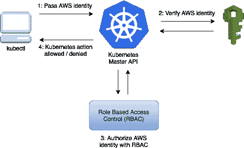
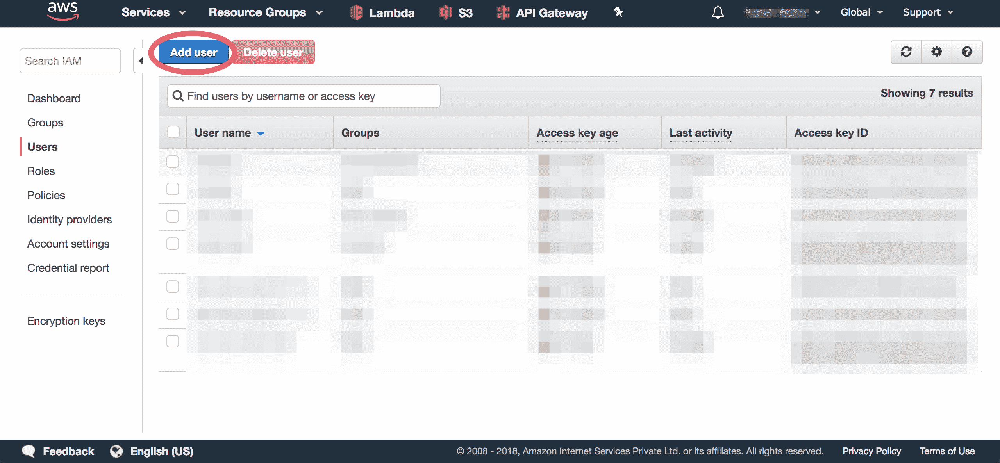
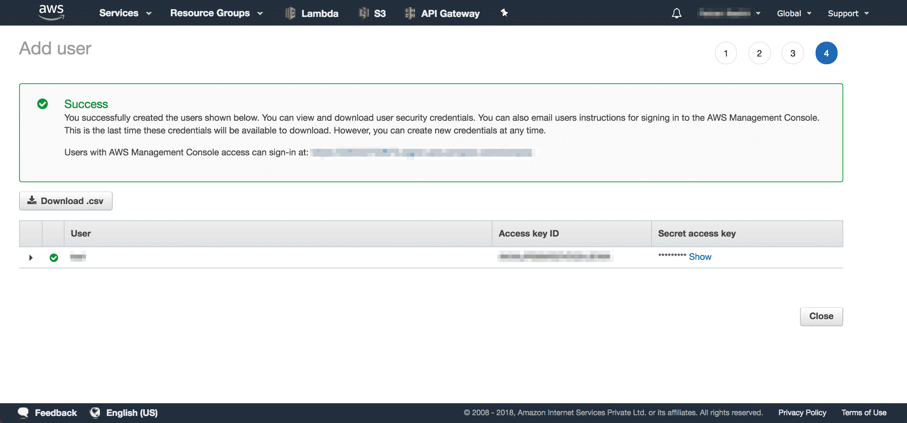

# 如何将受限访问 IAM 用户添加到 EKS 集群

> 原文：<https://www.freecodecamp.org/news/adding-limited-access-iam-user-to-eks-cluster/>

### **简介**

[弹性 Kubernetes 服务(EKS)](https://aws.amazon.com/eks/) 是由 AWS 完全管理的 [Kubernetes](https://kubernetes.io/) 服务。它与许多 AWS 服务深度集成，如 AWS 身份和访问管理(IAM)(用于集群身份验证)、Amazon CloudWatch(用于日志记录)、自动扩展组(用于扩展工作节点)和 Amazon 虚拟私有云(VPC)(用于联网)。许多公司信任亚马逊 EKS 来运行他们的集装箱化工作负载。



EKS 使用 IAM 为您的 Kubernetes 集群提供身份验证(通过`aws eks get-token`命令，或用于 Kubernetes 的 [AWS IAM 身份验证器)。对于授权，它依靠本地的](https://github.com/kubernetes-sigs/aws-iam-authenticator) [Kubernetes 基于角色的访问控制(RBAC)](https://kubernetes.io/docs/reference/access-authn-authz/rbac/) 。IAM 用于对您的 EKS 集群进行身份验证。您还可以通过本地 Kubernetes RBAC 系统管理与集群的 Kubernetes API 交互的权限。

## 如何创建 IAM 用户

转到你的 [AWS 控制台](https://console.aws.amazon.com/)，在那里你会找到列在“安全、身份&合规”组下的 [IAM 服务](https://console.aws.amazon.com/iam/home)。在 IAM 控制面板中，单击“用户”选项卡，然后单击“添加用户”按钮。



创建一个新用户，通过点击“程序化访问”复选框，允许用户 ****程序化访问**** 。您的用户访问 EKS 不需要任何特殊权限。您可以继续操作，无需选择任何权限。



创建用户后，您将可以访问用户的 ****访问密钥 ID**** 和 ****秘密访问密钥**** 。在下一步中，您将需要使用这些密钥。

## 配置 AWS CLI

为新用户配置 AWS CLI 就像运行`aws configure`命令并提供`AWS Access Key ID`和`AWS Secret Access Key`一样简单。不过，`Default region name`和`Default Output format`是可选的。

```
$ aws configure --profile eks-user
AWS Access Key ID [None]: AKIAI44QH8DHBEXAMPLE
AWS Secret Access Key [None]: je7MtGbClwBF/2Zp9Utk/h3yCo8nvbEXAMPLEKEY
Default region name [None]: us-east-1
Default output format [None]: text
```

配置完成后，您可以使用`aws sts get-caller-identity`命令测试用户配置是否正确:

```
$ aws sts get-caller-identity --profile eks-user
```

如果用户正确配置了`aws` cli 实用程序，您应该会看到如下所示的响应:

```
{
    "UserId": "AIDAX7JPBEM4A6FTJRTMB",
    "Account": "123456789012",
    "Arn": "arn:aws:iam::123456789012:user/eks-user"
}
```

## 为用户创建角色和角色绑定

正确配置 IAM 用户后，您可以继续为该用户创建角色。这段代码创建了一个名为`eks-user-role`的角色，该角色对集群中的`pods`资源拥有适度的`list`权限。

```
kind: Role
metadata:
  name: eks-user-role
rules:
- apiGroups: [""]
  resources: ["pods"]
  verbs: ["list"]
```

将上面的代码片段保存到一个文件中，然后将角色保存到您的 Kubernetes 集群中:

```
$ kubectl apply -f role.yaml
```

配置好角色后，您需要创建相应的角色绑定:

```
apiVersion: rbac.authorization.k8s.io/v1
kind: RoleBinding
metadata:
  name: eks-user-role-binding
subjects:
- kind: User
  name: eks-user
  apiGroup: rbac.authorization.k8s.io
roleRef:
  kind: Role
  name: eks-user-role
  apiGroup: rbac.authorization.k8s.io
```

将上述代码片段保存在一个文件中，然后`apply`将角色绑定到您的 Kubernetes 集群:

```
$ kubectl apply -f role-binding.yaml
```

## 将用户添加到 aws-auth 配置图

如果您希望授予其他 AWS 用户或角色与您的 EKS 集群交互的能力，您必须将这些用户/角色添加到`kube-system`名称空间中 Kubernetes 内的`aws-auth` ConfigMap 中。

你可以通过使用`kubectl edit`命令编辑它:

```
$ kubectl edit configmap aws-auth -n kube-system
```

或者通过导入`aws-auth`配置图并应用更改:

```
$ kubectl get configmap aws-auth -n kube-system -o yaml > aws-auth.yaml
```

将用户添加到`mapUsers`下，作为`aws-auth`配置图中的一项:

```
data:
  mapUsers: |
    - userarn: arn:aws:iam::123456789012:user/eks-user
      username: eks-user
      groups:
      - eks-role
```

如果用户配置正确，您应该能够列出群集中的窗格:

```
$ kubectl get pods --as eks-user
```

`--as`标志将对 Kubernetes 的请求模拟为给定的用户。您可以使用此标志来测试任何给定用户的权限。

## 为用户配置权限

您之前定义的角色只有列出窗格的权限。`eks-user`不能访问任何其他 Kubernetes 资源，如部署、配置图、事件、秘密、日志，甚至是给定 pod 中的 shell。

在现实世界中，您需要向用户提供访问所需资源的权限。下面的代码片段提供了对资源的访问，如`events`、`pods`、`deployments`、`configmaps`和`secrets`。

```
rules:
- apiGroups: [""]
  resources: ["events"]
  verbs: ["get", "list", "watch"]
- apiGroups: [""]
  resources: ["pods", "pods/log", "pods/exec"]
  verbs: ["list", "get", "create", "update", "delete"]
- apiGroups: ["extensions", "apps"]
  resources: ["deployments"]
  verbs: ["list", "get", "create", "update", "delete"]
- apiGroups: [""]
  resources: ["configmaps"]
  verbs: ["list", "get", "create", "update", "delete"]
- apiGroups: [""]
  resources: ["secrets"]
  verbs: ["list", "get", "create", "update", "delete"]
```

使用`kubectl apply -f`将上述权限添加到`role.yaml`文件中，并应用更改。

## 测试，测试，测试！

现在继续测试，看看权限是否已经正确地应用到了`eks-user`。您可以使用上面提到的`--as USERNAME`标志进行测试，或者将`eks-user`设置为`aws` cli 的默认配置文件。

```
$ export AWS_PROFILE=eks-user
```

配置完成后，您可以使用`aws sts get-caller-identity`命令测试用户配置是否正确:

```
$ aws sts get-caller-identity
```

您应该会看到如下所示的响应，表明用户已正确配置了您的`aws` cli 实用程序:

```
{
    "UserId": "AIDAX7JPBEM4A6FTJRTMB",
    "Account": "123456789012",
    "Arn": "arn:aws:iam::123456789012:user/eks-user"
}
```

使用下面提到的命令测试用户的权限。

```
$ kubectl get pods
$ kubectl get secrets
$ kubectl get configmaps
$ kubectl get deployments
$ kubectl logs <pod-name>
$ kubectl exec -it <pod-name> sh
$ kubectl create configmap my-cm --from-literal=db_username=<USERNAME> --from-literal=db_host=<HOSTNAME>
$ kubectl create secret generic my-secret --from-literal=db_password=<SOME_STRONG_PASSWORD>
```

简单地说，`eks-user`用户应该能够执行动词数组中为`pods`、`secrets`、`configmaps`、`deployments`和`events`指定的所有动作。你可以在这里阅读更多信息 [Kubernetes 授权概述](https://kubernetes.io/docs/reference/access-authn-authz/authorization/)。

## 我能不能

您可以使用`auth can-i`来检查您是否拥有对资源的权限。要查看您是否有获得 pods 的权限，只需运行:

```
$ kubectl auth can-i get pods
```

答案将是简单的`yes`或`no`。很神奇，不是吗？

想要检查您是否有`cluster-admin`权限吗？发射这个:

```
$ kubectl auth can-i "*" "*"
```

## 包裹

EKS 为 Kubernetes 控制平面提供了后端持久层。Kubernetes API 服务器和主节点跨不同的可用性区域进行配置和扩展，从而实现高可用性并消除单点故障。AWS 管理的 Kubernetes 集群可以承受可用性区域的损失。

访问和授权控制对于任何安全系统都是至关重要的。Kubernetes 为我们提供了一个强大的 RBAC 许可机制。

**原载于*[**faizanbashir . me**](https://faizanbashir.me/adding-limited-access-iam-user-to-eks-cluster)*