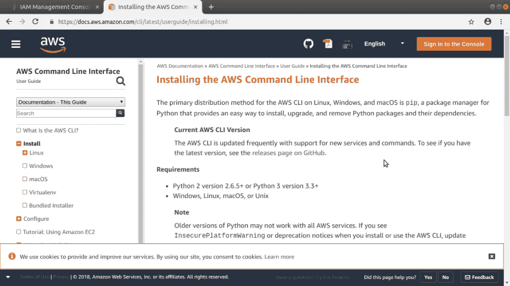

# 如何使用 AWS CLI 直接从键盘上运行云服务——不需要 GUI

> 原文：<https://www.freecodecamp.org/news/administrating-aws-resources-productively-using-the-aws-cli/>

我敢打赌，你已经在 AWS 上运行了一些东西，而且是使用浏览器控制台实现的。但是我敢打赌，你已经怀疑点击配置页面的一层又一层并不总是最好的方法。事实上，AWS CLI 是一种更好的方式，它可以完成完全相同的工作，但要少很多工作。

使用改编自我的 [*Pluralsight 课程的内容:使用 AWS CLI*](https://pluralsight.pxf.io/c/1191769/424552/7490?u=https%3A%2F%2Fwww.pluralsight.com%2Fcourses%2Fautomating-aws-operations-aws-cli) 自动化 AWS 操作，让我快速演示一下。假设您想从 EC2 启动一个 Amazon Linux 实例。要启动并运行它，您需要…

*   加载 EC2 仪表板页面
*   单击启动实例
*   从 AMI 页面中选择一个 AMI
*   从“实例类型”页面中选择实例类型
*   在“配置实例详细信息”页面上设置网络、IAM、生命周期行为和用户数据设置
*   在“添加存储”页面上选择一个或多个存储卷
*   在“添加标签”页面上添加标签
*   在“等待—配置安全组”页面上选择或配置安全组
*   最后在名为(还有什么？)审核并启动

不要忘记点击弹出窗口，在那里您将确认您的密钥对，然后返回到 EC2 实例仪表板以获取您的实例数据(如 IP 地址)。

你觉得好玩吗？如果你用慢速网络连接工作，听起来还会有趣吗？如果您需要一周执行六次这个过程的变体，那该怎么办呢？


The keyboard: all you really need to manage your AWS stuff

想看看如何从 Bash shell(可以在 Linux、macOS 甚至 Windows 10 中运行)使用 AWS CLI 启动配置吗？注意我是如何使用反斜杠告诉 Bash 命令还没有完成的。按回车键让整个混乱状态开始运行。

```
aws ec2 run-instances --image-id ami-04681a1dbd79675a5 \
 --count 1 \
 --instance-type r5d.large \
 --key-name MyKeyPair \
 --security-group-ids sg-007e43f80a1758f29 \
 --subnet-id subnet-970ec9f0 \
 --user-data file://my_script.sh \
 --tag-specifications \
 ‘ResourceType=instance,Tags=[{Key=backend,Value=inventory1}]’
```

如果你只是把这个精确的命令粘贴到你的终端并运行它，它就不会为你工作。安全组和子网 id 是特定于我的帐户的，您可能还没有名为 MyKeyPair 的密钥对或名为 my_script.sh 的脚本文件，但这确实向您展示了，一旦您完成了一些基本的预先研究以获得所有正确的值并确认它有效，您就能够将该命令保存到一个脚本文件中，您可以在需要时修改并运行该文件。这可以将五分钟的过程缩短到几秒钟。

获取您的操作系统的最新 CLI 安装说明的最佳途径是[AWS 文档页面](https://docs.aws.amazon.com/cli/latest/userguide/installing.html)。您最好的选择通常是使用 PIP 的 Python 包管理器方法。



The AWS CLI installation page

配置您的 CLI 以安全地访问和管理您的 AWS 帐户资源相当简单。尽管您首先需要从控制台的帐户下拉菜单中的 My Security Credentials 链接为您的 AWS 用户生成(并复制/记录)一个访问密钥。完成后，只需在命令提示符下键入“aws configure ”,然后输入从我的安全凭证中获得的访问密钥 ID 和秘密访问密钥。您可以选择默认区域和输出格式值。

```
worker@workstation:~$ aws configure
AWS Access Key ID [****************KB2Q]: 
AWS Secret Access Key [****************W/Cu]: 
Default region name [us-east-1]: 
Default output format [text]: 
worker@workstation:~$
```

## AWS CLI 语法模式

你现在可以开始了。让我们从将命令语法分解成其组成部分开始，并使用实际例子来说明它是如何工作的。在 aws 命令前缀之后，一个 CLI 命令由 ****选项**** (顾名思义是可选的) ****命令********子命令**** 和 ****参数**** 组成。

```
aws [options] <command> <subcommand> [parameters]
```

这个例子将返回 Amazon 官方维护的运行 CentOS Linux 操作系统的所有 EC2 AMI 映像。

```
aws --output table ec2 describe-images \
 --filters “Name=description,Values=*CentOS*” \
 “Name=owner-alias,Values=amazon”
```

它使用 ****输出**** 选项，赋予其“*表*的值，以表格形式显示文本输出。这里的顶层 ****命令**** 是 ec2。大多数(如果不是全部的话)顶级命令将调用特定的 AWS 服务。s3、iam 和 dynamodb 是其他示例。

****子命令**** 是 *describe-images* ，它将返回与当前可用于 EC2 实例的所有亚马逊机器映像相关的数据。这将返回大量的数据，因为有数百个 ami，每个都由大量的元数据表示。所以你需要缩小搜索范围。为此，我为— filters 参数提供了两个值:图像描述应该包含单词 *CentOS* —大写 c、o 和 s，因为这将区分大小写，并且 owner-alias 值必须等于 *amazon* 。

您将经常运行基于 *describe-* 的子命令来获取重要的资源 id，然后您可以将这些 id 插入到实际的操作命令中。该 CentOS 映像 ID 通常会用作 ec2 *run-instances* 命令的一部分，以实际启动一个实例。

除了 describe 和 run，其他常见的子命令将以动词开头，如 create、delete、enable、disable、modify、request、stop 和 terminate。

****选项**** 包括*区域*、*输出*和*配置文件*——您已经看到过了——加上*模拟运行*，它什么也不做，而是显示如果实际运行，您的命令将生成的输出*。当您不确定语法是否正确时，这非常有用。让我们试着运行上面的 ec2 run-instances 命令，但是这次添加了*模拟运行*。*

## S3 的例子

是时候来点 S3 魔法了。我有一个业务，需要一个简单的网站，没有任何数据库访问或 javascript 的铃铛和哨子。只是一些常规的，运行的工厂，HTML5 善良。因此，我将创建、仔细配置并填充我的 bucket，使其作为一个静态网站工作，或者换句话说，使传入流量自动定向到我创建的 index.html 文件。

虽然它在这个演示中不会起任何作用，但我最终会想要在 Amazon 的 Route 53 中设置一个指向该站点的. com 域名，因此我需要创建一个完全使用该名称的 S3 bucket，即. com 和其他名称。我使用 *mb* 和一个全局唯一的桶名创建了一个桶。

```
aws s3 mb s3://mysite548.com
```

这个 bucket 必须是公共可读的，所以我将使用 *s3api put-bucket-acl* ，以及 *bucket* 和 *acl* 参数。后者将取值*公共读取*。

```
aws s3api put-bucket-acl --bucket mysite548.com --acl public-read
```

接下来，我将使用 s3 sync 将当前本地目录的所有内容移到我的 bucket 中。我已经创建了三个文件:*index.html*是默认网页，而*error.html*将是当一个不存在的资源被请求时加载的页面。还有一个小图像来帮助美化演示。 *acl public-read* 参数将赋予文件本身与 bucket 相同的权限。

```
aws s3 sync . s3://mysite548.com --acl public-read
```

最后，我将使用“s3 网站”为 S3 定义这些 html 文件的用途。*索引文档*和*错误文档*参数简单地指向相关文件。不需要用那些特定的文件名，对了，那只是我。我将使用 s3api get-bucket-website 来确认该操作。

```
aws s3 website s3://mysite548.com/ --index-document index.html --error-document error.html
aws s3api get-bucket-website --bucket mysite548.com
```

## 下一步是什么？

AWS CLI 的命令语法相当直观。然而，你经常需要帮助才能做到完全正确。正如我在[plural sight 课程](https://pluralsight.pxf.io/c/1191769/424552/7490?u=https%3A%2F%2Fwww.pluralsight.com%2Fcourses%2Fautomating-aws-operations-aws-cli)中展示的，你可以从命令行的*帮助*系统，或者从 [AWS 在线文档](https://docs.aws.amazon.com/cli/latest/reference/index.html#cli-aws)中获得出色的指导。我的[在一个月的午餐中学习亚马逊网络服务的书](https://www.manning.com/books/learn-amazon-web-services-in-a-month-of-lunches?a_aid=bootstrap-it&amp;a_bid=1c1b5e27)也包含有用的指导和例子。

*本文节选自我的新* [*Pluralsight 课程，使用 AWS CLI 自动化 AWS 操作。*](https://pluralsight.pxf.io/c/1191769/424552/7490?u=https%3A%2F%2Fwww.pluralsight.com%2Fcourses%2Fautomating-aws-operations-aws-cli)