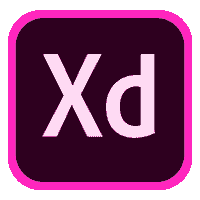
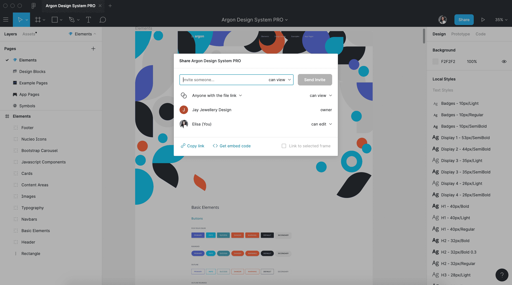
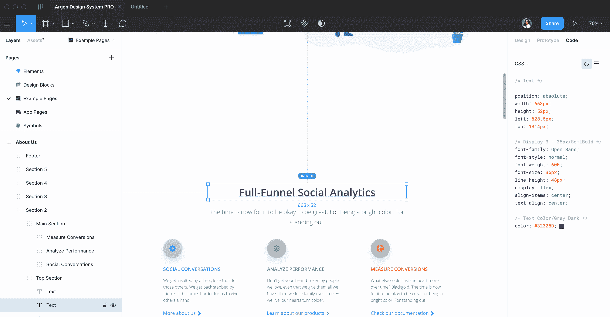
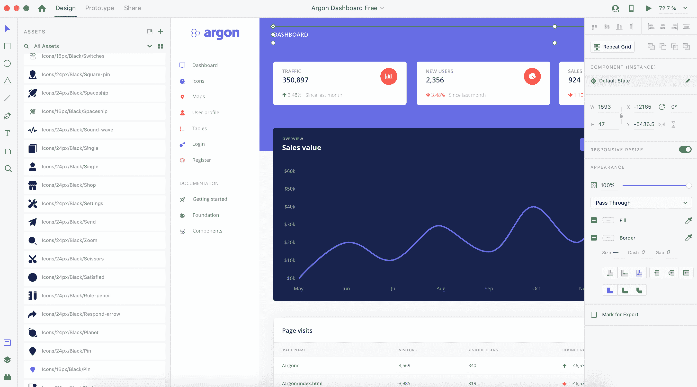
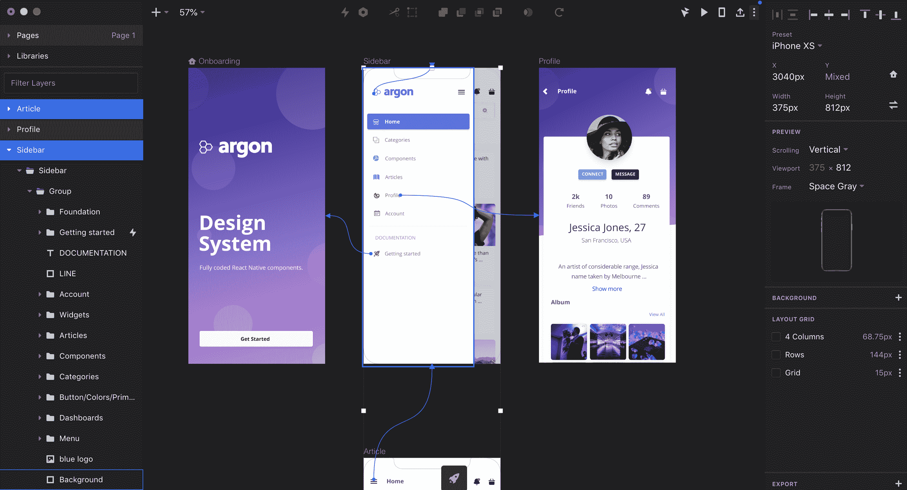
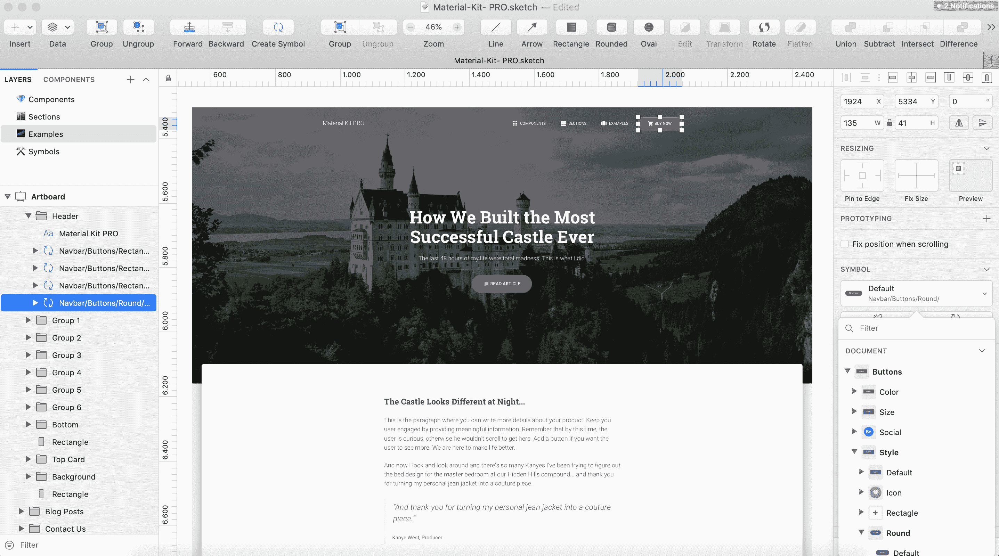

# adobe XD vs Sketch vs fig ma vs InVision——如何挑选 2020 年最好的设计软件

> 原文：<https://www.freecodecamp.org/news/adobe-xd-vs-sketch-vs-figma-vs-invision/>

比较**Adobe XD vs Sketch vs fig ma vs InVision studio**在寻找最佳设计软件的设计师中，这是一个非常常见的话题。

长期以来，Sketch 一直是 UX 和 UI 设计师的首选应用程序。但是在过去的四年里，我们看到了许多新的竞争者争夺 Sketch 的桂冠。其中进步最大的三个是 Figma、Adobe XD 和 InVision Studio。

这四种工具有许多共同之处，但也有一些不同之处。例如，第一个比较，Adobe XD 与 Sketch，是有意义的，特别是因为两者都有一个相似的界面，用户友好且具有简约风格。

在这篇文章中，我利用我在 [Creative Tim](https://www.creative-tim.com/?ref=freecodecamp) 工作时获得的经验，分析了最常用的设计应用程序是如何竞争的，以及它们的独特功能是什么。

### **[土坯 XD](https://www.adobe.com/products/xd/details.html)**

Adobe XD 由 Adobe Inc .开发并发布，于 2017 年 10 月 18 日发布。它是一个基于矢量的用户体验设计工具，适用于 macOS 和 Windows 的 web 应用、移动应用和语音应用。iOS 和 Android 也有一些版本可以帮助你直接在移动设备上预览你的工作结果。

XD 还支持网站线框化和创建简单的交互式点击原型。借助 Adobe XD 的字符和布局工具，可以轻松创建元素并导出单个对象。

界面保持相对简单，工具栏在侧面对齐，还有大的画板区域。

比较 Adobe XD 和 Sketch 是有意义的，特别是因为这种相似的界面是用户友好的，并且具有简约的风格。

### **[草图](https://www.sketch.com/)**

草图是一个[矢量图形编辑器](https://en.wikipedia.org/wiki/Vector_graphics_editor)，由[荷兰](https://en.wikipedia.org/wiki/Netherlands)公司开发的波西米亚编码。Sketch 于 2010 年 9 月 7 日首次为 [macOS](https://en.wikipedia.org/wiki/MacOS) 发布。它在 2012 年获得了苹果设计奖。

Sketch 与其他矢量图形编辑器的一个关键区别是，Sketch 不包括打印设计功能。Sketch 只在 macOS 上可用。第三方和切换工具部分解决了这个问题。

当 Sketch 第一次出现时，它完全扰乱了界面设计领域，但是 Adobe XD 和 Figma 最近成为了新的挑战者。它们提供独特的功能，如原型制作和实时协作。

我最近在为我的副业项目[uxtools.co](http://uxtools.co/)研究这些工具，并想分享我认为最值得注意的决策点。此外，在我看来，[学习素描](https://ahrefs.com/keywords-explorer/google/us/overview?keyword=learning%20to%20sketch)非常有用，而且不需要太多就能成为专业人士。

### **图图**

Figma 于 2016 年登台[，初始资金为 1400 万美元](https://techcrunch.com/2015/12/03/figma-vs-goliath/)。

凭借其无缝的用户界面和时尚的功能选项板，该工具很快成为该领域类似解决方案的臭名昭著的竞争对手。

来自 Twitter、微软、GitHub 和 Dropbox 等品牌的设计师将 Figma 视为终极 UI 设计工具。

### **[视觉工作室](https://www.invisionapp.com/studio)**

InVision Studio 是一款新软件，于 2019 年发布，允许设计师构建更高级的动画和微交互。Studio 还通过其 Craft 插件集成了 InVision 的 Sketch 链接。

默认情况下，InVision Studio 有一个漂亮的深色用户界面，这有助于开发人员专注于晚上要做的工作。然而，使用 macOS Mojave，每个应用程序都可以很容易地看起来像这样。当他们创建它时，他们受到了另一个设计工具的启发——我正在考虑 Sketch 应用程序。

## **应用比较**

### **1。定价**

当你用自己的资源工作时，预算可能是个大问题。其中一些许可证有教育和促销价格(通常是 50%)，所以不要错过这一部分。例如，只要你不在一个团队工作，Figma 就会让你免费去那里。

*   **Figma** :个人免费！您可以免费拥有 3 个项目，或者您可以以每月 12 美元(按年计费)的价格升级到无限项目和团队功能。
*   **草图**:每份许可证 99 美元，你可以终身使用 Mac 应用程序，并获得该应用程序的下一个生产版本。
*   Adobe XD :根据个人或团队的需求，它提供免费和付费计划。付费计划起价为每月 9.99 美元。
*   **InVision Studio:** 现在免费。

### **2。站台**

虽然 Sketch 非常受欢迎，但它迫使设计师只能使用 Mac，这使得开发人员无法访问设计文件。

*   **Figma** :浏览器！Figma 最近发布了一款 [Mac 应用](http://figma.com/downloads)和 [Windows 应用](https://www.figma.com/downloads)(不过不支持离线)。
*   **草图**:仅限 Mac。
*   **Adobe XD** : Mac 和 Windows。受到与 CC 套件相同的限制。
*   **InVision Studio:** Mac 和 Windows。

### **3。实时协作**

没有人喜欢在一天结束时发送“3.0 版”、“3.0.final 版”、“3.0.final.final 版”。直播协作可以帮助我们，尤其是直播评论。

我想这些都是围绕着高度创新的 Google Docs 套件发布的同样的担忧。然而，Google Docs 在实时协作方面颠覆了微软套件，现在 Figma 正在寻求在 UI 设计方面做同样的事情。

*   **Figma** :是的！更不用说是基于浏览器的，它允许 Windows 甚至 Linux 用户拥有一个非常完美的设计工具。
*   **草图**:不是原生的，而是一个插件，[野餐](http://picnic.design/)，正在寻求改变这一点。此外，他们有[团队](https://www.sketch.com/teams/)的草图。
*   **Adobe XD** :提供实时协同编辑，在 Adobe MAX 2019 推出。
*   **InVision Studio:** 目前不可以，但是可以生成分享链接。

*图片:Figma - [氩设计系统 Pro](https://www.creative-tim.com/product/argon-design-system-pro?ref=freecodecamp)*

### **4。移交**

最近已经开发了一些应用程序，专门向开发人员提供规格(尺寸、间距、颜色)，但设计工具已经开始集成这种功能。

*   **Figma** :由于实时协作，开发人员可以很容易地进入(不管操作系统)并访问设计。Figma 现在可以在右侧面板中整齐地打印 CSS、iOS 或 Android 的切换代码。
*   **草图**:他们最近推出了自己的原生开发者移交功能——云检查员。甚至有一个完全免费的替代方案叫做草图测量，也同样有效。
*   Adobe XD :它提供设计规范，允许设计者创建一个包含度量、资产和自动生成的 CSS 代码片段的共享链接。
*   **InVision Studio:** 他们有“现在检查”。

*图片:Figma - [氩设计系统 Pro](https://www.creative-tim.com/product/argon-design-system-pro?ref=freecodecamp)*

### **5。离线**

这很重要。当 Wifi 关闭时，一些在线应用程序可以保护您的信息，但您需要完全访问权限才能离线打开、使用和保存应用程序。

*   没有，在 AMA 中他们声明他们目前没有任何增加它的计划。
*   **草图**:当然。
*   Adobe XD :是的。
*   **InVision 工作室:**是的。

*图片:AdobeXD - [氩气仪表盘免费](https://www.creative-tim.com/product/argon-dashboard?ref=freecodecamp)*

### **6。原型制作**

如今有几十个这样的应用程序，但它们可能会灭绝，因为 Adobe XD 将原型直接引入了设计工具。看好这些。

*   **Figma** :是的！这是非常基本的，但感觉就像没有过渡的 Adobe XD。此外，还有一个很好的[帧](https://medium.com/figma-design/introducing-figmas-integration-with-framer-c69a747aeee2)集成。
*   **草图**:对！
*   **Adobe XD** :对，app 内原生原型。Adobe XD 还支持语音原型和键盘/游戏手柄支持。
*   **InVision Studio:** 可以，可以创建原型和动画。

*图片:InVision Studio - [氩反应原生](https://www.creative-tim.com/product/argon-react-native?ref=freecodecamp)*

### **7。符号**

符号可以使你的工作更容易。这些完全改变了设计过程。忘记一遍又一遍地构建和复制列表项，让符号为你工作。

*   图玛:准备好了。符号现在有状态、约束和替代。
*   **Sketch**:Sketch 中的符号功能非常令人印象深刻，并且还在继续改进。符号可以在整个文档中更新，并可以相应地调整大小(这意味着在更改屏幕尺寸时，您的工作量会减少)。
*   Adobe XD :它提供了可以在整个文档中使用以及跨文档链接的组件。它还允许设计者为不同的交互创建组件的变体，称为组件状态。
*   InVision Studio: 它们的组件非常接近其他应用程序中的符号约定。最终形式的组件将遵循广泛的、可扩展的层次结构，允许设计人员在设计中智能地快速构建、混合和匹配组件。

*图片:草图- [素材库 Pro](https://www.creative-tim.com/product/material-kit-pro?ref=freecodecamp)*

## **结论**

Sketch 在这里有一个很大的缺点，因为它只提供给 Mac 用户。因此，它让 Figma 和 Adobe XD 这样的工具在基本需求之外进行创新。

此外，在设计工具方面，Adobe XD 提供了一套健壮的 responsive，而 Sketch 没有内置这一功能(但它有许多插件)。如果你的工具比其他工具做得更好，这通常就足以成为转换的理由。Figma 采用的基于浏览器的方法也值得关注。

当谈到 Adobe XD vs Sketch 时，第一个的未来看起来非常光明，并将赢得许多 Sketch 用户。InVision 重心的改变可能会确保它的生存，但有一点是肯定的——Adobe XD 将继续存在。Adobe 公司很强大，像 InVision 和 Sketch 这样的小公司将不得不努力工作以在未来保持相关性。

人们通常喜欢在一个地方设计和工作。如果你是团队的一员，那么 Figma 无疑是适合你的。

在所有这些之后:第一个是 Figma，第二个是 Sketch，第三个是 Adobe XD，第四个是 InVision Studio。

总的来说，当谈到最好的设计软件时，这四个工具非常适合现代设计师的需求。

尝试所有四种方法，看看哪一种更适合您的用例。我希望这个比较——Adobe XD vs Sketch vs fig ma vs InVision——能帮助你决定哪种设计工具更适合你。

资源:

[https://www.figma.com/figma-vs-sketch/](https://www.figma.com/figma-vs-sketch/)

[https://uxtools.co/blog/sketch-vs-adobe-xd-vs-figma/](https://uxtools.co/blog/sketch-vs-adobe-xd-vs-figma/)

[https://www.codeinwp.com/blog/figma-vs-sketch-vs-adobe-xd/](https://www.codeinwp.com/blog/figma-vs-sketch-vs-adobe-xd/)

[https://support . invision app . com/HC/en-us/sections/360004450191-Studio](https://support.invisionapp.com/hc/en-us/sections/360004450191-Studio)

[https://helpx.adobe.com/ro/xd/help/components.html](https://helpx.adobe.com/ro/xd/help/components.html)

[https://www.sketch.com/docs/](https://www.sketch.com/docs/)