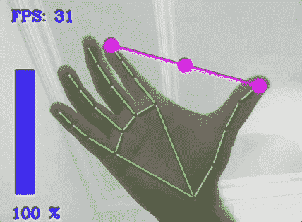

# 用 Python 实现高级计算机视觉

> 原文：<https://www.freecodecamp.org/news/advanced-computer-vision-with-python/>

如今，越来越多的应用程序使用计算机视觉。

我们刚刚在 freeCodeCamp.org YouTube 频道上发布了一个完整的课程，将帮助您使用 Python 学习高级计算机视觉。通过用 OpenCV 和 Mediapipe 等库构建五个项目，您将学习最先进的计算机视觉技术。

如果你是初学者，不要害怕进阶这个词。尽管这些概念很先进，但本课程以一种易于理解的方式教授它们。

这门课由穆尔塔扎·哈桑教授。Murtaza 有一个关于机器人和人工智能的受欢迎的 YouTube 频道，现在他正在与 freeCodeCamp 的观众分享他的专业知识。

在课程的前半部分，你将通过实现手部跟踪、姿势估计、面部检测和面部网格来学习核心技术。

在课程的后半部分，你将创建五个实际应用的项目。以下是您将创建的内容:

*   手势音量控制
*   手指计数器
*   AI 私人教练
*   人工智能虚拟画家
*   人工智能虚拟鼠标

观看 freeCodeCamp.org YouTube 频道的全部课程(6 小时观看)。

[https://www.youtube.com/embed/01sAkU_NvOY?feature=oembed](https://www.youtube.com/embed/01sAkU_NvOY?feature=oembed)