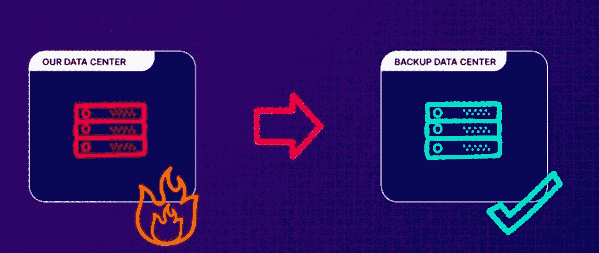
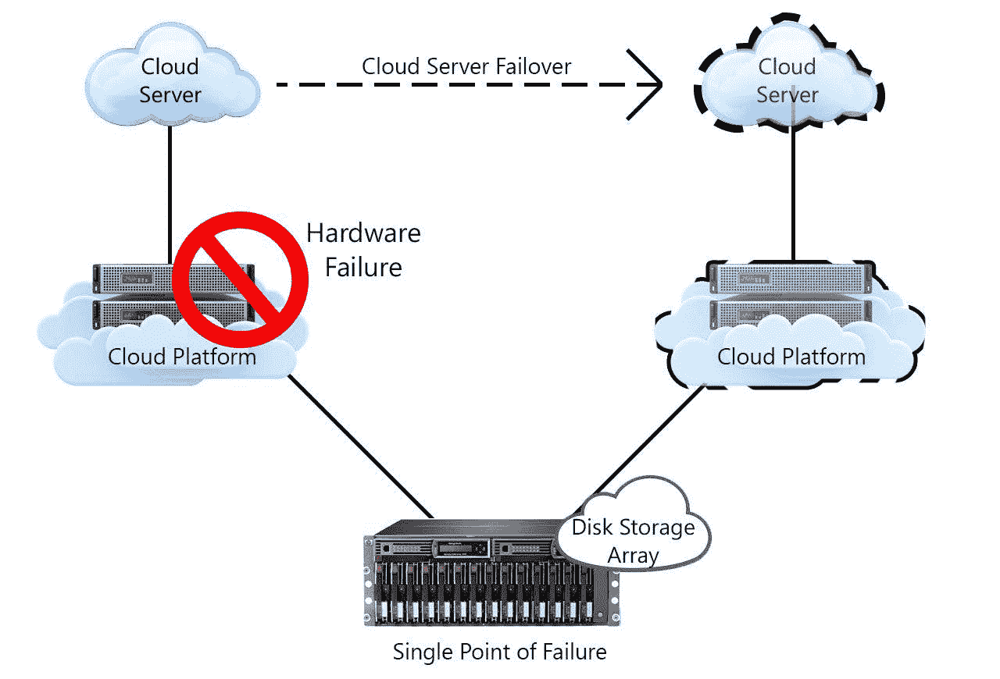
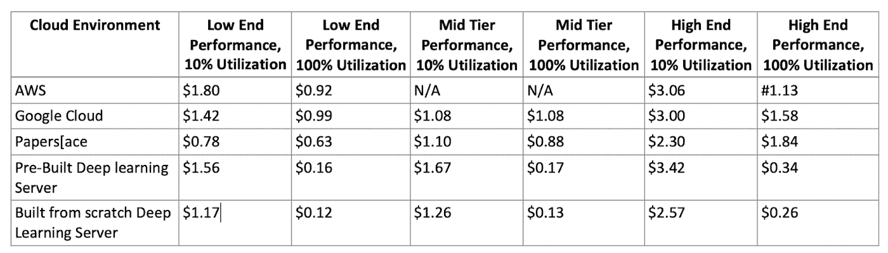
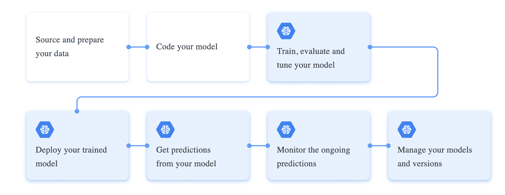

# 为什么您应该迁移到云？解释云计算的优势

> 原文：<https://www.freecodecamp.org/news/advantages-of-cloud-computing/>

术语云计算指的是在互联网上运行的软件和服务，而不是在本地的服务器或计算机上运行。

采用云可以帮助您和您的团队削减成本，并确保您的数据和系统随时随地可供您的客户使用。

云技术对许多不同的业务都有很大的潜力，并且还在继续扩展。

世界各地有许多云提供商，如 AWS、微软 Azure 和谷歌 GCP。因此，您应该能够找到一个适合您从本地服务器迁移到云服务器的选项。

在本文中，您将了解为什么如此多的公司正在向云迁移，以及在将您的数据和系统平稳迁移到云时可以应用的五大云迁移策略。

让我们开始吧。🚀

## 为什么要迁移到云？

公司转向云计算有很多原因。没有云，你也可以获得这些优势，就像你多年来一直在做的那样，但云使其中许多优势变得更容易、更实惠。

### 1.容错

许多公司最初对云感兴趣的一个常见原因是容错。

根据定义，容错是指当一个或多个组件出现故障时，系统继续运行而不中断的能力。这里，系统可以是计算机、网络或云集群。

[acloudguru.com](https://acloudguru.com/)

如果你是一家重视正常运行时间和一致性的公司，你可能会有一个灾难恢复计划。如果您的主数据中心出现某种灾难性问题，这些计划通常会涉及一些备用位置，您可以在这些位置存储数据或系统。

传统上，公司通过与提供商签订合同来保留其硬件的第二个物理副本。这样，当主要硬件无法运行时，它就准备好了。

唯一的问题是，当一切都正常运行时，备份物理硬件只是坐在那里积灰，变得过时。而且它会让你花费更多，因为即使你当时不使用它，你仍然要为它付费。

此外，如果那个物理拷贝发生了什么情况呢？一去不复返了。

但是，如果有比购买所有备份设备更好的方法呢？为什么不只是在你需要的时候租呢？

云提供商可以在几秒钟内为您提供大量的系统容量，您只需为您使用的容量付费。

此外，您不必担心自己管理这些资源。这几乎总是导致巨大的成本(和时间)节约。当危机结束时，你可以关闭这些东西，停止支付。

[datasoft.ws](https://datasoft.ws/templates/VPSHost/html/images/ftcloud1.jpg)

### 2.成本节约

转向云技术使您能够节省空间和成本。在云出现之前，您必须为现场服务器(有时甚至是非现场数据中心)付费。有了云，你付钱给云提供商来处理数据中心和其他资源，而不是自己在内部托管服务器。

例如，Oracle 报告称，他们的云客户通过转向云节省了大约[30%到 50%](https://www.forbes.com/sites/quora/2019/12/20/how-much-money-can-businesses-save-by-moving-to-the-cloud/?sh=6678530cef43&ref=hackernoon.com)。

[Table 1](https://towardsdatascience.com/why-you-should-consider-a-multi-cloud-strategy-in-your-next-machine-learning-project-994858273c5e): Cost Per Hour of Cloud and On-Prem Options

但是，如果你滥用你的云资源，它们很容易就会比任何一种现场服务器贵得多。这就是培训您的员工并让有经验的云架构师参与进来如此重要的原因。

所以你可以有很大的成本节约，但你必须小心你设定的预期，尤其是在早期。

### 3.全球化

这是公司转向云计算的另一个常见原因。随着你的业务增长并扩展到你的祖国之外，在你想要到达的新市场附近拥有资源和服务是有意义的。这可能是因为法规原因，也可能是因为性能原因。

Photo by [Artem Beliaikin](https://www.pexels.com/@belart84?utm_content=attributionCopyText&utm_medium=referral&utm_source=pexels) from [Pexels](https://www.pexels.com/photo/person-holding-terrestrial-globe-scale-model-taken-1079033/?utm_content=attributionCopyText&utm_medium=referral&utm_source=pexels)

云提供商已经在世界各地拥有数据中心和资源，你只需点击一下按钮就可以使用它们。

这可以节省大量成本，因为您不必自己创建数据中心。客户总是喜欢性能提升。

### 4.灵活

公司转向云计算的另一个原因是灵活性。简单来说，敏捷性就是响应不断变化的需求的能力。

在许多公司中，如果您想要运行一个需要 IT 设备的实验，您可能必须忍受征用和采购过程，并从 IT 团队获得资源来设置和维护该设备。这些步骤可能需要几周或几个月。

但通过采用不同提供商的云服务，你可以在几分钟内访问该设备，你可以尝试你的实验，然后在需要时关闭设备。

另一个好处是，你可以在几天内得到你的结果，而不是一个月，成本将比其他方式低。

### 5.可量测性

公司采用云的另一个原因是可扩展性。云计算中的可扩展性是指根据需要增加或减少 IT 资源以满足不断变化的业务需求的能力。您的目标是让您的容量尽可能接近您的需求，但这是一件很难预测的事情。

云提供商的现收现付模式让您能够根据业务需求灵活地扩展或缩减规模

## 云计算在人工智能领域是如何实现的？

云计算帮助公司处理大数据，开发人工智能解决方案来解决他们的业务问题。

例如，谷歌云 ML 引擎是由谷歌云平台(GCP)提供的通用服务。它要求您使用 Python 和 TensorFlow 库编写代码，以训练和评估不同用例(如图像识别)的机器学习模型。

您还可以在云平台上部署和运行您的人工智能解决方案，以便您的 web 应用程序可以通过 API 访问它们。

[ML Workflow](https://medium.com/@vinoroy70/tales-of-a-machine-learning-startup-50b290e1c9cd)

## 前 5 大云迁移策略是什么？

云迁移策略是一个公司可以采用的将其部分或全部数据和系统迁移到云中的计划。拥有一个好的策略是至关重要的，因为它可以帮助公司确定和验证迁移其数据和系统的最有效方式。

迁移到云时，您可以应用几种迁移策略。要应用的正确策略将取决于系统的需求和您的长期计划。

### 1.主机更换

第一种迁移策略是简单地将您现有的数据和系统迁移到云中，不做任何更改。这意味着您将把在旧环境(现场服务器)上运行的相同软件、相同操作系统和相同数据转移到云提供商。

有时这种策略被称为“提升和转移”，因为你只是从 a 点移动到 b 点，而没有做出任何改变。这种策略的优点是在迁移到云时风险较低。但不利的一面是，从长远来看，它可能不会带来太多好处。

> **“Cordant Group 在 AWS 上重新托管其 IT 运营，并节省了**50%的基础设施成本*。*——[simform.com](https://www.simform.com/?ref=hackernoon.com)**

****注:**** 这是很多公司迁移到云的非常常见的第一步。

### 2.平台

这种策略为您提供了使用云提供商提供的一些云服务的优势。您可以开始使用云供应商提供的现有云服务，而不仅仅是将您的数据和系统迁移到云中。

例如，云提供商可以提供完全托管的数据库服务，允许公司管理其数据库，并可能节省容错和维护成本。

### 3.买回

这种策略让您可以选择购买已经在云中的东西，而不是将您的系统迁移到云中。

您可以放弃现有系统，从云供应商那里购买新的云服务。有时，这种迁移策略被称为“放下并购买”。

例如，一家公司可以决定许可一些用户帐户或者已经在云中的新的客户关系管理系统。Salesforce 就是这类系统的一个例子。

### 4.重新架构

如果你想变得雄心勃勃，你完全可以通过在云上重新设计和重建你的系统来重新架构。你可以使用云提供商提供的各种服务来创建一些人所谓的云原生版本。

这仅仅意味着您使用的方法能够最好地利用云提供商所提供的优势。这个过程需要很多时间，只有当您认为现有系统不能满足当前业务需求时，才会考虑这个过程。

从长远来看，这种方法往往会产生最佳回报。例如，公司可以利用现有环境中不具备的云功能，如无服务器计算和云自动扩展。

****注:**** 这种迁移策略也是最复杂、风险最大的。

### 5.退休

最后一种迁移策略称为淘汰。在这里，公司可以评估他们的系统，找出系统的哪些部分根本没有被使用。

如果是这种情况，公司可以简单地关闭它们，因为保持系统运行是有成本的。有时这被称为系统或应用程序的日落。

## 最后的想法

[从业务和运营的角度来看，云技术](https://hackernoon.com/how-to-deploy-machine-learning-models-to-the-cloud-quickly-and-easily?ref=hackernoon.com)有很多优势。在本文中，我解释了其中的几个，它们可以帮助你决定在你的公司或你的个人项目中采用云技术。

除了采用云技术的好处，你还必须考虑潜在的风险。这些风险包括:

*   向云的迁移可能非常耗时。
*   你对你的数据没有太多的控制权，因为你在使用第三方。
*   云技术需要更多的管理技能。
*   现有数据可能会丢失。

您还必须知道云迁移可能是复杂且有风险的。实施云迁移战略可能会遇到自身的挑战，例如成本管理、供应商锁定、数据安全性和合规性。

如果您根据您的数据和系统选择正确的迁移策略，就可以应对这些挑战。

如果你学到了新的东西或者喜欢阅读这篇文章，请分享给其他人看。在那之前，下期帖子再见！

你也可以在 Twitter 上找到我 [@Davis_McDavid](https://twitter.com/Davis_McDavid) 。