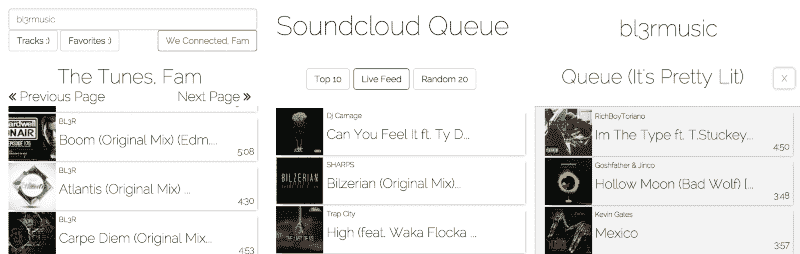

# NodeJS 历险记

> 原文：<https://www.freecodecamp.org/news/adventures-in-nodejs-d3d1f85a9d3e/>

埃利奥特·麦克纳利

# NodeJS 历险记

几周前，在浏览了 FreeCodeCamp 的前端课程后，我开发了一个应用程序，并想在进入 NodeJS-land 时更新一下。我终于能够获得我的前端证书，这是我非常自豪的，但一旦我进入后端，兴奋很快就消失了。

到目前为止，学习 NodeJS 非常困难。试图撒上仙尘是没有意义的。从主要使用 JQuery 和一些基本的 JS 技术的前端，到使用普通的 ol' Javascript 和数百个回调的后端，我发现我不知道自己在做什么。

Me trying to learn NodeJS

NodeJS 要求对 Javascript 有基本的理解。当我开始尝试学习它时，我肯定没有这种能力。我不得不回去看几个小时的 YouTube 视频，解释回调、事件循环、闭包、作用域等等…

我开始有了相当多的理解，但在无数次的回访后，我还是会迷失。我使用 learnyounode，如果不寻找解决方案，我甚至无法解决第一个问题。

我开始阅读大量的 MEAN Stack 教程，试图获得使用 Express 进行路由和节点的基本概念。在我意识到我没有真正吸收正在发生的事情之前，我建立了至少 4 个不同的待办应用程序，2 个 reddit 克隆，1 个 Twitter 克隆和 2 个聊天应用程序。我肯定没有盲目地遵循指示，但是他们认为我对 Javascript 了解太多了。

我开始在 NewBoston 的 YouTube 频道上观看一系列节目，这些节目确实帮助我了解了基本原理。我打算尝试制作另一个 reddit 克隆，直到我意识到我应该从我关心的东西开始学习，我制作的 Soundcloud queue 应用程序。

我不再看东西，开始通读文档。我跟随入门教程，试图了解更多的基本原理。

我经常谈到在编程时“点击”某些东西的感觉，这次我也有同样的感觉。这是一个你永远不会忘记的时刻，因为你的肾上腺素在分泌，你可以看到一些光。当我能够用键-值对设置我的第一个数据库，让事件将东西推送到数据库，然后将 JSON 发送到我创建的一个路由时，这是令人难以置信的。已经很晚了，我像个疯子一样在房间里打转。

从那时起，我开始获得一些信心，并不断鞭策自己。我在 MongoDB 中查找、排序和增加我现有的文档。我意识到我想要一个实时提要，所以我开始研究 Socket.io。

我认为我之前学习的教程的问题是，我从来没有真正了解过我为什么做事情。我总是只是做这些事情，而不是真的去想它。知道你为什么做你正在做的事情是非常重要的。

我不再用谷歌搜索那些以“我如何……”开头的东西，而是开始搜索为什么，试图弄清楚到底发生了什么。我的搜索开始看起来更像是“OAuth 中的刷新令牌是什么？”或者“Passport.js 中序列化和反序列化做什么？”。

当我做出这个转变时，我真的开始学习了。

不断鞭策自己也很重要。如果你有想做的东西，就去做。总是有办法做某件事的，这取决于你自己(当然，除非是 API 的限制或其他什么…那么你只需要变得有点黑客样:)。如果你不知道如何认证用户，尝试学习。如果您不知道如何创建 RESTful API，请学习！这将需要大量的时间，但一旦它点击你会欣喜若狂。

上周日我太投入了，一直工作到凌晨 5 点，这时海鹰队开始在墨尔本比赛。这是一场长达 14 小时的编码狂欢。我真的从来没有享受过如此多的乐趣，也从未如此专注于任何事情。这是一种疯狂的感觉。

我终于弄明白了(在某种程度上)如何用 Heroku 部署它，而且它已经上线了。现在有一个 feed 显示网站上正在排队的歌曲，在右上角有一个 live artist feed 显示网站上正在搜索的艺术家。我还实现了一个前 10 名歌曲的前 10 名排名(自从推出这个功能以来)。

Random 20 仍然为所有使用它寻找新音乐的人而存在。多亏了我在[上一篇文章](https://medium.freecodecamp.com/building-an-app-outside-of-your-curriculum-7b76aa881d52)中的一个建议，我已经让用户可以用他们的 SoundCloud 账户登录并喜欢歌曲了。

正确学习 Node 和 Javascript 将是一个漫长的旅程，但我有耐心。三个月前，我甚至不知道变量是什么。

你也可以在推特上关注我的冒险。