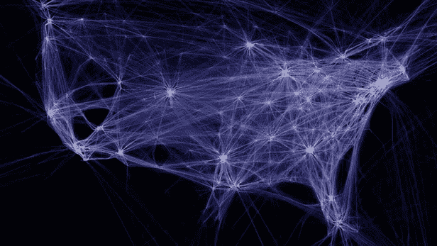
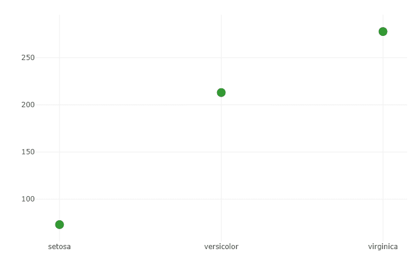
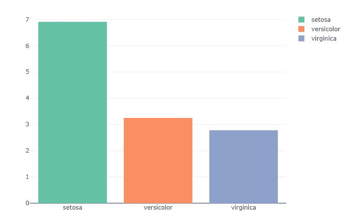
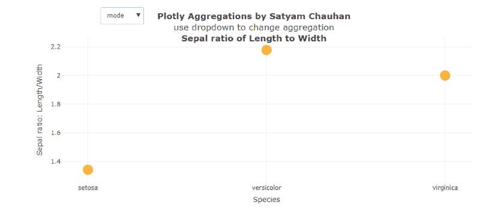
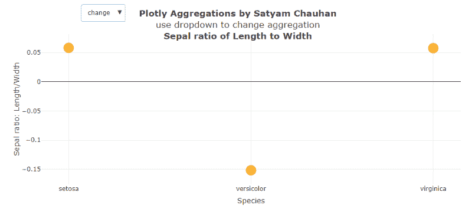
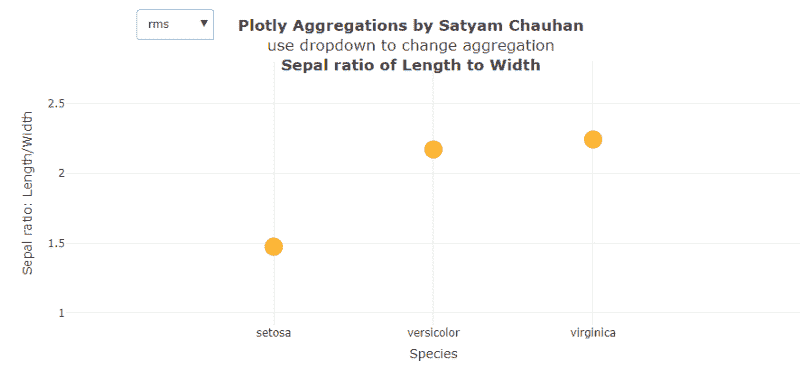

# R 中的聚合介绍:处理数据的强大工具

> 原文：<https://www.freecodecamp.org/news/aggregates-in-r-one-of-the-most-powerful-tool-you-can-ask-for-4dd14eafff1f/>

萨蒂扬·辛格·乔汉

# R 中的聚合介绍:处理数据的强大工具

数据可视化不仅仅是关于颜色和图形。这是关于探索数据和可视化正确的事情。



[Source](https://newatlas.com/art-ones-and-zeros-data-visualization/49926/)

在处理数据时，最有用的工具是聚合。聚合只是我们应用于任何给定数据的转换类型。

#### 我们有 11 个聚合函数可用:

*   **avg**
    计算并返回所有数值的平均值。
*   **count**
    函数 count 返回每组中项目的总数。
*   **first**
    函数首先返回每组的第一个值。
*   **last**
    每组的最后一个值由函数 last 返回。
*   **max**
    每组的最大值由函数 max 返回。
    识别异常值也很有帮助。
*   **median**
    函数 median 返回上述组中所有数值的中值。
*   **min**
    每组的最小值由函数 min 返回。
    识别异常值也很有帮助。
*   **mode**
    函数 mode 返回所述组的所有数值的模式。
*   **rms**
    均方根，函数 rms 返回组中所有数值的 rms 值。
*   **sttdev**
    函数 stddev 返回组中给定的所有数值的标准差。
*   **sum**
    函数 sum 返回所有数值的总和。

### 基本示例

#### **使用聚合函数的基本视觉散点图——sum**

```
#Include the Librarylibrary(plotly)
```

```
#Store the graph in one variable to make it easier to manipulate.p <- plot_ly(     type = 'scatter',     y = iris$Petal.Length/iris$Petal.Width,     x = iris$Species,     mode = 'markers',     marker = list(          size = 15,          color = 'green',          opacity = 0.8     ),     transforms = list(          list(               type = 'aggregate',               groups = iris$Species,               aggregations = list(                    list(                         target = 'y', func = 'sum', enabled = T                    )               )          )     ))
```

```
#Display the graphp
```

#### **这是什么意思？**

函数 sum，如上所述，计算每组的和。因此，这里的群体被归类为物种。这个代码使用的 Iris 数据集包括三个不同的物种，setosa，veriscolor 和 virginica。对于每个物种，数据集中有 50 个观察值。这个数据集在 R(内置)中可用，可以直接加载。

有“iris”和“iris 3”——两个数据集可用。你可以选择其中任何一个来运行这段代码。本文使用的数据集是“iris”。



**Fig. 1 Sum** of Petal Length

#### **这段代码到底**做什么**？**

这段代码使用函数 sum 并计算所有花瓣的总和。每组长度分别为。然后，计算出的总和绘制在 x-y 轴上。x 轴表示物种，y 轴表示总和。

从这个图中，我们可以看出 setosa 的花瓣大小最小，因为总和最小，但是**并不是决定性的证据**。为了得到确凿的证据，我们可以使用 avg 函数。

函数 sum**非常适合几乎整个数据集**。例如，在人口数据集中可以使用这种方法。在世界人口数据集中，我们可以按大洲聚合国家，求出其中所有国家的人口总和。

#### **最常用功能—平均值**

```
#Include the Librarylibrary(plotly)
```

```
#Store the graph in one variable to make it easier to manipulate.q <- plot_ly(     type = 'bar',     y = iris$Petal.Length/iris$Petal.Width,     x = iris$Species,     color = iris$Species,     transforms = list(          list(               type = 'aggregate',               groups = iris$Species,               aggregations = list(                    list(                         target = 'y', func = 'avg', enabled = T                    )               )          )     ))
```

```
#Display the graphq
```

#### **这是什么意思？**

虹膜数据集包含两列花瓣，花瓣。此外，它还可以用来计算花瓣比例的平均值。长度和花瓣宽度



**Fig. 2** **Average** ratio of Petal Length to Petal Width

#### 这段代码到底是做什么的？

对于每次观察，花瓣的比例。长度到花瓣。在绘制所有增益值的平均值之前计算宽度。正如我们可以从这个柱状图中观察到的，Setosa 具有最大比率，接近比率 7，这表明 Setosa 的花瓣长度是其宽度的 7 倍。而另一方面，virginica 的比率最小，接近宽度的 3 倍。

这个函数非常灵活，尤其是当它被非常明智地使用以获得最佳结果时。例如，如果我们考虑一些其他数据集，如人口，那么我们可以计算每个国家的平均出生与死亡比率。

让我们在一张图中使用所有的函数。现在我们将为每个类别绘制一个散点图，我们将使用所有的函数。在这个图中，我们将添加一个按钮，从中我们可以选择所需的功能，使我们的工作更容易，更快地得到结果。

#### **所有功能的集合——所有功能在一个图形中**

```
#Include the Librarylibrary(plotly)
```

```
#Store the graph in one variable to make it easier to manipulate.s <- schema()agg <- s$transforms$aggregate$attributes$aggregations$items$aggregation$func$valuesl = list()
```

```
for (i in 1:length(agg)) {     ll = list(method = "restyle",     args = list('transforms[0].aggregations[0].func', agg[i]),     label = agg[i])     l[[i]] = ll     }
```

```
p <- plot_ly(     type = 'scatter',     x = iris$Species,     y = iris$Sepal.Length / iris$Sepal.Width,     mode = 'markers',     marker = list(          size = 20,          color = 'orange',          opacity = 0.8          ),     transforms = list(          list(               type = 'aggregate',               groups = iris$Species,               aggregations = list(                    list(                         target = 'y', func = 'avg', enabled = T                    )               )            )     )) %>%layout(     title = '<b>Plotly Aggregations by Satyam Chauhan</b><br>use     dropdown to change aggregation<br><b>Sepal ratio of Length to     Width</b>',     xaxis = list(title = 'Species'),     yaxis = list(title = 'Sepal ratio: Length/Width'),     updatemenus = list(          list(               x = 0.2,               y = 1.2,               xref = 'paper',               yref = 'paper',               yanchor = 'top',               buttons = l          )     ))
```

```
#Display the graphs
```

#### **这是什么意思？**

我们制作了一个存储所有聚集函数属性的列表。我们使用这个函数来试验 r 中聚合的所有函数。

下面显示了一些带有不同示例的图表。



**Fig. 3** Illustrates the function **mode**.

#### 这段代码到底是做什么的？

首先，如前所述创建一个列表，其中存储了所有的函数。列表做好之后，y 轴设置为萼片比例。到萼片的长度。宽度和 x 轴设置为物种。

在计算比率之后，调用函数转换，其中 func = 'avg '仅用于起始阶段。当我们运行这段代码并选择函数“mode”时，我们得到**图 3(上图)，**显示 setosa 的模式是三者中最少的，大约为 1.4。Mode 表示比率 1.4 重复的次数最多，或者该值最有可能被采样。我们在这里看到的不同模式是，最有可能被采样的最高值来自模式接近 2.2 的类别 veriscolor。



**Fig. 4** **Left Figure**: Illustrates the change in Sepal ratio of Length to Width **Right Figure**: Illustrates the root mean square (**rms**) value of the Graph

在上面的图 4 中，画出了萼片长度与萼片宽度之比的变化，与其余的图相比，我们得到了非常不同的结果。我们观察到刚毛和海滨锦鸡儿的变化是相同的和正的，而在物种比率的变化中，veriscolor 几乎是负的，是刚毛和海滨锦鸡儿变化的三倍。

另一方面，右图显示了每个物种的均方根值。我们可以很容易地看到，物种 veriscolor 和 virginica 具有几乎相同的值，该值显著大于 setosa 的 rms 值。

### 结论

聚合函数是开发人员可以要求的最强大的工具之一。他们可以提供你意想不到的模式和结果。为了直观地分析数据，你必须处理数据，为此我们需要处理和转换数据。聚合函数可以帮你做到这一点，它们是在[转换](https://plot.ly/r/#transforms)中使用最广泛的函数之一。这篇文章只是一个开始。你当然可以多探索，多应用。探险者就是这么做的。