# 游击可用性测试 Airbnb iOS 应用的新体验功能

> 原文：<https://www.freecodecamp.org/news/airbnb-experiences-guerrilla-usability-test-on-ios-app-95c2b5186970/>

艾琳·郭

# 游击可用性测试 Airbnb iOS 应用的新体验功能

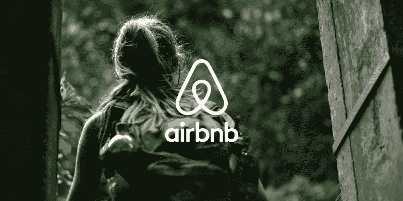

photo by Dan Gold

Airbnb 最近出了[体验](https://www.airbnb.com/experiences)，是由主持人设计并主导的活动。我在使用新设计的应用程序时遇到了一些问题，所以我进行了可用性测试，以:

1.  查看其他用户是否遇到了类似的问题
2.  确定用户的难点/优先事项，并
3.  让用户体验更加顺畅和直观。

当用户第一次前往一个新的城市时，当前的布局是很棒的——各种选项都被布置好了。但是当用户想要搜索更具体的东西时，它就不那么好用了。

请注意，我在 2017 年 1 月初进行了这项可用性测试，因此它没有反映此后引入的变化。

### 目标

运行一个游击式可用性测试来回答这个问题:**用户是否可以通过 Airbnb 的移动应用程序轻松搜索和预订特定的体验(非随机浏览)？**

### 目标用户

我采访了高频和低频旅行者，以了解每个群体之间的行为差异。与低频旅行者相比，更熟悉一系列自发的探索性体验的旅行者会如何行动？低频旅行者的体验理念可能包括预订主流观光的传统导游。我还确保受访者拥有从基础到高级的技术经验。

虽然 25 岁至 34 岁的旅行者是 Airbnb 用户中最大的人群，但老年女性是 Airbnb 最大的增长群体。将那些可以被认为是极端用户的人纳入可用性测试，帮助我为他们放大的需求进行设计，这些需求通常包括普通用户的需求。

我在咖啡店和公园里测试了 7 个用户。研究的重点范围允许我用小样本重复设计周期。

### 任务

我给用户提供了情境场景，并要求他们在完成四项任务时大声思考:

1.  场景:假设你刚抵达洛杉矶，想预订明天的瑜伽课程。你现在会怎么做？
2.  场景:你计划在十月的第二周去东京旅行。你如何预订几天的烹饪课程？
3.  任务:寻找评论。
4.  任务:预订体验。

*我演示了一个快速的自言自语环节，向参与者展示对他们的期望。我试图把我在使用我选择的应用程序时会感到困惑的例子结合起来，鼓励用户分享他们未经过滤的思维过程。

### 合成音符

为了综合我的研究，我把采访的要点写在便利贴上，并按主题分组。使用斯坦福大学设计学院的意义构建框架，我注意到了紧张和相关的设计原则，然后使用“我注意到了，我想知道”的结构得出见解，以集思广益的方式解决这些棘手问题。

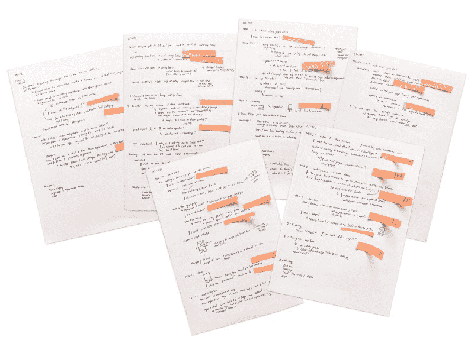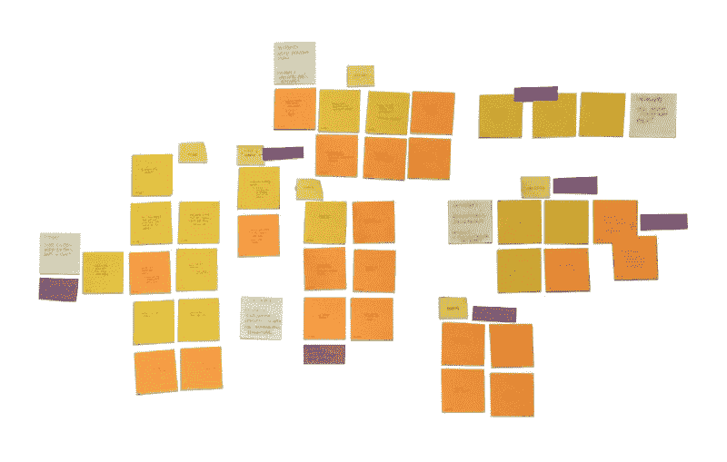

### 主要发现

我的研究揭示了 3 个关键发现:

#### **1。搜索栏混乱&忽略了过滤按钮**

> “我在哪里搜索？”

我采访的所有用户都试图使用顶部的搜索栏来寻找特定的体验。

> "我是不是必须从头到尾滚动一遍？"

在用户试图通过在通常输入位置和日期的搜索栏中键入特定的单词或短语来搜索体验后，他们不知道如何进一步缩小结果范围，因为他们经常忽略过滤器按钮。即使是之前使用过 Airbnb 应用程序的用户，在直接寻找过滤器选项时也没有看到它。

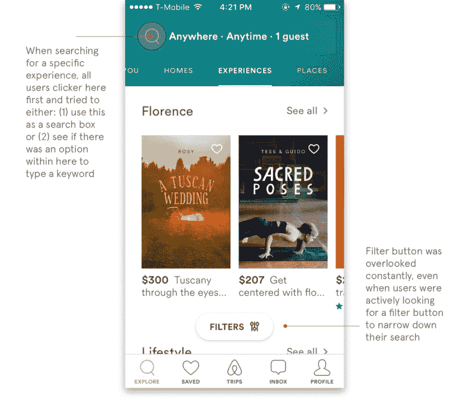

当我让用户根据一次经历会持续多长时间来过滤时，大多数人都跳过了过滤选项中的时间过滤器。

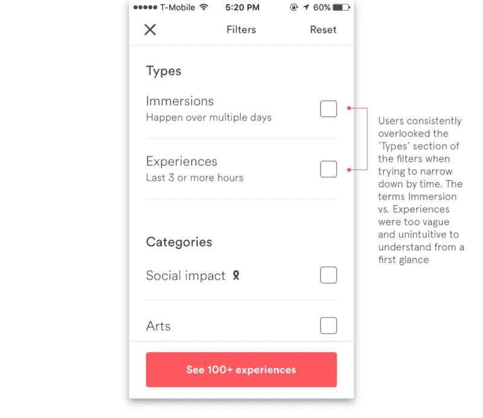

#### 2.**评论**

> "点击这个有用吗？"

用户直观地试图点击底部的星星栏来访问评论。

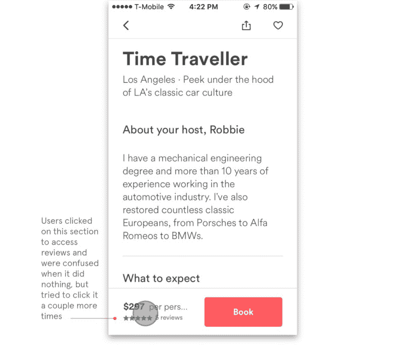

> “每个人的评分是多少？”

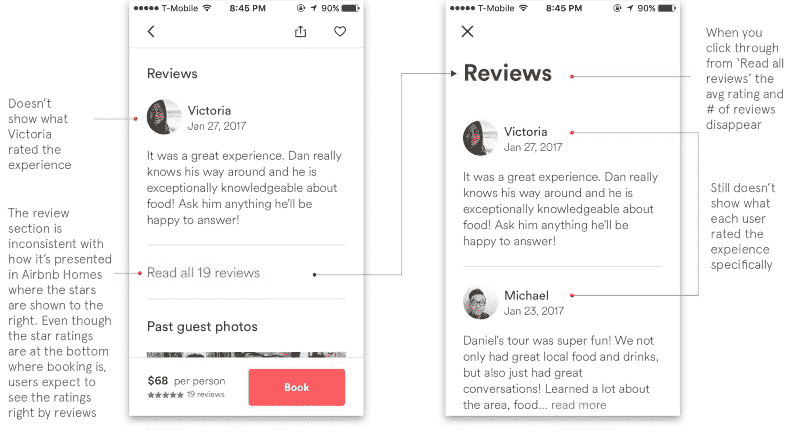

#### 3.**预订**

> “哦不！！！我订了吗？”

从用户点击“预订”开始，用户必须至少点击 5 次才能完成预订。用户认为点击“接受”意味着他们预订了体验。

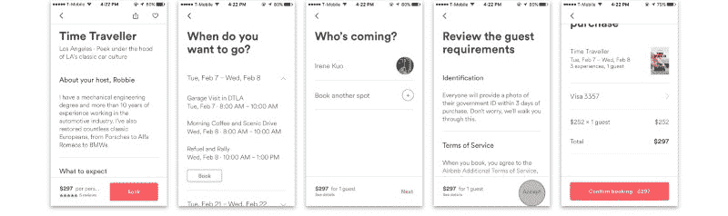

### 创意和原型解决方案

在强调了主要的痛点之后，我开始通过草图头脑风暴可能的解决方案，然后继续进行线框图和创建高分辨率模型。

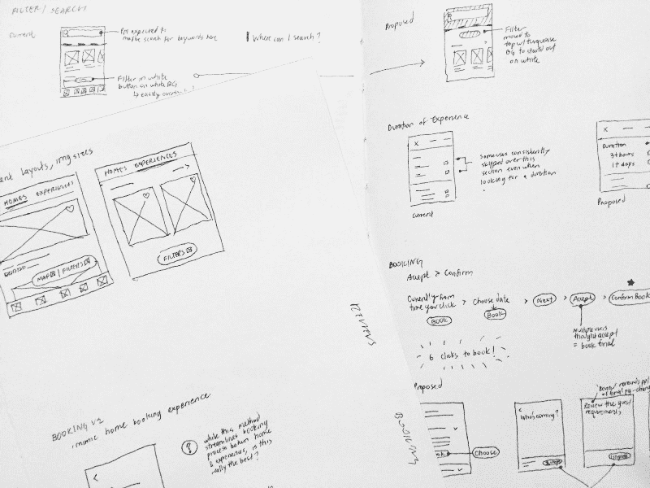

#### **1。搜索和过滤**

回顾我的发现，缺少搜索栏是最常见的摩擦点，也是导致最负面情绪反馈的原因。100%的用户在寻找一个新城市的特定体验时，直觉地寻找一个搜索栏来输入。

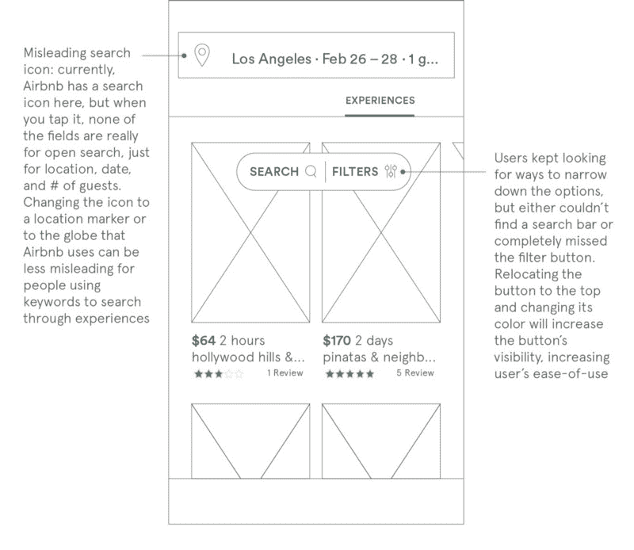

没有创建独立的搜索栏，而是仿照 Airbnb Home 的过滤器+地图按钮设计了搜索+过滤器按钮，以保持两种功能的一致性。

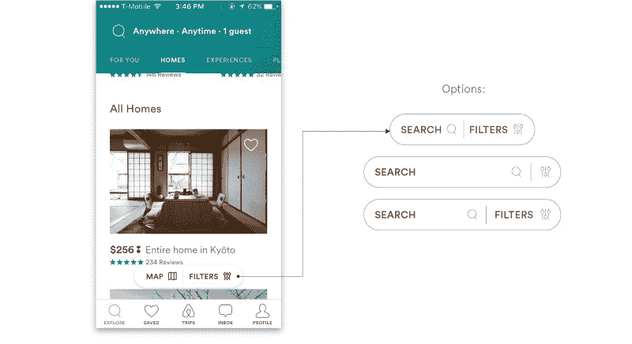

虽然第二个和第三个选项可以让用户在搜索栏中自动输入，从而最大限度地减少用户点击，但我希望这个按钮在顶部的输入栏中处于次要位置，以优先考虑位置、日期和客人数量的条目。

在创建了一个基于线框的模型后，它在顶部有搜索+过滤器按钮，我意识到在顶部放置搜索+过滤器会阻止第一次体验的添加到愿望列表的心形图标。下面提出的解决方案将按钮向下移动到原来的位置，但仍然通过颜色强调它。我的建议可以扩展到整个移动应用程序，以获得一致的体验。

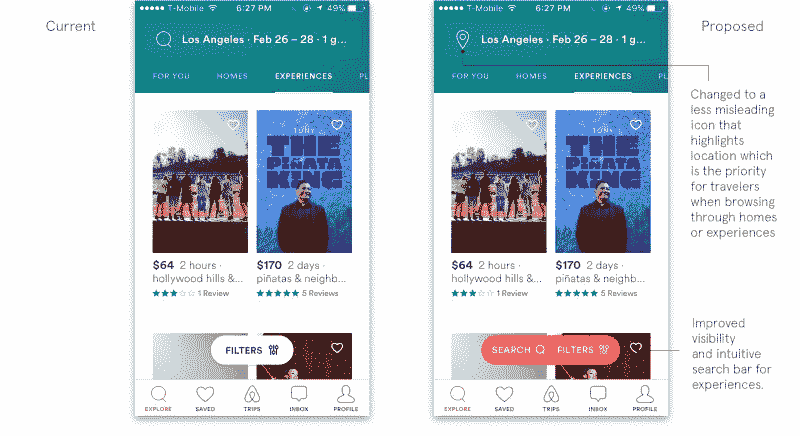

#### 1b。**持续时间过滤**

时间过滤器经常被忽视。所有主机引导的体验都归类在“体验”标签下可以理解的是，用户并没有立即意识到还有另一类导游(沉浸式)。为了消除用户在过滤器中看到的第一个术语的模糊性(沉浸与体验)，建议的解决方案:

1.  …完全放弃模糊的术语，以便更清楚地区分几小时和几天的体验。
2.  …将“类型”一词替换为“持续时间”,以阐明该过滤器是关于时间/体验将持续多长时间。

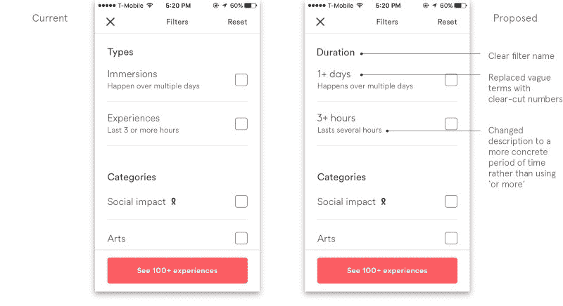

#### 2.**评论**

用户想知道每个特定的人对体验的评价。

用户既有作为客人的评级，也有作为主人的评级(如果他们是主人，则*)。鉴于 T2 在 Airbnb 社区对家庭中客人/主人评级的分离产生了困惑，我想确保这种困惑不会蔓延到体验/主人/客人评级。在我的设计中，我必须小心翼翼地澄清，每个经历过体验的客人留下的评级是针对体验的，而不是客人本身的总体评级。*

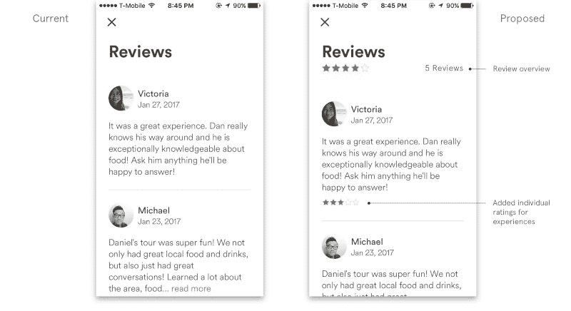

所有接受测试的用户都希望点击底部的星号来阅读评论，因此流程应该符合用户的期望:

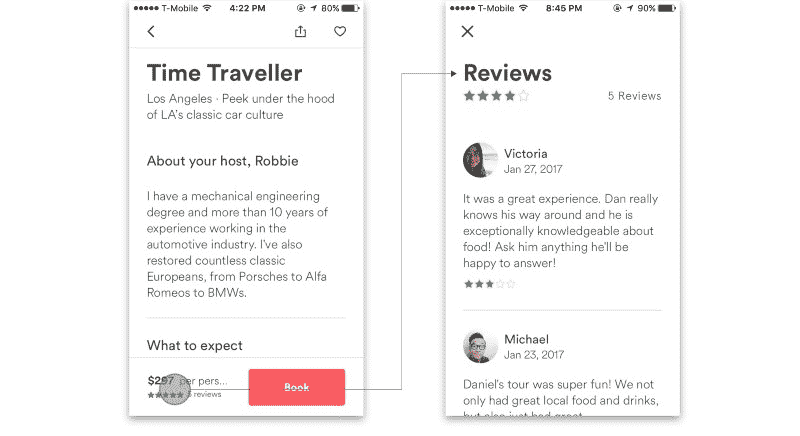

用户在查看新体验时也会感到困惑，因为没有明确提到有 0 条评论。然而，他们仍然会试图寻找一个评论部分。

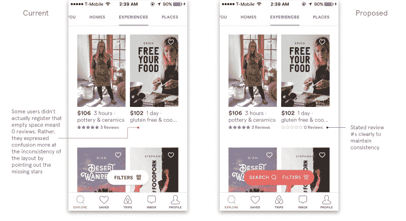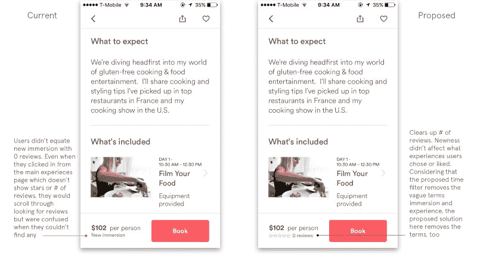

#### 3.**预订**

我注意到体验和家庭的预订流程是不同的。与体验预订的 5 个步骤相比，家庭预订在一个页面上显示了所有步骤，如下所示:

为了阐明当前的体验预订流程，我从 homes 中的“左数”指示器中取了一页。因为体验预订并不都在一个页面上，用户并不真正知道它何时停止。“下一步”或“接受”这两个词让用户认为他们错误地确认了预订。

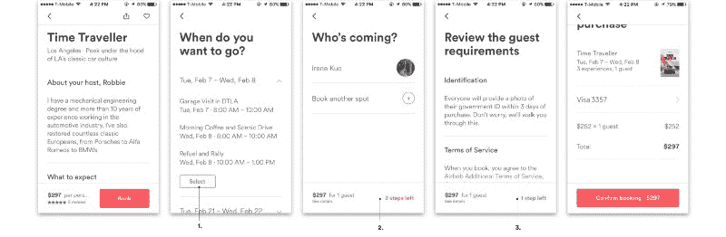

1.  把“书”这个词改成了“选择”，因为“书”这个词让人想到了最后一步
2.  将“下一步”改为“还剩两步”,以便用户知道他们在流程中的位置
3.  最初，单词“accept”使用户认为点击它将最终确定他们的预订。它被改为“向左一步”,以消除用户点击下一页的顾虑

编辑:评论中的一个建议非常有道理:剩下的两步看起来不像是一个可点击的按钮，所以用户可能会对下一步该做什么感到困惑。我的改进是使用一个按钮来指示下一个行动项目，可以是“还剩两步”或“下一步”，尽管还剩两步会给用户一个更好的标记，表明他们在预订过程中的位置。

### 验证解决方案

为了验证我的解决方案，我打印出了纸质原型，并让 7 名用户(4 名来自最初的研究)再次完成任务，这次摩擦要小得多。虽然我看不到搜索栏在 Airbnb 的系统中实际上是如何工作的，但用户体验到的困惑要少得多。

[Back Le](https://medium.com/@lehbac)的一条评论认为，我在预订过程中的解决方案可能会造成混乱，因为“还剩两个步骤”看起来不像是一个可点击的按钮。这只是表明我需要与更多的用户一起验证。

然而，在我的验证过程中，我注意到在整个应用程序中导航时有一个无意识的摩擦点。我的意思是，用户经历了困难，但保持中立，忽视了痛点。首先，该应用程序同时使用左右和上下滚动。例如，当浏览住宅时，用户通过上下滚动，但是在体验中，如果用户不输入位置，滚动是左右和上下的，一旦输入位置，滚动就变成只有上下。第二，家庭、经历和地点的图像大小都不同，这使得体验不一致。这个问题在我最初的研究中也存在，但不在体验中非随机浏览的范围之内。这可能是未来的另一项研究。

### 结论

感谢阅读！这是一个自我发起的 UX 研究和设计项目，我与 Airbnb 没有任何关系。我想解决我在浏览他们的新体验版块时遇到的问题。我希望 x 10000 能听到你的反馈！

我目前在约翰·霍普金斯大学和马里兰艺术学院学习设计领导艺术硕士/工商管理硕士。请到 irenekuo.com 找我