# UX 案例研究:建立更好的体验(重新设计空中和平航空公司网站)

> 原文：<https://www.freecodecamp.org/news/airpeace-website-a-ux-case-study-e0ef593f2619/>

和平·奥杰梅(佩里)

# UX 案例研究:建立更好的体验(重新设计空中和平航空公司网站)

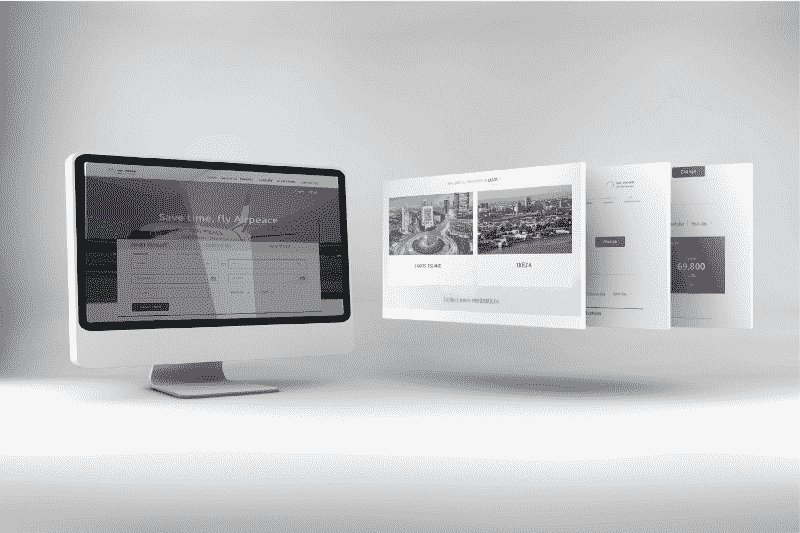

乘飞机旅行总是很棒的经历，但我认为应该考虑预订航班的压力。在当今的数字世界，我们重视速度和简单，所以有一个好的在线预订系统来节省时间是非常重要的。

为此，我选择了尼日利亚航空公司 Air Peace Airline[作为有效用户体验(UX)设计的案例研究。想方设法改善他们的预订系统，请继续关注我，我们将为预订系统找出解决方案。](https://www.flyairpeace.com/)

#### ***设计流程***

按照设计流程，我从可用性测试开始，以验证结束:

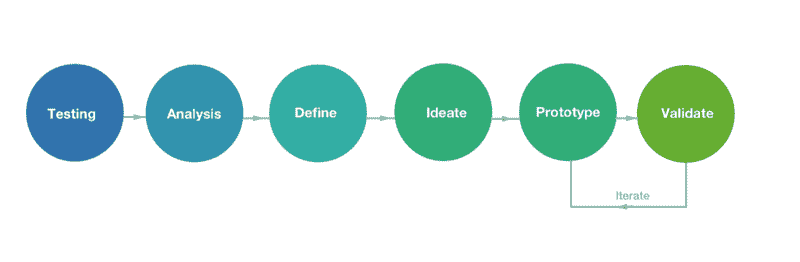

#### 研究

经过与朋友的几次讨论和采访，我发现了以下几点:

*   大多数人在去机场的路上预订机票
*   有些人在商务会议中
*   对于一些人来说，他们在看电影的时候预订
*   人们想要一个可以叫出租车、预订酒店、参观景点的区域，因为他们中的一些人可能不熟悉这里的环境

我们证实了大多数人在做其他事情时预订航班的想法。最终，用户会更喜欢一种漂亮、快速、易用的方法来预订航班，同时继续他们的日常活动。

#### 目标

*   支付过程应该更快。用户应该能够尽快付款，然后返回到他们的各种活动
*   实现一个平台，所有的支付都应该在网站上进行。通过在网站上收集信用卡详细信息而不是重定向用户来做到这一点。这将有助于留住客户并减少步骤。
*   能够预订出租车带你去目的地将会是另一个很棒的体验

#### 先决条件

*   用数据支持所有设计决策。
*   了解付款流程，并设计一种方法来解决这个问题。
*   提出设计解决方案并验证它们。

#### 人

我为一个想要预订航班的“空中和平”网站的典型用户创建了一个角色。我今天使用“余思敏·戈尔德先生”作为我们的用户，但是当然除了他还有许多其他的场景。

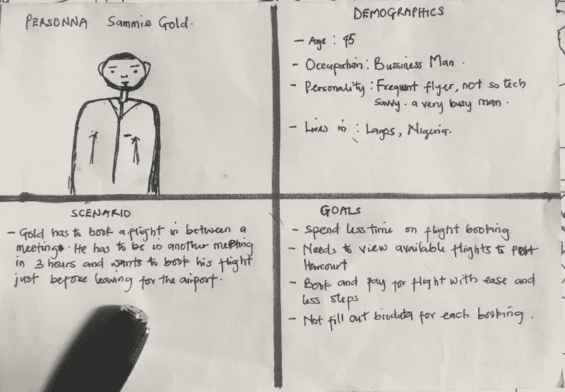

#### 故事板

我更进一步，为余思敏先生创建了一个故事板，他只想快速预订航班，继续他的会议。

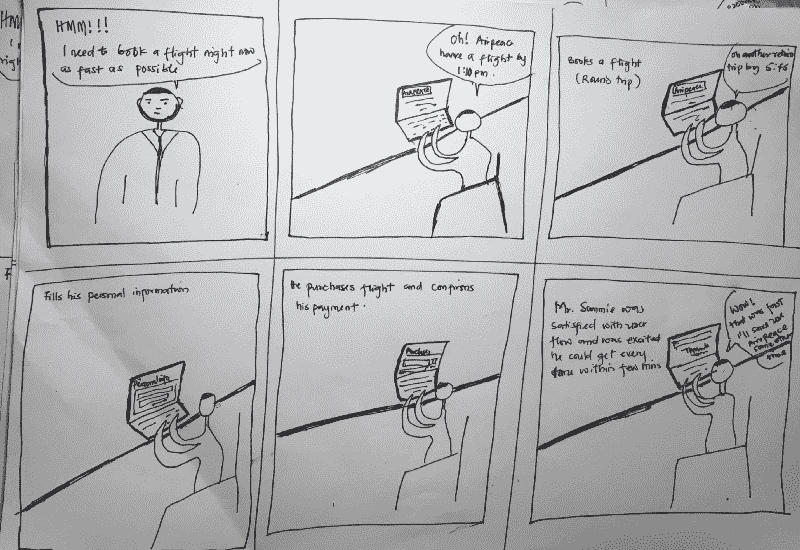

Storyboard for Mr. Sammie Gold.

#### 设计原型

检查[büHance](https://www.behance.net/gallery/64746541/A-redesign-of-Airpeace-website)上的设计。

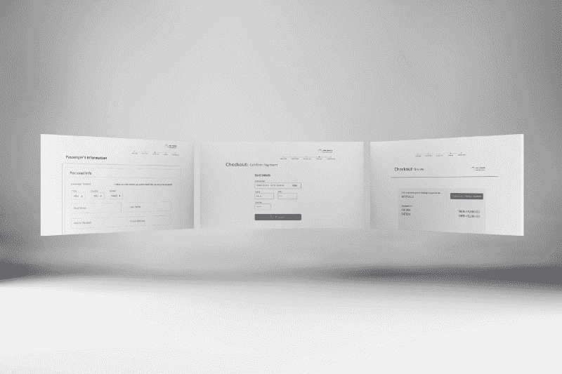

#### 预订流程

搜索航班:

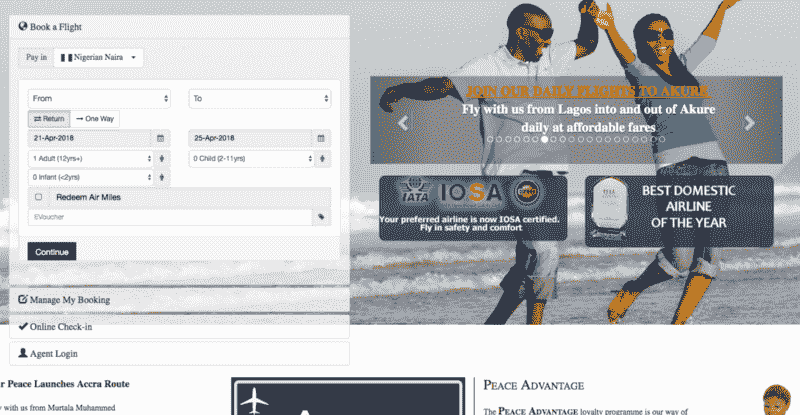

The current booking process

萨米先生会喜欢更简单的形式:

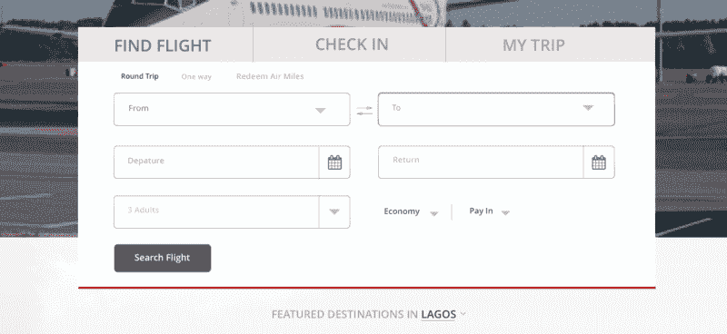

The new booking experinece

拥有不太复杂的表单实际上会带来更好的体验。这样，从“预订”到“入住”再到“我的行程”变得更加容易，只需“一次点击”，嘣，你就可以开始预订了。

预订重新设计前后的航班:

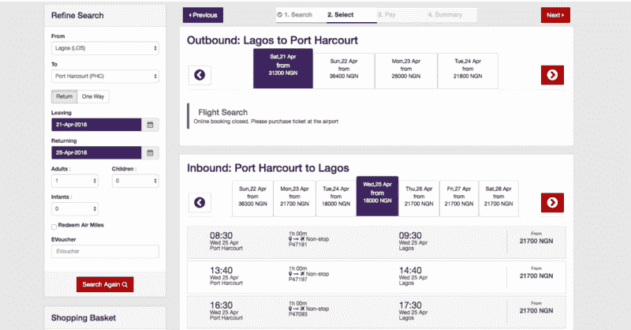

Current experience.

现在表单看起来更容易和用户友好了，对吗？

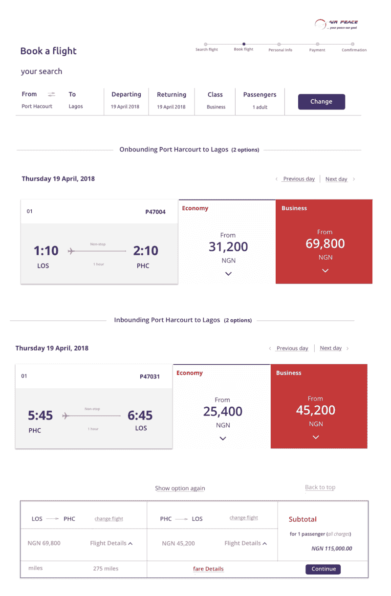

选择您喜欢的航班和座位类型:

当前个人信息页面:

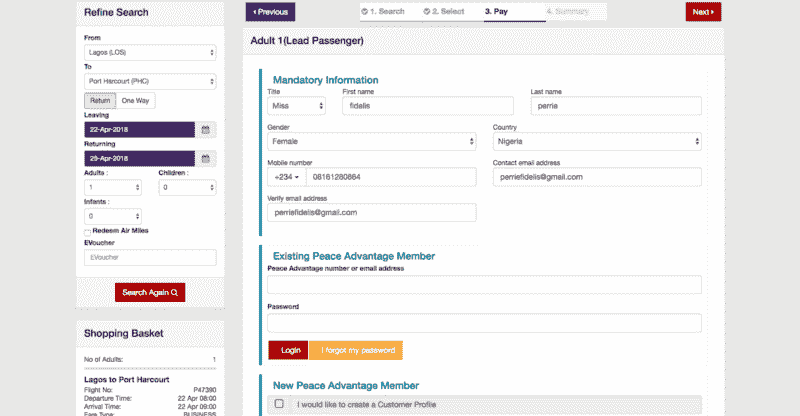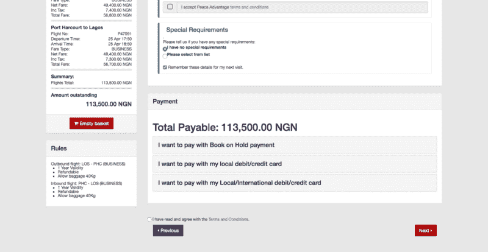

Current personal info form

这有点太拥挤了，所以让我们简化一下:

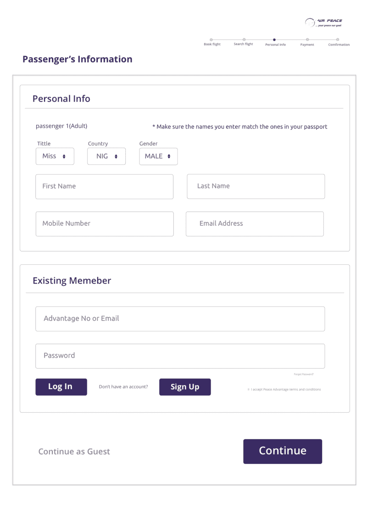

New personal info form

现在看起来直奔主题？耶！

当前付款流程页面:

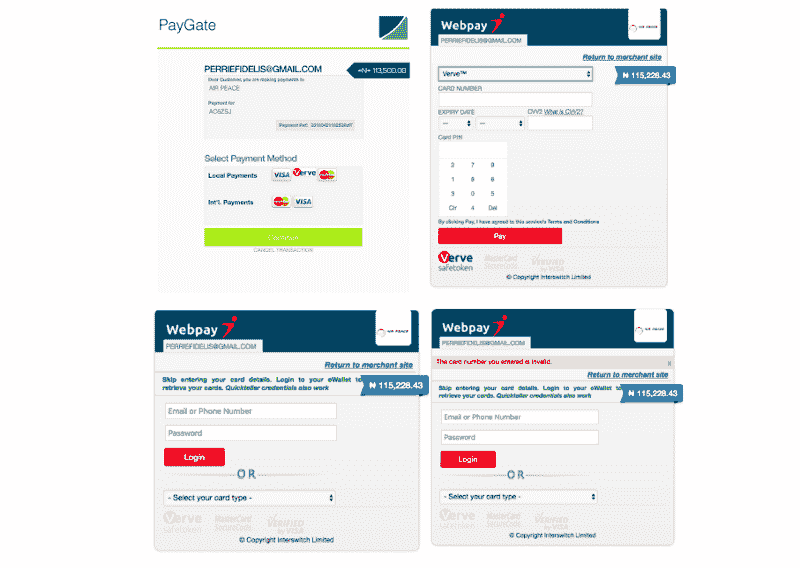

Old checkout flow

旧的流程将用户重定向到“PayGate”和“Webpay”，这根本没有必要。你可以在空中和平网站上支付所有费用。所以，让我们来解决这个问题:

哦等等！

你是否注意到，在付款流程中，你必须选择三次付款方式？这会让用户产生怀疑和恐惧，所以让我们改变这种情况。现在让我们看看:

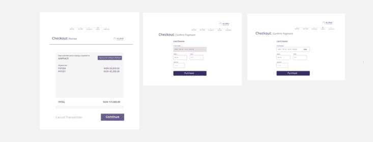

New payment flow.

首先，每一笔付款都是在空中和平网站本身进行的。用户不必为选择支付方式而紧张，系统会帮你完成。而现在，步骤被减少到了两个。

瞧啊。用户完成了，一张票发送到了他的邮箱里，余思敏先生很高兴——所以他又回去全神贯注地参加会议了！

### 其他功能:

哦是的！现在，用户可以计划他的旅行。如果他点击“计划旅行”按钮:

*   他可以选择预订出租车。在这里，他可以看到出租车公司的各种评级，选择评级最高的一个，他就完成了。
*   他还可以选择预订酒店。不同等级的酒店都显示的很清楚。

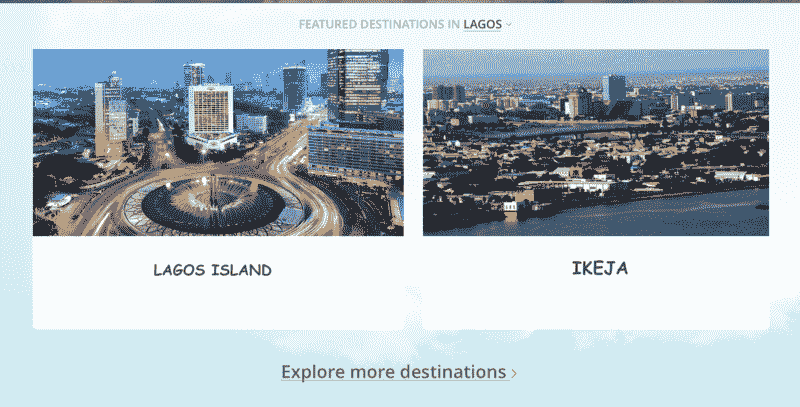

用户可以在这个新的环境中寻找美丽的地方。

### 确认

原型完成后，我对一些用户进行了验证测试，发现:

*   该网站变得更容易使用，因为用户很容易看到他们想做的第一眼
*   现在预订航班更容易，表格填写更简单快捷，支付流程缩短，所有活动都在空中和平网站上完成，而不是将用户重定向到其他地方。
*   用户界面看起来更加友好，对用户来说更有吸引力

一般来说，人们喜欢最终的结果！现在，更多的人想使用 Air Peace 来预订他们的航班。

非常感谢您通读！我很想得到你的反馈。如果你认为这对你有意义，别忘了和**分享**。

我是佩里·费德利斯——我是一名产品设计师。你可以在 [Twitter](https://twitter.com/PerrieFidelis) 、 [LinkedIn](https://www.linkedin.com/in/perrie-fidelis-0b5bb2151/) 和 [Bēhance](https://www.behance.net/perriefidelis) 上和我联系。