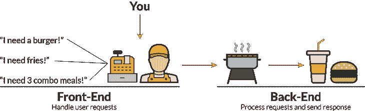
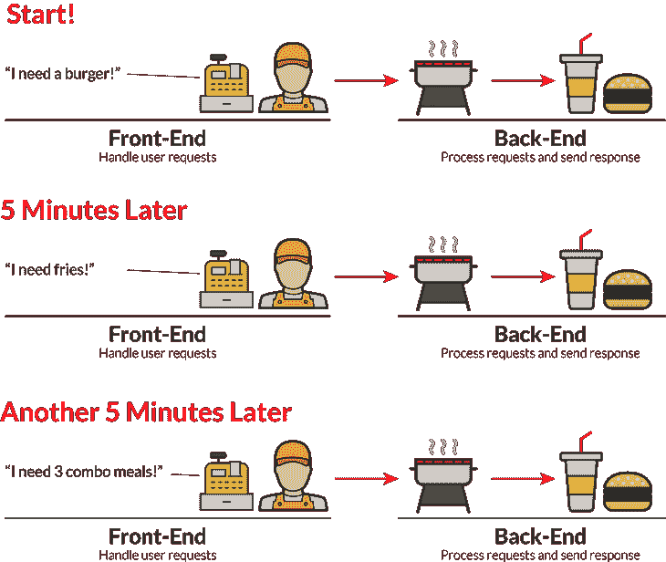
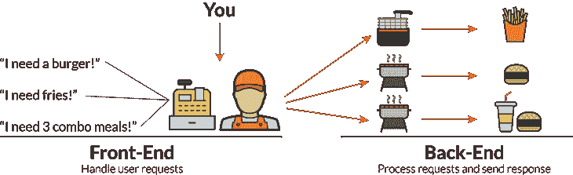
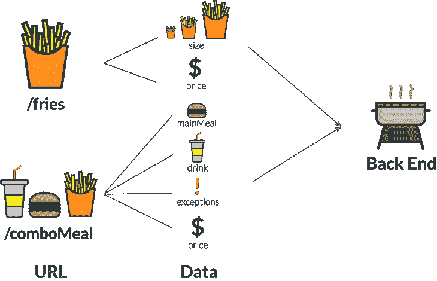
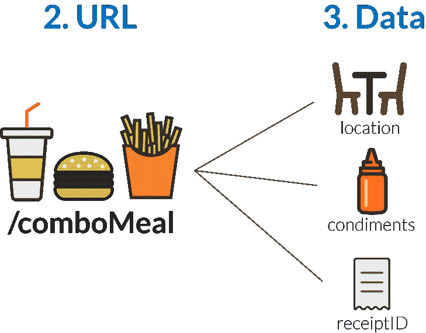
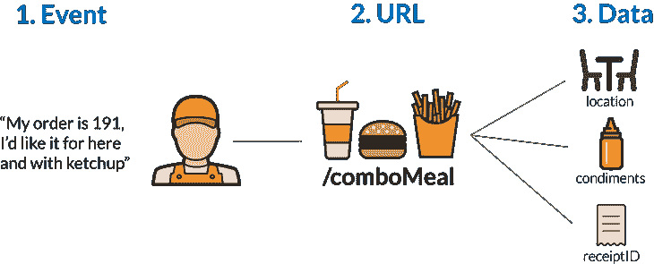
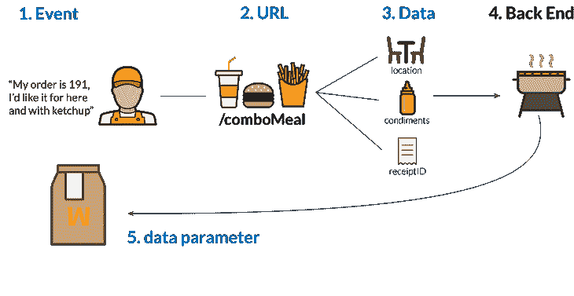

# 通过在快餐店工作来解释 AJAX 基础知识

> 原文：<https://www.freecodecamp.org/news/ajax-basics-explained-by-working-at-a-fast-food-restaurant-88d95f5fcb7a/>

凯文·科诺年科


# 通过在快餐店工作来解释 AJAX 基础知识

如果你对服务器端代码没有很好的理解，AJAX(异步 JavaScript 和 XML)可能会让人感到困惑。

当我开始从事 web 开发时，在涉足 Node.js 和 Ruby on Rails 之前，我首先学习了 HTML、CSS、JavaScript 和 jQuery。

但是，当然，我想了解如何构建动态 web 应用程序，所以我需要学习如何使用 AJAX 与服务器通信。我不想只构建 2005 年的静态页面。

前端和后端是完全不同的挑战。我努力理解 GET 或 POST 请求的不同部分。

所以，我想出了一个快餐店的类比来解释。如果你去过麦当劳、汉堡王或者温蒂，那么你可以写你自己的 GET 和 POST 请求。

为了理解这篇文章，你需要对 jQuery 有一个初步的了解。

### AJAX 是什么样子的？

你有没有注意到，你可以在脸书上评论一篇文章，而不用重新加载整个页面？这就是 AJAX 的作用。AJAX 允许用户与你的 web 应用程序交互，而不需要完全重载页面。

想象一下，如果每次你在脸书上“喜欢”一个帖子或添加评论，页面就会重新加载？那就太可怕了！相反，脸书会迅速将你的“评论”或“喜欢”添加到帖子中，并允许你继续阅读。他们将互动添加到他们的数据库中，而不会中断您的体验！

### 我们为什么需要 AJAX？

好吧，这些都是轶事，让我们看看整个系统。

将您的整个 web 应用程序想象成一家快餐店。你是出纳员，在第一线的人。您处理来自客户的**请求**。



如果你看这个图表，我可以看到需要做的三个独立的工作。

1.  收银员必须快速处理用户请求。
2.  你需要厨师把汉堡放在烤架上，烹饪所有的食物。
3.  你需要一个膳食准备团队来包装食物，并把它放在袋子里或托盘上。

但是，如果没有 AJAX，从开始到结束，一次只能处理一个订单！你需要接受订单…然后向顾客收费…然后坐在那里什么也不做，而厨房里的人在做饭…然后继续等待，让餐前准备团队打包。在那之后你只能接受下一个订单。



这是一个糟糕的用户体验！你再也不能称之为“快餐”了。相反，你应该称之为“平庸的食物”…或者别的什么。

AJAX 允许一个**异步处理模型**。这意味着您可以在不加载整个页面的情况下请求或发送数据。这就像一个普通快餐店的经营方式。作为收银员，你接受顾客的订单，将其发送给厨房团队，并准备接受下一个顾客的订单。

顾客可以继续点菜，你不需要坐在那里，让员工在厨房工作，让每个人都等着。

这无疑引入了一些复杂性。你现在在餐馆里有多种专业。此外，订单以不同的速度处理。但是，它创造了更好的用户体验。



你可能已经在餐馆里看到过这种情况。一个人在操作炸薯条机。一个人在管理烤架。当订单进来时，收银员可以立即与双方沟通，并继续接受订单。

### 如何创建发布请求

让我们将这些概念付诸实践。作为收银员，您需要将收到的顾客要求发送到厨房，以便团队的其他成员可以准备饭菜。您可以通过 POST 请求来实现这一点。

在您的实际代码中，POST 请求向您的服务器发送数据。在本例中，这意味着您将订单数据发送到后端。

它有三个主要部分:

1.  **一个 URL** :这是请求将遵循的路由。一会儿再说。
2.  **数据**:你需要发送给服务器的任何额外参数。
3.  [**回调**](https://blog.codeanalogies.com/2016/04/11/javascript-callbacks-explained-using-minions/) :发送请求后会发生什么

人们在快餐店点的一些常见的东西是什么？让我们看两个例子。

1.  炸薯条
2.  由汉堡、薯条和饮料组成的套餐

这两个需要不同的过程。薯条请求可能只需要一个人将一些薯条舀到一个袖子里。但是套餐需要多个团队成员一起工作。所以，这两个需要不同的网址。

```
$.post('/comboMeal')
```

```
$.post('/fries')
```

URL 允许我们在后端对某些类型的请求使用相同的逻辑。这一部分超出了本教程的范围，所以当您查看后端时，可以更深入地了解这一点。

接下来是**数据**。这是一个[对象](https://blog.codeanalogies.com/2017/04/29/javascript-arrays-and-objects-are-just-like-books-and-newspapers/)，它告诉我们关于请求的更多信息。对于套餐 URL，我们可能需要知道:

1.  主餐的种类
2.  他们的饮料类型
3.  价格
4.  有什么特殊要求吗

对于薯条，我们可能只需要知道:

1.  薯条的大小
2.  价格



让我们看一个套餐的例子:一个芝士汉堡和一瓶百事可乐，价格是 6 美元。这是 JavaScript 中的样子。

```
let order = {  mainMeal: 'cheeseburger',  drink: 'Pepsi',  price: 6,   exceptions: '' };
```

```
$.post('/comboMeal', order);
```

*订单*变量保存订单的内容。然后我们把它包含在 POST 请求中，这样我们的厨房工作人员就知道在套餐中放什么了！

但是，我们不能让所有这些代码随机运行！我们需要一个触发事件来触发请求。在这种情况下，快餐店的顾客订单就像一个人在你的网站上点击“订单”按钮。我们可以使用 jQuery 的 [click()事件](https://api.jquery.com/click/)在用户点击按钮时运行 POST。

```
$('button').click(function(){   let order = {     mainMeal: 'cheeseburger',    drink: 'Pepsi',     price: 6,     exceptions: ''   };   $.post('/comboMeal', order); });
```

最后一部分。我们需要在顾客的订单发出后告诉他们一些事情。收银员通常会说“请下一位顾客！”因为这是一家快餐店，所以我们可以在回调中使用它来显示订单已经提交。

```
$('button').click(function(){    let order = {     mainMeal: 'cheeseburger',     drink: 'Pepsi',     price: 6,     exceptions: ''    };
```

```
$.post('/comboMeal', order, function(){     alert('Next customer please!');   }); })
```

### 如何创建 GET 请求

到目前为止，我们有能力提交订单。现在，我们需要一种向客户交付订单的方式。

这就是 GET 请求的来源。GET 允许我们从服务器(或者厨房，这个类比)请求数据。请注意:现在，我们的数据库充满了订单，而不是食物本身。这是一个重要的区别，因为 **GET 请求不会改变我们的数据库**。他们只向前端传递信息。POST 请求会更改数据库中的信息。

这里有一些你在收到食物前可能会被问到的典型问题。

1.  你想要在这儿吃还是带走食物？
2.  你需要调味品吗(像番茄酱或芥末)？
3.  收据上你的号码是多少(以证明这是你的食物)？

假设你为你的家人点了三份套餐。你想吃餐馆里的食物。你需要番茄酱。你收据上的号码是 191。

我们可以创建一个 URL 为'/comboMeal '的 GET 请求，它对应于 POST 请求以及相同的 URL。然而，这一次我们需要不同的数据。这是一种完全不同的请求。相同的 URL 名称只是允许我们更好地组织我们的代码。

```
let meal = {  location: 'here',  condiments: 'ketchup',  receiptID: 191 };
```

```
$.get('/comboMeal', meal);
```



我们还需要一个触发器。顾客在你将食物交付给他们之前，作为收银员回答你的问题，就会触发这个请求。没有方便的方法用 JavaScript 来表示问题和答案。因此，我将使用类“answer”为按钮创建另一个单击事件。

```
$('.answer').click(function(){  let meal = {     location: 'here',     condiments: 'ketchup',     idNumber: 191,   };
```

```
$.get('/comboMeal', meal); });
```



这个还需要一个回调函数，因为我们将接收订单 191 中的三份套餐中包含的任何内容。我们可以通过回调中的一个*数据*参数接收数据。

这将返回后端为订单 191 规定的任何内容。我将使用一个名为 *eat* 的函数来表示您最终会吃到食物，但是请记住，JavaScript 中没有 eat 函数！

```
$('.answer').click(function(){   let meal = {     location: 'here',     condiments: 'ketchup',     idNumber: 191,    };   //data contains the data from the server   $.get('/comboMeal', meal, function(data){      //eat is a made-up function but you get the point      eat(data);   }); });
```

理论上，最终产品*数据*将包含三份套餐的内容。这要看后端怎么写了！



### 尝试其他直观的解释

你喜欢这个教程吗？给它一个掌声，这样其他人就可以看到它了！或者，**注册时事通讯**以了解 CSS 和 JavaScript 教程的最新发布。