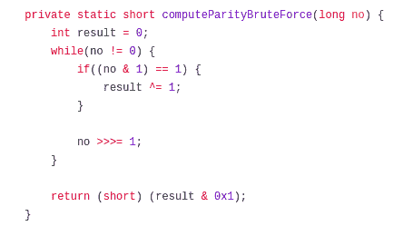
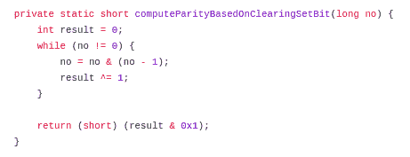
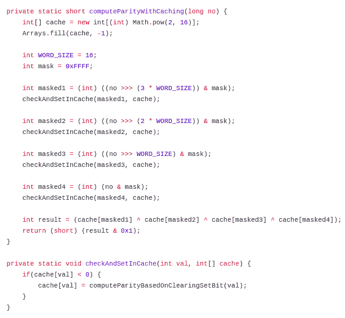
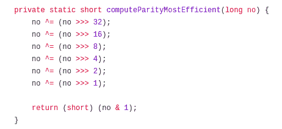

# 算法问题解决:如何有效地计算一串数字的奇偶性

> 原文：<https://www.freecodecamp.org/news/algorithmic-problem-solving-efficiently-computing-the-parity-of-a-stream-of-numbers-cd652af14643/>

### 问题陈述:

你得到一串数字(比如说`long`类型的数字)，计算这些数字的奇偶性。假设你必须服务于一个巨大的规模，比如每分钟一百万个号码。设计一个考虑这样规模的算法。如果一个数的二进制表示中设置位的总数是奇数，则该数的奇偶性为 1，否则奇偶性为 0。

### 解决方案:

#### **方法 1 -蛮力:**

问题陈述清楚地陈述了什么是宇称。我们可以计算出给定数的二进制表示中设置位的总数。如果设置位的总数为奇数，则奇偶校验为`1`，否则为`0`。因此，天真的方法是继续对给定的数字进行逐位右移&检查当前的最低有效位(LSB)以跟踪结果。



在上面的代码片段中，我们将逐一检查`while`循环中的所有位。有了条件`((no & 1) == 1)`，我们检查当前 LSB 是`1`还是`0`，如果是`1`，我们做`result ^= 1`。变量`result`被初始化为`0`。所以当我们在`result` & `1`的当前值之间做`xor (^)`运算时，如果`result`当前为`0`，则`result`将被设置为`1`，否则`1`。

如果有偶数个置位位，最终`result`将变成`0`，因为所有`1’s`之间的`xor`将相互抵消。如果`1’s`为奇数，`result`的最终值将为`1`。`no >&`gt；> 1 将位右移 1。

`>`；> >是 java 中的逻辑右移运算符，它也移动符号位(有符号数中的最高有效位)。还有另一种右移运算符`er`—>>叫做算术右移运算符*【参见本页 l* ast 处的参考文献 1】。它不会移动二进制表示中的符号位——符号位在其位置保持不变`ition. Final` ly 结果& 0x1 如果`e`是奇偶校验则返回 1，否则返回 0。

**优点:**

1.  该解决方案非常容易理解和实施。

**缺点:**

1.  我们手动处理所有的位，所以这种方法在规模上几乎没有效率。

**时间复杂度:** `O(n)`其中`n`是给定数的二进制表示的总位数。

#### **方法 2 -逐个清除所有设置位:**

上面的解决方案中有一个瓶颈:`while`循环本身。它只是一个接一个地遍历所有的位，我们真的需要这样做吗？我们关心的是设置位，所以我们不会因为检查未设置位或`0`位而得到任何好处。如果我们只检查设定的位，我们的解决方案会变得更加优化。在按位计算中，如果给我们一个数字`n`，我们可以通过以下操作清除最右边的设置位:

```
n = n & (n-1)
```

举个例子:说`n = 40`，8 位格式的二进制表示为:`00101000`。

```
n           = 0010 1000
n - 1       = 0010 0111
n & (n - 1) = 0010 0000 
```

我们已经成功清除了最低设置位(右侧第 4 位)。如果一直这样下去，数字`n`在某个时间点就会变成`0`。基于这个逻辑，如果我们计算奇偶性，就不需要扫描所有的位。相反，我们只扫描`k`位，其中`k`是数量& `k <= length of the binary representation`中设置位的总数。以下是代码:



**优点:**

1.  实现简单。
2.  比暴力解决方案更有效。

**缺点:**

1.  这不是最有效的解决方案。

**时间复杂度:**

`O(k)`其中`k`是数字中设置位的总数。

#### 方法 3 -缓存:

再看一下问题陈述，肯定有关于规模的问题。我们早期的解决方案是否可以扩展以满足数百万的请求，或者是否还有改进的空间？

如果我们能够将结果存储在内存缓存中，我们可能会使解决方案更快。这样，我们可以节省一些 CPU 周期来计算相同的结果。那么如果总位数是`64`，我们需要多少内存来保存所有可能的数字呢？`64`位将导致我们有`Math.pow(2, 64)`个可能的有符号数(最高有效位仅用于存储符号)。一个`long`类型数的大小是`64`位或`8`字节，所以需要的总内存大小是:`64 * Math.pow(2, 64)`位或`134217728 TeraBytes`。这太多了&不值得存储如此海量的数据。我们能做得更好吗？

我们可以将`64`位数分解成一组`16`位，从缓存&中取出这些单独位组的奇偶校验，然后将它们组合起来。这个解决方案是可行的，因为`16`将`64`分成了`4`等份&我们只关心设置位的总数。因此，只要我们得到这些单个位组的奇偶性，我们就可以将它们的结果相互进行比较，因为`xor`是[结合的&交换的](https://www.purplemath.com/modules/numbprop.htm)。我们获取这些位组&并对其进行操作的顺序甚至都不重要。

如果我们将这些`16`位数存储为一个整数，所需的总内存是:`Math.pow(2, 16) * 32 bits = 256 Kilo Bytes`。



在上面的代码片段中，我们将一组`16`位移动了`i * WORD_SIZE`位，其中
`0 ≤ i ≤ 3`，并用`mask = 0xFFFF` ( `0xFFFF = 1111111111111111` )执行逐位`AND`运算(`&`，这样我们就可以将最右边的`16`位提取为整数变量，如`masked1, masked2`等，我们将这些变量传递给一个方法`checkAndSetInCache`，该方法在缓存中不可用的情况下计算该数的奇偶性。最后，我们只是对这组数的结果做`xor`运算，它决定了给定数的最终奇偶性。

**优点:**

1.  以相对较小的缓存内存为代价，我们获得了更好的效率，因为我们在输入之间重用了一组 16 位的数字。
2.  该解决方案可以很好地扩展，因为我们正在为数百万个号码提供服务。

**缺点:**

1.  如果该算法需要在超低存储设备中实现，则必须事先充分考虑空间复杂性，以决定是否值得容纳如此大量的空间。

**时间复杂度:**

`O(n / WORD_SIZE)`其中`n`是二进制表示中的总位数。所有的右/左移&位`&, |, ~`等操作都是字级操作，由 CPU 高效完成。因此它们的时间复杂度应该是`O(1)`。

#### 方法 4 -使用 XOR 和移位运算:

我们来考虑一下这个 8 位二进制表示:`1010 0100`。这个数的奇偶性是`1`。当我们通过`4` &对这个数进行右移，并与这个数本身进行异或运算时，会发生什么？

```
n                 = 1010 0100
n >>> 4           = 0000 1010
n ^ (n >> 4)      = 1010 1110
n = n ^ (n >>> 4) = 1010 1110 (n is just assigned to the result)
```

在最右边的`4`位中，设置了`n` & `n >&` gt 中不同的所有位；> 4。现在让我们把注意力集中在最右边的 4 bi `ts o` nly: 1110，让我们忘记其他的 b `i` ts。`Now n is` 1010 1110 &我们只是集中在 th `e`最低 4 b `its` 即；1110.让我们对 n 进行 2 的按位右移。

```
n                 = 1010 1110
n >>> 2           = 0010 1011
n ^ (n >>> 2)     = 1000 0101
n = n ^ (n >>> 2) = 1000 0101 (n is just assigned to the result)
```

现在只关注最右边的`2`位&，忘记最左边的`6`位。让我们通过`1`将数字右移:

```
n                 = 1000 0101
n >>> 1           = 0100 0010
n ^ (n >>> 1)     = 1100 0111
n = n ^ (n >>> 1) = 1100 0111 (n is just assigned to the result)
```

我们不需要再右移了，我们只需要提取 LSB 位，上面的例子中的`1`&返回结果:`result = (short) n & 1`。

乍一看，这个解决方案可能看起来有点混乱，但它确实有效。怎么会？我们知道`0 xor 1`或`1 xor 0`是`1`，否则就是`0`。因此，当我们将一个数的二进制表示按长度分成相等的两半&时，我们在它们之间做`xor`，所有不同的位对在异或数中产生设置位。

由于奇偶校验发生在二进制表示中有奇数个设置位时，我们可以使用`xor`操作来检查是否有奇数个`1`存在。因此，我们将数字右移总位数的一半，我们将移位的数字与原始数字进行`xor`，我们将异或结果分配给原始数字&我们现在只关注数字的最右半部分。所以我们每次只对一半的数字进行异或运算&缩小我们的异或运算范围。对于`64`位编号，我们从`32`位半开始异或，然后是`16`位半，然后分别是`8`、`4`、`2`、`1`。

本质上，一个数的奇偶性意味着该数的二进制表示的相等一半的`xor`的奇偶性。算法的关键是先集中于最右边的`32`位，然后`16`、`8`、`4`、`2`、`1`位&忽略其他左边的位。以下是代码:



**优点:**

1.  没有多余的空间使用字级运算来计算结果。

**缺点:**

1.  对于开发人员来说可能有点难以理解。

**时间复杂度:**

`O(log n)`其中`n`是二进制表示中的总位数。

以下是完整的工作代码:

```
import java.util.Arrays;

public class ParityOfNumber {

    private static short computeParityBruteForce(long no) {
        int result = 0;
        while(no != 0) {
            if((no & 1) == 1) {
                result ^= 1;
            }

            no >>>= 1;
        }

        return (short) (result & 0x1);
    }

    private static short computeParityBasedOnClearingSetBit(long no) {
        int result = 0;
        while (no != 0) {
            no = no & (no - 1);
            result ^= 1;
        }

        return (short) (result & 0x1);
    }

    private static short computeParityWithCaching(long no) {
        int[] cache = new int[(int) Math.pow(2, 16)];
        Arrays.fill(cache, -1);

        int WORD_SIZE = 16;
        int mask = 0xFFFF;

        int masked1 = (int) ((no >>> (3 * WORD_SIZE)) & mask);
        checkAndSetInCache(masked1, cache);

        int masked2 = (int) ((no >>> (2 * WORD_SIZE)) & mask);
        checkAndSetInCache(masked2, cache);

        int masked3 = (int) ((no >>> WORD_SIZE) & mask);
        checkAndSetInCache(masked3, cache);

        int masked4 = (int) (no & mask);
        checkAndSetInCache(masked4, cache);

        int result = (cache[masked1] ^ cache[masked2] ^ cache[masked3] ^ cache[masked4]);
        return (short) (result & 0x1);
    }

    private static void checkAndSetInCache(int val, int[] cache) {
        if(cache[val] < 0) {
            cache[val] = computeParityBasedOnClearingSetBit(val);
        }
    }

    private static short computeParityMostEfficient(long no) {
        no ^= (no >>> 32);
        no ^= (no >>> 16);
        no ^= (no >>> 8);
        no ^= (no >>> 4);
        no ^= (no >>> 2);
        no ^= (no >>> 1);

        return (short) (no & 1);
    }

    public static void main(String[] args) {
        long no = 1274849;
        System.out.println("Binary representation of the number: " + Long.toBinaryString(no));

        System.out.println("Is Parity [computeParityBruteForce]: " + computeParityBruteForce(no));
        System.out.println("Is Parity [computeParityBasedOnClearingSetBit]: " + computeParityBasedOnClearingSetBit(no));
        System.out.println("Is Parity [computeParityMostEfficient]: " + computeParityMostEfficient(no));
        System.out.println("Is Parity [computeParityWithCaching]: " + computeParityWithCaching(no));
    }
}
```

### 从这个练习中学习:

1.  虽然是基础知识，但我想提一下，单词级位运算在时间上是常数。
2.  在某种程度上，我们可以通过将二进制表示分解成大小相等的两部分来应用缓存，就像我们的例子中的`16`,这样我们就可以在内存中容纳所有可能的数字。因为我们应该处理数百万个数字，所以我们最终将跨数字重用缓存中的`16`位组。字数不一定需要是`16`，这要看你要求&实验了。
3.  您不需要在单独的数组中存储一个数字的二进制表示来对它进行操作，相当巧妙地使用按位运算可以帮助您实现目标。

#### 参考资料:

[1].[https://stack overflow . com/questions/2811319/difference-between-and](https://stackoverflow.com/questions/2811319/difference-between-and)

[2].[https://gist . github . com/kousiknath/b0f 5 CD 204369 C5 CD 1669535 cc 9 a 58 a 53](https://gist.github.com/kousiknath/b0f5cd204369c5cd1669535cc9a58a53)