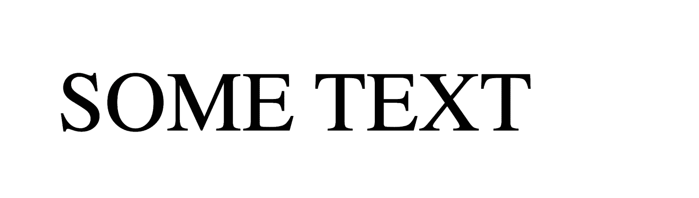
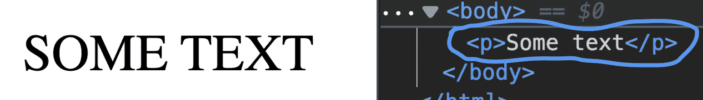

# CSS 中的全部大写——如何用样式大写文本

> 原文：<https://www.freecodecamp.org/news/all-caps-in-css-how-to-uppercase-text-with-style/>

当你设计一个网站或者做一个项目的时候，你可能会因为各种原因想要使用大写的文本。也许你想使用缩写或首字母缩略词，强调某些文本，或将其用于标题。

在 HTML 中有多种大写文本的方法。第一种方法是在 HTML 中硬编码大写文本:

```
<p>UPPERCASE TEXT</p> 
```

第二种方法是使用 [`toUpperCase()` JavaScript 字符串方法](https://dillionmegida.com/p/10-useful-string-methods-in-javascirpt/#touppercase-and-tolowercase)并在 DOM 上呈现它:

```
const upper = string.toUpperCase()

// then render 
```

第三种方法是使用`text-transform` CSS 属性，我们将在本文中看到。

## 如何在 CSS 中使用文本转换

您可以使用`text-transform` CSS 属性将不同形式的文本大写。该属性可以将文本修改为**大写**、**小写**或**大写**(这样每个单词都以大写字母开头，并且单词中的其余字符保持其原始形式)。

要在 CSS 中将文本转换为大写，请使用以下样式声明:

```
element-selector {
  text-transform: uppercase;
} 
```

这会将所选元素中的文本设置为大写。

这个声明不会改变 DOM 的内容。例如，看看这段 HTML 代码:

```
<p class='paragraph'>
  Some text
</p> 
```

这种风格:

```
.paragraph {
  text-transform: uppercase;
} 
```

在用户界面上，文本的样式如下:



但是在 DOM 中，文本保持不变，如下所示:



当您在浏览器上复制文本时，在某些浏览器中会复制原始文本“某些文本”，但在其他浏览器中，会复制样式化的版本。

## 你应该在 CSS 中使用文本转换还是其他方法？

如果你使用大写字母作为样式，我推荐使用 CSS。原因是不同的浏览器和浏览器工具处理大写文本的方式可能不一致。

一个不一致之处是我前面提到的复制粘贴差异。

另一个不一致是一些屏幕阅读器将大写文本解释为缩写。因此，像“某个文本”这样的文本会被读作“S . o . m . e . T . e . x . T”，这会影响读者对信息的理解。

不过，值得注意的是，一些屏幕阅读器也将 CSS 的大写文本解释为缩写。

但是，建议保留样式作为样式。如果您只是为了样式的目的而想要大写的文本，那么使用 CSS，并且让原始文本在 HTML 中。但是，如果您使用大写字母表示缩写，或者出于某种特殊原因使用大写文本，您可以在 HTML 中硬编码。

你可以参考[这条没有 CSS 的 tweet](https://twitter.com/Mandy_Kerr/status/1285866670284668930)来看看围绕它的讨论。