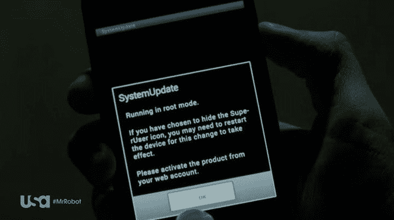
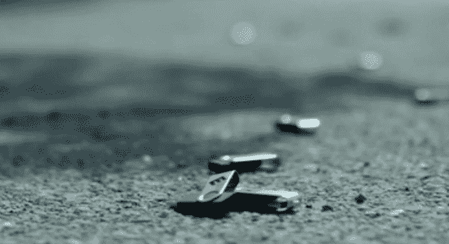
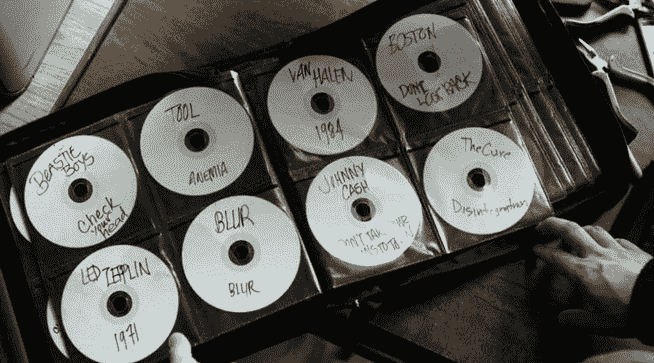

# 关于信息安全，我真正需要知道的是，我从机器人先生那里学到的

> 原文：<https://www.freecodecamp.org/news/all-i-really-need-to-know-about-infosec-i-learned-from-mr-robot-7902cca6d729/>

我被困在长达 14 个小时的飞往中国的飞机上，腿上还抱着一个时差综合症新生儿。幸运的是，飞机上的娱乐节目包括一部名为《机器人先生》的新网络犯罪剧。

这部剧将技术现实主义带到了好莱坞前所未有的高度。它成功地转移了我的注意力，让我不再为和哭泣的婴儿做“那个人”而尴尬。我甚至学到了一些关于信息安全的知识。

出于对还没有看过这部金球奖获奖系列片的读者的尊重，我已经删除了这篇文章中任何与故事中的人物或情节有关的内容。满怀信心地读下去——这是一篇没有剧透的文章。

事不宜迟，以下是《机器人先生》第一季的五堂信息安全课。

#### 1.黑客可以在几秒钟内攻破你的手机，而你永远不会知道

黑客不需要偷你的手机——那太明显了，只会让他们获得你过去的数据。

相反，他们可以通过间谍软件控制你的手机。他们可以在几分钟内完成，而你永远不会知道。

在《机器人先生》中，一个角色在某人的手机上安装了一个根包，用的时间比洗澡还少。使用 flexi spy——一种广泛使用的 Android 间谍软件工具——该角色“扎根”手机——将其置于超级用户模式——然后隐藏普通超级用户图标，以掩盖手机被篡改的事实。

FlexSpy — a menacing piece of spyware with the most vanilla Software-as-a-Service landing page ever.

从现在开始，这个角色能够监控手机的所有数字和音频通信。

给你一个忠告——使用你手机的指纹扫描仪或设置锁屏密码会让黑客更难对你这么做。

#### 2.不要接受陌生人的光盘或 u 盘

从地铁里走出来，一个开着音箱的说唱歌手给你一张他最新专辑的免费拷贝。

现在，你不会从一个穿喇叭裤的家伙手里拿糖果，然后把它塞进你的嘴里。不要从戴扁嘴帽的人那里拿一张 CD，然后把它放在你的电脑里！

公平地说，您仍然需要执行一个文件。在《机器人先生》中，黑客使用“免费 iTunes Gift Card.exe”等诱人的文件名来欺骗受害者双击它。这会安装远程访问特洛伊木马(RAT ),有效地让攻击者访问文件甚至网络摄像头。令人毛骨悚然。

#### 3.把东西藏在显眼的地方

有时候藏东西的最好地方就在户外。谁会对你地板上的旧摇滚专辑的活页夹三思呢？

看起来像一张普通的 CD——甚至可以播放用记号笔潦草写在上面的专辑——实际上包含了一层额外的数据。

从任何网络访问中移除，读取这些 CD 上的数据的唯一方法将是物理地进入场所并得到它们。然后你至少要花足够长的时间来启动光驱并转储其中的内容。

#### 如果您没有使用蓝牙，请将其关闭。

如果攻击者在您的设备上发现了开放的蓝牙连接，他们可以将自己的键盘连接到设备上，并开始输入命令。

是的，在 Windows 和 OSX 上都可以用一系列热键打开终端，然后输入恶意命令。

额外的好处是，当你外出走动时，关闭蓝牙会减少你的电池消耗，让你有更多的时间阅读像这篇文章这样的中等文章(并关注像我这样的中等作家)。

#### 你是你自己最大的弱点

纵观《机器人先生》,最常见的利用方式是古老的社会工程——操纵人们做你想做的事。

以下是一些与陌生人交往时需要注意的危险信号:

*   一个直接跳到“我只是需要先问你一些安全问题”的电话——许多服务使用相同的安全问题，这些也可以用来加速猜测你的密码的暴力尝试。
*   一个陌生人用一个非常可信的故事接近你，并要求使用你的电话——这是获得你的电话号码或其他身份信息的简单方法
*   你自己的虚荣、懒惰、对家庭的热爱，或者对病菌的恐惧——这些都是攻击者可以利用的漏洞。如果一个陌生人似乎无缘无故地在情感上让你紧张，他们可能不仅仅是一个卑鄙的人。他们可能是攻击者。

如果你喜欢这篇文章，你可能会喜欢机器人先生。你可以在这里观看整个第一季。

你也可以从[最著名的黑帽黑客本人](http://www.amazon.com/gp/product/B0047Y0F0K/ref=as_li_tl?ie=UTF8&camp=1789&creative=9325&creativeASIN=B0047Y0F0K&linkCode=as2&tag=out0b4b-20&linkId=YAU7HTXFLAUZKFPA)那里了解更多关于 InfoSec 的知识。

注意安全！

我只写编程和技术。如果你在推特上关注我，我不会浪费你的时间。？