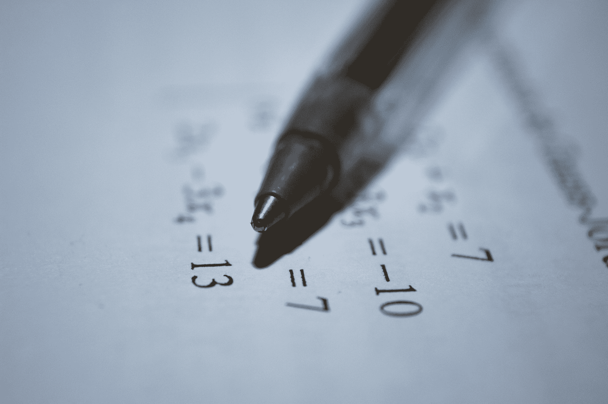
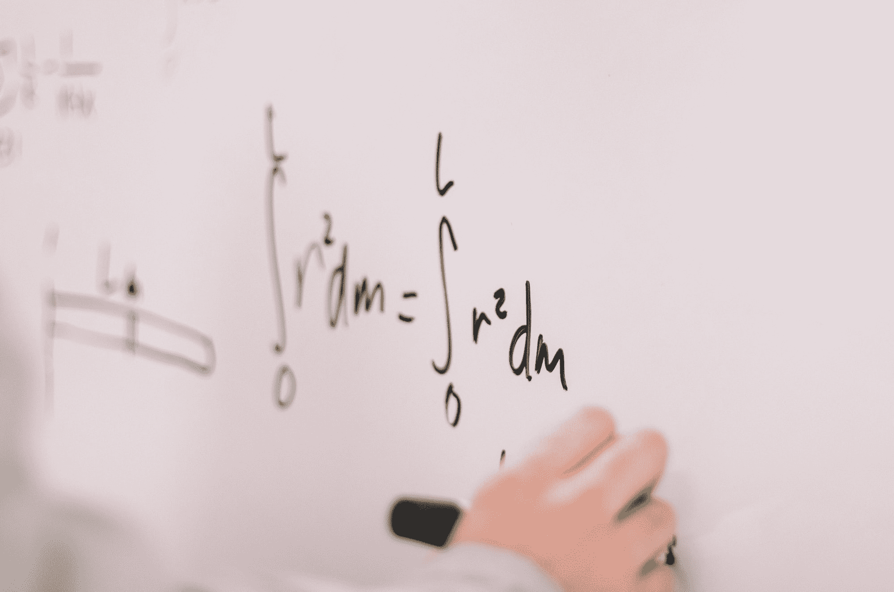

# 人工智能中你需要知道的所有数学知识

> 原文：<https://www.freecodecamp.org/news/all-the-math-you-need-in-artificial-intelligence/>

我是一名人工智能研究人员，我收到了不少电子邮件，问我人工智能需要多少数学知识。

我不会撒谎:**数学很大**。

这也是人工智能让许多初学者却步的原因之一。经过大量的研究，并与该领域的几位资深人士交谈后，我编辑了这本严肃的指南，涵盖了你需要知道的所有数学基础。

下面提到的概念通常会在大学的几个学期中涉及到，但我把它们归结为你可以关注的核心原则。

这本指南对初学者来说绝对是救命稻草，所以你可以研究最重要的话题。但是对于像我这样需要快速浏览这些概念的从业者来说，这是一个更好的资源。

> 注意:你不需要知道所有的概念(如下)来获得你的第一份人工智能工作。你所需要的是对基本面的牢牢把握。专注于这些并巩固它们。

你也可以在我的 Github 上找到这些资源: [Jason 的 AI 数学路线图](https://github.com/jasmcaus/ai-math-roadmap)。

## 1.人工智能需要知道的代数

Photo by [Antoine Dautry](https://unsplash.com/@antoine1003?utm_source=ghost&utm_medium=referral&utm_campaign=api-credit) / [Unsplash](https://unsplash.com/?utm_source=ghost&utm_medium=referral&utm_campaign=api-credit)

代数知识也许是一般数学的基础。除了加法、减法、乘法和除法等数学运算，您还需要了解以下内容:

*   
*   **[**部首**](https://tutorial.math.lamar.edu/classes/alg/Radicals.aspx)**
*   **[**阶乘**](https://www.youtube.com/watch?v=pGg40oiQsUk&feature=youtu.be)**
*   **[**总结**](https://www.youtube.com/watch?v=LDfaYXXAcHY&feature=youtu.be)**
*   **[**科学符号**](https://www.khanacademy.org/math/pre-algebra/pre-algebra-exponents-radicals)**

## **2.人工智能需要知道的线性代数**

**

Linear Algebra. [Source](https://www.engineer4free.com/blog/free-online-linear-algebra-course).** 

**线性代数是人工智能和许多其他科学和工程领域的主要数学计算工具。对于这个字段，您需要了解 4 个主要的数学对象及其属性:**

*   **[**标量**](http://www.sciencebits.com/vector_algebra) —单个数(可以是实数，也可以是自然数)。**
*   **[**向量**](http://www.sciencebits.com/vector_algebra) —一列数字，按顺序排列。将它们视为空间中的点，每个元素代表一个轴上的坐标。**
*   **[**矩阵**](https://www.mathsisfun.com/algebra/matrix-introduction.html) —一个二维数字数组，其中每个数字由两个索引标识。**
*   **[**张量**](https://mathworld.wolfram.com/Tensor.html) —一个 N-D 数组(N > 2)，排列在一个有 N 个轴的规则网格上。在机器学习、深度学习和[计算机视觉](https://github.com/jasmcaus/caer)中很重要。**
*   **[**特征向量&特征值**](https://www.mathsisfun.com/algebra/eigenvalue.html) —特殊向量及其对应的标量。了解其意义以及如何找到它们。**
*   **[**奇异值分解**](https://web.mit.edu/be.400/www/SVD/Singular_Value_Decomposition.htm) —将一个矩阵分解成 3 个矩阵。了解属性和应用。**
*   **[**【主成分分析】**](https://royalsocietypublishing.org/doi/10.1098/rsta.2015.0202) —理解意义、性质、应用。**

**了解诸如[点积](https://betterexplained.com/articles/vector-calculus-understanding-the-dot-product/)、[矢量积](http://hyperphysics.phy-astr.gsu.edu/hbase/vvec.html)和[哈达玛积](https://handwiki.org/wiki/Hadamard_product_%28matrices%29)这样的属性也很有用。**

## **3.人工智能需要知道的微积分**

**

Photo by [Jeswin Thomas](https://unsplash.com/@jeswinthomas?utm_source=ghost&utm_medium=referral&utm_campaign=api-credit) / [Unsplash](https://unsplash.com/?utm_source=ghost&utm_medium=referral&utm_campaign=api-credit)** 

**微积分处理参数、函数、误差和近似值的变化。多维微积分的工作知识在人工智能中是必不可少的。**

**以下是微积分中最重要的概念(尽管不是详尽的):**

*   **[**导数**](https://www.mathsisfun.com/calculus/derivatives-introduction.html) —法则(加法、乘积、链式法则等等)，双曲导数(tanh、cosh 等等)和偏导数。**
*   **[**向量/矩阵演算**](http://www.personal.rdg.ac.uk/~sis01xh/teaching/CY4C9/ANN3.pdf) —不同的导数算子(梯度、雅可比、海森和拉普拉斯)**
*   **[**梯度算法**](https://towardsdatascience.com/gradient-descent-algorithm-and-its-variants-10f652806a3) —局部/全局极大值和极小值、鞍点、凸函数、批处理和小批处理、随机梯度下降、性能比较。**

## **4.人工智能中你需要知道的统计和概率概念**

**

Photo by [Naser Tamimi](https://unsplash.com/@tamiminaser?utm_source=ghost&utm_medium=referral&utm_campaign=api-credit) / [Unsplash](https://unsplash.com/?utm_source=ghost&utm_medium=referral&utm_campaign=api-credit)** 

**这个话题可能会占用你大量的时间。好消息:这些概念并不难，所以你没有理由不掌握它们。**

*   **[**基础统计**](https://www.dummies.com/education/math/statistics/statistics-for-dummies-cheat-sheet/) —均值、中位数、众数、方差、协方差等等。**
*   ******—事件(相依与独立)、样本空间、条件概率中的基本规则。******
*   ******[**随机变量**](https://www.khanacademy.org/math/statistics-probability/random-variables-stats-library) —连续与离散、期望、方差、分布(联合与条件)。******
*   ******[贝叶斯定理](https://www.freecodecamp.org/news/bayes-rule-explained/)** —计算信念的有效性。贝叶斯软件帮助机器识别模式并做出决策。****
*   ********—参数估计。需要基本概率概念的知识(事件的联合概率和独立性)。********
*   ******[**常见分布**](https://www.stat.tamu.edu/~twehrly/611/distab.pdf) —二项式、泊松、伯努利、高斯、指数。******

## ****5.人工智能需要知道的信息论概念****

****

Photo by [Giulia May](https://unsplash.com/@giuliamay?utm_source=ghost&utm_medium=referral&utm_campaign=api-credit) / [Unsplash](https://unsplash.com/?utm_source=ghost&utm_medium=referral&utm_campaign=api-credit)**** 

****这是一个对人工智能和深度学习做出重大贡献的重要领域，但许多人还不知道。可以把它看作是微积分、统计学和概率的融合。****

*   ****[**熵**](https://mathoverflow.net/questions/146463/what-is-entropy-really)**——也叫香农熵。用于测量实验中的不确定性。******
*   ******[**交叉熵**](https://machinelearningmastery.com/cross-entropy-for-machine-learning)**——比较两个概率分布，告诉我们它们有多相似。********
*   ******[**Kullback Leibler 散度**](https://www.countbayesie.com/blog/2017/5/9/kullback-leibler-divergence-explained)**——两个概率分布有多相似的另一种度量。********
*   ******[**维特比算法**](https://www.cis.upenn.edu/~cis262/notes/Example-Viterbi-DNA.pdf) —广泛应用于自然语言处理(NLP)和语音。******
*   ****[**编解码**](https://hackernoon.com/information-theory-of-neural-networks-c96a0f0a8d9)**——**用于机器翻译 RNNs 等机型。****

## ****数学很有趣！****

****如果你一提到“数学”就害怕，你可能不会对人工智能感兴趣。****

****但是，如果你愿意投入时间来提高你对微积分、线性代数、统计和概率的基本原理的熟悉程度，没有什么——甚至数学——应该阻碍你进入人工智能。****

****PS:数学*真的*好玩。随着你对数学的深入研究，一定要理解某个数学概念的美妙之处，以及*它是如何影响某些东西的。你将很快分享许多数学家和人工智能科学家的激情！*****

> ****一个提示:把数学概念当作一个现收现付的东西:每当一个外国概念出现，抓住它，狼吞虎咽！上面的指南提供了一个最小的，但是全面的资源来理解人工智能中任何种类的主题或概念。****

****请务必在 Twitter 上[关注我，了解未来文章的更新。快乐学习！](http://twitter.com/jasmcaus)****