# 要理解 JavaScript 的原型，你只需要知道

> 原文：<https://www.freecodecamp.org/news/all-you-need-to-know-to-understand-javascripts-prototype-a2bff2d28f03/>

大多数时候，JavaScript 的原型让刚开始学习 JavaScript 的人感到困惑——尤其是如果他们来自 C++或 Java 背景。

在 JavaScript 中，继承的工作方式与 C++或 Java 稍有不同。JavaScript 继承更广为人知的说法是“原型继承”。

当您在 JavaScript 中遇到`class`时，事情变得更加难以理解。新的`class`语法看起来类似于 C++或 Java，但实际上，它的工作方式不同。

在本文中，我们将尝试理解 JavaScript 中的“原型继承”。我们还研究了新的基于`class`的语法，并试图理解它实际上是什么。所以让我们开始吧。

首先，我们将从老学校的 JavaScript 函数和原型开始。

#### 理解对原型的需求

如果您曾经使用过 JavaScript 数组、对象或字符串，您会注意到有一些方法是默认可用的。

例如:

```
var arr = [1,2,3,4];arr.reverse(); // returns [4,3,2,1]
```

```
var obj = {id: 1, value: "Some value"};obj.hasOwnProperty('id'); // returns true
```

```
var str = "Hello World";str.indexOf('W'); // returns 6
```

你有没有想过这些方法是从哪里来的？你还没有自己定义这些方法。

可以这样定义自己的方法吗？你可以这样说:

```
var arr = [1,2,3,4];arr.test = function() {    return 'Hi';}arr.test(); // will return 'Hi'
```

这是可行的，但只适用于这个名为`arr`的变量。假设我们有另一个名为`arr2`的变量，那么`arr2.test()`将抛出一个错误“TypeError: arr2.test 不是一个函数”。

那么，这些方法如何对数组/字符串/对象的每个实例可用呢？你能用同样的行为创建你自己的方法吗？答案是肯定的。你需要用正确的方法去做。为了帮助解决这个问题，JavaScript 的原型出现了。

我们先来看看这些函数是从哪里来的。考虑下面的代码片段:

```
var arr1 = [1,2,3,4];var arr2 = Array(1,2,3,4);
```

我们已经用两种不同的方式创建了两个数组:`arr1`用数组字面量，`arr2`用`Array`构造函数。两者都是等价的，只是有一些差异，这些差异对于本文来说无关紧要。

现在来看构造函数`Array`——它是 JavaScript 中预定义的构造函数。如果你打开 Chrome 开发者工具，进入控制台，输入`console.log(Array.prototype)`并点击`enter`，你会看到如下内容:

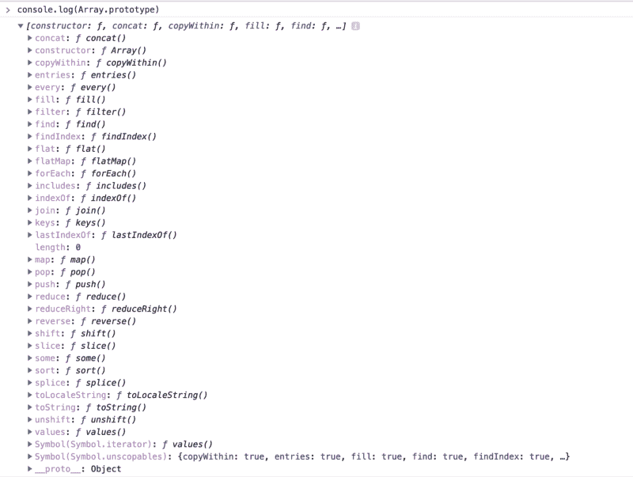

Fig: 1

在那里你会看到所有我们想知道的方法。所以现在我们来看看这些函数是从哪里来的。请随意使用`String.prototype`和`Object.prototype`进行尝试。

让我们创建自己的简单构造函数:

```
var foo = function(name) { this.myName = name; this.tellMyName = function() {   console.log(this.myName); }}
```

```
var fooObj1 = new foo('James');fooObj1.tellMyName(); // will print Jamesvar fooObj2 = new foo('Mike');fooObj2.tellMyName(); // will print Mike
```

你能找出上面代码的一个根本问题吗？问题是我们用上面的方法浪费内存。注意，方法`tellMyName`对于`foo`的每个实例都是相同的。每次我们创建一个`foo`的实例，方法`tellMyName`就会占用系统的内存空间。如果`tellMyName`对于所有的实例都是一样的，那么最好把它放在一个地方，让我们所有的实例都从那个地方引用。让我们看看如何做到这一点。

```
var foo = function(name) { this.myName = name;}
```

```
foo.prototype.tellMyName = function() {   console.log(this.myName);}
```

```
var fooObj1 = new foo('James');fooObj1.tellMyName(); // will print Jamesvar fooObj2 = new foo('Mike');fooObj2.tellMyName(); // will print Mike
```

让我们检查一下上面的方法和前面的方法的区别。使用上面的方法，如果您`console.dir()`实例，那么您将看到类似这样的内容:

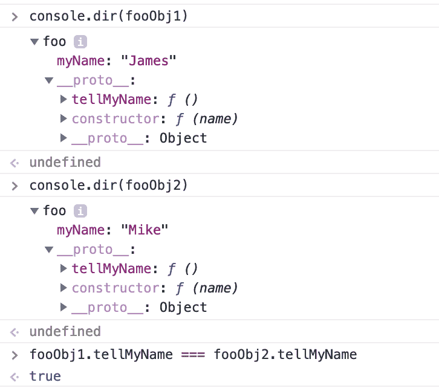

Fig: 2

注意，作为实例的属性，我们只有`myname`。`tellMyName`在`__proto__`下定义。过段时间我会来这个`__proto__`。最重要的是注意，比较两个实例的`tellMyName`结果为真。JavaScript 中的函数比较只有在它们的引用相同时才计算为 true。这证明了`tellMyName`没有为多个实例消耗额外的内存。

让我们看看前一种方法的相同之处:

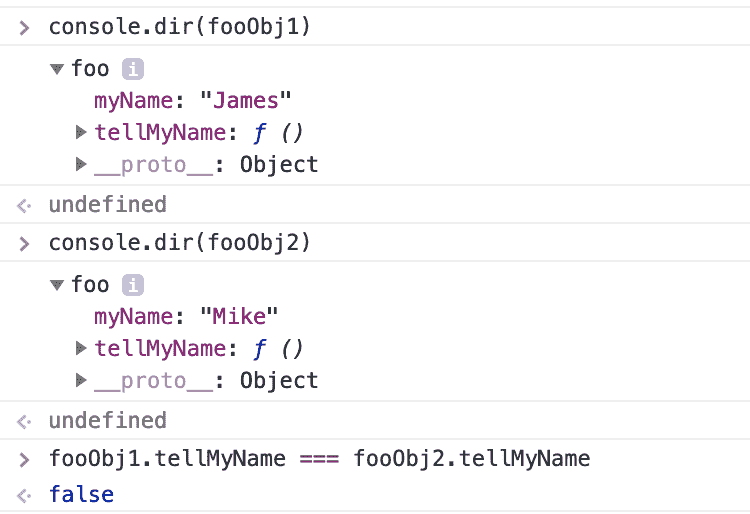

Fig: 3

注意，这个时间`tellMyName`被定义为实例的属性。已经不在那个`__proto__`下面了。另外，请注意，这次比较函数的结果为 false。这是因为它们位于两个不同的内存位置，它们的引用也不同。

我希望现在你明白了`prototype`的必要性。

现在让我们来看看关于原型的更多细节。

每个 JavaScript 函数都有一个对象类型的`prototype`属性。可以在`prototype`下定义自己的属性。当你使用这个函数作为构造函数时，它的所有实例都将继承`prototype`对象的属性。

现在让我们来看看你在上面看到的那个`__proto__`房产。`__proto__`只是对实例继承的原型对象的引用。听起来很复杂？其实没那么复杂。让我们用一个例子来形象化这一点。

考虑下面的代码。我们已经知道用数组文字创建数组将从`Array.prototype`继承属性。

```
var arr = [1, 2, 3, 4];
```

我上面刚刚说的是“*`__proto__`只是对实例继承了*的原型对象的引用”。所以`arr.__proto__`和`Array.prototype`应该是一样的。我们来验证一下。

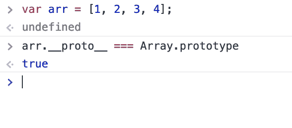

Fig: 4

现在我们不应该用`__proto__`访问原型对象。根据 MDN，使用`__proto__`是非常不鼓励的，可能不是所有的浏览器都支持。正确的做法是:

```
var arr = [1, 2, 3, 4];var prototypeOfArr = Object.getPrototypeOf(arr);prototypeOfArr === Array.prototype;prototypeOfArr === arr.__proto__;
```

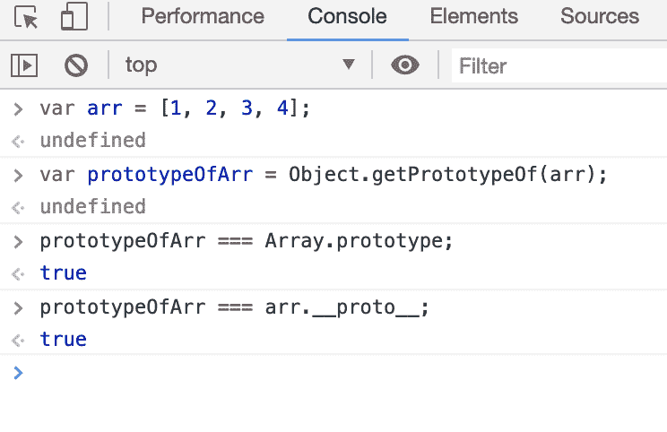

Fig: 5

上面代码片段的最后一行显示`__proto__`和`Object.getPrototypeOf`返回相同的东西。

现在是休息的时候了。拿一杯咖啡或任何你喜欢的东西，自己尝试上面的例子。一旦你准备好了，回到这篇文章，我们将继续。

#### 原型链接和继承

在上面的图 2 中，您是否注意到在第一个`__proto__`对象中还有另一个`__proto__`？如果没有，那么向上滚动一点到图 2。看一看，然后回到这里。我们现在将讨论这实际上是什么。这就是所谓的原型链接。

在 JavaScript 中，我们借助原型链接来实现继承。

考虑这个例子:我们都理解“车辆”这个术语。公共汽车可以被称为交通工具。汽车可以被称为交通工具。摩托车可以被称为交通工具。公共汽车、小汽车和摩托车有一些共同的特性，这就是它们被称为交通工具的原因。例如，他们可以从一个地方移动到另一个地方。他们有轮子。他们有角，等等。

同样，公共汽车、小汽车和摩托车可以是不同的类型，例如奔驰、宝马、本田等。

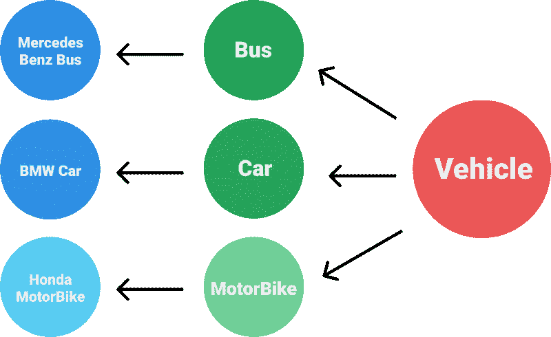

Fig: 6

在上图中，Bus 从 vehicle 继承了一些属性，Mercedes Benz Bus 从 Bus 继承了一些属性。汽车和摩托车也是如此。

让我们用 JavaScript 来建立这种关系。

首先，为了简单起见，让我们假设几点:

1.  所有的公共汽车都有 6 个轮子
2.  公共汽车、小汽车和摩托车的加速和制动程序不同，但所有公共汽车、小汽车和摩托车的加速和制动程序相同。
3.  所有车辆都可以按喇叭。

```
function Vehicle(vehicleType) {  //Vehicle Constructor    this.vehicleType = vehicleType;}
```

```
Vehicle.prototype.blowHorn = function () {    console.log('Honk! Honk! Honk!'); // All Vehicle can blow Horn}
```

```
function Bus(make) { // Bus Constructor  Vehicle.call(this, "Bus");      this.make = make}
```

```
Bus.prototype = Object.create(Vehicle.prototype); // Make Bus constructor inherit properties from Vehicle Prototype Object
```

```
Bus.prototype.noOfWheels = 6; // Let's assume all buses have 6 wheels
```

```
Bus.prototype.accelerator = function() {    console.log('Accelerating Bus'); //Bus accelerator}
```

```
Bus.prototype.brake = function() {    console.log('Braking Bus'); // Bus brake}
```

```
function Car(make) {  Vehicle.call(this, "Car");  this.make = make;}
```

```
Car.prototype = Object.create(Vehicle.prototype);
```

```
Car.prototype.noOfWheels = 4;
```

```
Car.prototype.accelerator = function() {    console.log('Accelerating Car');}
```

```
Car.prototype.brake = function() {    console.log('Braking Car');}
```

```
function MotorBike(make) {  Vehicle.call(this, "MotorBike");  this.make = make;}
```

```
MotorBike.prototype = Object.create(Vehicle.prototype);
```

```
MotorBike.prototype.noOfWheels = 2;
```

```
MotorBike.prototype.accelerator = function() {    console.log('Accelerating MotorBike');}
```

```
MotorBike.prototype.brake = function() {    console.log('Braking MotorBike');}
```

```
var myBus = new Bus('Mercedes');var myCar = new Car('BMW');var myMotorBike = new MotorBike('Honda');
```

请允许我解释一下上面的代码片段。

我们有一个期望车辆类型的`Vehicle`构造函数。由于所有车辆都可以鸣笛，我们在`Vehicle`的原型中有一个`blowHorn`属性。

由于`Bus`是一辆车，它将从`Vehicle`对象继承属性。

我们假设所有的公交车都有 6 个轮子，并且有相同的加速和刹车程序。所以我们在`Bus`的原型中定义了`noOfWheels`、`accelerator`和`brake`属性。

类似的逻辑也适用于汽车和摩托车。

让我们进入 Chrome 开发者工具->控制台，执行我们的代码。

执行后，我们将有 3 个对象`myBus`、`myCar`和`myMotorBike`。

在控制台中键入`console.dir(mybus)`并点击`enter`。使用三角形图标将其展开，您将看到如下内容:


Fig: 7

在`myBus`下，我们有属性`make`和`vehicleType`。注意`__proto__`的值是`Bus`的原型。它原型的所有属性在这里都有:`accelerator`、`brake`、`noOfWheels`。

现在看看第一个`__proto__`物体。这个对象有另一个`__proto__`对象作为它的属性。

在它下面我们有`blowHorn`和`constructor`属性。

```
Bus.prototype = Object.create(Vehicle.prototype);
```

还记得上面那行吗？`Object.create(Vehicle.prototype)`会创建一个原型为`Vehicle.prototype`的空对象。我们把这个物体设定为`Bus`的原型。对于`Vehicle.prototype`，我们没有指定任何原型，所以默认情况下它继承自`Object.prototype`。

让我们看看下面的魔术:

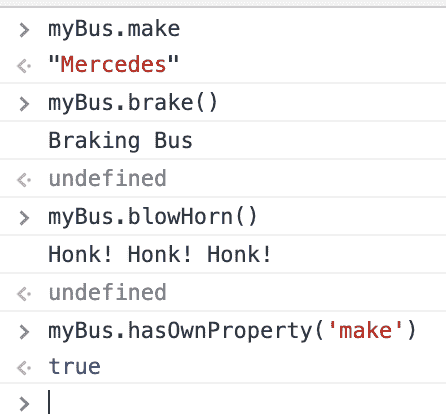

Fig: 8

我们可以访问`make`属性，因为它是`myBus`自己的属性。

我们可以从`myBus`的原型中访问`brake`属性。

我们可以从`myBus`的原型的原型中访问`blowHorn`属性。

我们可以从`myBus`的原型的原型的原型中访问`hasOwnProperty`属性。:)

这被称为原型链接。每当在 JavaScript 中访问对象的属性时，它首先检查该属性在对象内部是否可用。如果不是，它检查它的原型对象。如果它在那里，那么好，你得到财产的价值。否则，它将检查属性是否存在于原型的原型中，如果不存在，则再次检查原型的原型的原型中，依此类推。

那么以这种方式检查需要多长时间呢？如果在任何一点找到该属性，或者任何一点的`__proto__`值为`null`或`undefined`，它将停止。然后，它将抛出一个错误，通知您它无法找到您正在寻找的属性。

这就是 JavaScript 中借助原型链接的继承工作方式。

请随意使用`myCar`和`myMotorBike`尝试上面的例子。

众所周知，在 JavaScript 中一切都是对象。您会发现，对于每个实例，原型链都以`Object.prototype`结尾。

上述规则的例外是，如果您使用`Object.create(null)`创建一个对象

```
var obj = Object.create(null)
```

用上面的代码`obj`将会是一个没有任何原型的空对象。

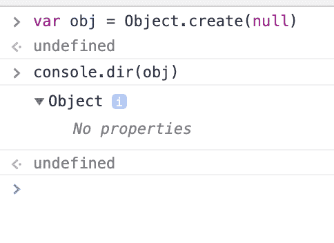

Fig: 9

有关`Object.create`的更多信息，请查看 MDN 上的文档。

能否更改现有对象的原型对象？是的，用`Object.setPrototypeOf()`你可以。查看 MDN 中的文档。

想检查一个属性是否是对象自己的属性？你已经知道怎么做了。会告诉你属性是来自对象本身还是来自它的原型链。查看它在 MDN 上的文档。

注意`__proto__`也称为`[[Prototype]]`。

现在是另一次休息的时候了。一旦你准备好了，回到这篇文章。然后我们会继续，我保证这是最后一部分。

#### 理解 JavaScript 中的类

根据 MDN:

> ECMAScript 2015 中引入的 JavaScript 类主要是 JavaScript 现有的基于原型的继承的语法糖。类语法*没有*向 JavaScript 引入新的面向对象继承模型。

JavaScript 中的类将提供更好的语法，以更简洁的方式实现我们上面所做的。让我们先来看看类的语法。

```
class Myclass {  constructor(name) {    this.name = name;  }    tellMyName() {    console.log(this.name)  }}
```

```
const myObj = new Myclass("John");
```

`constructor`法是一种特殊类型的方法。每当您创建该类的实例时，它都会自动执行。在你的类体内。`constructor`只可能出现一次。

您将在类主体中定义的方法将被移动到原型对象中。

如果你想要实例中的一些属性，你可以在构造函数中定义它，就像我们对`this.name = name`所做的那样。

让我们来看看我们的`myObj`。

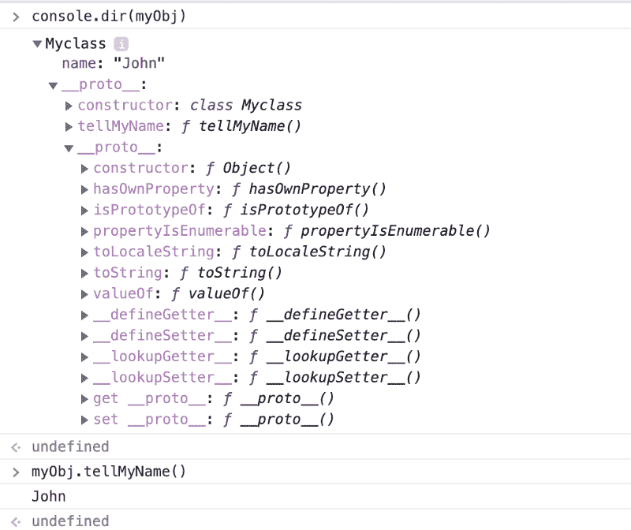

Fig: 10

注意，我们在实例`myObj`中有`name`属性，方法`tellMyName`在原型中。

考虑下面的代码片段:

```
class Myclass {  constructor(firstName) {    this.name = firstName;  }    tellMyName() {    console.log(this.name)  }  lastName = "lewis";}
```

```
const myObj = new Myclass("John");
```

让我们看看输出:

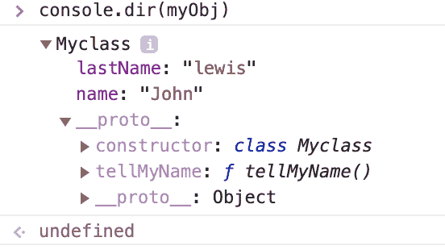

Fig: 11

看到`lastName`被移到实例中，而不是原型中。只有在类体内声明的方法才会被转移到 prototype。但是有一个例外。

考虑下面的代码片段:

```
class Myclass {  constructor(firstName) {    this.name = firstName;  }    tellMyName = () => {    console.log(this.name)  }  lastName = "lewis";}
```

```
const myObj = new Myclass("John");
```

输出:

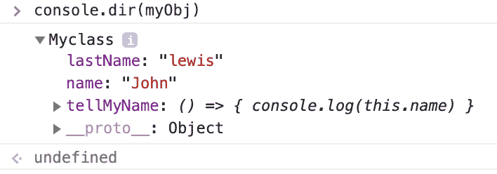

Fig: 12

注意，`tellMyName`现在是一个箭头函数，它已经被移动到实例而不是原型。所以请记住，箭头函数总是会被移动到实例中，所以要小心使用它们。

让我们看看静态类属性:

```
class Myclass {  static welcome() {    console.log("Hello World");  }}
```

```
Myclass.welcome();const myObj = new Myclass();myObj.welcome();
```

输出:

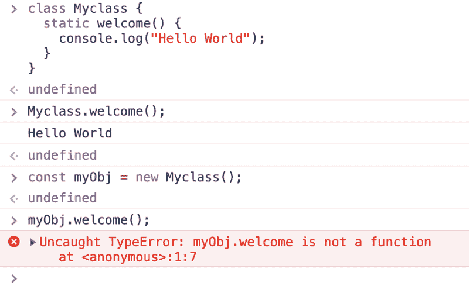

Fig: 13

静态属性是不需要创建类的实例就可以访问的东西。另一方面，实例将不能访问类的静态属性。

那么静态属性是一个新的概念吗？这个概念只在类中可用，而在老式的 JavaScript 中没有。不，在传统的 JavaScript 中也有。实现静态属性的老方法是:

```
function Myclass() {}Myclass.welcome = function() {  console.log("Hello World");}
```

现在我们来看看如何用类实现继承。

```
class Vehicle {  constructor(type) {    this.vehicleType= type;  }  blowHorn() {    console.log("Honk! Honk! Honk!");  }}
```

```
class Bus extends Vehicle {  constructor(make) {    super("Bus");    this.make = make;   }  accelerator() {    console.log('Accelerating Bus');  }  brake() {    console.log('Braking Bus');  }}
```

```
Bus.prototype.noOfWheels = 6;
```

```
const myBus = new Bus("Mercedes");
```

我们使用`extends`关键字继承其他类。

`super()`将简单地执行父类的构造函数。如果你从其他类继承并且在你的子类中使用构造函数，那么你必须在你的子类的构造函数中调用`super()`,否则它将抛出一个错误。

我们已经知道，如果我们在类体中定义一个普通函数之外的任何属性，它将被移动到实例而不是原型。所以我们在`Bus.prototype`上定义`noOfWheel`。

在你的类体内，如果你想执行父类的方法，你可以使用`super.parentClassMethod()`来完成。

输出:

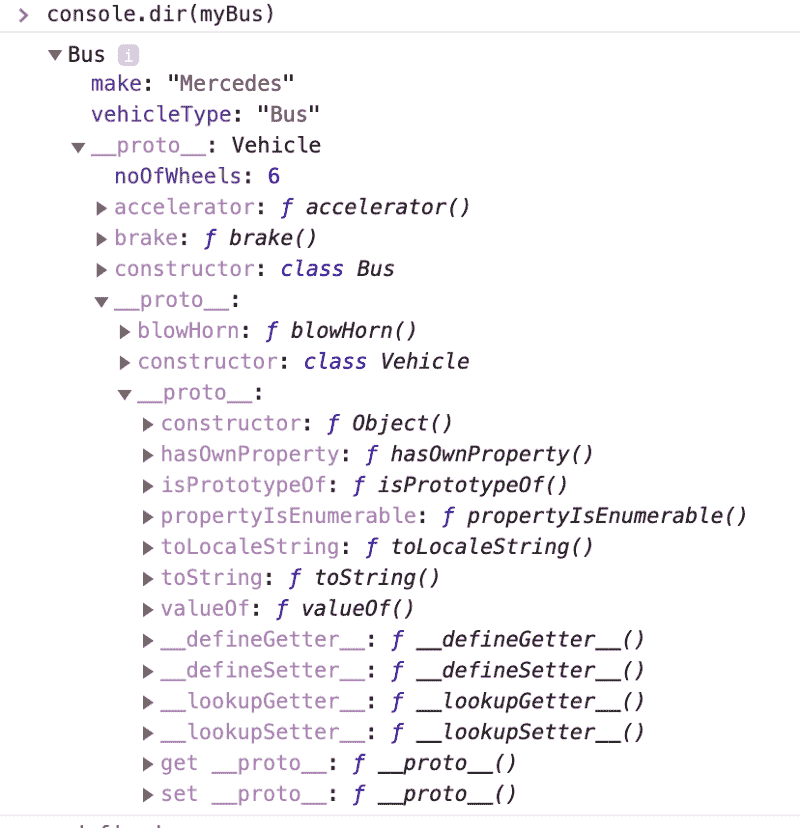

Fig: 14

上面的输出看起来类似于图 7 中我们之前的基于函数的方法。

#### 包扎

那么你应该使用新的类语法还是旧的基于构造函数的语法呢？这个问题我估计没有明确的答案。这取决于您的用例。

在本文中，对于类部分，我已经演示了如何实现原型继承类。关于 JavaScript 类还有更多需要了解的，但这超出了本文的范围。查看 MDN 上的类文档。或者我会试着写一整篇关于类的文章。

如果这篇文章有助于你理解原型，如果你能稍微鼓掌，我将不胜感激。

如果你想让我写一些其他的话题，请在回复中告诉我。

也可以通过 [LinkedIn](https://www.linkedin.com/in/shirshendubhowmick/) 和我联系。

#### 感谢您的阅读。:)