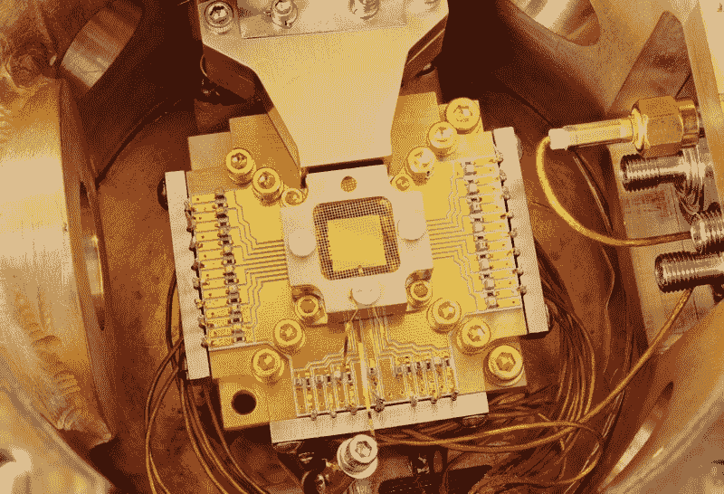

# (几乎)你曾经想知道的关于量子计算机的一切

> 原文：<https://www.freecodecamp.org/news/almost-everything-you-ever-wanted-to-know-about-quantum-computers-5ee6bc2f40ba/>

阿什瓦尼·库马尔

# (几乎)你曾经想知道的关于量子计算机的一切

#### 从薛定谔的猫到大海捞针

Source: [Wikimedia Commons](https://commons.wikimedia.org/wiki/File:Quantum_Computing;_Ion_Trapping_(5941055642).jpg)

随着 IBM 最近在 CES 2019 上宣布推出第一台完全集成的商用量子计算机 [IBM Q System One](https://www.research.ibm.com/ibm-q/system-one/) ，量子计算即将进入主流计算领域。装在一个九英尺高，九英尺宽，半英寸厚的箱子里…