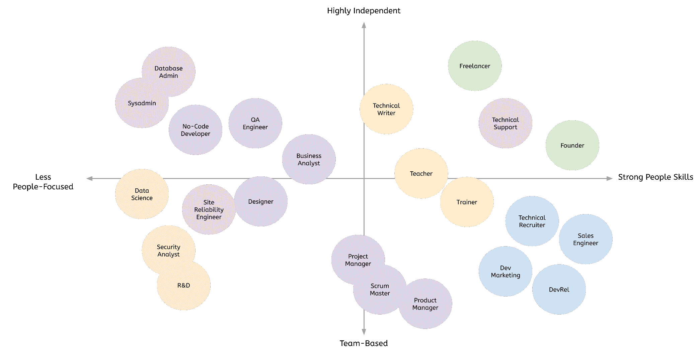
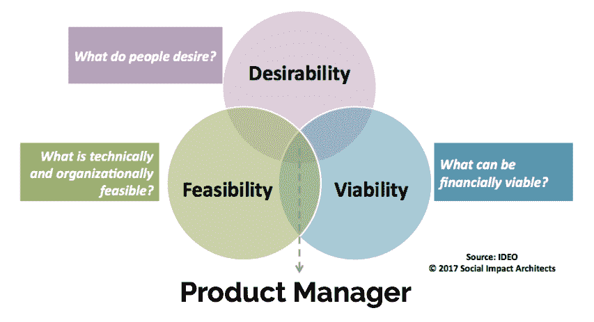

# 23 种可供软件开发人员选择的职业道路

> 原文：<https://www.freecodecamp.org/news/alternative-career-paths/>

在过去的五年里，我在芝加哥的许多编码训练营做过几十次客座演讲。

有几个问题总是会出现:“接下来我应该学习哪种语言？、[如何准备技术面试？](https://www.freecodecamp.org/news/interviewing-prep-tips-and-tricks/)、“你们招人了吗？”

但是让我困惑的一个问题是，“如果我不想成为一名软件开发人员怎么办？”

我最近一直在思考这个问题。在领导产品和工程团队近十年后，我意识到我已经准备好迎接新的挑战，所以今年夏天，我开始了自由职业技术写作。当我得到第一个客户时，我并不知道，但我很快意识到*技术写作是前软件工程师*的许多有效职业道路之一。

## 软件开发人员还能做什么？

这种认识让我思考:“除了写软件，软件工程师还能做什么工作？”

名单出奇的长。

这篇文章将介绍软件开发人员的许多职业道路，尤其是最近的训练营毕业生。我会解释每份工作的作用，你如何进入职场，以及长期前景。

无论你是因为没有找到工程师的工作，还是因为意识到软件开发不适合你而寻找替代职业道路，本指南都将帮助你找到适合你技能的职业。

## 面向客户的角色

虽然软件工程师受益于人际交往技能，但我交谈过的一些训练营毕业生并不希望整天安静地坐着写代码。如果你想要一条能提供更多与人交往机会的职业道路，这些工作可能适合你。

### 1.开发者关系、宣传或布道

随着越来越多的公司努力与作为其客户、用户或拥护者的开发人员建立关系，开发人员关系领域正在快速发展。

开发者关系专家(一些公司称他们为开发者拥护者、开发者福音传播者、社区管理者或“DevRels”)帮助建立和构建围绕他们公司软件的社区。

他们经常参与创建演示应用程序，撰写博客文章，在会议上发言，以及为技术型公司管理社交媒体账户。许多知名科技公司(脸书、谷歌、亚马逊等。)雇佣开发者关系专业人员团队。

如果你对这个领域感兴趣，读一读玛丽·滕瓦尔和 T2·PJ·哈格蒂在做什么。他们是这个领域中我最喜欢的两位有影响力的人，他们一起推出了[社区脉动播客](https://communitypulse.io/)。

### 2.开发者营销

虽然与开发者关系有一些重叠，但开发者营销更注重外表。

对开发商的营销尤其棘手，因为我们不喜欢被销售，所以许多在其他市场有效的更激进的营销策略在这里是禁忌。作为一个有技术背景的人，你自然会理解开发人员的思维方式，你会比传统营销人员更有影响力。

[SlashData](https://www.slashdata.co/blog/) 发布了许多关于开发者营销的精彩内容，包括 2018 年关于该主题的一本[书。如果你想在这个领域起步，学习网络营销:搜索引擎优化，社会媒体，内容营销，影响者营销等。在申请工作之前，你可以在你的博客上练习这些技能来展示你的知识。](https://www.slashdata.co/blog/developer-marketing-guide-selling-softly)

### 3.销售工程师

许多工程师对任何标题中带有“销售”的工作都不感兴趣，但那只是因为我们都遇到过糟糕的销售人员。

事实是[每个人都在销售](https://www.theladders.com/career-advice/everyone-is-in-sales-and-thats-a-good-thing)。无论你是在面试过程中“推销”自己作为一名求职者，还是在你的工程团队中倡导一个新的框架，销售意味着将客户的需求与正确的解决方案相匹配。

销售工程师是独一无二的，因为他们有一定水平的技术专长。对于那些不想整天写代码但懂软件工程的开发人员来说，这可能是一个极好的匹配。

销售的另一个好处是，你不需要任何专门的认证。 [Hubspot 提供了一个很好的介绍](https://blog.hubspot.com/sales/how-to-become-sales-engineer)给你一些可以开始的技能和资源。随着越来越多的公司为工程师开发软件工具和服务，未来十年对销售工程师的需求可能会更大。

### 4.技术招聘人员

另一个在软件工程师中名声不好的职业是技术招聘。

我遇到过一些诚实、真诚的科技招聘人员(例如，来自我的家乡芝加哥的泰勒·多塞特和 T2·马特·霍夫曼)，但我也遇到过一些糟糕、无知的招聘人员，他们纯粹专注于筛选候选人以达到配额。

好消息是，有了软件开发的背景，你会比其他技术招聘人员更有同情心和可信度。像销售一样，这个领域需要更外向、更注重人际关系的个性，但不需要专门的认证或课程。

不幸的是，科技招聘中的许多入门级工作都在低质量的公司，所以在你申请之前，一定要检查他们在 Glassdoor 上的[声誉。](https://www.glassdoor.com/Salaries/technical-recruiter-salary-SRCH_KO0,19.htm)

## 产品角色

如果你想留在产品团队，但你不确定你是否想成为一名软件开发人员，有很多领域你可以转行。这些角色与工程师密切合作，因此您的编码知识将对您有所帮助，但它们也需要其他专业知识。

### 5.质量保证或测试工程师

虽然质量保证工程师和测试工程师之间有细微的差别，但他们都在软件上线前处理测试工作。

如果你对细节很有眼光，并且喜欢想出创造性的方法来自动化重复的任务，这可能是一条很好的职业道路。这可能需要一些编码以及一些手工测试工作。

较小的公司让他们的软件工程师测试彼此的代码，因此专门的测试和 QA 角色在大型组织中最常见。各公司进行测试的方式有很大差异，所以一定要询问他们使用的工具，他们的测试自动化程度如何，以及你的角色需要多少手动测试和自动化测试。

### 6.商业分析员

产品开发生命周期的另一端是业务分析师。他们通常充当业务和技术团队之间的桥梁，以确保理解需求、限制和时间表。根据团队的结构，他们也可能会加入并帮助测试和质量保证，所以他们需要有广泛的产品知识。

如果你有商业、产品开发或设计的背景和一些编码技能，你可能有资格担任初级业务分析师的角色。如果没有，我建议你去看看一些在线课程，帮助你对这个职位及其要求有一个基本的了解。

### 7.项目管理人

像业务分析师一样，项目经理必须理解他们产品的业务需求和技术约束。

关键的区别在于，项目经理通常会深入单个项目。他们经常为项目团队定义任务和资源，并在项目接近发布时跟踪项目的进展。

较小的公司可能会以各种方式结合业务分析师、项目管理、scrum master 和产品经理的角色，但是较大的公司可能会定义单独的职责。

优秀的组织能力、对业务的理解和人际交往能力是项目经理成功的关键。这个角色取决于你管理期望和激励可能比你更资深或更有经验的人的能力，所以你必须迅速建立信任。这个角色的多面性使得它非常适合不想再写代码的分析型、技术型人员。

### 8.Scrum 大师

在敏捷团队中， [Scrum Master](https://www.scrum.org/resources/what-is-a-scrum-master) 帮助确保每个人都了解并接受 Scrum 理论、最佳实践和规则。

这最终看起来很像项目管理，但是特别强调为参与构建产品的其他团队服务。同样，这并不总是它自己的工作，但在更大的组织中，它可能是。

作为一名 Scrum 大师，管理期望和限制的能力对你的成功至关重要。你还需要了解敏捷的最佳实践，所以我建议你去找一个合适的课程或者书籍。敏捷已经在各种规模的组织中被广泛采用，所以这一职业道路在未来十年中可能会继续发展。

### 9.生产部经理

我在 2019 年花了很多时间学习产品管理，以[改善我们在 Graide Network](https://www.karllhughes.com/posts/product-management-process) 的产品交付流程。

产品经理从整体上审视公司的产品，以确保它们是合意的(客户想要的)、可行的(有商业意义的)和可行的(我们可以构建它)。像这样高水平思考的能力是罕见的，所以如果你有这种能力和一些技术背景，你可能会做得很好。

入门级产品经理可能会从产品的较小部分开始，或者在一些组织中担任项目经理。这可以让你体验产品开发，并帮助你在被分配管理自己的产品之前，与所有必要的利益相关者建立关系。

### 10.设计师

如果你来自设计或艺术背景，成为一名拥有一些编码技能的 UI 或 UX 设计师是在你的领域脱颖而出的一个好方法。这种技能的结合将使你更有效地与工程师交流，用 HTML/CSS 而不仅仅是静态图像文件创建交互式模型。

如果你没有太多的设计经验，参加一门课程，并开始建立一个文件夹。如果没有学位的人能够展示他们的知识和技能，许多公司会雇用他们。 [Dribbble](https://dribbble.com/) 是我见过最常见的投资组合平台，但你也可以使用自己的网站。

### 11.没有或低代码开发人员

过去几年中无代码和低代码开发工具的激增为那些想要快速构建软件而不雇佣开发团队的公司带来了机遇。这些工具可以让你在几个小时而不是几周内创建一个移动或网络应用程序，并且因为它们每年都在变得更好，更多的公司正在拥抱无代码应用程序。

Makerpad 和[无代码工作](https://nocodejobs.co/)是开始寻找这类工作的好地方。因为这是一个新的领域，你会发现需要的技能和工资范围很广，但是你写代码的背景无疑会是一项资产。

## 支持角色

许多新的软件工程师并没有意识到在幕后有许多员工帮助保持服务器、网站和操作的平稳运行。其中一些角色需要您编写自动化脚本或对服务器管理有深入的了解，但如果您正在寻找传统产品开发周期之外的东西，但具有技术倾向，这些角色可能非常适合。

### 12.系统管理员或开发运维工程师

大型软件公司有成百上千的服务器需要全年进行修补、升级和轮换。虽然云计算的广泛采用已经改变了这份工作，从物理上插入服务器到使用像 [Terraform](https://www.terraform.io/) 和 [Kubernetes](https://kubernetes.io/) 这样的软件，但这个领域并不缺少工作。

传统上，系统管理员负责维护和管理工程团队所需的服务器。随着组织的发展和向云托管的转移，许多组织采用了 DevOps 工程师这一头衔，以反映这一过程中自动化程度的提高。实际上，这些角色之间有很多重叠。

无论哪种方式，您都需要对操作系统、托管平台、自动化工具、bash 脚本和系统架构有一个基本的了解。在这个领域很难找到入门级的工作，因为它需要如此广泛的技术知识，但如果你喜欢解决工程方面的问题，而不需要大多数面向客户的产品所需的 UI/UX 要求，这是一个很好的角色。

### 13.数据库管理员

一些公司将数据库管理员与系统管理员混在一起，但这可能是一个不同的角色。

数据库管理员处理低级数据存储系统的安全性、供应、扩展和优化。您需要了解 SQL 和 NoSQL 数据库、安全最佳实践以及一些基本的脚本技能，但是您不可能整天都在写代码。您还会担心一些非常细微的优化问题，比如修复索引和缓存。

如果你是软件开发的新手，从尽可能多的了解数据库开始。您需要知道哪个数据库适合哪个应用程序，以及如何大规模地优化它们，因此您自己很难做到这一点。如果你想找到一些大型数据集，请查看 [Kaggle](https://www.kaggle.com/datasets) 。

### 14.现场可靠性工程师

现场可靠性工程师负责响应和解决生产中出现的关键问题。通常这意味着他们会在“待命”名单中轮换，所以你可能会在一些奇怪的时间工作。好处是，您将真正擅长解决各种不寻常的问题，构建自动警报，以及读取服务器日志。

由于这项工作的高度反应性，很难让有经验的软件工程师长期担任站点可靠性的角色。也就是说，如果你在寻找你的第一个软件开发角色时遇到了困难，那么这可能是你迈出第一步的好地方。我认识两个训练营的毕业生，他们在进入软件开发之前都在 SRE 工作。你甚至会发现你喜欢快节奏解决问题的挑战和刺激。

### 15.技术或客户支持

虽然一些工程师害怕与客户互动，但其他人发现整天帮助人们解决问题是令人振奋的。你的编码经验将使你成为软件公司客户支持职位的理想候选人，这些公司需要有技术背景的人来回答问题并提出修正建议。

从事支持工作的不利之处在于，你可能不得不与处于最糟糕状态的人打交道。不满意或沮丧的用户可能不乐意与技术支持团队交谈，所以你需要很大的耐心和厚脸皮才能长期担任这个角色。

## 教学和写作角色

我一直热爱教学，所以我发现自己被允许我从事这项工作的工程角色所吸引。如果你喜欢将复杂的主题分解并展示给其他工程师，有几条职业道路可供你选择。

### 16.技术作家

我在大学的第三份实习是在一家大公司做技术写作。这是相当枯燥的写作，但我喜欢每天学习新的东西。

我发现技术写作不仅仅意味着文档。可以追求[技术博客](https://www.karllhughes.com/posts/start-freelance-blogging)或者文案；您可以创建内部或外部文档；您可以创建演示应用程序和教程。这是作家收入最高的领域之一，所以值得考虑。

如果你走这条路，你将需要擅长写作(显然)，组织复杂的想法，并学习新的东西。你自我编辑的能力越强，你的作品就越有价值，所以投资一些工具来帮助你变得更好、更有效率。

你可以开始为一些付费的社区写作项目写作，随着你建立起一个网络和作品集，你可以将这种经历转化为一份全职工作。

### 17.教师

有几种方法可以让你从软件开发职业转向教师职业。你可以在编码训练营找到一份教书的工作，你可以在大学或高中教书，你可以加入像 egghead.io 这样的平台，或者你可以创建自己的可教或可教的课程网站。你走的路取决于你的背景和风险承受能力。

无论如何，教师必须快速学习新信息，并以易于理解的形式呈现给学生。你必须满足你的观众的水平，并与他们建立信任，才能取得成功。教学可能比软件开发工资低，但它也可以是一个非常充实的职业道路。

### 18.运动鞋

企业培训是另一种教学形式，也值得考虑。培训师可能是独立顾问，也可能是大公司的员工，他们通常会前往客户的办公室，提供专业软件的实践培训。

培训师可能拥有深厚的技术知识，但有些人只是精通技术的沟通者。企业培训通常比教学报酬更高，但也可能更受销售驱动。培训师经常在会议上发言，举办社区研讨会，或者在培训期间去会见团体。

如果你喜欢在舞台上展示技术概念，这可能是一个理想的职业道路。

## 分析角色

科技公司的许多职位都需要分析技能。虽然这些领域中的许多都需要专业教育，但是如果你的职业重心从软件工程转向其他领域，还是值得考虑的。你将开始以不同于大多数专注于产品的工程师的速度工作，并且像上面的一些支持角色一样，你可能会与业务的其他部分互动。

### 19.数据科学家或工程师

这两个角色(一些公司将它们结合在一起)涉及使用大型数据集来帮助企业或他们的客户做出更好的决策。

数据工程师通常处理数据接收和组织管道，而数据科学家设计实验和算法，将这些数据处理成有用的结果。[数据科学(AI，机器学习等。)是一个巨大的领域](https://en.wikipedia.org/wiki/Data_science)，它植根于数学、软件工程和统计学。

有针对数据科学和工程的课程、训练营和大学学位，但是如果你有很强的数学背景，你可能能够自己学习一些基础知识。如果没有，考虑先温习数值分析、矩阵代数和统计学。

因为这些技能需要很长时间来学习，而且对数据科学家的需求很大，所以这个角色的报酬很高，而且不太可能很快消失。

### 20.安全分析师

信息安全角色通常会隐藏起来，直到出现问题。虽然每个开发人员都应该意识到安全漏洞和风险，但是安全分析师被明确地雇佣来寻找、分类和建议安全问题的修复。

一些人以独立顾问的身份工作，但是在更大的公司，可能会有内部团队。这个角色很有趣，因为它需要技术、合规、业务和风险评估技能的组合。

安全工作也是技术领导者最难胜任的工作之一，所以在这里你会有工作保障。信息安全是一个广阔的领域，所以[如果你有兴趣追求它，可以看看你可以选择的许多途径中的一些](https://medium.com/bugbountywriteup/jobs-in-information-security-infosec-93a5efc12ca2)。

### 21.研究与开发(research and development)

对于拥有软件工程技能的人来说，从事研发工作可能是一种独特的体验。像谷歌和亚马逊这样的大公司将一部分利润投入到研发团队进行的高风险、潜在高回报的实验中。这些跨学科团队可能包括软件开发人员、数据科学家、业务分析师和项目经理。

进入一个好的 R&D 团队是很难的。这些角色往往竞争激烈，需要高度专业化的知识，而这些知识在编码训练营中是学不到的。也就是说，一些公司雇佣道德黑客、创始人或通晓多种语言的 T2 人来帮助充实团队，并给团队注入一些创造性思维。

## 独立性和灵活性

虽然我们的职业经常允许远程工作，有时甚至允许休假，但你可能希望生活中有更多的灵活性。如果你有创业的动力，你可以每周工作 4 个小时，一年中花 6 个月的时间旅行，或者花一半的时间在开源项目上。这并不容易，但是作为一名软件开发人员，你比大多数人都有优势。

### 22.自由职业者或顾问

获得更多自由的一个方法是离开你朝九晚五的工作，成为一名自由职业者。作为一名自由职业者，你会把自己雇佣给一个或多个客户，他们会按小时付钱给你为他们写代码。公司经常雇用自由职业者从事特定的短期项目，清理技术债务，或者在员工休息时填补空缺。

顾问是为客户解决具体问题的高端自由职业者。虽然他们可能会编写代码，但他们通常是因为专业知识或独特的背景而被聘用的。自由职业者和顾问之间的界限非常模糊，所以不要太纠结于语义。

作为一名自由职业者或顾问，入门是最难的部分。如果你没有一个庞大的网络，你可能会依靠像 [Upwork](https://www.upwork.com/) 或 [Toptal](http://toptal.com/) 这样的平台来寻找客户。这些平台会大幅削减你的收入，迫使你与世界各地的许多其他自由职业者直接竞争。

随着你建立起声誉和客户名单，你将能够从推荐中获得更多的工作。推荐是很好的，因为客户来找你是基于信任的关系，而不是互联网的匿名性。如果你真的擅长自由职业或咨询，你可以把你的工资提高到足够高的水平，这样你就可以在每次约会之间休息一段时间。

### 23.创业创始人

互联网上到处都是软件工程师创业的故事( [1](https://medium.com/@a13n/software-engineer-to-saas-founder-c16154013e12) 、 [2](https://medium.com/@dvassallo/only-intrinsic-motivation-lasts-92c0497cf97c) 、 [3](https://www.indiehackers.com/podcast/096-ben-orenstein-of-tuple) )，所以你可能会觉得这很容易，甚至是个好主意。

事实是，这要看情况。

初创公司通常需要很长时间才能产生收入，所以你需要在几个月或几年内没有薪水的情况下生活才能做到这一点。也就是说，如果你想建立自己的软件业务，上升空间几乎是无限的。

你也可以在正常工作时间之外开一家公司。虽然这[很难做到(并且可能有法律后果)](https://www.entrepreneur.com/article/251931)，但这并不罕见。如果你能找到一两个其他的创始人来分担负担，这可能会增加你成功的机会。

## 最后的想法

软件工程是一个令人兴奋的领域，但并不适合每个人。即使你离开了，如果你决定做别的事情，你获得的技能也不会浪费。

许多训练营的毕业生害怕寻找软件开发领域之外的工作，但是我鼓励你走自己的路。平衡实用性(赚足够的钱生活)和你的兴趣，希望你能找到一条工作感觉不像“工作”的职业道路。

我很想听听你的想法。如果你走了一条非常规的道路或者换了职业，[让我知道你在 Twitter 上的想法](https://twitter.com/karllhughes)。