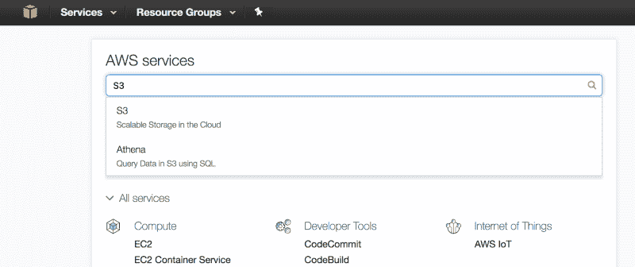
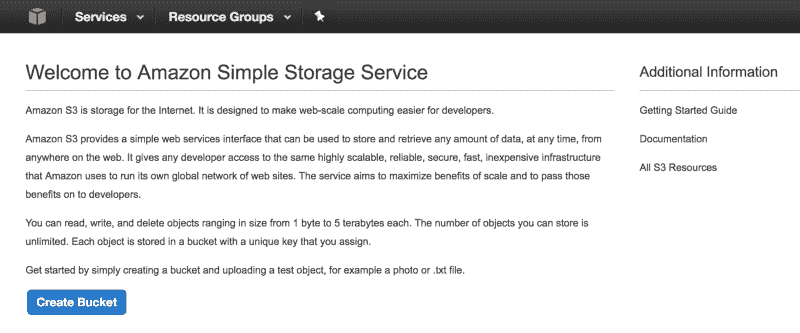
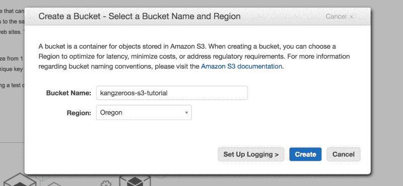
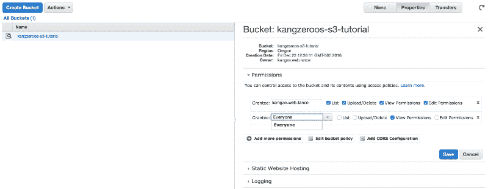
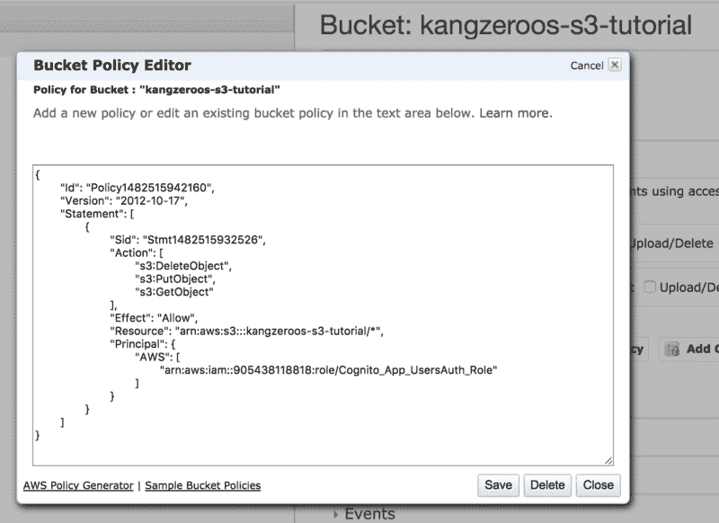
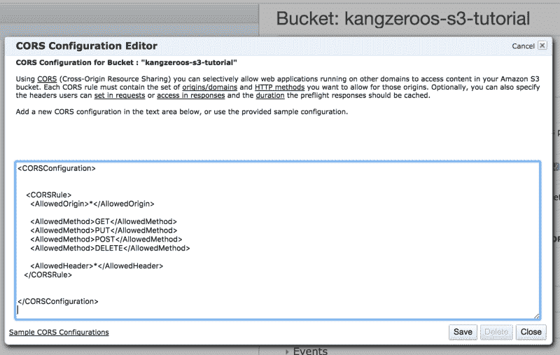

# 亚马逊 S3 —通过云文件存储来提高性能和节约成本

> 原文：<https://www.freecodecamp.org/news/amazon-s3-cloud-file-storage-for-performance-and-cost-savings-8f38d7769619/>

作者:黄

# 亚马逊 S3 —通过云文件存储来提高性能和节约成本

#### 完整的 AWS Web 样板文件—教程 2


### 目录

> **第 0 部分:** [介绍完整的 AWS Web 样板文件](https://medium.com/@kangzeroo/the-complete-aws-web-boilerplate-d0ca89d1691f#.3eqpvcjsy)

> **第 1 部分:** [使用 AWS 认知的用户认证](https://medium.com/@kangzeroo/user-management-with-aws-cognito-1-3-initial-setup-a1a692a657b3#.cbkz7b2jp) (3 部分)

> **第二部分:** [用亚马逊 S3 节省文件存储成本](https://medium.com/@kangzeroo/amazon-s3-cloud-file-storage-for-performance-and-cost-savings-8f38d7769619#.l9so2hk00) (1 部分)

> **第三部分:** [用亚马逊 SES 发送邮件](https://medium.com/@kangzeroo/sending-emails-with-amazon-ses-7617e83327b6#.5nhcrr609) (1 部分)

> 第 4 部分:使用 AWS IAM 管理用户和权限**【即将推出】**

> 第 5 部分:使用 AWS EC2 和 ELB 的云服务器托管**【即将推出】**

> 第 6 部分:MongoDB 黑仔:AWS DynamoDB **【即将推出】**

> 第 7 部分:使用 AWS RDS 的无痛 SQL 伸缩**【即将推出】**

> 第 8 部分:使用 Amazon Lambda 的无服务器架构**【即将推出】**

点击下载 Github [。](https://github.com/kangzeroo/Kangzeroos-AWS-S3-Boilerplate)

#### 介绍

传统上，提供给应用程序的文件将被保存到服务器的文件系统和由开发人员设计的架构中。我们可以立即看到，这在劳动力和业务风险方面成本很高，因为我们必须依赖开发人员的专业知识/设计。这在带宽方面也很昂贵，因为每个文件都必须从服务器传输到客户端。如果我们将文件系统保留在主服务器上，将会降低所有核心功能的处理速度。如果我们将文件系统分离到自己的服务器中，我们必须为该服务器的正常运行时间支付额外的费用，并设计一种即使在 URL 改变时也能可靠地访问图像的方法。不同的文件类型呢？我们需要编写代码来处理 jpg，MP4，pdf，ZIP 文件..等等。安全性和仅限授权用户访问怎么样？安全本身就是一项艰巨的任务。最后，如果我们希望所有这些都可以扩展，我们将不得不为此付出代价。如果有一种方法可以轻松且经济高效地实现所有这些生产级功能，那会怎么样？

介绍亚马逊简单存储服务(S3)-一个全面管理的文件存储系统，您可以在大规模使用，开箱即用。即使一个存储中心出现故障，您的文件也会自动存储在多个物理位置，以保证可用性。一切都为您处理好了，因此您只需提供 URL(如果适用，成为授权用户)就可以访问您的内容。S3 是一个廉价的地方，因为 S3 的带宽/存储比 EC2 的带宽/存储便宜得多:存储 10GB 的图像，30GB 的数据传输和 100 万个 GET 请求，每月总计 1.89 美元。哇哦。让我们开始吧。

### 初始设置



点击左上角的 AWS 控制台图标(立方体),搜索 S3。



在 S3 页面，单击“创建存储桶”按钮。给你的 S3 存储桶起一个独特的名字，因为你不能和互联网上的其他 S3 存储桶有相同的名字。还要选择离用户居住地最近的地区，这样连接速度最快。



在下一个 S3 管理屏幕上，单击权限和“添加更多权限”。在下拉菜单中，选择“所有人”。这将使您的 S3 桶及其所有内容公开访问。



如果我们想更好地调整谁可以访问我们的 S3 存储桶，我们可以创建一个存储桶策略。单击“添加存储桶策略”按钮，然后单击左下角的“AWS 策略生成器”。您在下面看到的策略文本是策略生成器的输出。



当您生成策略时，需要注意两件事。“动作”指的是允许在该 S3 存储桶上完成的功能，在这种情况下是删除、创建和查看对象。“委托人”指的是被允许执行该操作的实体，比如 Cognito 用户的 IAM 角色(这里的示例使用在我的 AWS Cognito 教程中创建的`Cognito_App_UsersAuth_Role`)。“委托人”通过其 ARN 标识符引用，您可以在该委托人的信息页面上找到该标识符，并遵循`arn:aws:<AWS_SERVICE>:::<UNIQUE_ID`标识符>的格式。如果你看看 ARN 的“本金”或“资源”，你会发现一个类似的模式。最后，“资源”是指该策略适用的 S3 存储桶对象，再次由它的 ARN 标识。在这种情况下，我们的“资源”是我们的 S3 桶`fo`，用/*表示我们的 S3 桶的所有子对象。您可以通过在语句数组中添加另一个语句对象 `inside t`来添加更多的策略规则。

我们必须设置的最后一件事是 S3 铲斗 CORS 配置。如果我们希望网站能够访问我们的 S3 桶资源，而没有安全投诉，我们必须指定哪些 http 动作是允许的。如果你不知道 CORS 是什么，在这里读一读。



所以这很简单，edOrigin 意味着我们的 http 请求可以来自任何地方。如果我们想只允许来自某个 IP 地址的请求(生产中就是这种情况)，我们 `would have <AllowedOrigin>10.67.53.`55</AllowedOrigin>`. Next, the `<Allowed method>GET</allowed method>`指定允许 GET 请求。我们可以指定更多允许的方法，或者如果我们`enjoy living dangerously, we can`做`<AllowedMethod>*</AllowedMethod>`。最后`，<allowed headers>*</allowed headers>`允许任何 header，比如 OPTION，被授权与此`S3 bucket. If we want`通信要添加更多规则，只需再添加一个`<CORS rule></CORS rule>`。简单不是吗？如果您需要更多示例，请单击左下角的“CORS 配置示例”。

好了，我们差不多可以开始研究代码了！

### S3 简报

回想一下，只有通过 AWS Cognito 认证的用户才能够修改(上传或删除)文件，而所有用户都能够查看文件。在经过验证的用户通过 AWS Cognito 登录到我们的应用程序后，这个样板文件将从上传文件开始。如果您不知道如何使用 AWS Cognito 来完成这项工作，请查看之前的教程。如果您的用例允许所有用户修改文件，那么只需确保您的 S3 权限与之匹配。代码在其他方面是相同的，所以让我们开始吧！

亚马逊 S3 是文件的原始键值存储，这意味着每个文件都有一个名称，以及该名称的原始数据值。从技术上来说，这意味着我们可以在 S3 上存储任何类型的文件，但他们的[亚马逊网络服务许可协议](https://aws.amazon.com/agreement)中定义了一些限制，主要是关于恶意活动的限制。S3 上单个文件的最大大小是 5tb，单个 PUT 请求的最大大小是 5gb。除此之外，我们能在 S3 上储存的东西是无限的。在 S3，文件夹也是对象，但是具有类似空值的值，因为它们的目的是用于组织。S3 文件夹不能重新命名，如果从私有更改为公共，也不能改回来。与典型的文件系统不同，S3 有一个扁平的层次结构，这意味着驻留在文件夹中的文件在技术上与文件夹处于同一级别，所有内容都是一个级别。S3 只是使用文件名前缀来区分文件夹层次。例如，在 S3，文件夹“ChinaTrip”中名为“panda.jpg”的文件实际上具有文件名“ChinaTrip/panda.jpg”。这是 Amazon 的一个简单而有效的解决方案，既有文件夹层次结构，又保留了简单的一层深层键值存储的优点。简报到此结束，让我们开始编写代码吧！

### 代码

在样板文件前端，转到`App/src/api/aws/aws_s3.js`。我们首先注意到的是，我们正在从`App/src/api/aws/aws_profile.js`导入一个 S3 bucket name。确保在`aws_profile.js`中导出一个桶名，如下所示:

`export const BUCKET_NAME = 'kangzeroos-s3-tutorial'`

然后像这样导入到`App/src/api/aws/aws_cognito.js`中:

```
import {BUCKET_NAME} from './aws_profile'
```

现在让我们继续`aws_cognito.js`并运行我们将使用的第一个函数。

#### 创建用户相册

想象一下你的用户出于任何目的上传照片。您可能希望将用户上传的图像组织到代表每个用户的文件夹中。这就是`createUserS3Album()`的目的，它创建一个 S3 文件夹，并以它唯一的参数`albumName`命名——在这个样板文件及其与 AWS Cognito 的集成中，`albumName`将是用户的电子邮件。让我们浏览一下这个函数。

```
export function createUserS3Album(albumName){ const p = new Promise((res, rej)=>{           AWS.config.credentials.refresh(function(){         const S3 = new AWS.S3()     if (!albumName) {         const msg = 'Please provide a valid album name'         rej(msg)         return      }     albumName = albumName.trim();     if (albumName.indexOf('/') !== -1) {         const msg = 'Album names cannot contain slashes.'         rej(msg)         return     }
```

```
 const albumKey = encodeURIComponent(albumName) + '/';     const params = {      Bucket: BUCKET_NAME,      Key: albumKey     }     S3.headObject(params, function(err, data) {       if (!err) {         const msg = 'Album already exists.'         res()         return       }       if (err.code !== 'NotFound') {          const msg = 'There was an error creating your album: ' + err.message          rej()          return       }     if(err){        const albumParams = {         ...params,         ACL: "bucket-owner-full-control",         StorageClass: "STANDARD"        }        S3.putObject(params, function(err, data) {           if (err) {            const msg = 'There was an error creating your album: ' + err.message             rej(msg)             return           }           res('Successfully created album.');        });     }     });  }) }) return p}
```

在高层次上，这就是过程。我们首先刷新 AWS Cognito 提供给我们的 Amazon 凭证。只有在您的 S3 存储桶安全设置为只有登录的 AWS Cognito 用户才能上传文件的情况下，才需要这样做。如果你的用例允许任何人发布，那么你就不需要刷新亚马逊凭证。在样板文件中，每次用户登录时都会调用`createUserS3Album()`。

接下来，我们实例化 S3 对象并检查`albumName`的存在。我们继续将`albumName`URI 编码成`albumKey`，如果`albumName`来自一个电子邮件地址，这是需要的，因为 S3 不接受文件名中有像`/`和`@`这样的字符。

最后我们可以用 albumKey 和 BUCKET_NAME 来调用 S3.headObject()。在`headObject()`中，我们检查`albumKey`是否已经存在，或者我们是否得到一个错误代码。如果一切正常，那么我们用`albumKey`调用`S3.putObject()`。成功创建`albumKey`后，我们可以解析承诺，完成功能。

#### 上传文件到 S3

现在让我们来看看如何上传实际的文件。在样板文件中，我们使用图像，但是同样的概念也适用于任何文件。该函数需要两个参数:一个是`albumName`(在样板文件中是用户的`email`)，另一个是要上传的文件数组。让我们走一遍这个过程。

```
export function uploadImageToS3(email, files){ const p = new Promise((res, rej)=>{    if (!files.length || files.length == 0) {      const msg = 'Please choose a file to upload first.'      rej(msg)    }  AWS.config.credentials.refresh(function(){    const S3 = new AWS.S3()
```

```
 const S3ImageObjs = []    let uploadedCount = 0
```

```
 for(let f = 0; f<files.length; f++){     const file = files[f];     const fileName = file.name;     const albumPhotosKey = encodeURIComponent(email) + '/';     const timestamp = new Date().getTime()/1000
```

```
 const photoKey = albumPhotosKey + "--" + timestamp + "--" + fileName;     S3.upload({       Bucket: BUCKET_NAME,         Key: photoKey,         Body: file,         ACL: 'public-read'     }, function(err, data) {         if (err) {            const msg = 'There was an error uploading your photo: '+ err.message            rej(msg)            return         }         const msg = 'Successfully uploaded photo: ' + fileName
```

```
 S3ImageObjs.push({          photoKey: photoKey,          url: data.Location         })         uploadedCount++         if(uploadedCount==files.length){          res(S3ImageObjs)         }     })    }  }) }) return p}
```

首先，我们检查`files`内部实际上有一个项目数组。然后，我们再次刷新 AWS 凭证并实例化 S3 对象。现在我们使用一个 for 循环来遍历所有的`files`，并一个接一个地将它们上传到 S3。在最后一个文件中，我们用一个包含所有上传文件的数组`S3ImageObjs`来解析 promise。那么 for 循环在做什么呢？

每个文件都以`albumName`(在本例中是 URI 编码的`email`)作为前缀命名，然后打上时间戳，再附加上文件的原始文件名。最终的名字是`photoKey`。然后我们用正确的参数调用`S3.upload()`，在成功上传后，我们将结果推入`S3ImageObjs`数组。成功的上传将返回一个带有`Location`属性的对象，它是一个用于访问该文件的字符串 url。如果我们访问`Location`网址，我们将看到我们上传的图片。最后要注意的是`S3.upload()`中的`ACL`属性。`ACL`被设置为`‘public-read’`，以便所有人都可以公开访问该文件。

#### 其余的东西

很好，那么我们已经为样板文件完成了文件读取和提交(GET & POST)。更新和删除呢？更新就是替换以前的文件，遵循类似的 POST 过程。删除是用`photoKey`和 bucket 名称调用`S3.deleteObject()`的简单事情。

```
const params = {      Bucket: 'STRING_VALUE',    Key: 'STRING_VALUE' }; 
```

```
s3.deleteObject(params, function(err, data) {      if (err)       console.log(err, err.stack); // an error occurred      else           console.log(data);           // successful response });
```

就是这样！亚马逊 S3 的基础知识，包括安全性和授权集成。对于您的大多数使用案例，这将是您所需要的。这非常简单，哇，在我们的主服务器上使用原始文件存储比传统文件系统有很多好处。我希望这篇文章已经让你相信了 S3 的好处，以及如何在你自己的应用程序中实现它。

本系列的下一篇文章再见！

> 这些方法在 [renthero.ca](http://renthero.ca) 的部署中被部分使用