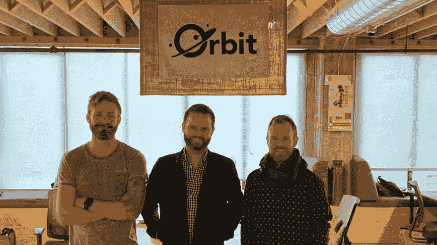
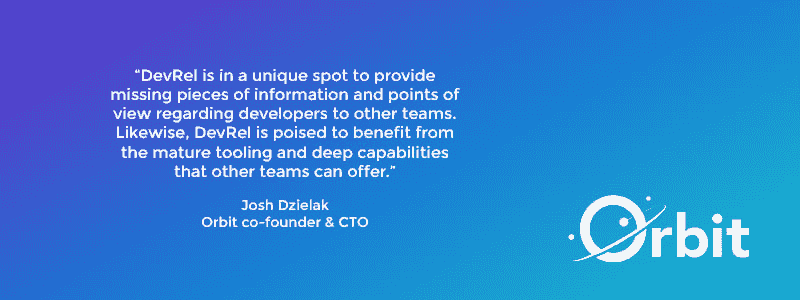
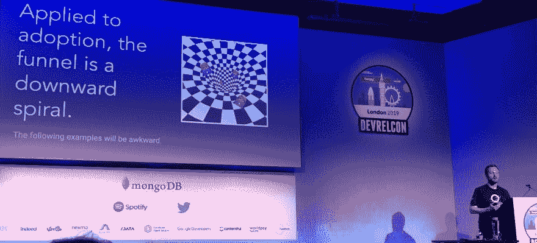

# 如何在公司内外扩大你的 DevRel 伙伴关系

> 原文：<https://www.freecodecamp.org/news/amplify-your-devrel-partnerships-inside-and-outside-your-company/>

在他们三人当中， [Orbit](https://orbit.love) 的联合创始人在工程和开发者关系方面拥有数十年的经验，在埃森哲、Algolia、苹果和 Keen.io 等公司开发产品。在推出 Orbit 后，他们花了去年的时间与 DevRel 领域的人讨论如何证明 DevRel 的价值。

一月份是高管们询问他们应该在开发商关系方面进行何种投资的常见时间，包括招聘什么人员，以及商业案例是什么。

上个月 [Orbit 加入 Heavybit】后，我和](https://www.heavybit.com/library/blog/orbit-joins-heavybit/) [Josh](https://twitter.com/dzello) 、 [Patrick、](https://twitter.com/patrickjwoods)和 [Dustin](https://twitter.com/foxinthewaves) 坐在一起谈论他们对 DevRel 的态度，从合作伙伴关系和促销到外包和度量。

## 目录

*   谈到 DevRel，公司最大的失误是什么？
*   公司应该外包 DevRel 的哪些部分？
*   你如何利用伙伴关系？
*   DevRel 如何与业务开发合作？
*   你如何平衡创作和推广？
*   你想打电话给德弗雷尔的谁？

### 问:谈到 DevRel，公司最大的失误是什么？

一个很大的错误是，在公司学会自己做一点点 DevRel 之前，试图雇佣一个开发者倡导者。在咨询业，公司会找到我们，说“我们已经准备好招聘了，我们只是需要帮助写一份工作描述和寻找候选人。”在那个时候，有时这些公司还没有发表演讲或创建面向开发者的内容。

相比之下，在一些公司，每个工程师从公司开始的时候就在做 DevRel 的某个方面，比如演讲和为项目做贡献。如果一个公司试图雇佣一个特定于 DevRel 的角色，但是没有这方面的经验，他们将很难成功。

公司和团队必须定义他们对 DevRel 的内部期望。经常会看到 DevRel 的工作描述没有重点——它可能跨越几十个关键活动！如果一个公司自己做了 DevRel，他们通常会给出一个更集中的工作描述。例如，他们是在巡回演讲中看到这个角色，还是成为内部倡导者？我们希望帮助公司避免写“无所不能”的职位描述

### 问:相对于外包，DevRel 的哪些部分公司应该保留在内部？

这取决于 DevRel 过程的哪些部分需要帮助。

一方面，你的 DevRel 人员与社区有联系——这个人应该在你的组织中生活和呼吸，并体现组织的文化。如果一家公司与外部公司签订了合同，你与他们交谈时，可能不会得到与嵌入公司文化的员工交谈时同样的体验。

如果你的拥护者与你的价值观一致，这将带来更好的开发者体验。这是合同雇佣的风险，尤其是在社区方面。我见过承包商为一家公司的开发者社区做社交媒体，但都出了问题——令人惊讶的是，为什么公司在几乎没有培训和监督的情况下做这些事情。

然而，如果你只是在内容、教程等方面工作，这可能是一个寻求外部帮助的好地方，因为组织中会有其他人审查内容，以确保它符合公司的定位和价值观。

我们在过去的一年里进行了咨询，所以我们在这方面有一些偏见，但使用外部公司来生成战略性的第三方内容可以给你带来很多优势。他们可以依靠你的内部团队来扩大内容，并将信息推向市场。我们已经和不同的公司这样做了很多次——这让公司内部的开发人员感觉像超级英雄，因为他们有很多很棒的内容可以拿出来和社区分享。

### 问:在开发者关系中，我们如何利用内部伙伴关系来增加我们的影响力和有效性？

我们认为合作伙伴关系是成功的 DevRel 战略中最有影响力的部分之一。一个单独的倡导者或 DevRel 团队在整个公司中起到力量倍增器的作用。一个工作良好的团队的内部影响在整个公司范围内倍增时是巨大的。

我们可以给出大量的例子，但是集中在几个方面:在市场营销中，DevRel 可以帮助保持品牌声音忠实于开发者个性。反过来，营销有助于 DevRel 更加数据驱动，双向推动价值。

在较大的公司中，有机会将开发人员的声音带入内部对话。你可以想象把现场的故事带到大楼的墙壁上，给公司一些关于开发者如何与你的产品互动的故事。

从历史上看，销售和营销团队与 DevRel 等社区团队之间存在某种程度的不匹配。这通常是基于漏斗的不匹配。

DevRel 可以推广测量社区影响的替代模型，而不是将人们推入漏斗并测量购买事件的标准模型。Orbit 模型可以让你改变公司对社区的看法，而不仅仅是一个标准的营销漏斗，还可以让你围绕你的社区工作创建衡量标准。

我们还看到 DevRel 和销售部门合作得很好——从历史上看，情况并非总是如此！我们已经看到，当有清晰的沟通时，他们可以非常合作和互补。

在大型组织中，看到个人开发人员参与社区是很棒的——如果一家公司的开发人员为您的项目做出贡献，这是一个强烈的信号，表明该公司可能对商业关系感兴趣。

从销售的角度来看，您可能不希望 SDR 向这些开发人员发送电子邮件，但是 SDR 希望获得有关该开发人员活动的反馈，以便他们在联系开发人员的经理时参考。当然，这需要后端的数据和工具来呈现这些信息，这也是我们看到的许多公司在 2020 年的发展方向。

我们实际上为 Heavybit 写了一整个系列，涵盖了内部协作的不同策略。

### 问:业务发展怎么样——开发者关系团队在那里合作的机会在哪里？

我很快就想到了机构合作。对于拥有以开发者为中心的平台的公司来说，BizDev 模式的一部分是与能够将平台构建到客户产品中的机构合作。Algolia 与实施所有不同电子商务和 CMS 平台的机构有关系。

与这些公司建立正式的合作关系对 BizDev 很有用，但也可以通过鼓励代理开发者参与到技术生态系统中来帮助你的 DevRel 程序。

DevRel 也可以与互补的公司和项目合作。这可以保持新鲜感，确保你没有过多地谈论你自己和你的产品——你给谈话带来了一些新鲜的声音。

### 问:对于创造新的资产，比如内容和谈话，以及推广这些资产，你的底线在哪里？你的 DevRel 预算应该 100%用于创作，100%用于宣传，还是介于两者之间？

从整体上看 DevRel，通常我们认为更多的重用是明智的。每次演讲都要写一份新的演示文稿，这在精力和精神上是非常昂贵的。

许多开发者支持者对重用材料犹豫不决，但是他们不应该这样——有数百万开发者以前没有看过你的演示。如果单口喜剧演员可以多年重复使用同一个笑话，你就不必担心在同一个城市做两次同样的演讲。

我有一个诀窍:在公司内部给工程师做报告，然后让工程师在其他地方做报告。制作您的资产和演示文稿，以便其他人可以重复使用这些资料和脚本。这是一个让组织中的其他人参与到 DevRel 工作中的好方法——三个月后，有人在台上发言，可能是第一次。

通常在你的公司里有一些工程师想要开始谈话，作为开发者的拥护者，他们每周都要做很多次，我们可以为这些工程师提供便利，也可以覆盖更多的领域。(有很多活动我想发言，但是我不能同时在两个地方。)

### 问:在 DevRel 中有没有人做得非常出色，你想突出强调一下？

*   Cloudinary 的副总裁 Doron Sherman 有一个很棒的 DevRel 项目
*   Twilio 的 Stefan Judis 因为他是数据驱动型的，所以他为自己的内容提供了一个很好的方法和仪表板，这让人印象深刻
*   [蒂姆·贝里隆德](https://twitter.com/tlberglund)和[阿勒·默里](https://www.linkedin.com/in/alemurray/)，汇合的队伍

*感谢[乔希·泽拉克](https://twitter.com/dzello)、[帕特里克·伍兹](https://twitter.com/patrickjwoods)和[达斯汀·拉里默](https://twitter.com/foxinthewaves)与我聊起他们的 DevRel 经历。*

### 后续步骤:

*   [在推特上关注轨道](https://twitter.com/orbitmodel)
*   看看[轨道模型 GitHub repo](https://github.com/orbit-love/orbit-model)
*   赶上 [Orbit 的 DevRel 博客](https://orbit.love/blog/)。