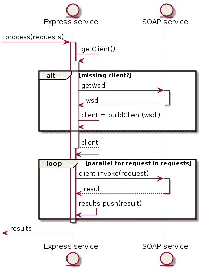

# 用不到 25 行代码实现并行 SOAP 调用的快速服务

> 原文：<https://www.freecodecamp.org/news/an-express-service-for-parallel-soap-invocation-in-under-25-lines-of-code-b7eac725702e/>

### 概观

假设有一项服务具有以下特性:

1.  它公开了一个接收请求列表的 REST 端点。
2.  它并行调用 SOAP 服务，请求列表中的每个元素调用一次。
3.  它返回从 XML 到 JSON 的转换结果。

使用 Node.js、Express 和 [Airbnb JavaScript 风格指南](https://github.com/airbnb/javascript#airbnb-javascript-style-guide-)，该服务的源代码可能如下所示:

```
'use strict';

const { soap } = require('strong-soap');
const expressApp = require('express')();
const bodyParser = require('body-parser');

const url = 'http://www.dneonline.com/calculator.asmx?WSDL';
const clientPromise = new Promise((resolve, reject) => (
    soap.createClient(url, {}, (err, client) => err ? reject(err) : resolve(client))
));

expressApp.use(bodyParser.json())
    .post('/parallel-soap-invoke', (req, res) => (clientPromise.then(client => ({ client, requests: req.body }))
        .then(invokeOperations)
        .then(results => res.status(200).send(results))
        .catch(({ message: error }) => res.status(500).send({ error }))
    ))
    .listen(3000, () => console.log('Waiting for incoming requests.'));

const invokeOperations = ({ client, requests }) => (Promise.all(requests.map(request => (
    new Promise((resolve, reject) => client.Add(request, (err, result) => (
        err ? reject(err) : resolve(result))
    ))
))));
```

样品申请:

```
POST /parallel-soap-invoke
[
  {
    "intA": 1,
    "intB": 2
  },
  {
    "intA": 3,
    "intB": 4
  },
  {
    "intA": 5,
    "intB": 6
  }
]
```

样本响应:

```
HTTP/1.1 200
[
  {
    "AddResult": 3
  },
  {
    "AddResult": 7
  },
  {
    "AddResult": 11
  }
]
```

测试表明，使用 SOAPUI 向 SOAP 服务发出一个直接请求需要大约 430 ms(从我所在的地方，智利)。发送三个请求(如上所示)需要大约 400 ms 来调用快速服务(除了第一个请求，它获取 WSDL 并构建客户端)。

为什么请求越多花费的时间越少？主要是因为 XML 没有像在常规 SOAP 中那样经过严格的验证，所以如果这种软验证不符合您的期望，您应该考虑其他特性或解决方案。

想知道使用`async/await`会是什么样子？给你(结果相同):

```
'use strict';

const { soap } = require('strong-soap');
const expressApp = require('express')();
const bodyParser = require('body-parser');

const url = 'http://www.dneonline.com/calculator.asmx?WSDL';
const clientPromise = new Promise((resolve, reject) => (
    soap.createClient(url, {}, (err, client) => err ? reject(err) : resolve(client))
));

expressApp.use(bodyParser.json())
    .post('/parallel-soap-invoke', async (req, res) => {
        try {
            res.status(200).send(await invokeOperations(await clientPromise, req.body));
        } catch ({message: error}) {
            res.status(500).send({ error });
        }
    })
    .listen(3000, () => console.log('Waiting for incoming requests.'));

const invokeOperations = (client, requests) => (Promise.all(requests.map(request => (
    new Promise((resolve, reject) => client.Add(request, (err, result) => (
        err ? reject(err) : resolve(result))
    ))
))));
```

下图提供了代码工作原理的概念:



本文旨在展示在企业环境中使用 JavaScript 执行任务的简单性，比如调用 SOAP 服务。如果你熟悉 JavaScript，这基本上只是在一个 Express 端点下的几个承诺回调之上的一个`Promise.all`。如果您认为对您有用，您可以直接进入第 4 部分(**奖金追踪**)。

如果您不在 JavaScript 领域，我认为我在开头提到的三个特性的 24 行代码是一笔非常好的交易。我现在将详细说明。

### 1.特快部分

先说 Express 相关的代码，一个极简灵活的 Node.js web 应用框架。这很简单，你可以在任何地方找到它，所以我将给出一个概括的描述。

```
'use strict';

 // Express framework.
const express = require('express');
// Creates an Express application.
const app = express();

/**
 * Creates a GET (which is defined by the method invoked on 'app') endpoint,
 * having 'parallel-soap-invoke' as entry point.
 * Each time a GET request arrives at '/parallel-soap-invoke', the function passed
 * as the second parameter from app.get will be invoked.
 * The signature is fixed: the request and response objects.
 */
app.get('/parallel-soap-invoke', (_, res) => {
    // HTTP status of the response is set first and then the result to be sent.
    res.status(200).send('Hello!');
});

// Starts 'app' and sends a message when it's ready.
app.listen(3000, () => console.log('Waiting for incoming requests.'));
```

结果:

```
GET /parallel-soap-invoke
HTTP/1.1 200
Hello!
```

现在我们需要处理一个通过 POST 发送的对象。Express `body-parser`允许轻松访问请求正文:

```
 'use strict';

const expressApp = require('express')(); // Compressing two lines into one.
const bodyParser = require('body-parser'); // Several parsers for HTTP requests.

expressApp.use(bodyParser.json()) // States that 'expressApp' will use JSON parser.
    // Since each Express method returns the updated object, methods can be chained.
    .post('/parallel-soap-invoke', (req, res) => { 
        /**
         * As an example, the same request body will be sent as response with
         * a different HTTP status code.
         */
        res.status(202).send(req.body); // req.body will have the parsed object 
    })
    .listen(3000, () => console.log('Waiting for incoming requests.'));
```

```
POST /parallel-soap-invoke
content-type: application/json

[
  {
    "intA": 1,
    "intB": 2
  },
  {
    "intA": 3,
    "intB": 4
  },
  {
    "intA": 5,
    "intB": 6
  }
]

HTTP/1.1 202

[
  {
    "intA": 1,
    "intB": 2
  },
  {
    "intA": 3,
    "intB": 4
  },
  {
    "intA": 5,
    "intB": 6
  }
] 
```

因此，长话短说:设置 Express 应用程序，一旦有了结果，就通过`res`和 voilà发送。

### 2.肥皂区

这将比前一部分多一些步骤。主要思想是，为了并行进行 SOAP 调用，我将使用`Promise.all`。在能够使用`Promise.all`中，对 SOAP 服务的调用需要在一个承诺内处理，而对于`strong-soap`来说，情况并非如此。这一节将展示如何将`strong-soap`的常规回调转换成承诺，然后在此基础上添加一个`Promise.all`。

下面的代码将使用来自`strong-soap`的[文档](https://github.com/strongloop/strong-soap#client)的最基本的例子。我将把它简化一点，使用我们看到的相同的 WSDL(我没有使用`strong-soap`文档中提到的相同的 WSDL，因为 WSDL 不再工作了):

```
'use strict';

// The SOAP client library.
var { soap } = require('strong-soap');
// WSDL we'll be using through the article.
var url = 'http://www.dneonline.com/calculator.asmx?WSDL';

// Hardcoded request
var requestArgs = {
    "intA": 1,
    "intB": 2,
};

// Creates the client which is returned in the callback.
soap.createClient(url, {}, (_, client) => (
    // Callback delivers the result of the SOAP invokation.
    client.Add(requestArgs, (_, result) => (
        console.log(`Result: ${"\n" + JSON.stringify(result)}`)
    ))
));
```

```
$ node index.js
Result:
{"AddResult":3}
```

为了这个例子，我将把它转换成承诺，我将一个接一个地经历所有的回调。这样，翻译过程对您来说就一目了然了:

```
'use strict';

var { soap } = require('strong-soap');
var url = 'http://www.dneonline.com/calculator.asmx?WSDL';

var requestArgs = {
    "intA": 1,
    "intB": 2,
};

/**
 * A function that will return a Promise which will return the SOAP client.
 * The Promise receives as parameter a function having two functions as parameters:
 * resolve & reject.
 * So, as soon as you got a result, call resolve with the result,
 * or call reject with some error otherwise.
 */
const createClient = () => (new Promise((resolve, reject) => (
    // Same call as before, but I'm naming the error parameter since I'll use it.
    soap.createClient(url, {}, (err, client) => (
        /**
         * Did any error happen? Let's call reject and send the error.
         * No? OK, let's call resolve sending the result. 
         */
        err ? reject(err) : resolve(client)
    ))))
);

/**
 * The above function is invoked.
 * The Promise could have been inlined here, but it's more understandable this way.
 */
createClient().then(
    /**
     * If at runtime resolve is invoked, the value sent through resolve
     * will be passed as parameter for this function.
     */
    client => (client.Add(requestArgs, (_, result) => (
        console.log(`Result: ${"\n" + JSON.stringify(result)}`)
    ))),
    // Same as above, but in this case reject was called at runtime.
    err => console.log(err),
);
```

调用`node index.js`得到和以前一样的结果。下次回拨:

```
'use strict';

var { soap } = require('strong-soap');
var url = 'http://www.dneonline.com/calculator.asmx?WSDL';

var requestArgs = {
    "intA": 1,
    "intB": 2,
};

const createClient = () => (new Promise((resolve, reject) => (
    soap.createClient(url, {}, (err, client) => (
        err ? reject(err) : resolve(client)
    ))))
);

/**
 * Same as before: do everything you need to do; once you have a result,
 * resolve it, or reject some error otherwise.
 * invokeOperation will replace the first function of .then from the former example,
 * so the signatures must match.
 */
const invokeOperation = client => (new Promise((resolve, reject) => (
    client.Add(requestArgs, (err, result) => (
        err ? reject(err) : resolve(result)
    ))
)));

/**
 * .then also returns a Promise, having as result the value resolved or rejected
 * by the functions that were passed as parameters to it. In this case, the second .then
 * will receive the value resolved/rejected by invokeOperation.
 */
createClient().then(
    invokeOperation,
    err => console.log(err),
).then(
    result => console.log(`Result: ${"\n" + JSON.stringify(result)}`),
    err => console.log(err),
);
```

`node index.js`？还是老样子。让我们将这些承诺包装在一个函数中，以便准备在 Express 端点内部调用它的代码。它还稍微简化了错误处理:

```
'use strict';

var { soap } = require('strong-soap');
var url = 'http://www.dneonline.com/calculator.asmx?WSDL';

var requestArgs = {
    "intA": 1,
    "intB": 2,
};

const createClient = () => (new Promise((resolve, reject) => (
    soap.createClient(url, {}, (err, client) => (
        err ? reject(err) : resolve(client)
    ))))
);

const invokeOperation = client => (new Promise((resolve, reject) => (
    client.Add(requestArgs, (err, result) => (
        err ? reject(err) : resolve(result)
    ))
)));

const processRequest = () => createClient().then(invokeOperation);

/**
 * .catch() will handle any reject not handled by a .then. In this case,
 * it will handle any reject called by createClient or invokeOperation.
 */
processRequest().then(result => console.log(`Result: ${"\n" + JSON.stringify(result)}`))
    .catch(({ message }) => console.log(message));
```

我打赌你能猜到`node index.js`的结果。

如果后续打了几个电话会怎么样？我们将通过下面的代码来找出答案:

```
'use strict';

var { soap } = require('strong-soap');
var url = 'http://www.dneonline.com/calculator.asmx?WSDL';

var requestArgs = {
    "intA": 1,
    "intB": 2,
};

const createClient = () => (new Promise((resolve, reject) => (
    soap.createClient(url, {}, (err, client) => {
        if (err) {
            reject(err);
        } else {
            // A message is displayed each time a client is created.
            console.log('A new client is being created.');
            resolve(client);
        }
    })))
);

const invokeOperation = client => (new Promise((resolve, reject) => (
    client.Add(requestArgs, (err, result) => (
        err ? reject(err) : resolve(result)
    ))
)));

const processRequest = () => createClient().then(invokeOperation)

processRequest().then(result => console.log(`Result: ${"\n" + JSON.stringify(result)}`))
    .catch(({ message }) => console.log(message));
processRequest().then(result => console.log(`Result: ${"\n" + JSON.stringify(result)}`))
    .catch(({ message }) => console.log(message));
processRequest().then(result => console.log(`Result: ${"\n" + JSON.stringify(result)}`))
    .catch(({ message }) => console.log(message));
```

```
$ node index.js
A new client is being created.
A new client is being created.
Result:
{"AddResult":3}
A new client is being created.
Result:
{"AddResult":3}
Result:
{"AddResult":3}
```

不好，因为正在创建几个客户端。理想情况下，客户端应该被缓存和重用。实现这一点有两种主要方法:

1.  您可以在承诺之外创建一个变量，并在获得该变量后立即缓存客户端(就在解析它之前)。姑且称之为`cachedClient`。但是，在这种情况下，您必须手动处理从第一次调用到解析第一个客户端之间对`createClient()`的调用。您必须检查`cachedClient`是否是预期值，或者您必须检查承诺是否被解决，或者您必须放置某种事件发射器来知道`cachedClient`何时准备好。我第一次为此写代码时，我使用了这种方法，最终我接受了这样一个事实:在第一个`createClient().resolve`覆盖了`cachedClient`之前的每一个调用。如果问题不是那么清楚，让我知道，我会写代码和例子。
2.  承诺有一个非常酷的特性([参见 MDN 文档，“返回值”一节](https://developer.mozilla.org/en-US/docs/Web/JavaScript/Reference/Global_Objects/Promise/then)):如果你在一个被解决/拒绝的承诺上调用`.then()`，它将返回与被解决/拒绝完全相同的值，而不需要再次处理。事实上，从技术上讲，这将是完全相同的对象引用。

第二种方法实现起来简单得多，因此相关代码如下:

```
'use strict';

var { soap } = require('strong-soap');
var url = 'http://www.dneonline.com/calculator.asmx?WSDL';

var requestArgs = {
    "intA": 1,
    "intB": 2,
};

// createClient function is removed.
const clientPromise = (new Promise((resolve, reject) => (
    soap.createClient(url, {}, (err, client) => {
        if (err) {
            reject(err);
        } else {
            console.log('A new client is being created.');
            resolve(client);
        }
    })))
);

const invokeOperation = client => (new Promise((resolve, reject) => (
    client.Add(requestArgs, (err, result) => (
        err ? reject(err) : resolve(result)
    ))
)));

// clientPromise is called instead getClient().
clientPromise.then(invokeOperation)
    .then(result => console.log(`Result: ${"\n" + JSON.stringify(result)}`))
    .catch(({ message }) => console.log(message));
clientPromise.then(invokeOperation)
    .then(result => console.log(`Result: ${"\n" + JSON.stringify(result)}`))
    .catch(({ message }) => console.log(message));
clientPromise.then(invokeOperation)
    .then(result => console.log(`Result: ${"\n" + JSON.stringify(result)}`))
    .catch(({ message }) => console.log(message));
```

```
$ node index.js
A new client is being created.
Result:
{"AddResult":3}
Result:
{"AddResult":3}
Result:
{"AddResult":3}
```

最后，对于这一部分，让代码处理几个并行调用。这很容易做到:

1.  为了处理几个并行调用，我们需要`Promise.all`。
2.  只有一个参数:一组承诺。所以我们将把请求列表转换成承诺列表。代码目前将单个请求转换成单个承诺(`invokeOperation`)，因此代码只需要一个`.map`来实现这一点。

```
'use strict';

var { soap } = require('strong-soap');
var url = 'http://www.dneonline.com/calculator.asmx?WSDL';

// Hardcoded list of requests.
var requestsArgs = [
    {
        "intA": 1,
        "intB": 2,
    },
    {
        "intA": 3,
        "intB": 4,
    },
    {
        "intA": 5,
        "intB": 6,
    },
];

const clientPromise = (new Promise((resolve, reject) => (
    soap.createClient(url, {}, (err, client) => err ? reject(error) : resolve(client))
)));

// Promise.all on top of everything.
const invokeOperation = client => (Promise.all(
    // For each request, a Promise is returned.
    requestsArgs.map(requestArgs => new Promise((resolve, reject) => (
        // Everything remains the same here.
        client.Add(requestArgs, (err, result) => (
            err ? reject(err) : resolve(result)
        ))
    )))
));

clientPromise.then(invokeOperation)
    .then(result => console.log(`Result: ${"\n" + JSON.stringify(result)}`))
    .catch(({ message }) => console.log(message));
```

```
$ node index.js
Result:
[{"AddResult":3},{"AddResult":7},{"AddResult":11}]
```

### 3.把所有的放在一起

这相当简单——它只是将前面每个部分的最后一段代码组装起来:

```
'use strict';

const { soap } = require('strong-soap');
const expressApp = require('express')();
const bodyParser = require('body-parser');

const url = 'http://www.dneonline.com/calculator.asmx?WSDL';
const clientPromise = new Promise((resolve, reject) => (
    soap.createClient(url, {}, (err, client) => err ? reject(err) : resolve(client))
));

expressApp.use(bodyParser.json())
    .post('/parallel-soap-invoke', (req, res) => (clientPromise.then(invokeOperations)
        .then(results => res.status(200).send(results))
        .catch(({ message: error }) => res.status(500).send({ error }))
    ))
    .listen(3000, () => console.log('Waiting for incoming requests.'));

// Adding req.body instead of hardcoded requests.
const invokeOperations = client => Promise.all(req.body.map(request => (
    new Promise((resolve, reject) => client.Add(request, (err, result) => (
        err ? reject(err) : resolve(result))
    ))
)));
```

```
POST /parallel-soap-invoke

[
  {
    "intA": 1,
    "intB": 2
  },
  {
    "intA": 3,
    "intB": 4
  },
  {
    "intA": 5,
    "intB": 6
  }
]

HTTP/1.1 500

{
  "error": "req is not defined"
}
```

嗯……不是一个好结果，因为我根本没想到会出错。问题是`invokeOperations`的作用域里没有`req`。第一个想法可能是“把它加到签名上。”但是这是不可能的，因为那个签名与之前承诺的结果相匹配，而那个承诺不返回`req`，它只返回`client`。但是，如果我们添加一个中间承诺，它的唯一目的是注入这个价值呢？

```
'use strict';

const { soap } = require('strong-soap');
const expressApp = require('express')();
const bodyParser = require('body-parser');

const url = 'http://www.dneonline.com/calculator.asmx?WSDL';
const clientPromise = new Promise((resolve, reject) => (
    soap.createClient(url, {}, (err, client) => err ? reject(err) : resolve(client))
));

expressApp.use(bodyParser.json())
    .post('/parallel-soap-invoke', (req, res) => (
        /**
         * After clientPromise.then, where client is received, a new Promise is
         * created, and that Promise will resolve an object having two properties:
         * client and requests.
         */
        clientPromise.then(client => ({ client, requests: req.body }))
            .then(invokeOperations)
            .then(results => res.status(200).send(results))
            .catch(({ message: error }) => res.status(500).send({ error }))
    ))
    .listen(3000, () => console.log('Waiting for incoming requests.'));

/**
 * Since the shape of the object passed to invokeOperations changed, the signature has
 * to change to reflect the shape of the new object.
 */
const invokeOperations = ({ client, requests }) => Promise.all(requests.map(request => (
    new Promise((resolve, reject) => client.Add(request, (err, result) => (
        err ? reject(err) : resolve(result))
    ))
)));
```

结果和总结会上的一模一样。

### 4.附赠曲目

用于并行 SOAP 调用的通用 SOAP 到 JSON 转换器。根据您在前面几节中看到的内容，代码是熟悉的。怎么样？

```
'use strict';

const { soap } = require('strong-soap');
const expressApp = require('express')();
const bodyParser = require('body-parser');

const clientPromises = new Map();

expressApp.use(bodyParser.json())
    .post('/parallel-soap-invoke', ({ body: { wsdlUrl, operation, requests } }, res) => (
        getClient(wsdlUrl).then(client => ({ client, operation, requests }))
            .then(invokeOperations)
            .then(results => res.status(200).send(results))
            .catch(({ message: error }) => res.status(500).send({ error }))
    ))
    .listen(3000, () => console.log('Waiting for incoming requests.'));

const getClient = wsdlUrl => clientPromises.get(wsdlUrl)
    || (clientPromises.set(wsdlUrl, new Promise((resolve, reject) => (
        soap.createClient(wsdlUrl, {}, (err, client) => err ? reject(err) : resolve(client))
    ))).get(wsdlUrl));

const invokeOperations = ({ client, operation, requests }) => (Promise.all(requests.map(request => (
    new Promise((resolve, reject) => client[operation](request, (err, result) => (
        err ? reject(err) : resolve(result))
    ))
))));
```

首次使用示例:

```
POST /parallel-soap-invoke
content-type: application/json

{
  "wsdlUrl": "http://www.dneonline.com/calculator.asmx?WSDL",
  "operation": "Add",
  "requests": [
    {
      "intA": 1,
      "intB": 2
    },
    {
      "intA": 3,
      "intB": 4
    },
    {
      "intA": 5,
      "intB": 6
    }
  ]
}

HTTP/1.1 200

[
  {
    "AddResult": 3
  },
  {
    "AddResult": 7
  },
  {
    "AddResult": 11
  }
] 
```

第二个使用示例:

```
POST /parallel-soap-invoke
content-type: application/json

{
  "wsdlUrl": "http://ws.cdyne.com/ip2geo/ip2geo.asmx?wsdl",
  "operation": "ResolveIP",
  "requests": [
    {
      "ipAddress": "8.8.8.8",
      "licenseKey": ""
    },
    {
    	"ipAddress": "8.8.4.4",
    	"licenseKey": ""
    }
  ]
}

HTTP/1.1 200

[
  {
    "ResolveIPResult": {
      "Country": "United States",
      "Latitude": 37.75101,
      "Longitude": -97.822,
      "AreaCode": "0",
      "HasDaylightSavings": false,
      "Certainty": 90,
      "CountryCode": "US"
    }
  },
  {
    "ResolveIPResult": {
      "Country": "United States",
      "Latitude": 37.75101,
      "Longitude": -97.822,
      "AreaCode": "0",
      "HasDaylightSavings": false,
      "Certainty": 90,
      "CountryCode": "US"
    }
  }
]
```

你正在经历[数字解耦](https://www.accenture.com/t00010101T000000__w__/nz-en/_acnmedia/Accenture/Conversion-Assets/DotCom/Documents/Global/PDF/Digital_2/Accenture-Digital-Decoupling.pdf)？在旧服务之上的 JavaScript 全栈架构中，这个构件可以帮助您封装所有 SOAP 服务，扩展它们，并且只暴露 JSON。您甚至可以稍微修改一下这段代码，以便同时调用几个不同的 SOAP 服务(正如我现在看到的，这应该只是一个额外的`.map`和`.reduce`)。或者，您可以将企业的 WSDLs 封装在数据库中，并基于代码或某种标识符来调用它们。这只是对连锁企业的一两个额外承诺。