# 对 SQOOP 架构的深入介绍

> 原文：<https://www.freecodecamp.org/news/an-in-depth-introduction-to-sqoop-architecture-ad4ae0532583/>

作者 Jayvardhan Reddy

# 对 SQOOP 架构的深入介绍

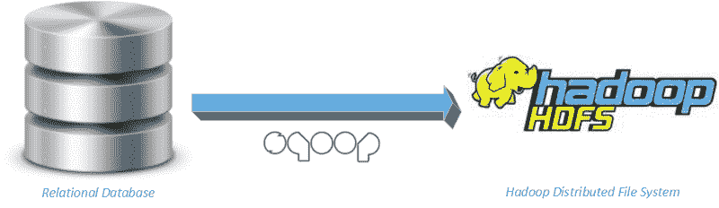

Image Credits: [hadoopsters.net](https://hadoopsters.net/2015/09/27/pulling-data-from-teradata-to-hadoop-with-apache-sqoop/)

**Apache Sqoop** 是一个数据摄取工具，旨在高效地在 Apache Hadoop 和结构化数据存储(如关系数据库)之间传输批量数据，反之亦然。

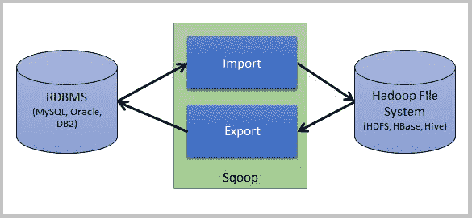

Image Credits: [hdfstutorial.com](https://www.hdfstutorial.com/sqoop-architecture/)

作为这个博客的一部分，我将解释这个架构如何执行一个 Sqoop 命令。我将介绍一些细节，比如通过 Codegen 生成 jar、执行 MapReduce 作业，以及运行 Sqoop 导入/导出命令所涉及的各个阶段。

### **Codegen**

理解 Codegen 是必不可少的，因为在内部这将我们的 Sqoop 作业转换成一个 jar，它由几个 Java 类组成，如 POJO、ORM 和一个实现 DBWritable 的类，扩展 SqoopRecord 以从关系数据库读取和写入数据到 Hadoop，反之亦然。

您可以显式地创建一个 Codegen，如下所示，以检查作为 jar 的一部分出现的类。

```
sqoop codegen \   -- connect jdbc:mysql://ms.jayReddy.com:3306/retail_db \   -- username retail_user \   -- password ******* \   -- table products
```

输出 jar 将被写入您的本地文件系统。你将得到一个 Jar 文件，Java 文件和编译成。类文件:

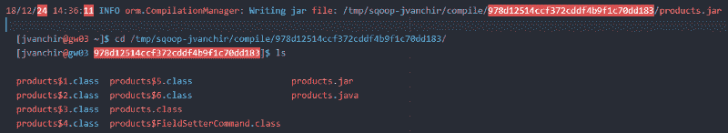

让我们看看将要生成的代码片段。

为映射生成的表“产品”//对象关系模式的 ORM 类:

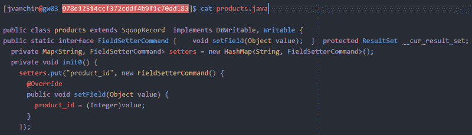

获取值的 Setter 和 Getter 方法:

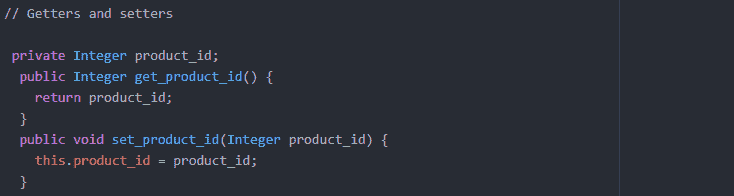

在内部，它使用 JDBC 准备好的语句写入 Hadoop，并使用 ResultSet 从 Hadoop 读取数据。

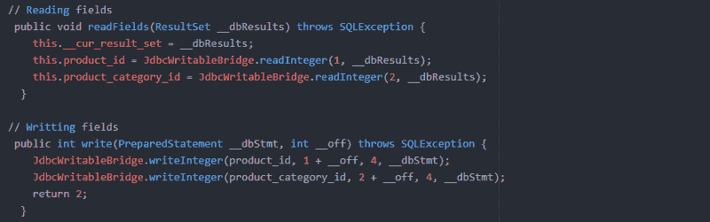

### **Sqoop 导入**

它用于将数据从传统的关系数据库导入 Hadoop。

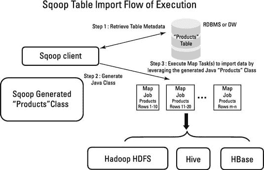

Image Credits: [dummies.com](https://www.dummies.com/programming/big-data/hadoop/hadoop-for-dummies-cheat-sheet/)

让我们来看一个样本片段。

```
sqoop import \   -- connect jdbc:mysql://ms.jayReddy.com:3306/retail_db \   -- username retail_user \   -- password ******* \   -- table products \   -- warehouse-dir /user/jvanchir/sqoop_prac/import_table_dir \   -- delete-target-dir
```

在执行 sqoop 的过程中，内部会执行以下步骤。

**步骤 1** :以流的方式从 MySQL 中读取数据。在将数据写入 HDFS 之前，它会执行各种操作。


作为这个过程的一部分，它将首先生成代码(典型的 Map reduce 代码),这只是 Java 代码。使用这个 Java 代码，它将尝试导入。

*   生成代码。(Hadoop MR)
*   编译代码并生成 Jar 文件。
*   提交 Jar 文件并执行导入操作

在导入过程中，it 必须决定如何将数据划分到多个线程中，以便可以扩展 Sqoop 导入。

**第二步**:理解数据的结构，进行编码

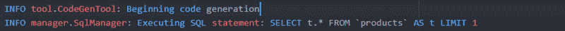

使用上面的 SQL 语句，它将获取一条记录以及列名。使用这些信息，它将提取列、数据类型等的元数据信息。

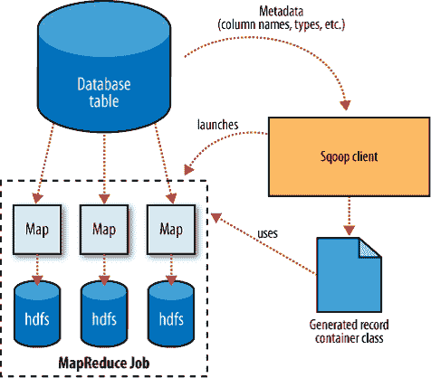

Image Credits: [cs.tut.fi](http://www.cs.tut.fi/~aaltone3/kurssit/hadoop/Sqoop_pdf.pdf)

**第三步**:创建 java 文件，编译并生成 jar 文件

作为代码生成的一部分，它需要理解数据的结构，并且必须在内部对传入的数据应用该对象，以确保数据被正确地复制到目标数据库中。每个唯一的表都有一个 Java 文件来描述数据的结构。

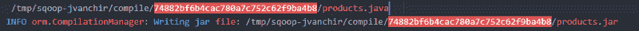

这个 jar 文件将被注入到 Sqoop 二进制文件中，以将该结构应用于传入的数据。

**第四步**:如果目标目录已经存在，删除目标目录。


**第五步**:导入数据

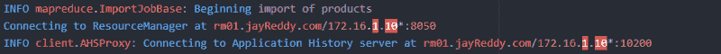

在这里，它连接到资源管理器，获取资源，并启动应用程序主机。


为了在 map 任务中执行数据的平均分配，它在内部执行一个基于默认主键
的边界查询，以找到表中记录的最小和最大计数。
根据最大计数，它将除以映射器的数量，并在每个映射器之间分配。


默认情况下，它使用 4 个映射器:

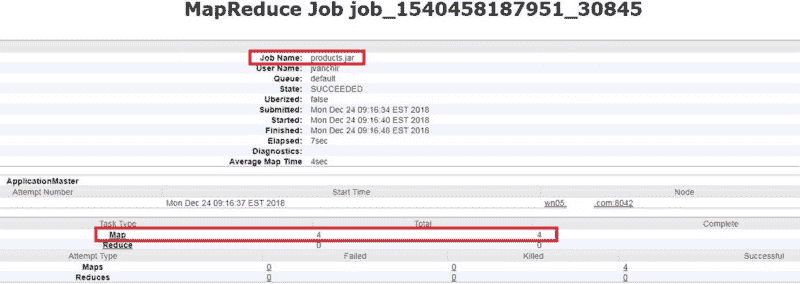

它在不同的执行器上执行这些作业，如下所示:

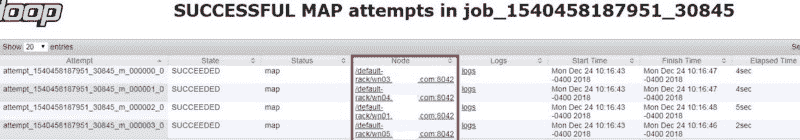

可以通过设置以下参数来更改默认的映射器数量:


在我们的例子中，它使用了 4 个线程。每个线程处理互斥的子集，即每个线程处理不同于其他线程的数据。

要查看不同的值，请查看以下内容:

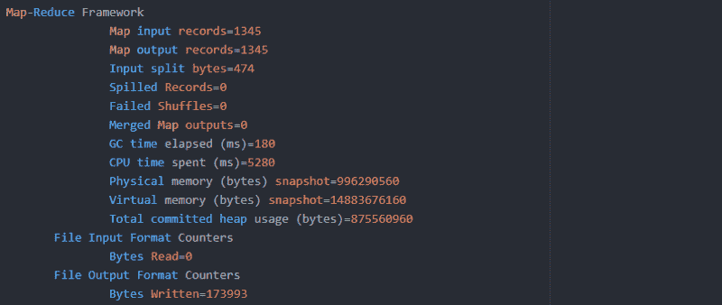

每个执行器节点下正在执行的操作:

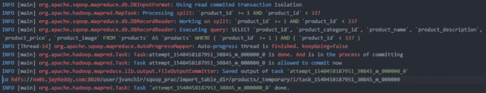

如果您执行 Sqooop 配置单元导入，作为执行的一部分会发生一个额外的步骤。

**第六步**:将数据复制到 hive 表

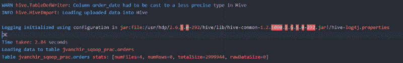

### **Sqoop 出口**

这用于将数据从 Hadoop 导出到传统的关系数据库中。


Image Credits: [slideshare.net](https://www.slideshare.net/gharriso/from-oracle-to-hadoop-with-sqoop-and-other-tools)

让我们来看一个样本片段:

```
sqoop export \  -- connect jdbc:mysql://ms.jayReddy.com:3306/retail_export \  -- username retail_user \  -- password ******* \  -- table product_sqoop_exp \  -- export-dir /user/jvanchir/sqoop_prac/import_table_dir/products
```

在执行上面的命令时，会执行类似于 Sqoop import 的执行步骤(1–4 ),但是源数据是从文件系统(除了 HDFS 什么也不是)中读取的。这里，它将根据数据块大小使用边界来划分数据，这在内部由 Sqoop 负责。

处理拆分如下所示:

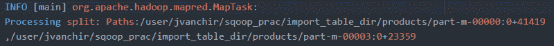

在连接到记录要导出到的相应数据库后，它将发出一个 JDBC 插入命令，从 HDFS 读取数据，并将其存储到数据库中，如下所示。

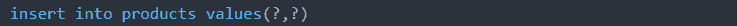

现在我们已经看到了 Sqoop 的内部工作方式，您可以确定从 jar 生成到提交 Sqoop 作业时执行 MapReduce 任务的执行流程。

**注意 *:*** 与这篇文章相关的被执行的命令被添加为我的 [GIT](https://github.com/Jayvardhan-Reddy/BigData-Ecosystem-Architecture) 账户的一部分。

同样，您也可以在此阅读更多内容:

*   [蜂巢架构深度](https://medium.com/plumbersofdatascience/hive-architecture-in-depth-ba44e8946cbc)带**代号**。
*   [HDFS 建筑深度](https://medium.com/plumbersofdatascience/hdfs-architecture-in-depth-1edb822b95fa)与**代号**。

如果你也愿意，你可以在 LinkedIn-[Jayvardhan Reddy](https://www.linkedin.com/in/jayvardhan-reddy-vanchireddy)上与我联系。

如果你喜欢读这篇文章，你可以点击拍手，让别人知道它。如果你想让我补充什么，请随时回复？