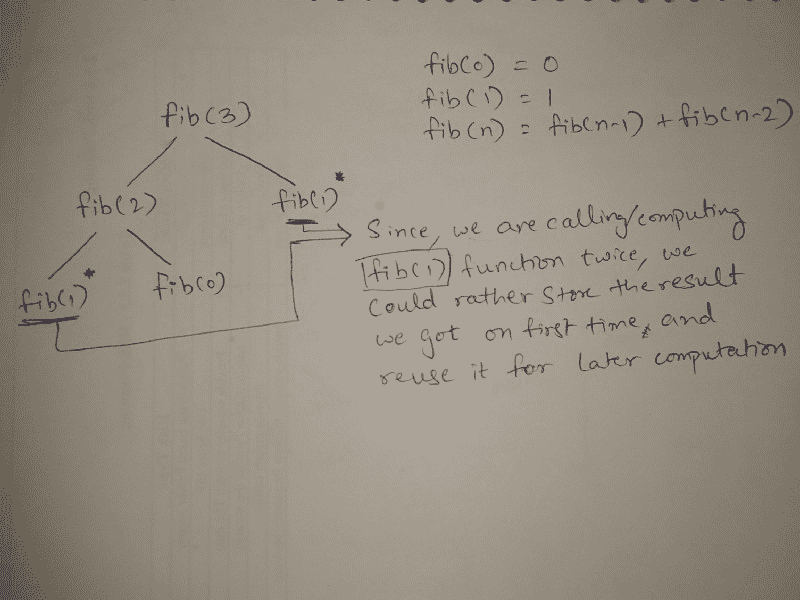
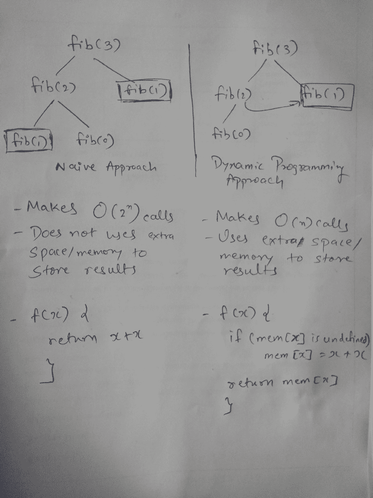
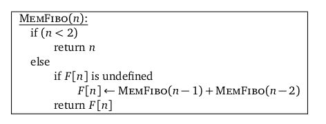
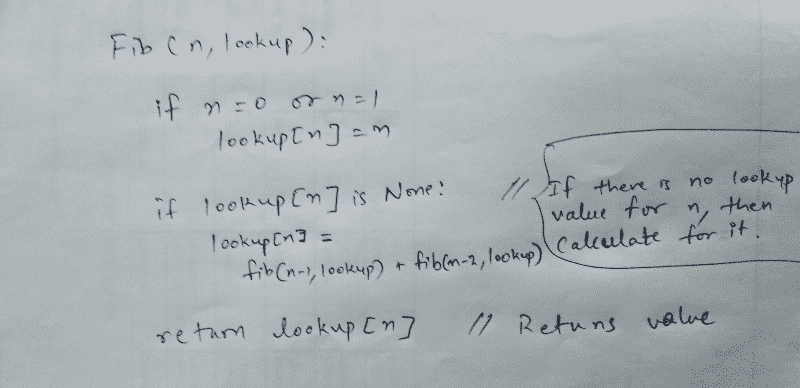
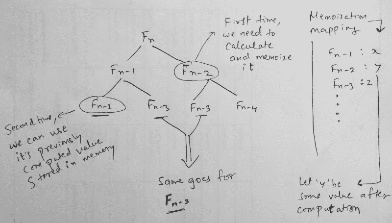
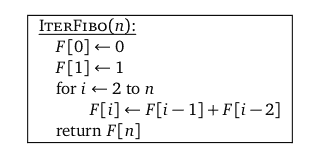
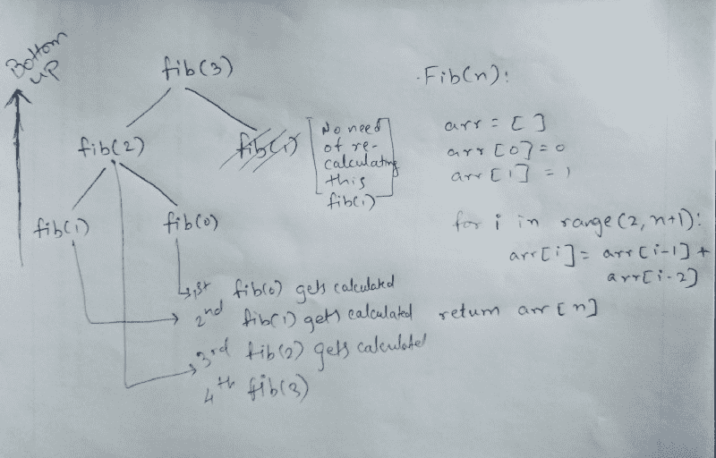
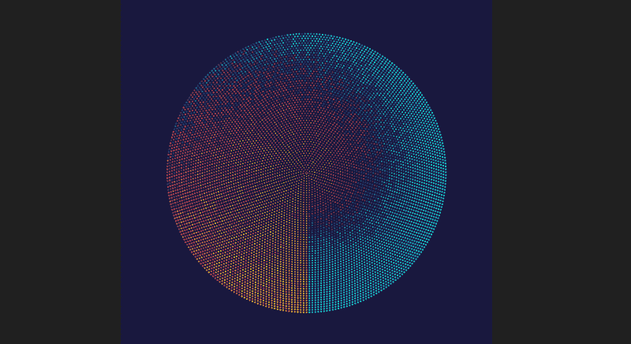

# 算法导论:动态编程

> 原文：<https://www.freecodecamp.org/news/an-intro-to-algorithms-dynamic-programming-dd00873362bb/>

通过会见扎维里

# 算法导论(第二部分):动态编程

Photo by [Helloquence](https://unsplash.com/photos/5fNmWej4tAA?utm_source=unsplash&utm_medium=referral&utm_content=creditCopyText) on [Unsplash](https://unsplash.com/search/photos/math?utm_source=unsplash&utm_medium=referral&utm_content=creditCopyText)

假设您正在使用一系列适当的输入进行一些计算。在每一个实例中都要进行一些计算来得出一些结果。当你提供了**相同的输入**时，你不知道你遇到了**相同的输出**。因此，这就像是您在对一个结果进行重新计算，而这个结果之前是通过特定的输入为其各自的输出实现的。

但是这里的问题是什么呢？问题是你的宝贵时间被浪费了。通过保存映射先前计算结果的记录，可以很容易地解决这个问题。例如使用适当的数据结构。例如，您可以将输入存储为键，将输出存储为值(映射的一部分)。

> 那些不记得过去的人注定要重蹈覆辙。~动态编程

现在通过分析这个问题，如果它是新的(或者不在数据结构中),就把它的输入和它各自的输出存储起来。否则检查输入键并从其值中获得结果输出。这样，当您进行一些计算并检查该输入是否存在于该数据结构中时，您可以直接获得结果。因此，我们可以将这种方法与动态编程技术联系起来。

### 深入动态编程

简而言之，我们可以说动态编程主要用于优化问题，我们希望找到做某事的“最佳”方式。

某个场景就像有重复出现的子问题，这些子问题又有它们自己更小的子问题。动态编程建议每个更小的子问题只解决一次，而不是一次又一次地试图解决那些重复出现的子问题。然后，您将结果记录在一个表格中，从中可以获得原始问题的解决方案。

例如，[斐波那契数列](http://www.maths.surrey.ac.uk/hosted-sites/R.Knott/Fibonacci/fib.html) `0,1,1,2,3,5,8,13,…`有一个简单的描述，其中每一项都与之前的两项相关。如果`F(n)`是这个系列的第`n`个术语，那么我们有`F(n) = F(n-1) + F(n-2)`。这被称为**递归公式**或**递归关系。为了计算后面的项，需要计算前面的项。**

大多数动态规划问题可以分为两种类型:

1.  **优化问题。**
2.  **组合问题。**

最优化问题要求你选择一个可行的解决方案，使所需函数值最小或最大。组合问题期望你计算出做某事的方法的数量或者某个事件发生的概率。

### 解决方法:自顶向下还是自底向上

有以下两种主要的不同方法来解决这个问题:

自上而下:你从顶层开始，通过分解来解决问题。如果你看到问题已经解决了，那么只需返回保存的答案。这就是所谓的 ***记忆化。***

**自下而上:**你直接开始解决较小的子问题，然后一路向上，得到那个大问题的最终解决方案。在这个过程中，保证在解决问题之前先解决子问题。这可以叫做 ***制表*** ( **填表算法**)。

关于迭代和递归，自底向上使用迭代，自顶向下使用递归。

The visualization displayed in the image is not correct acc. to theoretical knowledge, but I have displayed in an understandable manner

这里有一个简单方法和动态规划方法之间的比较。你可以从两者的时间复杂度看出区别。

### 记忆:不要忘记

[杰夫·埃里克森](http://jeffe.cs.illinois.edu/)在他的笔记中描述了斐波那契数列:

> 递归算法速度慢的明显原因是它一遍又一遍地计算相同的斐波纳契数。

From Jeff Erickson’s notes CC: [http://jeffe.cs.illinois.edu/](http://jeffe.cs.illinois.edu/)

我们可以通过写下递归调用的结果来大大加快递归算法的速度。如果以后需要的话，我们可以再去查一下。

**记忆化**指的是缓存和重用先前计算结果的技术。

如果您使用记忆化来解决问题，您可以通过维护一个已经解决的子问题的映射来实现(就像我们之前讨论的键和值的映射一样)。你做的是“**自上而下**”，也就是说你首先解决“顶层”问题(它通常向下递归以解决子问题)。

**用于记忆的伪代码**:

所以使用递归，我们用额外的内存开销(即这里的查找)来存储结果。如果在 lookup 中存储了一个值，我们就直接返回它，或者将它添加到 lookup 中以查找特定的索引。

记住，相对于列表法，有一个额外开销的权衡。

然而，如果你想要更多的记忆可视化，那么我建议看一下这个视频。

In a top-down manner.

### 制表:以表格形式填写

但是，一旦我们看到数组(记忆化的解决方案)是如何填充的，我们就可以用一个简单的循环来替换递归，这个循环有意地按顺序填充数组，而不是依赖复杂的递归来“意外地”为我们完成。

From Jeff Erickson’s notes CC: [http://jeffe.cs.illinois.edu/](http://jeffe.cs.illinois.edu/)

制表以**“自下而上”**的方式进行。它更直接，它计算所有的值。它需要更少的开销，因为它不必维护映射，并以表格形式存储每个值的数据。它也可能计算不必要的值。如果你只想计算问题的所有值，可以使用这个方法。

**制表伪代码:**

Pseudocode with Fibonacci tree

正如你在图像中看到的伪代码(右侧)，它进行迭代(即循环到数组的末尾)。它简单地从 fib(0)，fib(1)，fib(2)…开始，所以使用制表方法，我们可以消除对递归的需要，只需通过循环元素返回结果。

### 回顾历史

理查德·贝尔曼是这个概念背后的人。他在 20 世纪 50 年代中期为兰德公司工作时提出了这个想法。他选择“动态编程”这个名字的原因是为了隐藏他为这项研究所做的数学工作。他担心他的老板会反对或不喜欢任何种类的数学研究。

好吧，所以“编程”这个词只是一个参考，以澄清这是一种老式的计划或调度方式，通常是通过在一段时间内填写表格(以动态方式而不是线性方式)，而不是一次完成。

#### 包扎

就是这样。这是我去年开始的算法系列的第 2 部分。在我的[上一篇文章](https://codeburst.io/algorithms-i-searching-and-sorting-algorithms-56497dbaef20)中，我们讨论了什么是搜索和排序算法。抱歉，我不能在更短的时间内交付这个。但我愿意在未来几个月加快速度。

希望你喜欢它，我会很快在系列中添加第三个。编码快乐！

资源:

[**动态编程入门 1 教程&备注|算法| hackere earth**](https://www.hackerearth.com/practice/algorithms/dynamic-programming)
[*上图说了很多关于动态编程的内容。所以，重复你已经拥有的东西……*www.hackerearth.com](https://www.hackerearth.com/practice/algorithms/dynamic-programming)[**社区—竞技编程—竞技编程教程—动态编程:来自……**](https://www.topcoder.com/community/competitive-programming/tutorials/dynamic-programming-from-novice-to-advanced/)
[*社区—竞技编程—竞技编程教程—动态编程:从新手到高级*www.topcoder.com](https://www.topcoder.com/community/competitive-programming/tutorials/dynamic-programming-from-novice-to-advanced/)

[https://www . geeks forgeeks . org/overlapping-sub problems-property-in-dynamic-programming-DP-1/](https://www.geeksforgeeks.org/overlapping-subproblems-property-in-dynamic-programming-dp-1/)

特别感谢杰夫·埃里克森和他的算法笔记—[http://jeffe.cs.illinois.edu/](http://jeffe.cs.illinois.edu/)

