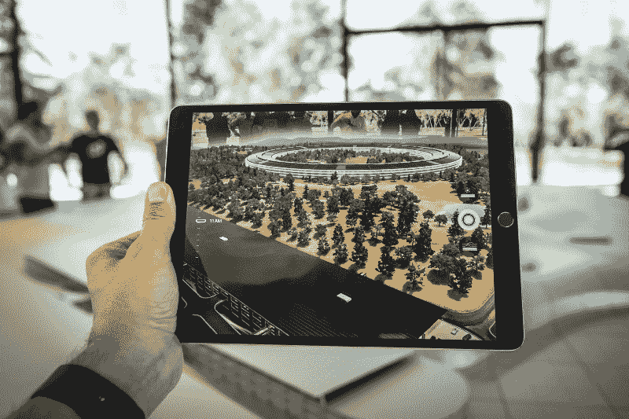
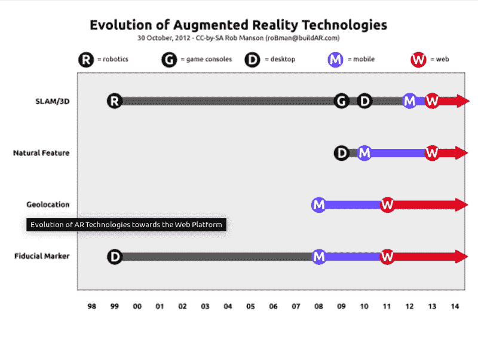

# 如果你是一名 JavaScript 开发人员，为什么你应该做增强现实——以及如何开始

> 原文：<https://www.freecodecamp.org/news/an-intro-to-augmented-reality-for-the-javascript-developer-with-an-example-71875ab184ee/>

埃瓦里斯托·卡拉巴略

# 如果你是一名 JavaScript 开发人员，为什么你应该做增强现实——以及如何开始

Photo by [Patrick Schneider](https://unsplash.com/photos/87oz2SoV9Ug?utm_source=unsplash&utm_medium=referral&utm_content=creditCopyText) on [Unsplash](https://unsplash.com/search/photos/augmented-reality?utm_source=unsplash&utm_medium=referral&utm_content=creditCopyText)

如果你是一名 JavaScript 程序员，仍然没有为 2019 年制定一份明确的决议清单，让我帮你一把:开始想办法进入增强现实(AR)。

自 2016 年以来，增强/混合/虚拟现实(AR/MR/VR)组合一直在疯狂增长，从超过 60 亿美元的边际市值到 2022 年可能达到 2100 亿美元的销售额(包括硬件)。在所有公司中，[增强现实](https://www.telecompetitor.com/ar-vr-forecast-bad-quarter-good-future/)是稳步增长的公司。

起初，一个想要进入 AR 之舟的 JavaScript (web)开发者可能会在发现[通常所需的技能](https://blog.pusher.com/how-you-can-become-an-ar-vr-developer/)时感到气馁；然后就是谁问[机器学习](https://medium.freecodecamp.org/8-ways-ai-makes-virtual-augmented-reality-even-more-real-25037707cfa1)或者物联网。然而，如果你主要是一名 JavaScript 开发人员，那么你应该感到幸运:这种语言被[反复提到](https://www.quora.com/What-programming-language-is-used-to-create-virtual-reality-experiences-and-programs)是进入这个领域你应该知道的一门语言。原因？现在很多增强现实的开发都在网上进行。这是 JavaScript 的天下。

Mobile and Web were the last getting AR capabilities, and are still developing (extract from a [buildAR presentation](https://www.slideshare.net/robman/web-standards-adoption-in-the-ar-market/6))

### 为 JavaScript 爱好者增加工作岗位——真的吗？

也许不会太快。有许多 AR/MR/VR 独自发光的例子，特别是在利基市场，但行业还没有完全了解这项技术对普通消费者的全部价值。一旦这个问题得到解决，这个行业肯定会制造更多的 AR/MR/VR 产品，这将转化为更多的就业机会。

对于一些分析师来说，AR 有望产生最广泛的影响，部分原因是它不需要像 VR 那样需要特定的设备和条件来实现。

> AR 几乎对任何事情都有用，覆盖了你周围世界的有用和相关信息。AR 可以以 VR 无法做到的方式无孔不入。

> -David McQueen-Strategy Analytics-[摘自两次采访](https://www.twice.com/product/ces-2018-how-disruptive-can-vr-ar-become-roundtable-discussion)

如何让增强现实成为日常生活中的一项技术，这取决于整个行业。根据一些公司的说法，特别是在移动电话领域，更好地开发 AR 潜力可以归结为一个众所周知的规则:*简单*。

> 虽然 Unity 已经成为构建 AR 应用的默认途径，但越来越多的人只需要少量的 AR 应用。

> ——摘自[本杰明·迪瓦恩](https://www.freecodecamp.org/news/an-intro-to-augmented-reality-for-the-javascript-developer-with-an-example-71875ab184ee/undefined)的一篇[文章](https://medium.com/homestory-ar/building-an-ar-ai-furniture-app-with-react-native-1847bc1fcbaa)

在许多情况下，利用领先的 AR 工具可能是一种过度的杀戮。相反，一些 2D/3D 资产上的 UX 驱动的好功能可能足以制作出引人注目的产品。JavaScript 开发人员经常做的事情。

然后，任何 JavaScript 开发人员都有可能在未来嵌入(非)标准 AR/VR 功能，作为他们传统职责的扩展。如果需要，JavaScript 对于更复杂的任务来说足够健壮。天空是极限。

### 成为 JavaScript 增强的

在开始之前，我建议看一下几个 AR 平台和标准。影响行业的相同技术限制也反映在 AR 世界中。

比如有几个平台，每个大科技一个(谷歌= [ARCode](https://developers.google.com/ar/discover/) ，苹果= [ARKit](https://developer.apple.com/arkit/) ，MS = [ChakraCore](https://github.com/microsoft/chakracore) ，脸书= [AR Studio](https://developers.facebook.com/blog/post/2018/05/01/ar-studio-create-distribute/) ， [React 360](https://facebook.github.io/react-360/) ，Mozilla = [aframe](https://aframe.io/) )。

在快速浏览选项后，开始完全用 JavaScript 实现的增强现实项目就相对容易了。你可以首先采用任何 web/应用程序开发框架，如 [Cordova](https://cordova.apache.org/) 、 [Ionic](https://ionicframework.com/) 、 [React Native](https://facebook.github.io/react-native/) 或 [Vue Native](https://vue-native.io/) 来嵌入你选择的 AR 框架，并在现实世界的顶部部署 3D 资产。

如果你想在 web 上使用基于标记的 AR 进行部署，你可以使用 GitHub repos，比如 [AR.js](https://github.com/jeromeetienne/AR.js) (免费)、 [argon.js](https://www.argonjs.io/) (免费但有限制)或 [awe.js](https://awe.media/) (付费 PaaS，但仍有旧的 GitHub 库可用)。有几个定制的对新手来说更难，其中许多专注于面部/头部识别(如 [tracking.js](https://trackingjs.com/) 和 [headtrackr](https://github.com/auduno/headtrackr) )。

或者，如果你能够移植由与 AR 相关的公司制造的可用 SDK，你可以提高你的项目能力。也有许多 API 在浏览器上呈现为 AR。例如，[地图框](https://www.mapbox.com/)遵循了这条道路，它是基于 JavaScript 开发的。

我建议你保持简单但互动。

然而，如果你的目标是掌握 JavaScript 的设计和动画，你肯定要学习至少一个 3D Javascript 包，其中最受欢迎的是 T2 的 THREE.js。但是，等你对 JavaScript 和 [OpenGl](https://www.opengl.org/) 以及几何学、三角学、线性代数或物理学有了良好的基础之后。而且不要指望现有的 3D JS GUIs 有更多的帮助；特别是 THREE.js 一个都没有。充满挑战但令人兴奋！

### 额外示例

我想准备一个快速演示来探索这项技术，所以我拿了一个漂亮的 CodePen，并对其进行了修改，以适应基于标记的网络渲染 AR 动画，该动画移植在克隆的 [Stemkoski 的](https://github.com/stemkoski/AR-Examples) [伟大作品](https://stemkoski.github.io/AR-Examples/)中，带有 AR.js

为了让你看到这个例子，你需要*一个带有摄像头*和互联网(手机或平板电脑)的移动设备，以及一份打印好的*标记*或另一个在屏幕上显示它的设备。

准备好了吗？现在，使用移动设备中的浏览器打开此[链接](https://evaristoc.github.io/ARexample/):

[https://evaristoc.github.io/ARexample/](https://evaristoc.github.io/ARexample/)

授权使用你的相机，将相机**指向一个类似下面**的标记，可以是印刷的，也可以是在另一个屏幕上。

**注意:**适用于 Android 和 Chrome——可能不适用于其他设备和浏览器？。

The original animation can be found [here](https://codepen.io/rainner/details/LREdXd).

新年快乐

我希望你能和我一样发现这项技术的魅力。如果是这样，不要孤单:在 [freeCodeCamp 论坛](https://www.freecodecamp.org/forum/)联系我们，分享你的问题和想法。

如果你喜欢这篇文章，别忘了给它一个？并在社交媒体上分享。

感谢阅读，享受 AR，快乐编码！！