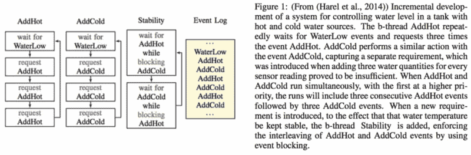
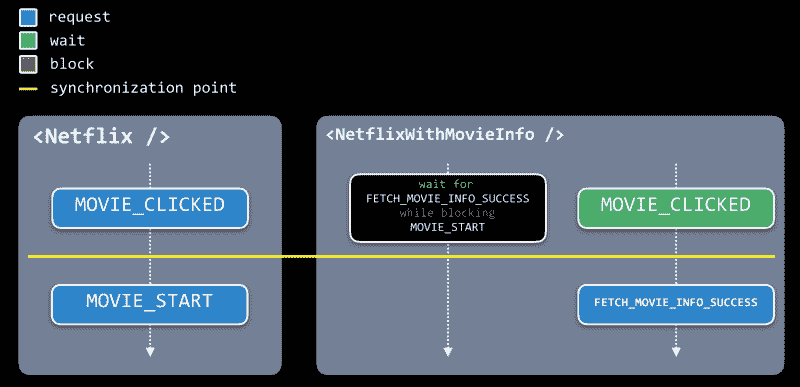
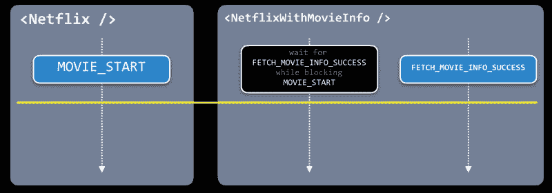
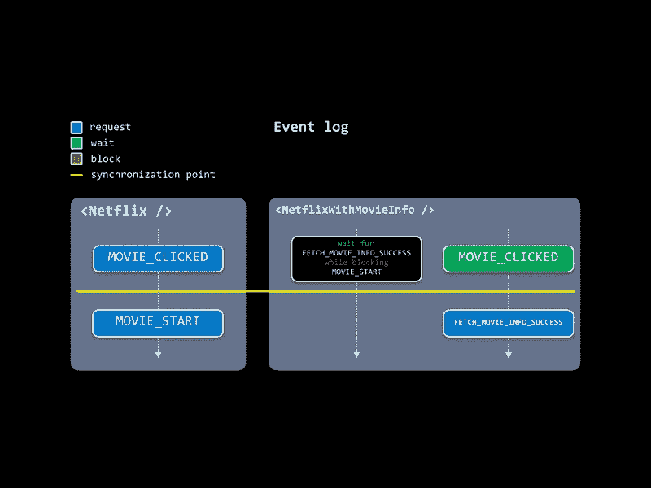
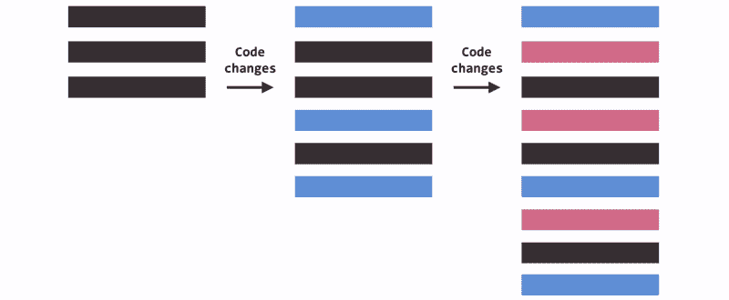
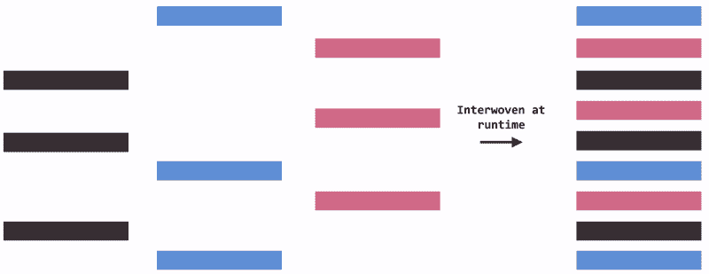

# React 行为编程简介:请求、等待和阻塞

> 原文：<https://www.freecodecamp.org/news/an-intro-to-behavioral-programming-with-react-request-wait-and-block-ad876e2d235e/>

由卢卡事项

# React 行为编程简介:请求、等待和阻塞


Changing behavior of a component is like adding layers to a circle ([source](https://solarsystem.nasa.gov/resources/661/panoramic-rings/?category=planets_saturn))

行为编程(BP)是大卫·哈雷尔、阿萨夫·马龙和杰拉·韦斯在 2012 年的文章中创造的一种范式。

直接从抽象中:

> 行为编程通过允许添加软件模块来简化处理欠规范和冲突需求的任务，这些软件模块不仅可以添加，还可以修改现有的行为。

### 高级概念

我将首先使用两个 React 组件`MoviesList`和`MoviesCount`的例子来解释高级概念。一个显示电影列表，另一个显示电影数量。然后我将深入研究行为编程到底是如何工作的。

这两个组件从同一个 HTTP URL 获取数据。它们是由一个大型组织中的两个不同的团队开发的。当我们在一个页面上呈现这两个组件时，我们会遇到一个问题，因为它们执行相同的请求:

```
<>  <MoviesList />  <MoviesCount /></>
```

我们几乎不知道这些是**行为成分**。这意味着我们可以做一些非常聪明的事情来避免两个请求都被触发:

```
const MoviesCountFromList = withBehavior([  function* () {    // block FETCH_COUNT from happening    yield { block: ['FETCH_COUNT'] }  },  function* () {    // wait for FETCH_LIST, requested by the other    // MoviesList component, and derive the count    const response = yield { wait: ['FETCH_LIST'] }    this.setState({      count: response.length    })  }])(MoviesCount)
```

在上面的例子中，我们进入了`MoviesCount`组件。我们**等待**和**请求**有事发生。而且，对行为编程来说更独特的是，我们还**阻止了**某些事情的发生。

因为我们试图避免两个请求都被触发，所以我们阻止了触发`FETCH_COUNT`事件(因为相同的数据已经被`FETCH_LIST`事件获取)。

```
<>  <MoviesList />  <MoviesCountFromList /></>
```

向现有组件添加功能而不修改它们的代码是行为编程范例的新颖之处。

直观地说，这可以允许创建更多可重用的组件。

在本文的其余部分，我将更深入地探讨行为编程(BP)是如何工作的，特别是在**反应**的背景下。

### 重新思考编程流程

为了实现上述功能，我们需要以稍微不同的方式考虑编程行为。具体来说， **events** 在编排我们为组件定义的各种行为之间的同步中起着至关重要的作用。

```
const addHotThreeTimes = behavior(  function* () {    yield { request: ['ADD_HOT'] }    yield { request: ['ADD_HOT'] }    yield { request: ['ADD_HOT'] }  })
```

```
const addColdThreeTimes = behavior(  function* () {    yield { request: ['ADD_COLD'] }    yield { request: ['ADD_COLD'] }    yield { request: ['ADD_COLD'] }  })
```

```
run(  addHotThreeTimes,  addColdThreeTimes)
```

当我们运行上面的代码时，我们得到一个请求事件的列表:

```
ADD_HOTADD_HOTADD_HOTADD_COLDADD_COLDADD_COLD
```

正如所料，第一个行为执行。一旦完成，第二个行为继续。然而，我们组件的新规范要求我们改变这两个事件的触发顺序。不是触发`ADD_HOT`三次，然后`ADD_COLD`三次，我们希望它们在`ADD_HOT`之后交错触发`ADD_COLD`。这将使温度保持一定的稳定。

```
...
```

```
const interleave = behavior(  function* () {    while (true) {      // wait for ADD_HOT while blocking ADD_COLD      yield { wait: ['ADD_HOT'], block: ['ADD_COLD'] }
```

```
 // wait for ADD_COLD while blocking ADD_HOT      yield { wait: ['ADD_COLD'], block: ['ADD_HOT'] }    }  })
```

```
run(  addHotThreeTimes,  addColdThreeTimes,  interleave)
```

在上面的例子中，我们引入了一个新的交叉行为，这正是我们所需要的。

```
ADD_HOTADD_COLDADD_HOTADD_COLDADD_HOTADD_COLD
```

我们改变了事情执行的顺序，而不必修改已经编写好的行为代码。

下图总结了这一过程。



这种编程方式的关键概念是**请求**、**等待、**和**块**操作符。这些运算符的语义如下:

*   **请求**事件:提议考虑触发该事件，并请求在触发时得到通知
*   **等待**一个事件:没有提出触发，要求在事件触发时得到通知
*   **阻塞**一个事件:禁止触发该事件，否决其他 b 线程的请求。

每个 b 线程(行为线程)独立存在，不知道其他线程。但是它们在运行时都是交织在一起的，这允许它们以一种非常新颖的方式相互交互。

生成器语法对于行为程序的运行至关重要。我们需要控制何时进行下一个收益表。

### 回过神来

如何在 React 的上下文中使用这些 BP 概念？

事实证明，通过高阶组件(hoc ),您可以以非常直观的方式将这种行为习语添加到现有组件中:

```
class CommentsCount extends React.Component {  render() {    return <div>{this.state.commentsCount}</div>  }}
```

```
const FetchCommentsCount = withBehavior([  function* () {    yield { request: ['FETCH_COMMENTS_COUNT']}    const comments = yield fetchComments()    yield { request: ['FETCH_COMMENTS_COUNT_SUCCESS']}    this.setState({ commentsCount: comments.length })  },])(CommentsCount)
```

这里我们使用来自 [b 线程](https://github.com/lmatteis/b-thread)库的`withBehavior`，使`CommentsCount`成为一个行为组件。具体来说，我们让它在数据准备好之后获取评论并显示数据。

对于简单的组件，这可能不会改变游戏规则。但是让我们想象一下更复杂的组件，其中包含许多逻辑和其他组件。

我们可以把整个网飞网站想象成一个`<Netflix` / >组件:


Screenshot of Netflix’s website

当我们在应用程序中使用这个组件时，我们希望与它进行交互。具体来说，当一部电影被点击时，我们并不想立即开始播放电影，而是希望发出一个 HTTP 请求，显示关于这部电影的其他数据，然后开始播放电影。

如果不改变`<Netflix` / >组件内部的代码，我认为如果它不是一个行为组件，这是不可能实现的。

相反，让我们想象`<Netflix` / >是使用行为编程开发的:

```
const NetflixWithMovieInfo = withBehavior([  function* () {    // First, block the MOVIE_START from happening     // within <Netflix /> until a new     // FETCH_MOVIE_INFO_SUCCESS event has been requested.    // The yield statement below can be read as:    // wait for FETCH_MOVIE_INFO_SUCCESS while blocking MOVIE_START    yield {       wait: ['FETCH_MOVIE_INFO_SUCCESS'],       block: ['MOVIE_START']     }  },  function* () {    // Here we wait for MOVIE_CLICKED, which is    // triggered within <Netflix />, and we fetch our    // movie info. Once that's done we request a new event    // which the earlier behavior is waiting upon    const movie = yield { wait: ['MOVIE_CLICKED'] }    const movieInfo = yield fetchMovieInfo(movie)    yield {       request: ['FETCH_MOVIE_INFO_SUCCESS'],       payload: movieInfo     }  }])(Netflix)
```

上面我们已经创建了一个新的`NetflixWithMovieInfo`组件，它修改了`<Netflix` / >组件的行为(同样，没有改变它的源代码)。以上行为的加入使得 `that MOVIE_C`舔不到 tr`igger MOVIE`_ 立即启动。

相反，它使用了“阻塞时等待”的组合:可以在一条 yield 语句中定义一个**等待**和一个**阻塞**。



上面的图片更详细地描述了我们的行为组件中正在发生的事情。组件中的每个小方框都是一个收益表。每个垂直虚线箭头代表一个行为(也称为 b 线程)。

在内部，行为实现将从查看所有 b 线程在当前同步点的所有 yield 语句开始，用一条水平黄线表示。如果其他 b 线程中没有事件阻止它，它将只继续执行 b 线程中的下一个 yield 语句。

因为没有东西阻塞`MOVIE_CLICKED`，所以它将被请求。然后我们可以继续下一个网飞行为的收益表。在下一个同步点，最右边等待`MOVIE_CLICKED`的 b 线程将继续执行下一个 yield 语句。

等待和阻塞这种中间行为不会继续。没有被其他 b 线程请求，所以它仍然等待阻塞。下一个同步点将如下所示:



和以前一样，我们将查看在这个同步点的所有 yield 语句。然而，这一次，我们不能请求`MOVIE_START`，因为有另一个 b 线程正在阻塞它(black yield 语句)。因此，网飞组件不会启动电影。

`FETCH_MOVIE_INFO_SUCCESS`然而在最右边，是自由被要求的。这将在下一个同步点解锁`MOVIE_START`。

所有这些在实践中允许我们改变其他组件中发生的事情的顺序，而不需要直接修改它们的代码。我们能够阻止某些事件触发，直到在其他组件中满足其他条件。

**这改变了我们思考编程的方式:**不一定是一组按顺序执行的语句，而是**通过特定事件语义同步的所有产出语句的交错。**

下面是一个简单的动画，描述了 b 线程在运行时的执行和交织方式。



Order of execution of different threads

### 不改变旧代码的编程

我们可以用另一种方式来理解这个习语程序。我们可以比较随着规范的变化我们当前的编程方式和行为编程的方式。



Each added behavior is depicted using a different colored rectangle

在上面的标题中，我们想象了如何将行为添加到非行为程序中。我们从一个只用三个黑色矩形(在左边)描述的程序开始。

随着规范的变化，我们意识到我们需要修改程序并在程序的各个部分添加新的行为，用新添加的彩色矩形来描述。随着软件需求的变化，我们会继续这样做。

每增加一个行为都需要我们修改已写好的代码，这可能会给旧的行为带来错误。此外，如果我们改变的程序是不同人使用的各种其他模块的一部分，我们可能会给他们的软件带来不必要的行为。最后，可能无法更改特定的程序，因为它们可能作为带有许可源代码的库分发。



Each column on the left is a b-thread

在上图中，我们看到了如何使用行为编程习惯用法实现相同的程序修改。我们仍然像以前一样从左边的三个矩形开始。但是随着新规范的出现，我们不会修改它们。相反，我们添加新的 b 线程，表示为列。

最终的程序是相同的，尽管构造方式非常不同。行为方法的一个优点是，当需求改变时，我们不必修改旧的代码。

您还可以想象并行开发每个 b 线程，可能由大型组织中的不同人员进行，因为他们并不直接相互依赖。

这种方法的好处似乎也在于打包:我们可以改变库的行为，而不需要访问或修改它的源代码。

### API 不仅是道具，也是事件

目前，React 组件与外界通信的唯一方式是通过 props(除了上下文 API)。

通过使一个组件行为化，而不是使用道具，我们通过产生事件来告诉外部世界组件内的事情何时发生。

为了允许其他开发人员与组件的行为进行交互，我们必须记录它**请求**的事件、它**等待的事件、**以及最后它**阻止的事件**。

事件成为新的 API。

例如，在一个非行为的`Counter`组件中，我们使用一个`onIncrement`属性告诉外界计数器何时递增以及当前计数是多少:

```
class Counter extends React.Component {  state = { currentCount: 0 }  handleClick = () => {    this.setState(prevState => ({      currentCount: prevState.currentCount + 1    }), () => {      this.props.onIncrement(this.state.currentCount)    })  }  render() {    {this.state.currentCount}    <button onClick={this.handleClick}>+</button>  }}
```

```
<Counter   onIncrement={(currentCount) =>     console.log(currentCount)  }/>
```

如果我们想在计数器的状态增加之前做些别的事情呢？事实上，我们可以添加一个新的道具，比如`onBeforeIncrement`，但关键是我们不希望每次出现新的细节时都添加道具并重构代码。

如果我们将它转换成一个行为组件，当新的规范出现时，我们可以避免重构:

```
class Counter extends React.Component {  state = { currentCount: 0 }  handleClick = () => {    bp.event('CLICKED_INCREMENT')  }  render() {    {this.state.currentCount}    <button onClick={this.handleClick}>+</button>  }}
```

```
const BehavioralCounter = withBehavior([  function* () {    yield { wait: ['CLICKED_INCREMENT'] }    yield { request: ['UPDATE_CURRENT_COUNT'] }
```

```
 this.setState(prevState => ({      currentCount: prevState.currentCount + 1    }), () => {      this.props.onIncrement(this.state.currentCount)    })  }])(Counter)
```

请注意我们是如何在 b 线程内部移动状态更新的逻辑的。此外，在更新实际发生之前，请求新的事件`UPDATE_CURRENT_COUNT`。

这实际上允许其他 b 线程阻止更新的发生。

组件也可以作为不同的包封装和共享，用户可以添加他们认为合适的行为。

```
// package-name: movies-listexport const function MoviesList() {  ...}
```

```
// package-name: movies-list-with-paginationexport const MoviesListWithPagination = pipe(  withBehavior(addPagination))(MoviesList)
```

```
// package-name: movies-list-with-pagination-logicexport const MoviesListWithDifferentPaginationLogic = pipe(  withBehavior(changePaginationLogic))(MoviesListWithPagination)
```

同样，这也不同于简单地增强一个组件，就像常规的 HOC 会做的那样。我们可以阻止某些事情在我们扩展的组件中发生，有效地修改它们的行为。

### 结论

这个新的编程习语一开始可能会感到不舒服，但它似乎缓解了我们在使用 UI 组件时遇到的一个突出问题:**很难重用组件，因为它们不能与它们被放入的环境融合。**

在未来，也许使用这些行为概念，我们将能够通过简单地安装新组件来为应用程序添加新的行为。像这样的事情将成为可能:

```
<Environment>  <Netflix />  <Twitter />  <WaitForTwitterBeforeNetflix />  <OnTwitterClickShowLoader /></Environment>
```

此外，事件不需要污染整个应用程序，只能在特定的环境中广播。

感谢阅读！如果你对行为编程的实际实现感兴趣，请查看我目前正在进行的与 React 一起工作的库:[https://github.com/lmatteis/b-thread](https://github.com/lmatteis/b-thread)。[行为编程主页](http://www.wisdom.weizmann.ac.il/~bprogram/)也包含各种实现。

为了获得更多关于这个令人兴奋的新概念的信息，我建议你阅读关于行为编程的[科学论文](https://scholar.google.ca/scholar?hl=en&as_sdt=0%2C5&q=behavioral+programming+harel&btnG=)或者查看关于这个主题的[我的其他文章](https://medium.com/@lmatteis/on-user-interface-development-appending-to-the-event-log-8d8ca966795d) [。](https://medium.com/@lmatteis/statecharts-updating-ui-state-767052b6b129)