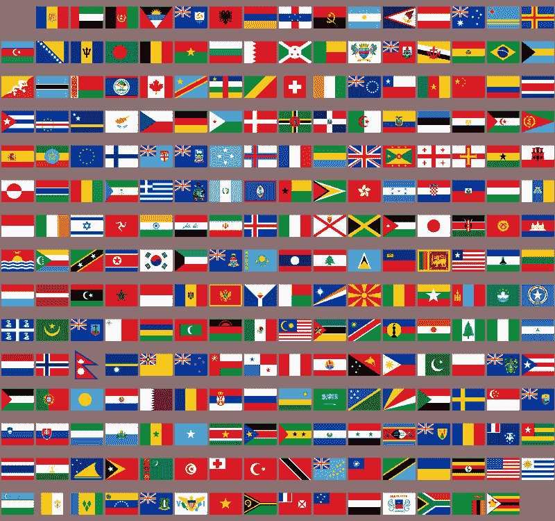
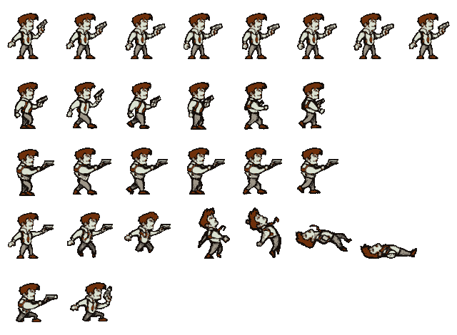
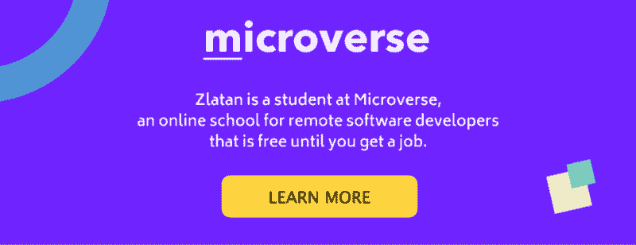

# CSS 图像精灵介绍:它们很容易学习，也很好理解

> 原文：<https://www.freecodecamp.org/news/an-intro-to-css-image-sprites-theyre-easy-to-learn-and-great-to-know-c13beec82403/>

兹拉坦·贝克里克

# CSS 图像精灵介绍:它们很容易学习，也很好理解

Photo by [Markus Spiske](https://unsplash.com/@markusspiske?utm_source=medium&utm_medium=referral) on [Unsplash](https://unsplash.com?utm_source=medium&utm_medium=referral)

自 20 世纪 70 年代以来，图像精灵就一直存在。它们被用于雅达利和其他游戏机上的第一批电脑动画。随着时间的推移，前端开发人员越来越少使用它们，他们希望为 3D 和虚拟现实提供更高级的(即逼真的)图形。

然而，近年来，它们卷土重来。

Sprite 是计算机图形学术语，指集成到更大场景中的二维位图。

在过去的几年里，脸书、推特、Instagram 和许多其他社交媒体平台疯狂增长。随着增长，他们需要尽可能地进行优化，并缩小服务器请求的规模。这就是 CSS 图像精灵回归主流的时候。

对于像脸书这样拥有超过 10 亿用户的平台，显示图标、图像和类似内容需要多个服务器请求。这些请求不必要地使流量过载。

### 那么，如何减少服务器请求和带宽呢？转向 CSS 图像精灵。

sprites 允许你使用一张图片，这意味着只有一个请求，而不是请求你的个人资料图片、你朋友的个人资料图片、你的相册缩略图等等。您可以操作该图像，将这些图像显示为一个更大图像的一部分。

让我们看一个涉及标志的例子:

Original image

现在让我们看看它是如何工作的:

正如您在上面的代码中看到的，我们已经设置了由三个 div 组成的基础，其中每个 div 都是一个 sprite 载体。

首先，我们选择 ID 为 first 的 div。我们的 div 将有一个显示在页面上的高度和宽度大小。作为背景，我们将用**URL(" https://I . postimg . cc/r 0n 7 nkh 9/flags . png ")**加载一张图片。

下一件事是缩小/放大我们的背景图片，背景尺寸:1400 像素。(我们可以用实际像素大小，百分比，em 或者 rem。)该参数将允许我们“放大”图像，直到只显示图像的某一部分。

最后，在**背景之后的两个参数:**

**URL(" https://I . postimg . cc/r 0n 7 nkh 9/flags . png ")，**将移动主图像的部分，该部分将沿 X 和 Y 轴可见。也就是说在这种情况下**背景:**

**URL(" https://I . postimg . cc/r 0n 7 nkh 9/flags . png ")-86px-87px；**我们将显示从图像顶部偏移 87 像素和 86 像素的部分。

第一个数字( **-86px** )代表 X 轴，负表示从左向右移动，正表示从右向左移动。第二个数字 **(-87px)** 用于从顶部到底部的偏移，此处适用反转规则，正数表示从底部到顶部，负数表示从顶部到底部。

正如你在原图上看到的，我们得到的旗帜(波斯尼亚)实际上是左起第二个。

够好吗？好的，我们继续。

现在让我们用秒的 ID 填充 div。相同的设置规则将适用，唯一的变化将是，在这种情况下，我们将停留在原来的 X 轴 **(0px)，**和 Y 方向将从底部走向顶部 **(89px)。**如果您再次检查原始图像，您可能会看到(乌兹别克斯坦)从底部开始，从左侧开始。

最后，但同样重要的是…

是的，最后我们用第三个 ID 填充最后一个 div。规则是一样的，如果你猜我们是从底层走向顶层，那是真的。

现在是关键时刻了…

在上面的例子中，我们沿着 X 和 Y 轴移动来显示图像的某些部分。从右到左向下我们看到了波斯尼亚(X 轴)，从底部向左(Y 轴)我们看到了泰国和乌兹别克斯坦。正如您所看到的，我们只使用了一个图像，这意味着只有一个图像请求。

重要的是要知道，当你构建精灵时，为了你自己的方便，基础图像应该有相同的图像部分。就像在这种情况下，我们向左右、上下移动，移动量是部分加上空白的大小。乌兹别克斯坦(89px)和泰国(178px)相差 89px 是他们的实际大小(87px)加上空格(1px + 1px)。

### 是的，你也可以制作动画。

Original Image

为了制作这种风格的甜美、酷的老派动画，我们只需要 CSS 动画属性。在这种情况下，我们沿着 X 轴移动原始图像，我们得到了这个旧风格的动画。相信我，精灵是没有限制的。

就这么简单:)

我希望你喜欢阅读这篇文章。

敬请关注更多…

