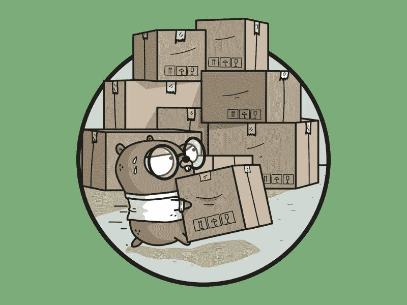
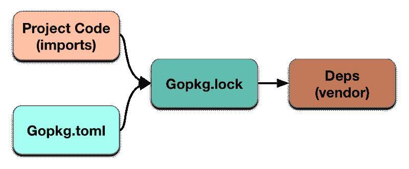

# dep 简介:如何管理 Golang 项目依赖关系

> 原文：<https://www.freecodecamp.org/news/an-intro-to-dep-how-to-manage-your-golang-project-dependencies-7b07d84e7ba5/>

作者:应洁媛

# dep 简介:如何管理 Golang 项目依赖关系



dep — A Go dependency management tool

**更新@ 2018–11–26:技术不仅在以极快的速度发展，而且在快速变化。不出一年，这篇文章就过时了！**

并根据 [dep 项目页面](https://github.com/golang/dep):

> dep 是“官方实验”从 1.11 开始，Go 工具链已经(实验性地)采用了一种与 dep 截然不同的方法。因此，我们在继续开发 dep，但是 gear 的工作主要是为工具链中的版本控制行为开发一个替代原型。

关于新 Go 内置管理的更多信息，请参考官方 GitHub Wiki — [Go 1.11 模块](https://github.com/golang/go/wiki/Modules)。

感谢[约翰·阿伦德尔@比特菲尔德](https://twitter.com/bitfield)和[二汗·雅库特@雅库特](https://twitter.com/yakuter)揭露问题。？

—

**更新@ 2018–02–03:[来自 godep 团队的 Sam Boyer](https://medium.com/@sdboyer) 澄清了本文中一些不正确的信息。对于由此带来的不便，我向山姆·博耶和读者道歉。**？

—

之前，我用 [Glide 在](https://glide.sh/) [Go](https://golang.org/) 贴了一篇关于依赖管理的[文章](https://blog.boatswain.io/post/manage-go-dependencies-using-glide/)。得到反馈[滑翔](https://glide.sh/)将会过时。Glide 团队建议用户转向另一个依赖管理工具，名为 [dep](https://github.com/golang/dep) ，由 Golang 团队编写。

> Go 社区现在有了 dep 项目来管理依赖关系。请考虑尝试从 Glide 迁移到 dep。Glide 将在一段时间内继续得到支持，但被视为处于支持状态，而不是积极的功能开发。

在 [Go 1.10 版本](https://tip.golang.org/doc/go1.10)中有将 [dep](https://github.com/golang/dep) 整合到工具链中的计划，但似乎[还有一段路要走](https://www.reddit.com/r/golang/comments/7dd2ty/go_110_release_notes_draft/#thing_t1_dpwyj4i)。

**更新@ 2018–02–03:**

*   [**dep**](https://github.com/golang/dep) **正式发布。**
*   [**dep**](https://github.com/golang/dep) **不在 1.10 中移入工具链。请参考[路线图](https://github.com/golang/dep/wiki/Roadmap)了解最新信息。**


And I am just not fast enough. ?

### 在$GOPATH 中创建项目

项目文件夹必须在 *$GOPATH* 中，以便解析 [Go](https://golang.org/) 包路径。让我们在*$ GOPATH/src/git lab . com/yk yuen/dep-example*创建一个新项目，并添加以下文件。

**main.go**

### dep 方式

#### Gopkg.toml 和 Gopkg.lock

[dep](https://github.com/golang/dep) 读取两个名为 *Gopkg.toml* 和 *Gopkg.lock* 的文件。让我们使用 *dep init* 命令初始化这两个文件。

```
[ykyuen@camus dep-example]$ dep init  Using master as constraint for direct dep github.com/dustin/go-humanize  Locking in master (bb3d318) for direct dep github.com/dustin/go-humanize
```

如您所见， *dep init* 命令扫描源代码，并将项目所需的所有包下载到*供应商*文件夹中。

*Gopkg.lock* 与 *glide.lock* 文件的功能完全相同。它锁定了**包的版本，除了**之外，版本应该保存在 *Gopkg.toml* 中。简而言之， *Gopkg.lock* 文件是自动生成的，它依赖于由 *Gopkg.toml* 控制的源版本中的 *import* 语句。



#### 更新相关性的版本

让我们编辑一下 *Gopkg.toml* ，用稍微老一点版本的 [go-humanize](https://github.com/dustin/go-humanize) 包代替最新的 master branch。

然后运行 *dep 确保*将包更新到所需版本。以下是更新后的 *Gopkg.lock* 的区别。

#### 添加新的依赖关系

可以使用*dep assure-add*命令添加新的包。

```
[ykyuen@camus dep-example]$ dep ensure -add github.com/leekchan/accountingFetching sources...
```

```
"github.com/leekchan/accounting" is not imported by your project, and has been temporarily added to Gopkg.lock and vendor/.If you run "dep ensure" again before actually importing it, it will disappear from Gopkg.lock and vendor/.
```

现在我们已经在*供应商*文件夹中准备好了新的*会计*包，新的约束被写入 *Gopkg.toml* 并被锁定在 *Gopkg.lock* 中。让我们更新 *main.go* 如下。

**main.go**

并运行它。

```
[ykyuen@camus dep-example]$ go run main.gohello worldThat file is 83 MB.You're my 193rd best friend.You owe $6,582,491.$123,456,789.21$12,345,678.00$25,925,925.67-$25,925,925.67$123,456,789.21
```

### git 子模块的问题

与 [Glide](https://glide.sh/) 相比， [dep](https://github.com/golang/dep) 的一个主要区别是软件包的子模块被忽略。比如 [dep](https://github.com/golang/dep) 添加 [go-goracle/goracle](https://github.com/go-goracle/goracle) 包后，里面的 [odpi](https://oracle.github.io/odpi/) 子模块为空导致错误。删除子模块的原因可在以下链接中找到。

*   有计划添加 Git 子模块支持吗？

**更新@ 2018–02–03:**

关于 Git 子模块的段落不正确。

[**山姆·博耶**](https://github.com/sdboyer) **写道:**

> 在您所描述的情况下，dep 在引入 git 子模块方面应该非常好。我只是在本地复制了你在这里描述的东西，问题不在于子模块——而是在 github.com/go-goracle/goracle/odpi,没有 Go 代码，所以不能直接导入。

> 你可能需要在 Gopkg.toml 中专门为那个项目关闭未使用的包修剪，否则 dep ensure 将自动直接删除看起来是未使用的包(但看起来它实际上被 cgo 使用)。

**更新@ 2018–03–04:**

发现 [go-goracle/goracle](https://github.com/go-goracle/goracle) 包与 [dep](https://github.com/golang/dep) 不兼容。你可以关注下面的问题，查看来自 [dep](https://github.com/golang/dep) 团队的最新更新。

*   [在 dep 确保命令](https://github.com/golang/dep/issues/1633)之后，无法获取包的 git 子模块

### 摘要

*   d̶̵̶e̶̵̶p̶̵̶̶̵̶i̶̵̶s̶̵̶̶̵̶q̶̵̶u̶̵̶i̶̵̶t̶̵̶e̶̵̶̶̵̶l̶̵̶i̶̵̶k̶̵̶e̶̵̶l̶̵̶y̶̵̶̶̵̶t̶̵̶o̶̵̶̶̵̶b̶̵̶e̶̵̶̶̵̶t̶̵̶h̶̵̶e̶̵̶̶̵̶o̶̵̶f̶̵̶f̶̵̶i̶̵̶c̶̵̶i̶̵̶a̶̵̶l̶̵̶̶̵̶d̶̵̶e̶̵̶p̶̵̶e̶̵̶n̶̵̶d̶̵̶e̶̵̶n̶̵̶c̶̵̶y̶̵̶̶̵̶m̶̵̶a̶̵̶n̶̵̶a̶̵̶g̶̵̶e̶̵̶m̶̵̶e̶̵̶n̶̵̶t̶̵̶̶̵̶t̶̵̶o̶̵̶o̶̵̶l̶̵̶̶̵̶i̶̵̶n̶̵̶̶̵̶t̶̵̶h̶̵̶e̶̵̶̶̵̶g̶̵̶o̶̵̶l̶̵̶a̶̵̶n̶̵̶g̶̵̶̶̵̶c̶̵̶o̶̵̶m̶̵̶m̶̵̶u̶̵̶n̶̵̶i̶̵̶t̶̵̶y̶̵̶.̶̵̶
*   i̶̵̶f̶̵̶̶̵̶y̶̵̶o̶̵̶u̶̵̶̶̵̶a̶̵̶r̶̵̶e̶̵̶̶̵̶s̶̵̶t̶̵̶a̶̵̶r̶̵̶t̶̵̶i̶̵̶n̶̵̶g̶̵̶̶̵̶a̶̵̶̶̵̶n̶̵̶e̶̵̶w̶̵̶̶̵̶g̶̵̶o̶̵̶l̶̵̶a̶̵̶n̶̵̶g̶̵̶̶̵̶p̶̵̶r̶̵̶o̶̵̶j̶̵̶e̶̵̶c̶̵̶t̶̵̶,̶̵̶̶̵̶d̶̵̶e̶̵̶p̶̵̶̶̵̶i̶̵̶s̶̵̶̶̵̶g̶̵̶o̶̵̶o̶̵̶d̶̵̶̶̵̶t̶̵̶o̶̵̶̶̵̶g̶̵̶o̶̵̶.̶̵̶
*   我，你，你，你，你，你，你，你，你，你，你，你，你，你，你，你，你，你，你，你，你，你，你，你，你，你，你，你，你，你，你，你，你，你，你，你，你，你，你，你，你，你，你(你)你(你)你(你)你(你)你(你)你(你)你(你)你(你)你(你)你(你)你(你)你(你)你-好吧
*   i̶n̶̶a̶d̶d̶i̶t̶i̶o̶n̶,̶̶m̶i̶s̶s̶i̶n̶g̶̶p̶a̶c̶k̶a̶g̶e̶’̶s̶̶s̶u̶b̶m̶o̶d̶u̶l̶e̶̶m̶a̶y̶̶r̶e̶s̶u̶l̶t̶̶i̶n̶̶m̶a̶l̶f̶u̶n̶c̶t̶i̶o̶n̶̶o̶f̶̶y̶o̶u̶r̶̶c̶o̶d̶e̶.̶
*   [**dep**](https://github.com/golang/dep) **正式发布。**
*   [**dep**](https://github.com/golang/dep) **在拉吉特子模块上运行良好。**
*   尽可能使用标准库。(由 [philoserf](https://www.freecodecamp.org/news/an-intro-to-dep-how-to-manage-your-golang-project-dependencies-7b07d84e7ba5/undefined) 建议)
*   你可以在[gitlab.com](https://gitlab.com/ykyuen/dep-example)上查看这个例子。

—最初发布在[水手长博客](https://blog.boatswain.io/post/manage-go-dependencies-using-dep/)上。