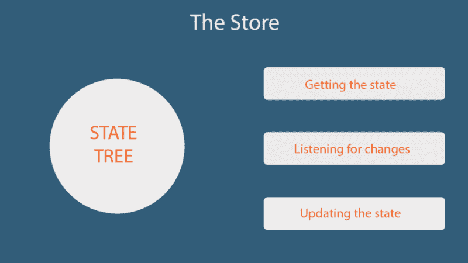
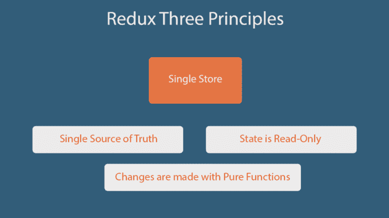
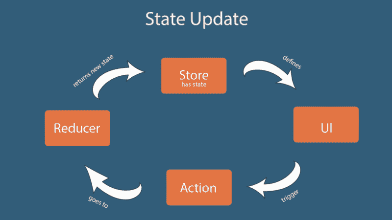

# 介绍 Redux 以及如何在 Redux 应用程序中更新状态

> 原文：<https://www.freecodecamp.org/news/an-intro-to-redux-and-how-state-is-updated-in-a-redux-application-839c8334d1b1/>

Syeda Aimen Batool

# 介绍 Redux 以及如何在 Redux 应用程序中更新状态


Photo by [Fabian Grohs](https://unsplash.com/photos/XMFZqrGyV-Q?utm_source=unsplash&utm_medium=referral&utm_content=creditCopyText) on [Unsplash](https://unsplash.com/search/photos/programming?utm_source=unsplash&utm_medium=referral&utm_content=creditCopyText)

几天前我开始学习 Redux，它对我来说是一个压倒性的概念。在通过制作一个[个人书籍阅读应用](https://github.com/aimenbatool/my-reads)来完善我在 ReactJS 中的技能之后，我前往 Redux 了解更多。

今天我要分享几个不使用任何视图库(React 或者 Angular)的核心 Redux 概念。这是一种供将来参考的个人笔记，但它也可以帮助其他人。

我们一起来挖吧！

### Redux 是什么？

Redux 是一个开源库，用于提高 JavaScript 应用程序中状态的可预测性。这是一个独立的图书馆。它通常与 React 和 Angular 等其他库一起使用，以便更好地管理应用程序的状态。Redux 由 Dan Abramov 在 2015 年创建，以高效的方式处理复杂的状态管理。

当应用程序变大时，管理状态和调试问题变得更加困难。跟踪状态在何时何地发生了变化，以及需要在何处反映这些变化，这成为一个挑战。有时用户输入会触发一些 API 调用来更新一些模型。该模型反过来更新某个状态，或者可能更新另一个模型，等等。

在这种情况下，跟踪状态变化变得很困难。发生这种情况主要是因为没有定义规则来更新状态，并且状态可以从应用程序内部的任何地方进行更改。

Redux 试图通过提供一些简单的规则来更新状态以保持其可预测性，从而解决这个问题。这些规则是 Redux 的组成部分。

### Redux 商店:

正如我们前面讨论的，Redux 的主要目的是在我们的应用程序中提供可预测的状态管理。Redux 通过拥有一个单一的真实来源，即一棵**单一状态树**来实现这一点。状态树是一个简单的 JavaScript 对象，它保存了应用程序的整个状态。与国家互动的方式只有几种。这使得我们很容易调试或跟踪我们的状态。

我们现在只有一个主状态，它占据了位于单个位置的应用程序的整个状态。对状态树的任何更改都会反映在整个应用程序中，因为这是应用程序的唯一数据源。这是 Redux 的第一个基本原则。

#### 规则 1 — [真相的单一来源](https://redux.js.org/introduction/three-principles#single-source-of-truth)

> 整个应用程序的状态存储在单个存储区的对象树中。—正式文件

与状态树交互的方式有:

*   获取状态
*   倾听国家的变化
*   更新状态

一个**存储**是一个单独的单元，它拥有**状态树**和**方法**来与状态树交互。除了通过这些给定的方法之外，没有其他方法可以与存储内部的状态进行交互。



我们来谈谈商店给我们提供的与状态交互的方法。

*   getState() —返回应用程序的当前状态。
*   dispatch(action)——更新状态的唯一方法是通过调度一个动作，而`dispatch(action)`就可以达到这个目的。我们稍后会更详细地讨论。
*   subscribe(listener) —此方法的目的是侦听状态变化。每次状态改变时，它都会被调用并返回更新后的状态。
*   replace reducer(next reducer)-替换存储当前用于计算状态的缩减器。

现在，当我们有一个包含状态树和一些与状态交互的方法的存储时，我们如何更新应用程序状态呢？

### 更新应用程序中的状态:

更新状态的唯一方法是分派一个动作。这是第二条规则。

#### 规则#2 — [状态是只读的](https://redux.js.org/introduction/three-principles#state-is-read-only)

动作是一个普通的 JavaScript 对象，用于跟踪应用程序中发生的特定事件。使它特别的是一个“类型”属性，这是它的一个必要部分。

```
{  type: "ADD_BOOK_TO_THE_CART"}
```

这个属性的主要目的是让 Redux 知道正在发生的事件。这种类型应该是对动作的描述。除了“类型”属性之外，它还可以包含有关正在发生的事件的其他信息。

动作可以包含任意多的信息。一个好的做法是尽可能少提供必要的信息，最好是 id 或任何唯一的标识符。

这里我们有一个向购物车添加一本书的操作。

一旦我们定义了我们的动作，我们就把它传递给调度程序。 **store.dispatch()** 是库提供的一个函数，它接受一个动作来执行一个针对状态的动作。Redux 限制只对此方法更新状态。

这种更新状态的严格方式确保了状态不能被视图或任何网络回调直接更改。更新状态的唯一方法是定义动作，然后调度它。记住动作是普通的 JavaScript 对象。出于调试目的，可以记录、序列化和重放操作。

我们现在有了一个商店、一个状态，以及应用程序中的一个动作来针对状态执行一些任务。现在，我们需要一种方法来使用这些动作来实际进行更新。这可以通过使用一个纯函数来完成，这是规则 3。



#### 规则#3 — [用纯函数进行更改](https://redux.js.org/introduction/three-principles#state-is-read-only)

魔法在这里发生。我们需要一个简单的 pure 函数，作为参数，它接受应用程序的当前状态和对该状态执行的操作，然后返回更新后的状态。这些功能被称为减速器。

这些被称为归约器，因为它们接受值的集合，将其归约为更新状态，然后返回。由于归约器是纯函数，它们不会改变原始状态。相反，它们在新的对象中返回更新后的状态。我们的应用程序可以有一个或多个缩减器。每个缩减器可以有一个相关的状态来执行特定的任务。

由于减速器是纯函数，它们应该具有以下属性:

*   给定相同的输入，它应该每次都返回相同的输出——不允许任何变异。
*   没有副作用——没有来自外部来源的 API 调用数据更改。

#### 这个过程。

如果我们把这些点连接起来，Redux 是一个库，它有一个包含状态树和一些与状态交互的方法的存储。更新存储内部状态的唯一方法是分派一个动作，并定义一个 reducer 函数来根据给定的动作执行任务。一旦被分派，动作就进入 reducer 函数中，执行任务并将更新后的状态返回给存储。这就是 Redux 的意义所在。



State update flow in Redux

### 到目前为止我们学到了什么？

让我们总结一下到目前为止我们所学的知识，把这些点联系起来。

*   Redux —一个开源的可预测状态容器
*   状态树——包含整个应用程序状态的普通 JavaScript 对象
*   与状态交互的三种方式(唯一的方式):
    [**存储**](https://redux.js.org/basics/store#store) —包含状态树&方法的单个单元与状态树
    **动作** —计划 Javascript 对象以描述发生的动作
    **还原器** —获取当前状态的纯 Javascript 函数和返回新状态的动作

因为 Redux 是一个独立的库，可以与 React、Angular 或任何其他库一起使用，所以我避免使用这些视图库制作一个示例应用程序。相反，我只关注核心的 Redux 概念。

Redux 一开始会让人不知所措，如果你是一个新手或初级开发人员，它会让你很难受。但是坚持和积极的态度是成功的关键。如果你作为一名初级开发人员正在为生存而奋斗，并且正在寻找一些动力，你可以阅读我如何努力克服我作为一名初级开发人员所面临的挑战。

打个招呼 [@aimenbatool。](https://twitter.com/AimenBatool)