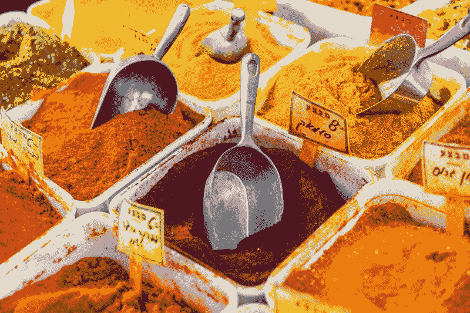

# CSS 位置味道的神秘配对介绍

> 原文：<https://www.freecodecamp.org/news/an-intro-to-the-mysterious-pairings-of-css-position-flavors-92b3625176ea/>

安娜贝拉·斯皮内利

# CSS 位置味道的神秘配对介绍

Photo by [Dan Gold](https://unsplash.com/photos/CwUkXRfjNWo?utm_source=unsplash&utm_medium=referral&utm_content=creditCopyText) on [Unsplash](https://unsplash.com/search/photos/spices?utm_source=unsplash&utm_medium=referral&utm_content=creditCopyText)

自从我开始学习 web 开发，我就发现 CSS 定位是一个神秘的相互依赖的属性的混合体，我从来没有完全理解它们的相互作用和影响。像大多数新手一样，我只是摆弄了一下`position`、`display`、`float`、`clear`以及它们所有可能的值组合，直到它看起来像我想要的。

CSS 就是这么运作的，对吧？

现在，在专注于 API 测试几年后，我想重温一下旧的普通 CSS，并试图真正理解那些基本的布局属性，同时我试图弄清楚这些天酷孩子在做什么，并跳回到开发列车上。

这是我的第一站:位置。

#### 开始了解属性

当你开始学习 CSS 的时候，`position`属性可能是一个神秘的东西。这就像给了一组未知的香料，它们看起来相似，但味道非常不同，它们之间的组合并不总是像预期的那样工作。

这是试图描述它们之间最好和最常见的*配对*，以便你可以在你的第一个网络烹饪步骤中轻松应用它们。就像我们在厨房里学到的一样——欧芹和大蒜搭配很好，但和肉桂搭配就没那么好了。

首先，让我们定义每个位置变量的味道:

*   `static` **:** 这是每个 HTML 元素默认拥有的。这意味着该元素将根据**正常文档流程进行定位。**基本上是所有的*盐*。
*   `relative` **:** 具有相对位置的元素可以相对于它们在正常文档流中占据的空间放置*。它们仍然是文档流的一部分，但是支持`top, right, bottom and left`属性。您分配给这些属性的任何值都将使用其自然位置和边界作为参考进行计算。就像加点胡椒粉，没多大坏处。*
*   `absolute` **:** 这个有点棘手——它有点像孜然，是一种很好的添加剂，但你必须小心使用。绝对元素从正常文档流中移除**。这意味着它们不影响页面中的其他元素，也不受其影响。但是，他们会被安排在离他们最近的`positioned`祖先*相对*(是的，我知道，请忍耐)。这意味着明确设置了其*位置的任何父元素。*可以使用`top, right, bottom and left`进行微调。所以它类似于相对定位，但是，因为它不再是文档流的一部分，所以它使用父文档作为引用。**
*   `fixed` **:** 啊，这个简单。固定元素不是文档流的一部分，它们的位置基于整个窗口，有时称为*视口*。此外，它们不受滚动的影响。

#### 那么，怎么才能把它们混合起来呢？

每当你想把一个元素从正常位置偏移一点点，但又不想让其他东西跟着它一起移动时，就使用`position:relative**;**` 。请记住，所有其他元素都将表现得好像没有移动过一样。

当您关心元素相对于其父元素或带有位置的包装的位置时，请使用`position: absolute**;**` ，在本例中为`relative`。请注意，`position`属性并不级联，所以它将使用最近的带有*显式相对声明的父属性。*如果想强制层叠这个属性，可以声明为`position:inherit;`。

请记住，这个元素的位置是由它的相对父元素的大小和形状定义的，所以如果您更改它，这个元素也可能会受到影响。

最后，`position: fixed;` 是个好玩的东西。正常使用包括粘性导航条、页脚或侧菜单。请记住，这超出了正常的文档流程，因此这意味着:

*   你可以把它放在任何你想放的地方，任何东西都不会损坏
*   这也意味着它不会做任何你没有明确告诉它去做的事情，所以你需要设置它的 2 坐标来显示它。
*   这两个坐标(即`top`或`bottom`，加上`left`或`right`)将从窗口边缘开始测量。

还有一个选项我没讲:`position: sticky`。这使得元素的行为和滚动正常，但随后停留在某个位置，而其余的内容继续滚动。我决定不讨论它，因为它仍然是实验性的，并且超出了本文的*理解基础知识*的范围。但是，如果你好奇的话，[这里有一个](https://alligator.io/css/position-sticky/)的链接展示了这一切。

我希望你喜欢这本书，并在阅读过程中学到了一些东西。如果您有任何意见或反馈，我很乐意阅读。