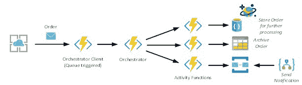

# Azure 持久功能简介:模式和最佳实践

> 原文：<https://www.freecodecamp.org/news/an-introduction-to-azure-durable-functions-patterns-and-best-practices-b1939ae6c717/>

与微软 Azure 的 Steef-Jan Wiggers 合著

使用持久功能，您可以编程一个工作流，并按顺序或并行顺序实例化任务，或者您可以构建一个观察器或支持一个人工交互流([批准工作流](https://blog.mexia.com.au/azure-durable-functions-approval-workflow-with-slack))。您可以链接函数来控制您的流程。您可以使用扇入和扇出场景、关联事件、灵活的自动化和长时间运行的流程，以及仅使用功能或逻辑应用程序难以实现的人工交互模式。

### 链接功能

持久函数最自然和直接的用法是将函数链接在一起。您有一个 orchestrator 函数，它按照您想要的顺序调用许多函数。您可以单独使用函数并使用服务总线队列来实现这一点，但是您将面临一些挑战:

*   没有可视化来显示函数和队列之间的关系
*   中间队列是一个实现细节，有概念上的开销
*   错误处理增加了很多复杂性

使用持久函数，您将不会遇到这些挑战。有了 orchestrator，您可以:

*   可以有一个中心位置来设置函数调用(关系)的顺序
*   不需要管理队列—在幕后，持久的功能使用和管理存储队列
*   集中处理错误—当某个活动函数发生错误时，该错误会传播回 orchestrator

```
//calls functions in sequence
public static async Task<object> Run (DurableOrchestrationContext ctx)
{ 
 try
 {
 var x = await ctx.CallFunctionAsync (“F1”);
 var y = await ctx.callFunctionAsync (“F2”, x);
 var z = await ctx.callFunctionAsync (“F3”, y);
 return = await ctx.CallFunctionAsync (“F4”, z);
 }

catch (Exception )
 {
 //global error handling /compensation goes here
 }
}
```

### 扇出/扇入

当您需要并行执行一个或多个函数，并根据结果运行一些其他任务时，可以使用扇出/扇入。对于函数，您不能采用这样的方法。此外，您还将面临前面提到的挑战。但是，通过持久功能，您可以实现扇出/扇入:

```
public static async Task Run (Durableorchestrationcontext ctx)
{
var parallelTasks = new List<Task<int>>();
//get a list of N work items to process in parallel
object []workBatch = await ctx.CallFunctionAsync<object[]> (“F1”);
for (int i = 0; i < workBatch.Length; i++)
{
Task<int> task = ctx.CallFunctionAsync <int> (“F2”, workBatch [i]); 
parallelTasks.Add (task);
}
await Task.WhenAll(parallelTasks);
//aggregate all N outputs and send result to F3
int sum = parallelTasks.Sum(t=> t.Result); 
await ctx.CallFunctionAsync (“F3”, sum);
}
```

### HTTP 异步响应

对于函数，当您调用另一个 API 时，您可能不知道在返回响应之前需要多少时间。例如，延迟和数量可能导致 API 处理请求并返回响应所需的时间未知。

使用消耗计划时，函数可能会超时。需要维护状态，这对于函数来说是不希望的，因为它们需要无状态。持久函数提供了内置的 API，简化了您为与长时间运行的函数执行进行交互而编写的代码。此外，状态由持久函数运行时管理。

```
//HTTP-triggered function to start a new orchestrator function instance.
public static async Task<HttpResponseMessage> Run (
HttpReq uestMessage req, DurableOrchestrationClient starter,
string functionName,
Ilogger log)
{
//Function name comes from the request URL.
//Function input comes from the request content .
dynamic eventData await req.Content .ReadAsAsync<object>();
string instanceid = await starter.StartNewAsync (functionName , eventData);
log .Loginformation ($”Started orchestration with ID = ‘{instanceid} ‘.”);
return starter.CreateCheckStatusResponse (req, instanceid);
}
```

### 演员

另一个用途是监视程序—工作流中的一个循环过程，例如清理过程。你可以用一个函数来实现。但是，同样，你会遇到一些挑战:

*   函数是无状态的和短命的
*   对外部状态的读/写访问需要同步

使用持久功能，您可以拥有灵活的重复间隔、任务生存期管理，以及从单个编排创建许多观察器流程的能力。

```
public static async Task Run(DurableOrchestrationContext ctx)
{
int counterState = ctx.Getinput<int>();
string operation = await ctx.WaitForExternalEvent<string>(“operation”);
if (operation == “incr”)
{
counterState++;
}
else if (operation == “decr”)
{
counterstate --;
}
ctx.ContinueAsNew(counterState);
}
```

### 人际互动

在组织内部，您将面临需要一些人工交互的流程，例如审批。像批准这样的交互需要批准者的可用性。因此，流程需要在一段时间内保持活动，并且在流程超时时需要一个可靠的机制。例如，如果 72 小时内没有获得批准，则必须启动升级流程。使用持久函数，您可以支持这样的场景。

```
public static async Task Run(DurableOrchestrationContext ctx)
{
await ctx.CallFunctionAsync<object []>(“RequestApproval”);
using (var timeoutCts = new CancellationTokenSource())
{
DateTime dueTime = ctx.CurrentUtcDateTime.AddHours(72);
Task durableTimeout = ctx.CreateTimer(dueTime, 0, cts.Token);
Task<bool > approvalEvent = ctx.WaitForExternalEvent< bool>(“ApprovalEvent”);
if (approvalEvent == await Task .WhenAny(approvalEvent, durableTimeout ))
{
timeoutCts.Cancel();
await ctx .CallFunctionAsync(“HandleApproval”, approvalEvent.Result);
}
else
{
await ctx.CallFunctionAsy nc(“Escalate” );
}
}
}
```

### 示例实现:使用持久函数链接



Orchestrator 客户端是一个可以在发送消息时触发的功能。这个客户端(一个函数)将调用 Orchestrator 并传递订单消息。

```
public static async Task<HttpResponseMessage> Run (
HttpReq uestMessage req, DurableOrchestrationClient starter, string functionName,
Ilogger log)
{
//Function name comes from the request URL.
//Function input comes from the request content .
dynamic eventData await req.Content .ReadAsAsync<object>();
string instanceid = await starter.StartNewAsync ( functionName , eventData);
log .Loginformation ($”Started orchestration with ID = ‘{instanceid} ‘.”);
return starter.CreateCheckStatusResponse (req, instanceid);
}
```

编排器将接收订单并调用活动函数。

```
public static async Task Run(DurableOrchestrationContext context, object order, ILogger log)
{
log.LogInformation($”Data = ‘{order}’.”);
var orderDetail = (OrderDetail) order;
try
{
bool x = await context.CallActivityAsync<bool>(“WriteToDatabase”, orderDetail);
log.LogInformation($”Data storage = ‘{x}’.”);
if (x == true)
{
await context.CallActivityAsync<OrderDetail>(“WriteToArchive”, orderDetail);
await context.CallActivityAsync<OrderDetail>(“SendNotification”, orderDetail);
}
}
catch (Exception)
{
//ErrorHandling
}
}
```

每个活动函数将执行一个任务——在本例中，将订单存储在 CosmosDB 实例的文档集合中，对存储的消息进行归档，并向队列发送一条消息，以便通过逻辑应用程序发出通知。

### 最佳实践

对于持久函数，有一些最佳实践可以遵循:

*   使用 Azure App Insights 应用程序监控正在运行的实例和运行状况，包括 Azure 功能
*   持久功能应用程序还公开了用于管理的 HTTP API。使用 API 方法，您可以影响持久函数的操作过程。
*   对持久函数使用版本控制
*   您可以使用并行部署，在部署时更新任务中心的名称。参见[持久功能蓝绿色部署策略](https://medium.com/@tsuyoshiushio/durable-functions-blue-green-deployment-strategies-ed25509ecd60)了解更多信息。

### 总结

在这篇博文中，我们希望您能更好地理解持久函数的使用，以及它们提供的价值。持久功能为您提供了对工作流的最终控制，这是其他技术(如逻辑应用程序或单独的功能)无法实现的。加上我们整合的一些最佳实践，您现在应该能够构建具有持久功能的可持续解决方案。

[本文最初发表于 Serverless360。](https://www.serverless360.com/blog/azure-durable-functions-patterns-best-practices)