# 深度 Q-Learning 简介:让我们玩毁灭战士

> 原文：<https://www.freecodecamp.org/news/an-introduction-to-deep-q-learning-lets-play-doom-54d02d8017d8/>

托马斯·西蒙尼尼

# 深度 Q 学习简介:让我们玩毁灭战士

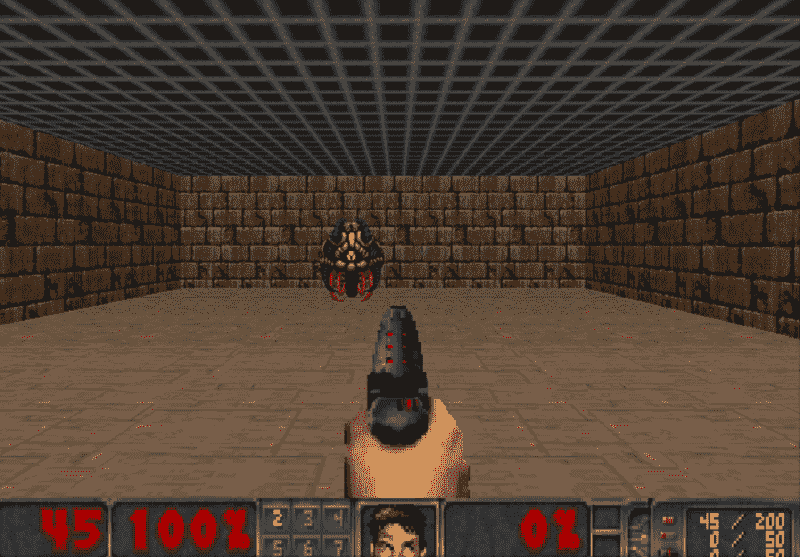

> 本文是 Tensorflow 深度强化学习课程的一部分？️.查看这里的教学大纲。

[上一次](https://medium.freecodecamp.org/diving-deeper-into-reinforcement-learning-with-q-learning-c18d0db58efe)，我们学习了 Q-Learning:一种产生 Q-table 的算法，代理使用它来找到给定状态下采取的最佳行动。

但是正如我们将看到的，在大的状态空间环境中，产生和更新 Q 表可能变得无效。

本文是深度强化学习系列博文的第三部分。如需更多信息和资源，请查看课程的教学大纲。

今天，我们将创建一个深度 Q 神经网络。不使用 Q 表，我们将实现一个神经网络，它获取一个状态并基于该状态近似每个动作的 Q 值。

多亏了这个模型，我们将能够创造一个学习玩[毁灭](https://en.wikipedia.org/wiki/Doom_(1993_video_game))的代理！


Our DQN Agent

在本文中，您将了解到:

*   什么是深度 Q 学习(DQL)？
*   与 DQL 打交道的最佳策略是什么？
*   如何处理时间限制问题
*   为什么我们使用体验回放
*   DQL 背后的数学原理是什么
*   如何在 Tensorflow 中实现

### **将“深度”添加到 Q 学习中**

在[的上一篇文章](https://medium.freecodecamp.org/diving-deeper-into-reinforcement-learning-with-q-learning-c18d0db58efe)中，我们借助 Q-learning 算法创建了一个代理来玩冰封湖。

我们实现了 Q-learning 函数来创建和更新 Q-table。可以把这看作是一张“小抄”,在给定当前状态的情况下，帮助我们找到一个行动的最大预期未来回报。这是一个很好的策略——但是，这是不可扩展的。

想象一下我们今天要做什么。我们将创建一个学习玩毁灭战士的代理。Doom 是一个具有巨大状态空间(数百万个不同状态)的大环境。为该环境创建和更新 Q 表根本没有效率。

在这种情况下，最好的想法是创建一个[神经网络](http://neuralnetworksanddeeplearning.com/),在给定一个状态的情况下，它将近似每个动作的不同 Q 值。


### 深度 Q 学习是如何工作的？

这将是我们深度 Q 学习的架构:

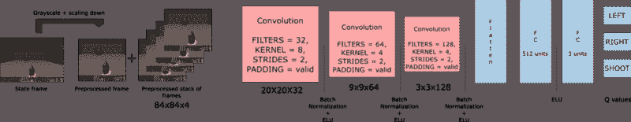

这看起来很复杂，但是我会一步一步地解释这个架构。

我们的 Deep Q 神经网络将四帧的堆栈作为输入。这些通过它的网络，并输出给定状态下每个可能动作的 Q 值向量。我们需要取这个向量的最大 Q 值来找到我们的最佳行动。

一开始，代理做得很糟糕。但随着时间的推移，它开始将框架(状态)与最佳行动联系起来。

#### **预处理部分**

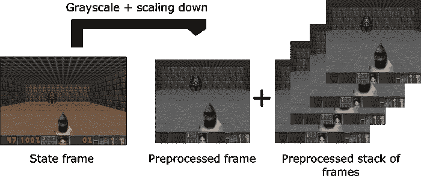

预处理是一个重要的步骤。我们希望降低状态的复杂性，以减少训练所需的计算时间。

首先，我们可以对每个状态进行灰度化。颜色并不添加重要信息(在我们的例子中，我们只需要找到敌人并杀死他，我们不需要颜色来找到他)。这是一个重要的节省，因为我们将三色通道(RGB)减少到 1(灰度)。

然后，我们裁剪框架。在我们的例子中，看到屋顶并没有真正的用处。

然后我们缩小框架的尺寸，我们把四个子框架叠在一起。

#### **时间限制的问题**

亚瑟·朱利安尼在[的文章](https://medium.com/emergent-future/simple-reinforcement-learning-with-tensorflow-part-8-asynchronous-actor-critic-agents-a3c-c88f72a5e9f2)中对这个话题做了精彩的解释。他有一个聪明的主意:使用 [LSTM 神经网络](http://colah.github.io/posts/2015-08-Understanding-LSTMs/)来处理这个问题。

不过我觉得新手还是用叠框比较好。

你可能会问的第一个问题是，为什么我们要把帧堆叠在一起？

我们将帧堆叠在一起，因为这有助于我们处理时间限制的问题。

让我们举个例子，在乒乓游戏中。当你看到这个画面时:

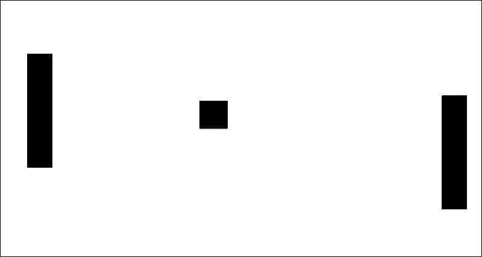

你能告诉我球要去哪里吗？

不会，因为一帧不够有运动感！

但是如果我再加三帧呢？这里你可以看到球向右边移动。

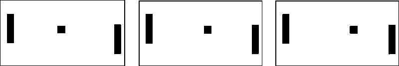

对我们的末日特工来说也是一样。如果我们一次只给他一帧，它就没有运动的概念。如果它不能确定物体移动的方向和速度，它又怎么能做出正确的决定呢？

#### **使用卷积网络**

这些帧由三个卷积层处理。这些图层允许您利用影像中的空间关系。此外，由于框架堆叠在一起，您可以利用这些框架的一些空间属性。

如果你不熟悉卷积，请阅读这篇由[亚当·盖特吉](https://www.freecodecamp.org/news/an-introduction-to-deep-q-learning-lets-play-doom-54d02d8017d8/undefined)撰写的[优秀的直觉文章](https://medium.com/@ageitgey/machine-learning-is-fun-part-3-deep-learning-and-convolutional-neural-networks-f40359318721)。

每个卷积层将使用 ELU 作为激活函数。ELU 已经被证明是卷积层的一个好的[激活函数。](https://arxiv.org/pdf/1511.07289.pdf)

我们使用一个具有 ELU 激活函数的全连接层和一个输出层(一个具有线性激活函数的全连接层),为每个动作产生 Q 值估计。

#### **经验回放:更有效地利用观察到的经验**

经验回放将帮助我们处理两件事:

*   避免忘记以前的经历。
*   减少体验之间的相关性。

我来解释一下这两个概念。

这一部分和插图的灵感来自于深度学习基础纳米学位 [Udacity](https://eu.udacity.com/) 的深度 Q 学习章节中的精彩解释。

#### **避免忘记以前的经历**

我们有一个大问题:权重的可变性，因为在动作和状态之间有很高的相关性。

记得在第一篇文章([强化学习简介](https://medium.freecodecamp.org/an-introduction-to-reinforcement-learning-4339519de419))中，我们谈到了强化学习的过程:


在每个时间步，我们接收一个元组(状态、动作、奖励、新状态)。我们从中学习(我们在我们的神经网络中喂养元组)，然后抛出这个经验。

我们的问题是，我们将与环境交互的连续样本提供给我们的神经网络。当它用新的经历覆盖时，它往往会忘记以前的经历。

例如，如果我们在第一层，然后在第二层(这是完全不同的)，我们的代理可以忘记如何在第一层的行为。

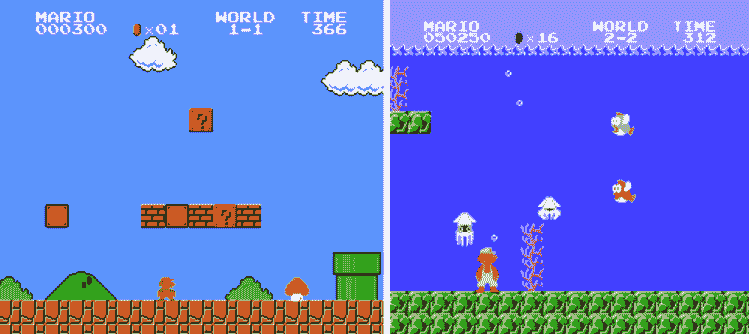

By learning how to play on water level, our agent will forget how to behave on the first level

因此，通过多次学习，利用以前的经验会更有效。

我们的解决方案是:创建一个“重放缓冲区”这存储了与环境交互时的经验元组，然后我们对一小批元组进行采样，以馈入我们的神经网络。

可以把重放缓冲区想象成一个文件夹，其中的每个表都是一个体验元组。你通过与环境的互动来喂养它。然后你随便拿一些纸来输入神经网络

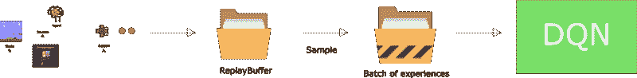

这防止了网络仅了解它立即做了什么。

#### **降低体验之间的相关性**

我们还有另一个问题——我们知道每个动作都会影响下一个状态。这输出了高度相关的经验元组序列。

如果我们按顺序训练网络，我们的代理人可能会受到这种相关性的影响。

通过从重放缓冲区随机取样，我们可以打破这种相关性。这可以防止动作值发生剧烈的波动或偏离。

举个例子会更容易理解。假设我们玩一个第一人称射击游戏，怪物可以出现在左边或右边。我们特工的目标是射杀怪物。它有两把枪和两个动作:向左射击或向右射击。

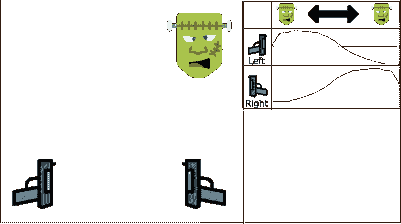

The table represents the Q-values approximations

我们通过有序的经验来学习。假设我们知道，如果我们射杀一个怪物，下一个怪物来自同一个方向的概率是 70%。在我们的例子中，这是我们的经验元组之间的相关性。

让我们开始训练吧。我们的特工看到了右边的怪物，并用正确的枪射杀了它。这是正确的！

那么下一个怪物也是从右边来的(有 70%的概率)，代理人会用正确的枪射击。还是那句话，这很好！

如此等等…

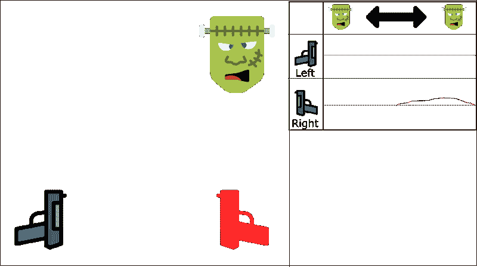

Red gun is the action taken

问题是，这种方法增加了在整个状态空间中使用正确的枪的价值。


We can see that the Q-value for monster being at left and shooting with right gun is positive (even if it’s not rational)

如果我们的代理没有看到很多左边的例子(因为只有 30%可能来自左边)，我们的代理只会选择右边，而不管怪物来自哪里。这一点都不理性。

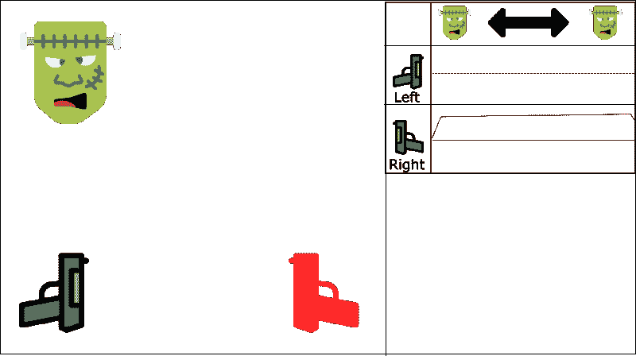

Even if the monster comes to the left, our agent will shoot with the right gun

我们有两个并行的策略来处理这个问题。

首先，我们必须在与环境互动的同时停止学习。我们应该尝试不同的东西，随机地玩一会儿来探索状态空间。我们可以将这些体验保存在重放缓冲区中。

然后，我们可以回忆这些经历并从中学习。之后，再回去玩更新值函数。

因此，我们将有一套更好的例子。我们将能够从这些例子中归纳出模式，以任何顺序回忆它们。

这有助于避免被固定在状态空间的一个区域。这可以防止重复强化同一个动作。

这种方法可以被看作是监督学习的一种形式。

我们将在以后的文章中看到，我们也可以使用“优先体验重放”这让我们更频繁地向神经网络呈现稀有或“重要”的元组。

### **我们的深度 Q 学习算法**

首先是一点数学知识:

[记住，我们使用贝尔曼方程更新给定状态和动作的 Q 值](https://medium.freecodecamp.org/diving-deeper-into-reinforcement-learning-with-q-learning-c18d0db58efe):

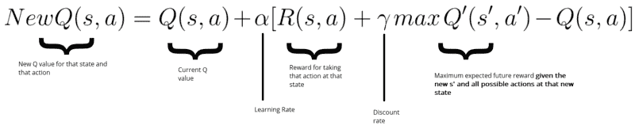

在我们的例子中，我们希望更新我们的神经网络权重以减少误差。

通过取我们的 Q_target(来自下一状态的最大可能值)和 Q_value(我们对 Q 值的当前预测)之间的差来计算误差(或 TD 误差)


```
Initialize Doom Environment EInitialize replay Memory M with capacity N (= finite capacity)Initialize the DQN weights wfor episode in max_episode:    s = Environment state    for steps in max_steps:         Choose action a from state s using epsilon greedy.         Take action a, get r (reward) and s' (next state)         Store experience tuple <s, a, r, s'> in M         s = s' (state = new_state)                  Get random minibatch of exp tuples from M         Set Q_target = reward(s,a) +  γmaxQ(s')         Update w =  α(Q_target - Q_value) *  ∇w Q_value
```

该算法中有两个过程:

*   我们对执行动作的环境进行采样，并将观察到的体验元组存储在重放存储器中。
*   随机选择小批量元组，并使用梯度下降更新步骤从中学习。

### **让我们实现我们的深度 Q 神经网络**

> 我们制作了一个视频，其中我们用 Tensorflow 实现了一个深度 Q 学习代理，它学习玩 Atari Space Invaders？️?。

现在我们知道它是如何工作的，我们将一步一步地实现我们的深度 Q 神经网络。下面链接的 Jupyter 笔记本中直接解释了代码的每个步骤和每个部分。

可以在[深度强化学习课程 repo 中访问。](https://github.com/simoninithomas/Deep_reinforcement_learning_Course/tree/master/DQN/doom)

仅此而已！你刚刚创造了一个学习玩毁灭战士的代理人。厉害！

不要忘记自己实现代码的每一部分。尝试修改我给你的代码真的很重要。尝试添加纪元，改变架构，添加固定的 Q 值，改变学习速率，使用更硬的环境(比如健康采集)…等等。玩得开心！

在下一篇文章中，我将讨论深度 Q-learning 的最新改进:

*   固定 Q 值
*   优先体验重放
*   双 dql
*   决斗网络

但是下一次我们将通过训练一个扮演毁灭战士的代理人来研究政策梯度，并且我们将通过收集生命值来尝试在敌对的环境中生存。

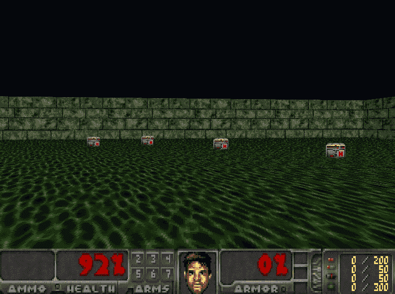

如果你喜欢我的文章，请点击？下面是你喜欢文章的次数，所以其他人会在媒体上看到它。别忘了跟着我！

如果你有任何想法，评论，问题，欢迎在下面评论或者给我发邮件:hello@simoninithomas.com，或者发推特给我。


不断学习，保持牛逼！

#### Tensorflow 深度强化学习课程？️

？S [yllabus](https://simoninithomas.github.io/Deep_reinforcement_learning_Course/)

？视频版本

第一部分:[强化学习简介](https://medium.com/p/4339519de419/edit)

第 2 部分:[用 Q-Learning 更深入地研究强化学习](https://medium.freecodecamp.org/diving-deeper-into-reinforcement-learning-with-q-learning-c18d0db58efe)

第 3 部分:[深度 Q 学习简介:让我们玩毁灭战士](https://medium.freecodecamp.org/an-introduction-to-deep-q-learning-lets-play-doom-54d02d8017d8)

第 3 部分+: [深度 Q 学习的改进:决斗双 DQN，优先体验重放，固定 Q 目标](https://medium.freecodecamp.org/improvements-in-deep-q-learning-dueling-double-dqn-prioritized-experience-replay-and-fixed-58b130cc5682)

第 4 部分:[关于厄运和翻转的政策梯度的介绍](https://medium.freecodecamp.org/an-introduction-to-policy-gradients-with-cartpole-and-doom-495b5ef2207f)

第五部分:[优势演员介绍评论方法:我们来玩刺猬索尼克吧！](https://medium.freecodecamp.org/an-intro-to-advantage-actor-critic-methods-lets-play-sonic-the-hedgehog-86d6240171d)

第 6 部分:[刺猬索尼克 2 和 3 的近似策略优化(PPO)](https://towardsdatascience.com/proximal-policy-optimization-ppo-with-sonic-the-hedgehog-2-and-3-c9c21dbed5e)

第七部分:[好奇心驱动的学习变得简单第一部分](https://towardsdatascience.com/curiosity-driven-learning-made-easy-part-i-d3e5a2263359)