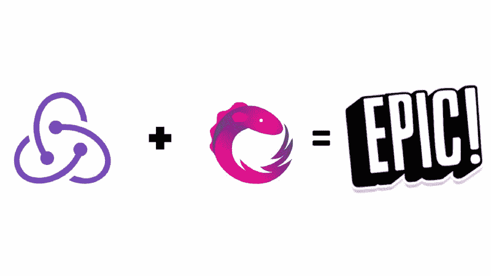

# Redux 中的函数式反应式编程简介

> 原文：<https://www.freecodecamp.org/news/an-introduction-to-functional-reactive-programming-in-redux-b0c14d097836/>

布万·马利克

# Redux 中的函数式反应式编程简介



让我们从什么是“反应式编程”的基本概念开始:

> ***反应式编程*** *是一种异步[编程范式](https://en.wikipedia.org/wiki/Programming_paradigm)与[数据流](https://en.wikipedia.org/wiki/Dataflow_programming)和变化传播有关。*
> *-维基百科*

或者 Rx 是反应式编程最流行的 API。它建立在可观察模式、迭代器模式和函数式编程的思想之上。Rx 有不同语言的库，但我们将使用 [RxJS](https://github.com/ReactiveX/rxjs) 。

#### Rx 基于**个可观察量**、**个观察者、**和**个算子**

一个观察者本质上**订阅**一个可观察的。

然后，被观察者发出数据流，观察者听到这些数据流并作出反应，在数据流上启动一系列操作。实际功率来自运营商或“无功扩展”(因此称为 Rx) **。**

操作符允许您转换、组合、操作和处理由 Observables 发出的项目序列。

如果你不熟悉 Rx，你可能很难理解和使用 [Redux-Observable](https://redux-observable.js.org/) 。所以我建议你先把 Rx 弄脏！

现在开始使用 RxJS 和 Redux。

### 冗余可观察的


#### Redux-Observable 是一个基于 RxJS 的 Redux 中间件

这是 Redux Docs 对 Redux 中的中间件的看法:

> 中间件提供了一个第三方的扩展点，在分派一个动作和它到达缩减器之间。

Redux 中间件可以用于日志记录、崩溃报告、与异步 API 对话、路由等等。或者我们可以笼统地说**副作用**。

#### 那么 Redux-Observable 是如何做到这一切的呢？

穿越[史诗](https://redux-observable.js.org/docs/basics/Epics.html)。史诗是可重复观察的核心原语。epic 只是一个简单的函数，它接受一个动作，然后返回另一个动作。**动作进→动作出**。因此，动作被视为流。

React 的任何组件中调度的每个动作都将作为一个流通过这样的函数(Epics)。

让我们看看一个简单的史诗，接受一个`action` `'PING’`并返回一个**新的** `action` `'PONG’`是什么样子的:

```
const pingEpic = action$ =>  action$.filter(action => action.type === 'PING')    .mapTo({ type: 'PONG' })
```

`action`后的`$`用于表示这些变量正在引用流。因此，我们有一系列的动作被传递到 Epic 中，我们在这些动作上使用了 RxJS 的`filter`操作符。

该过滤运算符过滤掉所有不属于`type` `PING`的动作！因此，史诗`pingEpic`只关注`type` `‘PING’`的操控动作。最后，这个`action` `‘PING’`映射到满足史诗主规则的`type` `‘PONG’`的一个新的`action`:**动作入→动作出**。

因为每一个 epic 只关注一个特定类型的动作，所以我们为`action$` (stream)提供了一个特殊的操作符来过滤掉流中不需要的动作。这个操作员就是`ofType()`操作员。

使用`ofType`重写之前的史诗，我们得到:

```
const pingEpic = action$ =>  action$.ofType('PING')  .mapTo({ type: 'PONG' })
```

如果您希望您的 epic 允许多种类型的操作，`ofType()`操作符可以接受任意数量的参数，比如:`ofType(type1, type2, type3,...)`。

#### 深入了解史诗如何运作的细节

你可能会认为“乒”这个动作只是进来，然后被这部史诗所吞噬。事实并非如此。有两件事要永远记住:

1.  每个动作总是先去减速器
2.  只有在那之后，这一行动才被史诗所接受

因此，Redux 循环正常工作。

`action` `‘PING’`先到达减速器，然后被 Epic 接收，再换成新的`action` `‘PONG’`发送给减速器。

我们甚至可以在 Epic 中访问商店的状态，因为 Epic 的第二个参数是 Redux 商店的简化版本！见下图:
`const myEpic = (action$, store) =&`gt；我们可以直接调用 e()来访问 Epics 内部的状态。

#### 运算符链接

在接收一个动作和发送一个新动作之间，我们可以做各种我们想做的异步副作用，比如 AJAX 调用、web 套接字、计时器等等。这是通过使用 Rx 提供的大量**操作符**来完成的。

> 这些 Rx 操作符允许你以声明的方式将异步序列组合在一起，具有回调的所有效率优势，但没有嵌套回调处理程序的缺点，而嵌套回调处理程序通常与异步系统相关联。

我们得到了回调的好处，没有了臭名昭著的“回调地狱”。

看看我们如何利用下面的运营商的力量。

#### 一个常见的用例

假设我们想要使用类似字典 API 的工具，使用用户实时输入的文本来搜索一个单词。我们主要处理存储(在 Redux 存储中)和显示 API 调用的结果。我们还希望消除 API 调用的抖动，以便在用户停止输入的 1 秒钟内调用 API。

这是使用 Epic 和 RxJS 操作符完成的方式:

```
const search = (action$, store) =>  action$.ofType('SEARCH')  .debounceTime(1000)  .mergeMap(action =>    ajax.getJSON(`https://someapi/words/${action.payload}`)     .map(payload => ({ type: 'SET_RESULTS', payload }))     .catch(payload => Observable.of({type: 'API_ERROR', payload}))  )
```

太多了吗？！别担心，我们来分析一下。

史诗正在得到一连串的动作。由于用户不断地输入，每个输入动作(`action.payload`)的有效负载都包含更新的搜索字符串。

操作符`debounceTime()`用于过滤掉流中除最后一个动作之外的一些动作。基本上，只有在 1 秒钟没有接收到另一个动作或可观察到的情况下，它才会通过它传递一个动作。

然后，我们发出 AJAX 请求，将结果映射到另一个动作`'set_RESULTS'`,该动作将响应数据`(payload)`传递给缩减器，这是动作输出部分。

使用`catch`操作符捕捉任何 API 错误。发出一个带有错误细节的新操作，稍后显示一个带有错误消息的烤面包机。

请注意在 AJAX 请求之后的`mergeMap()`中是如何捕捉的？这是因为`mergeMap()`创建了一个孤立的链。否则这个错误会传到`ofType()`并终止我们的史诗。如果出现这种情况，史诗将停止监听未来的任何行动！

我们也可以对 AJAX 请求使用传统的承诺。然而，它们有一个固有的问题，就是不能被取消。所以使用 Epics 的另一个重要用例是 AJAX 取消。

我们使用`takeUntil`操作符来处理这个问题。这就像我们在 AJAX 请求之后在`mergeMap`中使用的`catch`操作符一样。

这是因为`takeUntil`必须停止当前的 AJAX 请求，而不是整个 Epic！因此，隔离操作符链在这里也很重要。

去抖动、节流、过滤、AJAX 取消等等，只是冰山一角。我们有无数的[操作符](http://reactivex.io/documentation/operators.html)供我们使用，使得困难的用例变得微不足道。使用这些操作符，您可以发挥您的想象力所允许的创造力！函数式反应式编程(FRP)以它自己的方式是优雅的。

我这篇文章的重点是在 Redux 中使用 Redux-Observable 解释 FRP 的部分。要在 React+Redux 中设置 Redux-Observable，请参考[官方文档](https://redux-observable.js.org/)——它有很好的文档记录，非常详细，非常简单。

一定要看看我关于 Redux 的另一篇文章，这篇文章探索了创建 reducers 的最佳实践:

[**用 create Reducer()**](https://medium.freecodecamp.org/reducing-the-reducer-boilerplate-with-createreducer-86c46a47f3e2)
[*还原还原器样板首先，快速回顾一下 Redux 中的还原器有哪些:*medium.freecodecamp.org](https://medium.freecodecamp.org/reducing-the-reducer-boilerplate-with-createreducer-86c46a47f3e2)

想要提高您的 JavaScript 基础知识吗？读一下这些:

[**JavaScript ES6 函数:好的部分**](https://medium.freecodecamp.org/es6-functions-9f61c72b1e86)
[*ES6 提供了一些很酷的新功能特性，使 JavaScript 编程更加灵活。再来说说…*medium.freecodecamp.org](https://medium.freecodecamp.org/es6-functions-9f61c72b1e86)[**JavaScript 变量提升指南？有了 let 和 const**](https://medium.freecodecamp.org/what-is-variable-hoisting-differentiating-between-var-let-and-const-in-es6-f1a70bb43d)
[N*ew JavaScript 开发人员通常很难理解变量/函数提升的独特行为。m*edium.freecodecamp.org](https://medium.freecodecamp.org/what-is-variable-hoisting-differentiating-between-var-let-and-const-in-es6-f1a70bb43d)[**函数提升&提升面试问题**](https://medium.freecodecamp.org/function-hoisting-hoisting-interview-questions-b6f91dbc2be8)
[*这是我之前关于变量提升的文章《JavaScript 变量提升指南？与……m*edium.freecodecamp.org](https://medium.freecodecamp.org/function-hoisting-hoisting-interview-questions-b6f91dbc2be8)

和平✌️