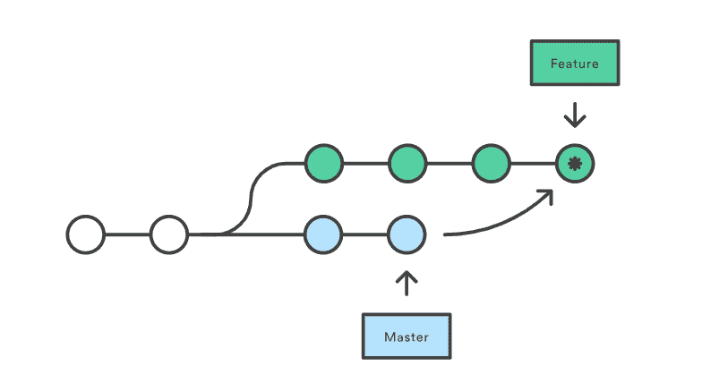
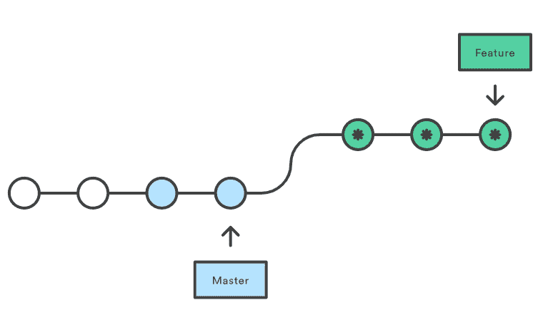
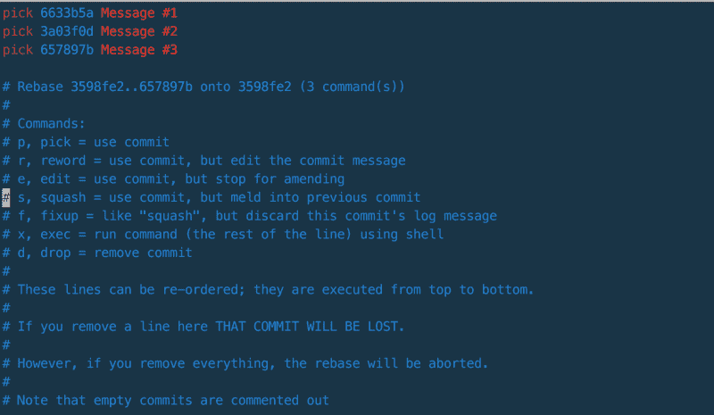

# Git merge 和 rebase 简介:它们是什么，以及如何使用它们

> 原文：<https://www.freecodecamp.org/news/an-introduction-to-git-merge-and-rebase-what-they-are-and-how-to-use-them-131b863785f/>

作者瓦利·沙阿

# Git Merge 和 Git Rebase 简介:它们做什么以及何时使用它们


作为一名开发人员，我们中的许多人不得不在合并和 Rebase 之间做出选择。根据我们从互联网上得到的所有参考，每个人都认为“不要使用 Rebase，它可能会导致严重的问题。”在这里，我将解释什么是 merge 和 rebase，为什么你应该(和不应该)使用它们，以及如何这样做。

Git Merge 和 Git Rebase 服务于相同的目的。它们被设计成将来自多个分支的变更集成到一个分支中。尽管最终目标是相同的，但这两种方法以不同的方式实现了它，当你成为一名更好的软件开发人员时，了解这种差异是很有帮助的。

这个问题分裂了 Git 社区。有些人认为你应该总是 rebase 和其他人认为你应该总是合并。双方都有一些令人信服的好处。

### Git Merge

对于使用版本控制系统的开发人员来说，合并是一种常见的做法。无论分支是为了测试、错误修复还是其他原因而创建的，合并都会将更改提交到另一个位置。更具体地说，合并获取源分支的内容，并将它们与目标分支集成在一起。在这个过程中，只有目标分支被改变。源分支历史保持不变。



Merge Master -> Feature branch

#### **优点**

*   简单而熟悉
*   保存完整的历史和时间顺序
*   维护分支的上下文

#### **缺点**

*   提交历史可能会被大量的合并提交所污染
*   使用`git bisect`进行调试会变得更加困难

#### **怎么做**

使用`checkout`和`merge`命令将主分支合并到特征分支中。

```
$ git checkout feature
$ git merge master

(or)

$ git merge master feature
```

这将在特征分支中创建一个新的“**合并提交**”，保存两个分支的历史。

### Git Rebase

Rebase 是将变更从一个分支整合到另一个分支的另一种方式。Rebase 将所有更改压缩到一个“补丁”中然后，它将补丁集成到目标分支上。

与合并不同，重定基础使历史变平，因为它将完成的工作从一个分支转移到另一个分支。在这个过程中，不需要的历史被删除。

> *rebase 是变更应该如何从层次结构的顶部向下传递，而 merges 是它们如何向上流回的方式*



Rebase feature branch into master

#### **优点**

*   简化潜在的复杂历史
*   操作单个提交很容易(例如，恢复它们)
*   避免在具有繁忙分支的繁忙存储库中出现合并提交“噪音”
*   通过将中间提交变成单个提交来清理它们，这对开发运维团队很有帮助

#### **缺点**

*   将该特性压缩为少量的提交可以隐藏上下文
*   在团队工作时，改变公共存储库的基础是很危险的
*   这需要更多的工作:使用 rebase 来保持你的特性分支总是更新的
*   使用远程分支重置基础需要您*强制推送。*人们面临的最大问题是他们强制推送，但没有设置 git 推送默认值。这导致本地和远程的所有分支都有相同名称的更新，这是**可怕的**处理。

> 如果你不正确地改变了基数，无意中改写了历史，这可能会导致严重的问题，所以请确保你知道你在做什么！

#### **怎么做**

使用以下命令将特征分支重置到主分支上。

```
$ git checkout feature
$ git rebase master
```

这会将整个特征分支移动到主分支的顶部。它通过为原始(特性)分支中的每个提交创建全新的提交来重写项目历史。

#### **交互式重置基础**

这允许在提交被移动到新的分支时改变提交。这比自动化 rebase 更强大，因为它提供了对分支提交历史的完全控制。通常，这用于在将特征分支合并到主特征之前清理混乱的历史。

```
$ git checkout feature
$ git rebase -i master
```

这将通过列出所有将要移动的提交来打开编辑器。

```
pick 22d6d7c Commit message#1
pick 44e8a9b Commit message#2
pick 79f1d2h Commit message#3
```

这确切地定义了执行重定基础后分支的样子。通过对实体重新排序，您可以让历史看起来像您想要的那样。例如，您可以使用`fixup`、`squash`、`edit`等命令来代替`pick`。



### 用哪一个

那么什么是最好的呢？专家有什么推荐？

很难一概而论，决定选择哪一个，因为每个团队都是不同的。但是我们必须从某个地方开始。

团队在设置他们的 Git rebase vs. merge 策略时需要考虑几个问题。因为事实证明，一种工作流策略并不比另一种更好。这取决于你的团队。

考虑整个组织中的重定基础和 Git 能力水平。与合并的可追溯性和历史相比，确定您对重定基础的简单性的重视程度。

最后，在一个清晰的分支战略的背景下，应该考虑合并和重组的决定(参见 [**这篇文章**](https://medium.freecodecamp.org/adopt-a-git-branching-strategy-ac729ff4f838) 以了解更多关于分支战略)。成功的分支策略是围绕你的团队组织而设计的。

### 我推荐什么？

随着团队的成长，使用 **always merge 策略来管理或跟踪开发变更将变得更加困难。为了有一个清晰易懂的犯罪历史，使用**重定基准**是合理有效的。**

通过考虑以下情况和准则，您可以充分利用 **Rebase:**

*   **你在本地发展:**如果你没有与他人分享你的工作。在这一点上，为了保持历史的整洁，你应该更喜欢重定基础而不是合并。如果您已经有了自己的库分支，并且没有与其他开发人员共享，那么即使在您已经推进到您的分支之后，您也可以安全地重定基础。
*   **您的代码已准备好接受审查:**您创建了一个拉请求。其他人正在审核您的工作，并可能将其放入他们的分支进行本地审核。在这一点上，你不应该改变你的工作。您应该创建“返工”提交并更新您的功能分支。这有助于拉取请求的可追溯性，并防止意外的历史破损。
*   审查已经完成，可以整合到目标分支中了。恭喜恭喜！您将删除您的要素分支。鉴于其他开发人员从现在开始不会在这些更改中进行提取合并，这是您整理历史的机会。此时，您可以重写历史，将原始提交和那些讨厌的“pr 返工”和“合并”提交合并成一小组集中提交。为这些提交创建显式合并是可选的，但是有价值。它记录了特征何时升级到主特征。

### 结论

我希望这个解释对 **Git 合并**和 **Git rebase 有所启发。**合并 vs 重定基础战略总是有争议的。但是，也许这篇文章将有助于消除您的疑虑，并允许您采用适合您的团队的方法。

我期待着撰写关于 **Git 工作流**和 **Git** 概念的文章。请对你希望我接下来写的主题发表评论。干杯！

`**code** = **co**ffee + **de**veloper`

[软件开发人员编码学校](https://www.microverse.org/)

