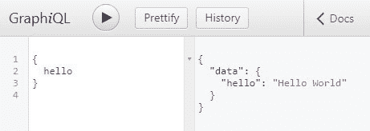

# GraphQL 简介:它如何工作以及如何使用

> 原文：<https://www.freecodecamp.org/news/an-introduction-to-graphql-how-it-works-and-how-to-use-it-91162ecd72d0/>

GraphQL 是 API 的查询语言。它显示了服务器提供的不同类型的数据，然后客户端可以准确地选择它想要的。

此外，在 GraphQL 中，您可以在一次调用中获得多个服务器资源，而不是进行多次 REST API 调用。

你可以查看 https://graphql.org/的福利清单。

事实是，直到您看到 GraphQL 的运行，很难理解它的好处。所以让我们开始使用 GraphQL。

在本文中，我们将使用 graphql 和 node.js

### 先决条件

从这里安装 NodeJS:[https://nodejs.org/en/](https://nodejs.org/en/)。

### 如何将 GraphQL 与 NodeJs 一起使用

GraphQL 可以用于多种语言。这里我们将重点讨论如何使用 NodeJS 将 GraphQL 与 JavaScript 结合使用。

创建一个名为 **graphql-with-nodejs** 的文件夹。进入项目文件夹并运行`npm init`来创建 NodeJS 项目。下面给出了执行此操作的命令。

```
cd graphql-with-nodejs npm init
```

### 安装依赖项

使用以下命令安装 Express:

```
npm install express
```

使用以下命令安装 GraphQL。我们将安装 GraphQL 和 GraphQL for Express。

```
npm install express-graphql graphql
```

### NodeJS Code(节点代码)

在项目中创建一个名为 **server.js** 的文件，并将以下代码复制到其中:

```
const express = require('express');
const port = 5000;
const app = express();

app.get('/hello', (req,res) => {
    res.send("hello");
   }
);

app.listen(port);
console.log(`Server Running at localhost:${port}`);
```

上面的代码有一个名为 **/hello** 的 HTTP GET 端点。

终点是使用 Express 创建的。

现在让我们修改这段代码来启用 GraphQL。

### 在代码中启用 GraphQL

GraphQL 将有一个名为 **/graphql** 的 URL 端点来处理所有请求。

将以下代码复制到 **server.js:**

```
//get all the libraries needed
const express = require('express');
const graphqlHTTP = require('express-graphql');
const {GraphQLSchema} = require('graphql');

const {queryType} = require('./query.js');

//setting up the port number and express app
const port = 5000;
const app = express();

 // Define the Schema
const schema = new GraphQLSchema({ query: queryType });

//Setup the nodejs GraphQL server
app.use('/graphql', graphqlHTTP({
    schema: schema,
    graphiql: true,
}));

app.listen(port);
console.log(`GraphQL Server Running at localhost:${port}`);
```

现在让我们来看一下这段代码。

**graphqlHTTP** 使我们能够在 **/graphql** url 设置一个 GraphQL 服务器。它知道如何处理传入的请求。

这一设置是通过以下代码行完成的:

```
app.use('/graphql', graphqlHTTP({
    schema: schema,
    graphiql: true,
}));
```

现在让我们研究一下 graphqlHTTP 中的参数。

### ql 图形

GraphQL 是一个 Web UI，您可以用它来测试 graph QL 端点。我们将把它设置为 true，以便更容易测试我们创建的各种 GraphQL 端点。

### (计划或理论的)纲要

GraphQL 只有一个外部端点 **/graphql** 。这个端点可以有多个其他端点做不同的事情。这些端点将在模式中指定。

该模式会做如下事情:

*   指定端点
*   指示端点的输入和输出字段
*   指示当一个端点被命中时应该做什么动作等等。

该模式在代码中定义如下:

```
const schema = new GraphQLSchema({ query: queryType });
```

该模式可以包含**查询**以及**变异**类型。本文将只关注查询类型。

### 询问

您可以在模式中看到，**查询**已经被设置为**查询类型**。

我们使用以下命令从 **query.js** 文件导入 queryType:

```
const {queryType} = require('./query.js');
```

**query.js** 是我们即将创建的自定义文件。

**查询**是我们在模式中指定只读端点的地方。

在项目中创建一个名为 **query.js** 的文件，并将下面的代码复制到其中。

```
const { GraphQLObjectType,
    GraphQLString
} = require('graphql');

//Define the Query
const queryType = new GraphQLObjectType({
    name: 'Query',
    fields: {
        hello: {
            type: GraphQLString,

            resolve: function () {
                return "Hello World";
            }
        }
    }
});

exports.queryType = queryType;
```

### 查询已解释

queryType 被创建为一个 **GraphQLObjectType** ，并被命名为**查询**。

**字段**是我们指定各种端点的地方。

因此，我们在这里添加了一个名为 **hello 的端点。**

**hello** 有一个 **GraphQLString** 的**类型**，这意味着这个端点有一个字符串的返回类型。类型是 **GraphQLString** 而不是 **String** ，因为这是一个 GraphQL 模式。所以直接用 String 是不行的。

**resolve** 函数表示端点被调用时要做的动作。这里的操作是返回一个字符串“Hello World”。

最后，我们使用`exports.queryType = queryType`导出 querytype。这是为了确保我们可以在 **server.js.** 中导入它

### 运行应用程序

使用以下命令运行应用程序:

```
node server.js
```

应用程序运行在 **localhost:5000/graphql** 上。

您可以通过转到 localhost:5000/graphql 来测试应用程序。

这个 URL 运行 Graphiql web UI，如下图所示。



输入在左边给出，输出在右边显示。

给出以下输入

```
{
  hello
}
```

这将产生以下输出

```
{
  "data": {
    "hello": "Hello World"
  }
}
```

### 恭喜你。

您已经创建了第一个 GraphQL 端点。

### 添加更多端点

我们将创建 2 个新端点:

*   **movie** :这个端点将返回一部电影，给定电影 ID
*   **控制器**:该端点将返回给定控制器标识的控制器。它也将归还由这位导演导演的所有电影。

### 添加数据

通常，应用程序会从数据库中读取数据。但是对于本教程，为了简单起见，我们将在代码中硬编码数据。

创建一个名为 **data.js** 的文件，并添加以下代码。

```
//Hardcode some data for movies and directors
let movies = [{
    id: 1,
    name: "Movie 1",
    year: 2018,
    directorId: 1
},
{
    id: 2,
    name: "Movie 2",
    year: 2017,
    directorId: 1
},
{
    id: 3,
    name: "Movie 3",
    year: 2016,
    directorId: 3
}
];

let directors = [{
    id: 1,
    name: "Director 1",
    age: 20
},
{
    id: 2,
    name: "Director 2",
    age: 30
},
{
    id: 3,
    name: "Director 3",
    age: 40
}
];

exports.movies = movies;
exports.directors = directors;
```

这个文件有电影和导演的数据。我们将使用该文件中的数据作为我们的端点。

### 将电影端点添加到查询中

新端点将被添加到 query.js 文件中的 queryType 中。

电影端点的代码如下所示:

```
movie: {
            type: movieType,
            args: {
                id: { type: GraphQLInt }
            },
            resolve: function (source, args) {
                return _.find(movies, { id: args.id });
            }
        }
```

这个端点的返回类型是 **movieType** ，即将定义。

**args** 参数用于指示电影端点的输入。这个端点的输入是类型为 **GraphQLInt 的 **id** 。**

**resolve** 函数从电影列表中返回 id 对应的电影。 **find** 是来自 **lodash** 库中的一个函数，用于查找列表中的一个元素。

**query.js** 的完整代码如下所示:

```
const { GraphQLObjectType,
    GraphQLString,
    GraphQLInt
} = require('graphql');
const _ = require('lodash');

const {movieType} = require('./types.js');
let {movies} = require('./data.js');

//Define the Query
const queryType = new GraphQLObjectType({
    name: 'Query',
    fields: {
        hello: {
            type: GraphQLString,

            resolve: function () {
                return "Hello World";
            }
        },

        movie: {
            type: movieType,
            args: {
                id: { type: GraphQLInt }
            },
            resolve: function (source, args) {
                return _.find(movies, { id: args.id });
            }
        }
    }
});

exports.queryType = queryType;
```

从上面的代码中，我们可以看到 **movieType** 实际上是在 **types.js.** 中定义的

### 添加自定义类型 movieType

创建一个名为 **types.js** 的文件。

将以下代码添加到 types.js 中

```
const {
    GraphQLObjectType,
    GraphQLID,
    GraphQLString,
    GraphQLInt
} = require('graphql');

// Define Movie Type
movieType = new GraphQLObjectType({
    name: 'Movie',
    fields: {
        id: { type: GraphQLID },
        name: { type: GraphQLString },
        year: { type: GraphQLInt },
        directorId: { type: GraphQLID }

    }
});

exports.movieType = movieType;
```

可以看出， **movieType** 被创建为 **GraphQLObjectType。**

它有 4 个字段: **id、姓名、年份和目录 Id** 。添加这些字段时，还会指定每个字段的类型。

这些字段直接来自数据。在这种情况下，它将来自**电影**列表。

### 为控制器端点添加查询和类型

像电影一样，甚至可以添加导演端点。

在 **query.js** 中，可以添加导演端点如下:

```
director: {
            type: directorType,
            args: {
                id: { type: GraphQLInt }
            },
            resolve: function (source, args) {
                return _.find(directors, { id: args.id });
            }
        }
```

**目录类型**可以在**类型. js 中添加如下:**

```
//Define Director Type
directorType = new GraphQLObjectType({
    name: 'Director',
    fields: {
        id: { type: GraphQLID },
        name: { type: GraphQLString },
        age: { type: GraphQLInt },
        movies: {
            type: new GraphQLList(movieType),
            resolve(source, args) {
                return _.filter(movies, { directorId: source.id });
            }

        }

    }
});
```

等一下。**导演类型**与**电影类型**略有不同。这是为什么呢？

为什么**directory type 里面有 resolve 函数？**之前我们看到解析函数只出现在**查询中……**

### 董事类型的特殊性

当调用**导演**端点时，我们必须返回导演的详细信息，以及导演执导的所有电影。

**董事类型**中的前 3 个字段 **id、姓名、年龄**很简单，直接来自数据(**董事**列表)。

第四个字段， **movies，**需要包含该导演的电影列表。

为此，我们要提到的是**电影**字段的类型是电影类型的**图表列表(电影列表)。**

但是我们到底要怎么找到这个导演导演的所有电影呢？

为此，我们在电影字段中有一个**解析**函数。这个解析函数的输入是**源**和**参数**。

源将具有父对象详细信息。

假设导演的字段 **id =1，name = "Random "和 age = 20** 。然后 **source.id =1，source . name = " Random ", source . age = 20**

所以在这个例子中，resolve 函数找出了 directorId 与所需导演的 Id 相匹配的所有电影。

### 密码

该应用程序的完整代码可在这个 [GitHub repo](https://github.com/aditya-sridhar/graphql-with-nodejs) 中获得

### 测试应用程序

现在让我们针对不同的场景测试应用程序。

使用`node server.js`运行应用程序。

转到 **localhost:5000/graphql** 并尝试以下输入。

### 电影

输入:

```
{
  movie(id: 1) {
    name
  }
}
```

输出:

```
{
  "data": {
    "movie": {
      "name": "Movie 1"
    }
  }
}
```

从上面我们可以看到，客户端可以准确地请求它想要的东西，而 GraphQL 将确保只发送回那些参数。这里只请求了**名称**字段，并且只有该字段被服务器发回。

在`movie(id: 1)`中，id 是输入参数。我们要求服务器发回 id 为 1 的电影。

输入:

```
{
  movie(id: 3) {
    name
    id
    year
  }
}
```

输出:

```
{
  "data": {
    "movie": {
      "name": "Movie 3",
      "id": "3",
      "year": 2016
    }
  }
}
```

在上面的示例中,**名称、id 和年份**字段是必需的。所以服务器发回所有这些字段。

### 主管

输入:

```
{
  director(id: 1) {
    name
    id,
    age
  }
}
```

输出:

```
{
  "data": {
    "director": {
      "name": "Director 1",
      "id": "1",
      "age": 20
    }
  }
}
```

输入:

```
{
  director(id: 1) {
    name
    id,
    age,
    movies{
      name,
      year
    }
  }
}
```

输出:

```
{
  "data": {
    "director": {
      "name": "Director 1",
      "id": "1",
      "age": 20,
      "movies": [
        {
          "name": "Movie 1",
          "year": 2018
        },
        {
          "name": "Movie 2",
          "year": 2017
        }
      ]
    }
  }
}
```

在上面的例子中，我们看到了 GraphQL 的强大。我们指出我们需要一个 id 为 1 的导演。此外，我们表示我们想要这个导演的所有电影。导演和电影字段都是可定制的，客户端可以准确地请求它想要的。

同样，这可以扩展到其他领域和类型。例如，我们可以运行类似**的查询，查找 id 为 1 的导演。找这个导演所有的电影。为每部电影找到演员。对于每个演员获得排名前 5 的电影**等等。对于这个查询，我们需要指定类型之间的关系。一旦我们这样做了，客户端就可以查询它想要的任何关系。

### 恭喜你。

您现在已经了解了 GraphQL 的基本概念。

您可以查看[文档](https://graphql.github.io/learn/)来了解更多关于 GraphQL 的信息

### 关于作者

我热爱技术，关注该领域的进步。我也喜欢用我的技术知识帮助别人。

请随时通过我的 LinkedIn 账户与我联系[https://www.linkedin.com/in/aditya1811/](https://www.linkedin.com/in/aditya1811/)

你也可以在推特上关注我[https://twitter.com/adityasridhar18](https://twitter.com/adityasridhar18)

我的网站:[https://adityasridhar.com/](https://adityasridhar.com/)

在 adityasridhar.com 的博客上阅读更多我的文章。