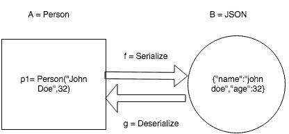

# Scala 中的法律测试介绍

> 原文：<https://www.freecodecamp.org/news/an-introduction-to-law-testing-in-scala-4243d72272f9/>

基于属性的法律测试是 scala 生态系统中最强大的工具之一。在这篇文章中，我将通过深入的代码示例解释如何使用法律测试以及它给你带来的价值。

这篇文章是针对那些想要提高测试知识和技能的 Scala 开发者的。它假设对 Scala、cats 和其他函数库有所了解。


#### **简介**

*   您可能熟悉作为一组值的类型(例如 Int 值有:`1,2,3` … String 值有:`“John Doe”` 等)。
*   您可能还熟悉从输入类型到输出类型的映射函数。
*   属性是在类型或函数上定义的，它描述了所需的行为。

那么什么是法律呢？继续阅读！

#### **一个具体的例子**

下面是我们钟爱的`*Person*`数据类型:

```
case class Person(name: String, age: Int)
```

使用 `Play-Json`序列化代码，这个库允许将你的`Person`类型转换成`JSON :`

```
val personFormat: OFormat[Person] = new OFormat[Person] {
  override def reads(json: JsValue): JsResult[Person] = {
    val name = (json \ "name").as[String]
    val age = (json \ "age").as[Int]
    JsSuccess(Person(name, age))
  }
override def writes(o: Person): JsObject =
    JsObject(Seq("name" -> JsString(o.name), 
                 "age" -> JsNumber(o.age)))
}
```

我们现在可以在特定的输入上测试这个序列化函数，如下所示:

```
import org.scalatest._
class PersonSerdeSpec extends WordSpecLike with Matchers {
  "should serialize and deserialize a person" in {
    val person = Person("John Doe", 32)
    val actualPerson =
      personFormat.reads(personFormat.writes(person))
    actualPerson.asOpt.shouldEqual(Some(person))
  }
}
```

但是，我们现在需要问自己，是否所有人都会连载成功？一个数据无效的人(比如负年龄)怎么办？我们会想要重复这个为所有测试数据寻找边缘案例的思考过程吗？

最重要的是，随着时间的推移，这些代码还能保持可读性吗？(例如:改变`person`数据类型【增加一个`LastName`字段】，对其他数据类型重复测试等)

> “我们可以通过引入额外的间接层来解决任何问题”。

### 基于属性的测试

我们使用的第一个武器是基于属性的测试(PBT)。PBT 的工作原理是定义一个属性，这是一个高级行为规范，适用于特定类型的所有值。

在我们的例子中，**属性**将是:

*   对于每个人 p，如果我们序列化和反序列化他们，我们应该得到相同的人。

使用 scala check 编写该属性如下所示:

```
object PersonSerdeSpec extends org.scalacheck.Properties("PersonCodec") {
  property("round trip consistency") = 
org.scalacheck.Prop.forAll { a: Person =>
    personFormat.reads(personFormat.writes(a)).asOpt.contains(a)
  }
}
```

属性检查需要一种生成人员的方法。这是通过使用一个`Arbitrary[Person]`来完成的，其定义如下:

```
implicit val personArb: Arbitrary[Person] = Arbitrary {
  for {
    name <- Gen.alphaStr
    age  <- Gen.chooseNum(0, 120)
  } yield Person(name, age)
}
```

此外，我们可以使用`“scalacheck-shapeless”`——一个神奇的库，它通过为我们生成任意类型定义，消除了(几乎)所有冗长(相当混乱且极易出错)的需求！


这可以通过添加以下内容来实现:

```
libraryDependencies += "com.github.alexarchambault" %% "scalacheck-shapeless_1.14" % "1.2.0"
```

并在我们的代码中导入以下内容:

```
import org.scalacheck.ScalacheckShapeless._
```

然后我们可以删除我们前面定义的`*personArb*`**实例。**

### **编解码器法律**

**让我们通过定义我们的数据类型的**法则**来进一步抽象:**

```
**`trait CodecLaws[A, B] {
  def serialize: A => B
  def deserialize: B => A
  def codecRoundTrip(a: A): Boolean = serialize.
andThen(deserialize)(a) == a
}`**
```

****

**这意味着给定**

*   **种类`A, B`**
*   **来自`A to B`的功能**
*   **来自`B to A`的功能**

**我们定义了一个名为“`codecRoundTrip`”的函数，它接受一个`“a: A”`，并通过函数来确保我们得到与 A 类型相同的值。**

**这条定律声明(没有给出任何实现细节)我们在给定输入上的往返不会“丢失”任何信息。**

> **另一种说法是宣称我们的 A 型和 B 型是同构的。**

**通过使用 cats-laws 库和用于定义等式描述的`IsEq` case 类，我们可以抽象更多。**

```
**`import cats.laws._
trait CodecLaws[A, B] {
  def serialize: A => B
  def deserialize: B => A
  def codecRoundTrip(a: A): cats.laws.IsEq[A] = serialize.andThen(deserialize)(a) <-> a
}
/** Represents two values of the same type that are expected to be equal. */
final case class IsEq[A](lhs: A, rhs: A)`**
```

**我们从这种类型和语法中得到的是两个值之间相等的**描述** **，而不是像以前一样的相等结果。****

### **编解码器测试**

**是时候检验我们刚刚定义的定律了。为了做到这一点，我们将使用“[规程](https://github.com/typelevel/discipline)库。**

```
**`import cats.laws.discipline._
import org.scalacheck.{ Arbitrary, Prop }
trait CodecTests[A, B] extends org.typelevel.discipline.Laws {
  def laws: CodecLaws[A, B]
  def tests(
    implicit
    arbitrary: Arbitrary[A],
    eqA: cats.Eq[A]
  ): RuleSet =
    new DefaultRuleSet(
      name   = name,
      parent = None,
      "roundTrip" -> Prop.forAll { a: A =>
        laws.codecRoundTrip(a)
      }
    )
}`**
```

**我们定义了一个 CodecTest 特征，它有两个类型参数`A and B`，在我们的例子中是`Person`和`JsResult`。**

**该特征保存了一个法则实例，并定义了一个测试方法，该方法接受一个`Arbitrary[A]`和一个等式检查器(类型为`Eq[A]`)并返回一个`rule-set`供`scalacheck`运行。**

**请注意，这里实际上没有运行任何测试。这给了我们运行这些测试的能力，这些测试只为我们想要的所有类型定义一次**

**我们现在可以通过用适当的类型实例化一个`CodecTest`来提交一个特定的类型和实现(比如`Play-Json`序列化)。**

```
**`object JsonCodecTests {
  def apply[A: Arbitrary](implicit format: Format[A]): CodecTests[A, JsValue] =
    new CodecTests[A, JsValue] {
      override def laws: CodecLaws[A, JsValue] =
        CodecLaws[A, JsValue](format.reads, format.writes)
    }
}`**
```

#### **绕道**

**但是现在我们得到了错误:**

```
**`Error:(11, 38) type mismatch;
 found   : play.api.libs.json.JsResult[A]
 required: A`**
```

**我们期望这些类型来自:**

```
 **`A  =>  B  =>  A`**
```

**但是 Play-Json 类型从:**

```
 **`A  =>  JsValue  =>  JsResult[A]`**
```

**这意味着我们的反序列化函数可以成功或失败，并不总是返回一个 A，而是一个 A 的容器。**

**为了对类型进行抽象，我们现在需要使用 `F[_]`类型构造函数语法:**

```
**`trait CodecLaws[F[_],A, B] {
  def serialize: A => B
  def deserialize: B => F[A]
  def codecRoundTrip(a: A)(implicit app:Applicative[F]): IsEq[F[A]] =
    serialize.andThen(deserialize)(a) <-> app.pure(a)
}`**
```

**`Applicative`实例用于获取类型 A 的简单值，并将其提升到`Applicative`上下文中，后者返回类型`F[A]`的值。**

> **这个过程类似于获取某个值`x`并使用`Some(x)`将其提升到`Option`上下文，或者在我们的具体示例中获取一个值`a:A`并使用`[JsSuccess](https://www.playframework.com/documentation/2.7.0/api/scala/play/api/libs/json/JsSuccess.html)(a)`将其提升到`JsResult`类型。**

**我们现在可以像这样完成`CodecTests`和`JsonCodecTests`的实现:**

```
**`trait CodecTests[F[_], A, B] extends org.typelevel.discipline.Laws {
  def laws: CodecLaws[F, A, B]
  def tests(
    implicit
    arbitrary: Arbitrary[A],
    eqA: cats.Eq[F[A]],
    applicative: Applicative[F]
  ): RuleSet =
    new DefaultRuleSet(
      name   = name,
      parent = None,
      "roundTrip" -> Prop.forAll { a: A =>
        laws.codecRoundTrip(a)
      }
    )
}
object JsonCodecTests {
  def apply[A: Arbitrary](implicit format: Format[A]): CodecTests[JsResult, A, JsValue] =
    new CodecTests[JsResult, A, JsValue] {
      override def laws: CodecLaws[JsResult, A, JsValue] =
        CodecLaws[JsResult, A, JsValue](format.reads, format.writes)
    }
}`**
```

**并在**的第 1 行代码:**中定义一个有效的`Person`序列化测试**

```
**`import JsonCodecSpec.Person
import play.api.libs.json._
import org.scalacheck.ScalacheckShapeless._
import org.scalatest.FunSuiteLike
import org.scalatest.prop.Checkers
import org.typelevel.discipline.scalatest.Discipline
class JsonCodecSpec extends Checkers with FunSuiteLike with Discipline { 
  checkAll("PersonSerdeTests", JsonCodecTests[Person].tests)
}`**
```

****

### **抽象的力量**

**我们能够在不泄露任何实现细节的情况下定义我们的测试和规则。这意味着我们明天可以切换到使用不同的库进行序列化，并且我们所有的规则和测试仍然有效。**

#### **另一个例子**

**我们可以通过使用`reactive-mongo`库添加对 BSON 序列化的支持来测试这个理论:**

```
**`import cats.Id
import io.bigpanda.laws.serde.{ CodecLaws, CodecTests }
import org.scalacheck.Arbitrary
import reactivemongo.bson.{ BSONDocument, BSONReader, BSONWriter }
object BsonCodecTests {
  def apply[A: Arbitrary](
    implicit
    reader: BSONReader[BSONDocument, A],
    writer: BSONWriter[A, BSONDocument]
  ): CodecTests[Id, A, BSONDocument] =
    new CodecTests[Id, A, BSONDocument] {
      override def laws: CodecLaws[Id, A, BSONDocument] =
        CodecLaws[Id, A, BSONDocument](reader.read, writer.write)
override def name: String = "BSON serde tests"
    }
}`**
```

**这里的类型来自**

```
**`A => BsonDocument => A`**
```

**并不像我们预期的那样。幸运的是，我们有一个解决方案，并使用 Id-type 来表示。**

**给定(非常长的)序列化程序定义:**

```
**`implicit val personBsonFormat
  : BSONReader[BSONDocument, Person] with BSONWriter[Person, BSONDocument] =
  new BSONReader[BSONDocument, Person] with BSONWriter[Person, BSONDocument] {
    override def read(bson: BSONDocument): Person =
      Person(bson.getAs[String]("name").get, bson.getAs[Int]("age").get)
override def write(t: Person): BSONDocument =
      BSONDocument("name" -> t.name, "age" -> t.age)
  }`**
```

**我们现在可以定义 BsonCodecTests 在其所有的 **1** 行逻辑荣耀。**

```
**`class BsonCodecSpec extends Checkers with FunSuiteLike with Discipline {
    checkAll("PersonSerdeTests", BsonCodecTests[Person].tests)
}`**
```

### **对我们代码的(一阶)逻辑观点**

**我们的第一次测试尝试可以描述如下:**

```
**`∃p:Person,s:OFormat that holds : s.read(s.write(p)) <-> p`**
```

**意，`for the specific person p(“John Doe”,32)`和`for the format **s**`，下列说法为真: `decode(encode(p)) <-` > p**

**第二次尝试(使用`PBT`)可以是:**

```
**`∃s:OFormat, ∀p:Person the following should hold :  s.read(s.write(p)) <-> p`**
```

**也就是说， `**for all** persons p`和 `for the specific format **s**`，以下为真:`decode(encode(p))<` - > p**

**使用`law testing`的第三个(也是迄今为止最有力的陈述):**

```
**`∀s:Encoder, ∀p:Person the the following should hold :  s.read(s.write(p)) <-> p`**
```

**也就是说， **`for all`** `formats s`，`**for all** persons p`，下列说法正确的:`decode(encode(p))<` - > p**

#### ****总结****

*   **法律测试允许你以数学和简洁的方式对你的数据类型和函数进行推理，并为测试你的代码提供了一个全新的范例！**
*   **您使用的大多数类型级库(如`cats`、`circe`等等)在内部使用法律测试来测试它们的数据类型。**
*   **避免为您的数据类型和函数编写特定的测试用例，并尝试使用基于属性的法则测试来概括它们。**

**谢谢你走到这一步！我对发现更多抽象和有用的法则感到非常兴奋，我可以在我的代码中使用它们！请让我知道你用过的或者能想到的。**

**更多鼓舞人心和详细的内容可以在[猫法](https://typelevel.org/cats/typeclasses/lawtesting.html)网站或 [circe](https://github.com/circe/circe/blob/master/modules/testing/shared/src/main/scala/io/circe/testing/CodecTests.scala) 找到。**

**完整的代码示例可以在[这里](https://gist.github.com/dorsev/0fdd8315228d7ef6914b27650f817ae6)找到。**