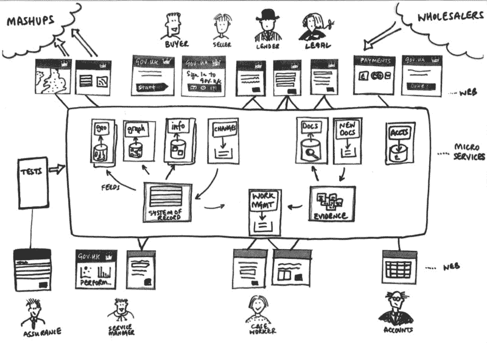
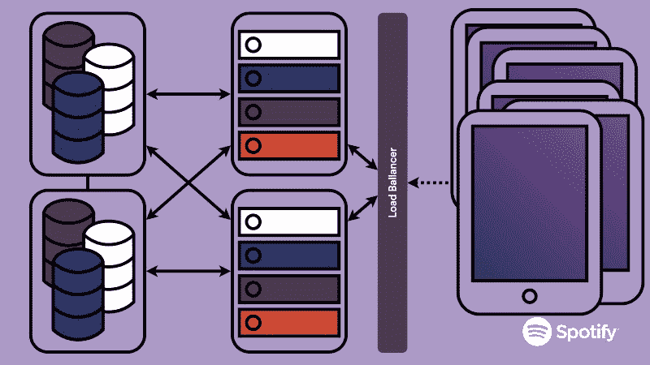
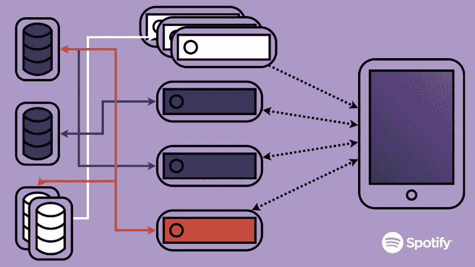

# 微服务介绍

> 原文：<https://www.freecodecamp.org/news/an-introduction-to-microservices-2705e7758f9/>

由 sanchitgear

Image credit: [Paul Downey](https://www.flickr.com/photos/psd/13109673843/)

# 微服务介绍

近年来，基于微服务模式的网络体系结构相当流行。微服务已经成为大型、笨重的整体应用程序的解决方案。

这种设计试图解决当您的代码库增长超过一定规模，并且变得越来越难以维护时出现的问题。

小规模服务是在保持代码可管理的同时快速扩展的需要。网飞、亚马逊和 Spotify 是朝着这种模式发展的一些更大、更有趣的玩家。我们来探究一下原因。

#### 什么是微服务？

定义微服务是一件棘手的事情。您的代码库要被认为是“微型的”，并没有固定的要求或规范相反，开发人员和架构师必须坚持一套通用的思想，以便想出一个适合他们的系统。

> 微服务架构风格是一种将单个应用程序开发为一套小型服务的方法，每个服务都在自己的进程中运行，并通过轻量级机制(通常是 HTTP 资源 API)进行通信。 ***马丁福勒***

在[构建微服务](http://shop.oreilly.com/product/0636920033158.do)中，Sam Newman 列出了设计这些服务时必须牢记的两个关键思想:**松耦合**和**高内聚**。诚然，这些听起来更像是流行词汇，但请允许我详细说明。

#### 松耦合

理想情况下，您希望服务之间很少或没有依赖性。服务应该可以独立地改变和部署，而不需要改变系统的其他部分。

服务必须只公开绝对必要的信息，以防止使用其数据的应用程序与它们绑定得太紧。这使得将来推出变更变得更加容易。

#### 高内聚力

高内聚可以被认为是松散耦合的必然结果。内聚指的是这样一种思想，即系统中与特定实体相关的所有逻辑应该被捆绑在一个地方。这使得修改部分系统的行为变得更加容易，因为它最小化了需要更新代码的地方的数量。

重要的是要记住，没有什么单一的结构会阻止你应用相同的原则。任何代码库都鼓励模块化。大型代码库传统上依赖于共享模块和库的概念，以便实施类似程度的逻辑分离。微服务更进了一步，让这些界限变得更明显，更难突破。

### 诱发因素

为了理解微服务，您应该理解在传统的整体结构中有一些缺陷，这是开发人员转向更松散耦合的服务的原因。

#### 技术多样性

随着您的应用程序规模的增长，它实现的功能数量也在增长，并且通过扩展，对您的系统提出了更多的技术要求。

例如，应用程序的某些部分可能需要一个用特定语言编写的特定库，而这个库恰好是合适的工具。您的应用程序的某些部分可能会受益于 Java 的静态类型、安全特性。而其他部分可能要求较低。类似地，最佳数据库可能因应用程序而异。

这也为在有限的范围内试验新的语言和框架提供了一个好机会。在某种程度上，实验变得风险更小，因为它仅限于少数几个可以很快恢复到原始状态的服务。

一般来说，在一个单一的应用程序中，您选择的工具通常是“最小公分母”，而不是为手边的任务进行优化。

然而，这一切都有不利的一面。在实践中，不同服务所使用的大量框架和语言本身可能会变得一团糟。如果不熟悉新的堆栈，在团队之间转移开发人员(通常每个服务一个团队)可能是一场噩梦。

有趣的是，Spotify——微服务架构模式的主要倡导者——对其制作服务中使用的各种语言采取零容忍政策。本质上，每一个被部署到生产环境的服务都必须用 Java 语言编写，而且只能用 Java 语言编写(因此这一论点是无效的)。

然而，技术多样性是基于微服务的设计的一个关键优势，即使只是少量使用。

#### 容错

容错的想法与之前讨论的松耦合概念有很大关系。团队应该专注于使每个服务尽可能独立。这确保了如果一个服务关闭，它不会影响其他服务(除了那些直接依赖它的服务)。

作为最终用户，您的体验可能会降低或受到限制，但应用程序仍应保持正常运行。在大多数情况下，这比让整个应用程序崩溃要好得多。

举个例子，考虑亚马逊。假设 Amazon 由几个不同的服务组成，每个服务处理应用程序的一个关键部分。

*   库存服务:负责管理亚马逊销售的所有商品，以及它们的库存水平
*   订单服务:负责接受客户订单并派送物品
*   推荐服务:负责对客户可能感兴趣的产品提出建议

这绝不是对亚马逊架构的完整或准确描述。但是对于这个例子来说效果很好。

考虑一下这样的场景，推荐服务突然失控，撞上了我们。现在，在传统的单片应用程序中，这可能会导致 Amazon 关闭！呀！

然而，在目前的情况下，用户可能会得到一个没有任何推荐的页面，而应用程序的其他部分仍然可以正常工作。次优体验，但仍可使用。还不错！

#### 可量测性

对于一家快速发展的公司来说，可伸缩性是一个非常重要的问题。当您有一个巨大的应用程序时，并不是它的所有部分都具有相同的负载强度。一些可能负责更被动、更普通的事情，例如提供静态信息，而其他可能更密集，需要大量的数据库交互和/或计算能力。

那么，单一代码库的问题是，不管它执行的操作类型如何，您都需要根据需要来扩展整个应用程序。因为这不是对系统实际需求的准确表示，所以会导致大量计算能力和资源的浪费。

这是微服务试图解决的问题之一。因为功能被分离到不同的“盒子”中，每个盒子可以独立地放大或缩小，而不会影响系统的其余部分。所以你最终会从一个看起来像这样的系统中走出来:

Borrowed from Kevin Goldsmith’s talk at GOTO Berlin 2015

变成这个样子:

Borrowed from Kevin Goldsmith’s talk at GOTO Berlin 2015

瞧啊。

#### 易于部署

最后，让我们谈一谈部署这些服务是如何工作的。考虑到正在部署的服务的绝对数量，这可能看起来有点像一个反驳的论点。然而，需要记住的关键点是，应用程序特定部分的任何行为变化通常需要应用程序的一个部分(最好是一个部分)发生变化，在这种情况下，应用程序的一个部分被隔离到一个微服务中。

当您有一个小的变化时，这种差异归结为重新部署一个小的服务与重新部署一个百万行的应用程序。实际上，单一应用程序很少以这样的速度重新部署。因此，变更通常会在两个版本之间累积，导致更大、更全面的版本。正在部署的变更的数量本身就可能是一个潜在的风险。

但是和往常一样，这里有一个权衡。尽管微服务允许您快速部署变更，但是它们要求您的服务的所有客户端都必须与您的版本保持同步。如果依赖于您的服务的服务数量很少，这可能是微不足道的，但是在较大的组织中，情况可能并不总是这样。可能会达成一个妥协，你很可能最终会为依赖它们的客户支持你的微服务的以前版本，直到他们开始升级！

在这篇文章中，我仅仅触及了皮毛。在走微服务路线之前，您还应该考虑其他几个想法。像[数据去中心化](http://microservices.io/patterns/data/database-per-service.html)和[服务发现](http://microservices.io/patterns/client-side-discovery.html)这样的概念是健壮架构的核心，需要更多的研究。(可能是以后的帖子吧！)

我自己对这种开发方式还相当陌生。如果有什么我遗漏或曲解的，请在评论中告诉我:)

*如果这是一个你想了解更多的话题，这里有一些我写这篇文章时发现有用的资源:*

*   [*打造微服务—山姆纽曼*](http://www.amazon.com/Building-Microservices-Sam-Newman/dp/1491950358/ref=sr_1_1?ie=UTF8&qid=1459727753&sr=8-1&keywords=building+microservices)
*   [*马丁·福勒的文章*](http://martinfowler.com/articles/microservices.html)
*   [*微服务. io*](http://microservices.io)
*   [*微服务@ Spotify*](https://www.youtube.com/watch?v=7LGPeBgNFuU)
*   [*实施微服务的挑战*](https://www.youtube.com/watch?v=yPf5MfOZPY0)