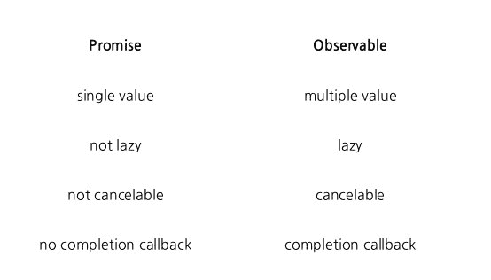

# 反应式编程中的可观测量介绍

> 原文：<https://www.freecodecamp.org/news/an-introduction-to-observables-in-reactive-programming-1cfd3e23bb94/>

对于新开发人员来说，学习观察者模式是最具挑战性的事情之一。理解如何通过 RxJS 有效地使用它来处理异步数据，如用户事件、HTTP 请求或任何其他需要等待事情完成的事件是很棘手的。

大多数人纠结的是新方法。这需要一种不同的思维方式，而视觉化在其中扮演着重要的角色。我们认为数据是随时间推移的一系列值，而不是只检索一次的单个值。这种心态被称为反应式编程。

由于观察者模式是一个由许多重要部分组成的相当大的生态系统，我选择通过只关注可观察的部分来缩小它的范围。我将很快分享其他涉及观察者模式的文章，比如如何处理 RxJS。

#### 我们将涉及的主题:

1.  异步到底是什么意思？
2.  使用哪种模式(观察者还是承诺)
3.  如何创建一个可观察的(代码示例从这里开始)
4.  如何订阅可观察的
5.  如何取消订阅可观察的

### 1.异步到底是什么意思？

web 和大多数语言的一个问题是，一旦你请求数据，比如从服务器请求用户列表，你不能保证数据会被返回。有一个不确定性的问题。

原因之一可能是数据不存在，服务器可能已损坏，或者 HTTP URL 无效，因为有人更改了查询字符串。

出于这个原因，以及其他一些原因，我们需要异步处理这样的数据。我们请求用户列表，并等待直到它被检索，但是不要因为一个简单的操作而停止整个应用程序。

这就像告诉一个同事去解决一个任务，而不是派出整个团队；这将是一个昂贵且不明智的方法。

让我们澄清一个误解:术语同步或异步与多线程无关，多线程是指操作同时执行。它仅仅意味着操作要么**依赖于**要么**彼此独立于**，就是这样。

让我们比较一下同步和异步的区别，以便更好地理解它们是如何工作的。

#### 什么是同步？

对于同步事件，您需要等待一个任务完成，然后再继续另一个任务。

**例子:**你在排队买电影票。除非你前面的每个人都拿到了，否则你是拿不到的，这同样适用于排在你后面的人。由[最聪明的人](https://stackoverflow.com/users/1428344/themightysapien)回答。

#### 什么是异步？

对于异步事件，您不需要等待，您可以继续下一个任务，直到数据可用。

你和许多其他人在一家餐馆里。你点你的食物。其他人也可以点他们的食物，他们不必等你的食物做好并端给你后再点。在厨房里，餐馆工作人员不停地烹饪、上菜和点菜。食物一做好，人们就会得到服务。由[最聪明的人](https://stackoverflow.com/users/1428344/themightysapien)回答。

好的，简而言之，这允许我们要么等待操作发生后再继续，要么不等到数据准备好。

### 2.使用哪种模式(观察者还是承诺)

首先，观察者模式和承诺模式都处理异步操作。用户事件或 HTTP 请求之类的操作，或者独立执行的任何其他事件。

当今的大多数操作都需要某种类型的异步/同步处理，理解其工作原理在构建健壮的应用程序时扮演着重要的角色。

这并不意味着让你的生活更艰难，而是更轻松。然而，这需要一个学习曲线，这可能是一个痛苦的过程，但最终的回报是值得的。

#### 坚持一种模式

区别在于应用的复杂程度。如果你处理一个小应用程序，它的任务是简单地从服务器获取用户列表，或者显示活跃成员，那么用`Fetch API` ( [阅读更多](https://medium.freecodecamp.org/a-practical-es6-guide-on-how-to-perform-http-requests-using-the-fetch-api-594c3d91a547))的承诺工作良好。

但是，如果您处理一个具有许多异步操作的大型应用程序，这些操作需要更改数据、对数据流执行多个操作或者在多个地方重用它，那么 observer 模式非常适用。

#### 我可以在一个项目中同时使用这两种模式吗？

是的，但是不建议您混合使用两种基本上做相同事情(处理异步事件)的架构。相反，坚持一个，并了解更多。

#### 用 RxJS 提升你的技能

有了 RxJS，您就可以接触到 189 位拥有文档+ [其他优秀资源](https://reactive.how/)的操作员。这些操作符中的每一个都是简单的回调，在数据流上做一些事情。

如果你熟悉 JavaScript 的函数原型(方法)，比如`map()`、`filter()`和`reduce()`，你会在 RxJS 中找到它们。注意，概念是相同的，但编写的代码不同。

那么这两种模式有什么区别呢？

Observable vs Promise

这里有一个观察者模式和承诺模式之间的快速比较。关键点在于，一旦使用了`.then()`回调，promise 就发出单个值，而 Observable 发出多个值，作为随时间推移的数据序列。另一个重要的观点是，一个可观察的可以被取消或重试，而一个承诺不能。但是，有一些外部软件包可以取消承诺。

### 3.我们如何创造一个可观察的？

这里有几种方法可以创造一个可观的:

*   从零开始创造一个可观察的
*   把承诺变成可观察的事实
*   或者使用一个在幕后为你做这件事的框架，比如 Angular。

> 你知道 Angular 广泛使用观察者模式吗？所有异步操作(如 HTTP GET 或监听事件或值的变化)都遵循 observer 模式。

如果您想要模拟(测试)一个真实的场景，也就是说随着时间传递值，我强烈推荐使用 interval 函数。这会在 x 时间(以毫秒为单位)后传递值。因此，如果您有一个 x 为 2000 毫秒的时间间隔，它会在 2 秒后传递每个值(增量)。

### 4.我们如何订阅一个可观察的？

一个可观察对象只是一个数据集合，在它可以发出任何数据之前，等待被调用(订阅)。如果您已经处理过承诺，那么访问数据的方法是用`then()`操作符链接它或者使用 ES6 `async/await`。

那么按照前面的例子，如何访问数据呢？

如上所示，当我们订阅时，我们告诉可观察对象把它持有的任何东西传给我们。它可以是数组、事件集合或对象序列等等。

我在开发人员中看到的一个常见的初学者错误是，他们对可观察的东西做了很多操作，但因为看不到任何结果而感到沮丧。你并不孤单！我犯过几次这样的错误，作为一条经验法则——永远记得订阅。

### 5.我们如何取消订阅一个可观察的？

取消订阅是很重要的，否则我们会因内存泄漏而导致浏览器变慢。如果您使用过 Angular，有一个名为`asyncPipe`的管道可以自动为您订阅和取消订阅。

我们取消订阅的方式是，通过创建一个变量来保存其当前状态，从而为每个被订阅的可观察对象创建一个引用。然后，对于每个变量，我们用`unsubscribe()`方法将它链接起来。请记住，您只能在订阅后取消订阅。这很简单，但经常被遗忘。

注意，如果您在这里取消订阅，`Observable_1`和`Observable_2`将在取消订阅之前输出数据，因为它们是冷可观测量(不依赖于时间)，而`Observable_3`和`Observable_4`不会输出任何数据，因为它们是热可观测量(依赖于时间)。

### 摘要

如上所述，学习观察者模式最具挑战性的部分是心态。我们以不同的方式看待价值的思维模式，例如随着时间推移而产生的一系列数据。在本文中，我们介绍了创建可观察对象的各种方法，以及如何订阅和取消订阅。

我推荐使用观察者模式，因为它提供了 promise 模式所提供的一切，甚至更多。它还提供了一些优秀的操作符来防止用户向后端发送数千个不必要的请求。

其中之一是`debonceTime`,它给用户足够的时间来写一个完整的单词，然后发送一个请求，而不是对每个字符都发送一个请求。当然，您可以通过一个简单的承诺来实现这一点，但这需要几行代码。

我将在不久的将来介绍更多关于反应式编程的内容，敬请关注！

如果你有兴趣了解更多关于网络生态系统的知识，这里有几篇我写的提高你网络技能的文章，请欣赏:)

*   [用这些 JavaScript 方法提升你的技能](https://medium.freecodecamp.org/7-javascript-methods-that-will-boost-your-skills-in-less-than-8-minutes-4cc4c3dca03f)
*   【Angular 和 React 之间的比较
*   [ES6 模块实用指南](https://medium.freecodecamp.org/how-to-use-es6-modules-and-why-theyre-important-a9b20b480773)
*   [如何使用获取 API 执行 HTTP 请求](http://A practical ES6 guide on how to perform HTTP requests using the Fetch API)
*   [需要学习的重要网络概念](https://medium.freecodecamp.org/learn-these-core-javascript-concepts-in-just-a-few-minutes-f7a16f42c1b0?gi=6274e9c4d599)

> 如果你想成为一名更好的 web 开发人员，开创自己的事业，教导他人，或者提高你的开发技能，你可以在我每周发布的 Medium 上找到我。或者你可以在 [Twitter](http://twitter.com/dleroari) 上关注我，我会在那里发布相关的 web 开发技巧和诀窍。

> 另外，如果你喜欢这篇文章，并且想要更多这样的文章，请为❤鼓掌，并与可能需要它的朋友分享，这是善缘。