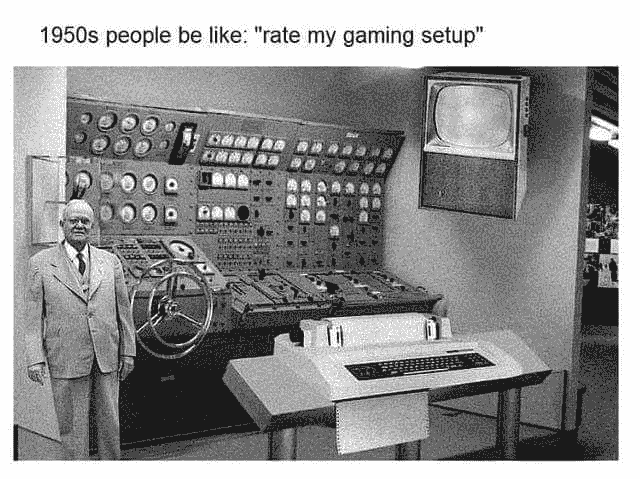
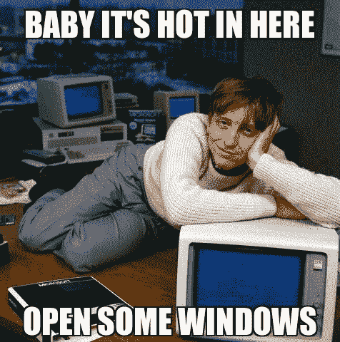
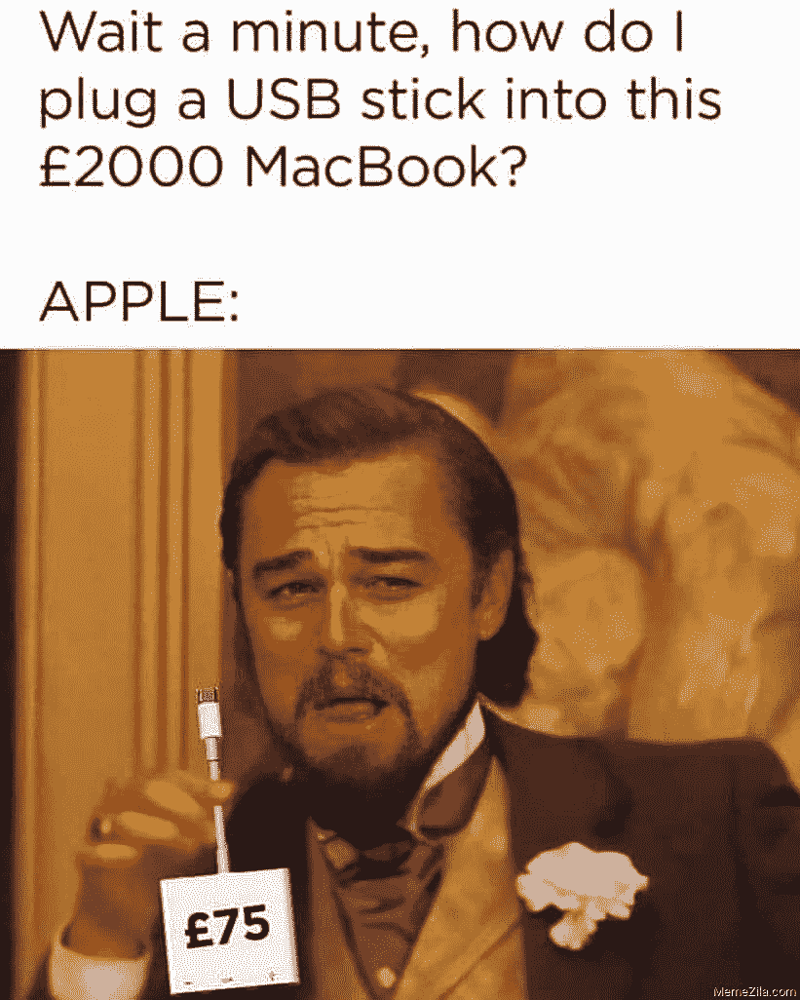
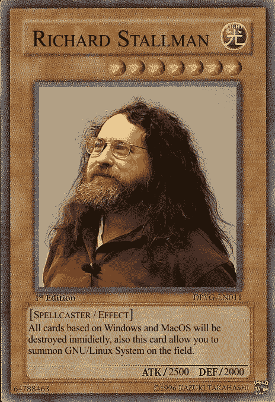
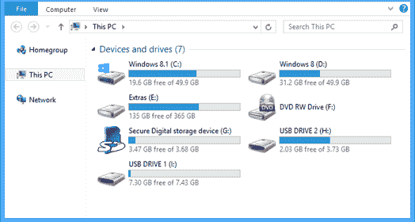

# windows vs MAC OS vs Linux——操作系统手册

> 原文：<https://www.freecodecamp.org/news/an-introduction-to-operating-systems/>

大家好！在这本手册中，我将简要介绍操作系统，并比较目前市场上的三种主要操作系统。

首先，我们将回顾一下什么是操作系统以及它的一些历史。然后，我们将回顾最流行的操作系统(Windows、Mac 和 GNU/Linux)的主要特性和差异。

这里的想法是探索他们的历史，他们是如何开发的，由谁开发的，他们的商业模式，以及他们的优缺点。这会让你更好地了解它们是如何工作的，以及选择哪一个。

我将分享一些事实以及我对这个问题的个人看法。所以请记住，我在这里提到的一些事情将基于我自己的经验和对该主题的分析。

我还会提供很多额外的文章/视频，如果你想深入某个特定的主题，你可以看看。

事不宜迟，我们走吧！

## 目录

*   [什么是操作系统？](#whatisanoperatingsystem)
*   [操作系统的一点历史](#abitofhistoryofoperatingsystems)
*   [三大操作系统](#thethreemainoss)
    *   [Windows 操作系统](#windowsoperatingsystem)
    *   [苹果电脑](#macos)
    *   [GNU/Linux](#gnulinux)
        *   Debian
        *   [Ubuntu](#ubuntu)
        *   [薄荷](#mint)
        *   [软呢帽](#fedora)
        *   [红帽企业版 Linux](#redhatenterpriselinux)
        *   [Arch Linux](#archlinux)
*   [Windows vs Mac vs Linux–操作系统对比](#windowsvsmacvslinuxoscomparison)
    *   [文件系统](#filesystems)
    *   [炮弹](#shells)
    *   [包管理器](#packagemanagers)
    *   [成本](#cost)
    *   [软件兼容性](#softwarecompatibility)
    *   [硬件质量和兼容性](#hardwarequalityandcompatibility)
    *   [易用性](#easeofuse)
    *   [安全性和稳定性](#securityandstability)
    *   [社区和文化](#communityandculture)
*   [选择哪个操作系统](#whichoperatingsystemtochoose)

## 什么是操作系统？

根据[维基百科](https://en.wikipedia.org/wiki/Operating_system#Examples)，

> 操作系统(OS)是管理计算机硬件、软件资源并为计算机程序提供公共服务的软件系统。

你可以把操作系统想象成一个“中间”程序，它位于你的计算机和你在其上运行的所有其他程序之间。它将管理至关重要的基本任务，如文件管理、内存管理、进程管理、输入输出管理和控制外围设备。

开放源码软件的创建是为了简化计算机的使用。如今，任何给定的程序都可以只担心执行其核心功能，而将所有基本的系统功能留给操作系统。但是事情并不总是这样...

## 操作系统的一点历史

在过去(20 世纪 40-50 年代)，程序是为在特定的机器上运行而编写的。这意味着一个程序只能在一种型号的计算机上运行。

如果你想在不同型号的计算机上执行相同的程序，程序员需要重新编写整个程序，因为硬件的配置方式不同。在运行的程序和实际的硬件之间没有抽象层。

旁注:你曾经停下来想一想当年程序员的工作吗？程序是用穿孔卡片写的！每当我想起这件事，我就感到震惊...令人惊讶的是，当时的水平是如此之低，而技术的进步要归功于那些早期的程序员。

到了 20 世纪 60 年代，工业巨头如 IBM 和美国电话电报公司开始研究操作系统，它可以作为硬件和软件之间的抽象层，这将简化新程序的实现。

这些项目中最臭名昭著的是 [**Unix**](https://wikipedia.org/wiki/Unix) ，这是一个由开发者[肯·汤普森](https://wikipedia.org/wiki/Ken_Thompson)(他目前正在开发 Go 编程语言)和[丹尼斯·里奇](https://wikipedia.org/wiki/Dennis_Ritchie)(他也创造了 C 编程语言)在 AT & T 的贝尔实验室开发的操作系统。奇怪的编码传奇，是的。).

Unix 获得了巨大的成功，并激发了许多其他具有相似特性的操作系统的诞生。这些后来对 GNU/Linux 和 MacOS 产生了很大的影响，我们一会儿会回顾一下。

到了 20 世纪 80 年代，计算机的性能、可访问性、尺寸和价格已经提高到普通大众可以购买并使用它们来完成个人任务的程度。这使得 OSs 从公司专用功能转向通用功能。这将我们带到了现代...

> 如果你对操作系统如何工作及其历史的更详细的解释感兴趣，这里有一个关于它的很棒的视频。这个频道也有一个令人难以置信的关于计算机科学的速成班系列，我绝对推荐它！；)

# 三大操作系统

在现代，当谈到个人台式机/笔记本电脑时，三个最常用的操作系统是微软 Windows(约 80%的市场份额)、苹果 MacOS(约 15%的市场份额)和基于 GNU/Linux 的操作系统(约 3%的市场份额)。

关于服务器，大约 80%运行 GNU/Linux，20%运行 Windows。谈到移动设备，大约 75%运行 Android(使用 Linux 内核)，25%运行 IOs(苹果的移动操作系统)。

我们将分别对它们进行简要回顾，然后对它们进行比较，找出它们之间的差异。

## windows 操作系统

Windows 的祖先是微软在 1981 年发布的基于文本的操作系统 MS-DOS。

MS-DOS 被开发出来与 IBM 个人电脑兼容，并且非常成功。但是为了让它更容易被大众接受，它需要一个 GUI，这就是微软在 1985 年发布的 Windows 1.0。

从那以后，Windows 发布了许多版本，像 95、98、XP、Vista 等等...并使其成为全球使用最广泛的操作系统。

Windows 的可访问性和它预装在大多数个人电脑中的事实(由于商业协议)使得这个操作系统成为迄今为止最受欢迎的操作系统。

这里有一个很酷的视频，它只用了 3 分钟就总结了 Windows 的历史。

如果你有兴趣了解更多关于微软的历史，这里有另一个关于它的很酷的视频。

关于它的商业模式，我想说 Windows 的策略是占领市场，使它的系统尽可能的简单易用。他们的主要目标客户是普通用户，所以对定制、安全性或性能没有特别的重视。

Windows 只是大多数人的默认操作系统。这是他们开始了解的第一个，它允许用户轻松地运行日常任务(互联网浏览、游戏、办公室工作),根本不需要太多配置。

Windows 是一个私有软件，这意味着它的源代码是不公开的。只有微软可以访问它。

起初，如果用户想购买 Windows 操作系统的副本或升级他们的 Windows 版本，他们必须付费。但在最新的版本中，Windows 采用了免费增值模式。在这种商业模式下，用户可以免费使用大多数软件功能，只需付费即可使用特定功能。

理解这种转变的关键是理解微软拥有非常多样化的业务组合(Xbox 在游戏领域，Azure 在云平台领域，LinkedIn 在社交网络领域，Bing 在搜索引擎领域，GitHub...仅举几个例子)。通过让 Windows 免费，他们不断涌入市场，让人们更容易将其作为默认操作系统。

另一件要记住的事情是，Windows 在操作系统中显示广告。所以它也可以被认为是一个广告平台。

另一个很酷的视频解释了这个动作[这里](https://www.youtube.com/watch?v=AYaRzp--xyk)。

这是微软老派营销风格的一个奇怪/有趣/有点吓人的例子。

## 马科斯

MacOS(以前叫做 OS X)是苹果公司开发的一系列操作系统。它预装在所有的麦金塔电脑上。它的第一个版本发布于 1984 年，是第一个内置 GUI 的个人电脑操作系统。

MacOS 是建立在类 UNIX 操作系统之上的，这就是为什么这款 MacOS 与 GNU/Linux 衍生的 MAC OS 有许多共同的特征。

在我看来，苹果的商业模式主要是基于差异化和排他性。与微软不同的是，苹果同时制造他们产品的硬件和软件，苹果的软件只在他们自己的机器上运行。

苹果将自己定位为科技市场的顶级制造商，旨在为客户提供高质量的硬件和软件，价格远高于大多数竞争对手。

排他性也被宣传为对用户的额外补贴，推销拥有苹果产品时成为精选人群中的一员的理念。

事实上，你不能在他们的硬件上运行任何你想运行的软件，你也不能在除了 Mac 机之外的任何地方安装他们的软件，这是同一个想法的一部分。如果你想成为这个团体的一员，你需要购买整套服务。

苹果公司生产的大部分软件和硬件都不一样，很多时候都与其他产品不兼容。微软的想法是让产品尽可能地普及和容易获得，而苹果的目标是让他们的产品质量一流，但价格昂贵，并且与其他硬件不兼容。

苹果公司的另一个伟大的营销举措是他们能够利用像史蒂夫·乔布斯这样极具魅力和影响力的人来获利。他们利用了他作为行业领导者、创新者和某种程度上的“反叛者”的地位和轨迹，将这些价值观含蓄地转化到他们的产品中。

看看这些广告就知道我的意思了:

*   [想不同的广告](https://www.youtube.com/watch?v=5sMBhDv4sik)
*   [公元 1984 年](https://www.youtube.com/watch?v=VtvjbmoDx-I)

如果你有兴趣了解更多关于 MacOS 的历史，[这里有一个关于它的视频](https://www.youtube.com/watch?v=c77lU0Rhq8k)。

## GNU/Linux

GNU/Linux 是许多开源操作系统的基础。与我们刚刚看到的例子不同，GNU/Linux 不是一个完整的操作系统，而是许多开源操作系统共享的一组程序/实用程序和一个内核。

让我们分别回顾一下每一部分。

GNU 是由[理查德·斯托尔曼](https://wikipedia.org/wiki/Richard_Stallman)创建的一个庞大的程序和实用程序集合。

GNU 项目始于 1983 年，当时的想法是开发一个免费的类似 UNIX 的操作系统(UNIX 是美国电话电报公司的财产，所以它不是免费的)。斯托曼开始为操作系统开发必要的程序和实用程序，但是缺少了一个关键部分——内核。

内核是任何操作系统的心脏。它是与硬件交互最紧密的软件，操作系统的其余部分位于它的上面。内核负责底层任务，比如磁盘管理、内存管理、任务管理等等。

1991 年，赫尔辛基大学的一名学生 Linus Torvalds 开始为一个类似 UNIX 的操作系统开发内核。

在接下来的几年里，这两个项目开始互动，并结合在一起，形成了一个任何操作系统都可以使用的坚实基础。

这里的关键是这两个项目都是开源的，完全免费的软件。这意味着:

*   任何人都可以出于任何目的运行该程序。
*   任何人都可以自由地研究程序是如何工作的，并对其进行修改，使其按照自己的意愿工作。
*   任何人都可以自由地重新发布原始软件的副本。
*   任何人都可以自由分发该软件的修改版本。

为了更好地理解自由软件运动，请听理查德的 TED 演讲。

然后看理查德说西班牙语，唱一首关于自由软件的歌(你会爱上这个家伙的...).

斯托尔曼和托瓦尔兹在开发 GNU/Linux 时所采用的方法与我们所看到的例子以及业界到那时为止所习惯的方法完全不同。

让 GNU/Linux 免费不仅从开发者的角度来看是正确的，从软件质量的角度来看也是一个极好的选择。这是因为世界上成千上万的开发者和公司选择免费合作来改进系统。

一些 GNU/Linux 发行版被认为是最安全和稳定的操作系统。它们被用于银行、金融、政府和军事等关键领域。

这很大一部分要归功于 GNU/Linux 背后的开源模型，以及世界各地成千上万的人能够不断地审查代码、修复 bug 和提出改进建议。

这两个由 Linux 基金会制作的视频解释了 Linux 是如何诞生的和 T2 目前是如何运作的。

如前所述，GNU/Linux 是许多其他操作系统的基础。在 Linux 世界中，这些操作系统被称为“发行版”或“发行版”。它们都有一个共同点，那就是它们都基于相同的内核和一组实用程序。它们可以被认为是 Linux 的“风味”。

某些发行版之间没有太大的区别，但其他发行版有值得一提的区别。让我们快速回顾一下最常用的发行版，以便更好地理解这一点:

### 一种自由操作系统

Debian 是一个只包含免费开源软件的操作系统。Debian 成立于 1993 年，现在仍然很强大，并不断发布新版本。Debian 主要以其稳定性和安全性而闻名，这使得它在发布新版本时更加保守和“缓慢”。

### 人的本质

Ubuntu 是使用最广泛的 GNU/Linux 发行版。它的创建是为了获取 Debian 的核心部分，并更快地对它们进行改进。它还更加注重用户友好性和可访问性，这可能使它成为来自 Windows 或 MacOS 背景的人的最佳选择。

Ubuntu 通常每六个月发布一次，每两年发布一次更稳定的 LTS(长期支持)版本。Ubuntu 由一家名为 [Canonical](https://canonical.com/) 的公司运营。

### 铸造

Mint 是建立在 Ubuntu 之上的发行版。最初它受到很多人的喜爱，因为它包含了 Ubuntu 没有的媒体编解码器和专有软件。

### 一种男式软呢帽

Fedora 是一个专注于自由软件的发行版。Fedora 由一家名为 [Red Hat](https://es.wikipedia.org/wiki/Red_Hat) 的公司赞助，该公司同时为 [IBM](https://www.ibm.com/) 所有。

### 红帽企业版 Linux

Red Hat Enterprise Linux 是一个商业 Linux 发行版，由在纳斯达克上市的 Red Hat 公司管理。该操作系统主要用于服务器和企业。它基于开源的 Fedora 项目，但旨在成为一个长期支持的稳定平台。

红帽利用商标法来防止红帽企业版 Linux 软件被重新分发。然而，核心软件是免费和开源的。

### Arch Linux

Arch 可能是最核心的 Linux 发行版。它非常轻便、灵活、小巧。使用 Arch，用户完全负责配置系统。Arch 的目的不是为了主流。它是为那些对计算机和操作系统的工作原理有深刻理解，或者至少对学习感兴趣的用户准备的。

在这本深入的手册中，您可以了解更多关于 Arch 的信息，以及您可以在多大程度上对其进行定制[。](https://www.freecodecamp.org/news/how-to-install-arch-linux/)

这里有一个[很棒的视频](https://www.youtube.com/watch?v=ShcR4Zfc6Dw)，它快速总结了 GNU/Linux 的历史，并介绍了主要发行版的特点。Fireship 是我推荐的另一个很棒的频道。；)

关于 GNU/Linux 商业模式，它们不是一个可以开始的商业模式。Linux 和自由软件基金会(GNU 背后的组织)都是依靠捐赠运作的非政府组织。

例如，Linux 通过白金、黄金、白银和个人会员资格赚钱。

微软、谷歌、脸书、思科、富士通、HPE、华为、IBM、英特尔、甲骨文、高通和三星等公司都是 Linux 基金会的积极捐助者。这对公司来说是有意义的，因为他们都受益于 Linux 产生的知识和技术，他们的捐赠也可以免税。

关于发行版，其中一些是完全免费的，由志愿者维护，另一些由公司维护，对特定用户免费，但对公司用户商业化。另一种商业模式是免费使用，但对企业用户的支持收费。

今天，Linux 运行在世界上大多数服务器上。它被用在大多数超级计算机和大多数手机上(如上所述，Android 使用 Linux 内核)。

在台式机/笔记本电脑方面，Linux 的使用远没有那么广泛。这可能是因为它不像 Windows 那样被广泛使用，也不像 Mac 那样在市场上销售。

此外，尤其是在过去，实现和使用 Linux 所需的学习曲线比其他两种操作系统选项要高得多。

无论如何，这种情况最近已经改变了，因为 Linux 发行版更加关注用户友好性，并且比以往任何时候都更容易让计算机默认安装 Linux 发行版。

## Windows 与 Mac 和 Linux - OS 的比较

好的，除了历史、商业模式等等，对于用户来说，这三个操作系统的实际区别是什么？

简而言之，实际上没有那么多。但是让我们回顾一下这些操作系统在设计、功能和用户体验方面的一些差异，稍后我会告诉你我对此的看法。

### 文件系统

Windows 组织文件的方式不同于 Mac 和 GNU/Linux。

Windows 使用“驱动器”。它们通常是存储所有计算机文件的 C 和 D 驱动器，以及用于 CD、USB 等外部设备的单独驱动器。

Mac 和 GNU/Linux 有一个类似的来自 UNIX 的文件系统。在这些操作系统中没有驱动器——计算机中的所有东西都被认为是一个文件(即使是外部设备),所有文件都被组织在从单个根目录派生的目录中。目录结构被形成为具有唯一根的树。

这对最终用户来说不一定有很大的区别，但是如果您习惯于浏览一种或另一种类型的文件系统，就要记住这一点。

### 贝壳

GNU/Linux 和 Mac 都将 Bash 作为它们的默认 shell，而 Windows 有自己的 shell，使用不同的语法。

作为开发人员和狂热的终端用户，学习 Bash 可能是最好的选择，因为这种知识比 Windows shell 更容易翻译到所有操作系统中。尤其是考虑到 GNU/Linux 运行在世界上大多数服务器上，这是您需要使用终端与计算机交互的主要场合之一。

如果你想了解更多关于 shells 和终端使用的知识，我最近写了一篇关于 T1 的文章。

### 包管理器

Mac 和 GNU/Linux 默认安装了包管理器。软件包管理器是一个软件，允许你从终端安装、更新和卸载程序，只需输入几个命令。

它们非常有用，尤其是当你不断地安装和卸载程序时，因为通过软件包管理器安装程序比手动安装更有效。

Mac 的包管理器叫做[家酿](https://brew.sh/)。在 GNU/Linux 上，默认的包管理器依赖于发行版。比如 Ubuntu 自带 [APT](https://ubuntu.com/server/docs/package-management) ，Arch 自带 [Pacman](https://wiki.archlinux.org/title/pacman) 等等。

所有的包管理器都以相似的方式运行，但是每一个使用的语法都有一些不同。还有一点很重要，您可以安装和运行不同于默认的包管理器。

Windows 没有默认的软件包管理器。如果你想要一个，你需要先安装它。Windows 可用的软件包管理器之一是 [Chocolatey](https://docs.chocolatey.org/en-us/) 。

### 费用

如前所述，大多数 GNU/Linux 发行版对任何人来说都是完全免费的。Windows 目前有一个免费增值模式，MacOS 只能在 Mac 电脑上运行，你可能知道 Mac 电脑非常贵。

### 软件兼容性

Windows 是使用最广泛的操作系统，因此大多数软件都适用于它。尽管不太受欢迎，但 MacOS 在这方面与 Windows 相似。

过去，Linux 与许多程序不兼容，但最近这种情况开始改变，尤其是像 Ubuntu 这样最流行的发行版。

### 硬件质量和兼容性

说到硬件，只有苹果对运行操作系统的电脑负有直接责任。苹果的硬件是最好的。

作为一家公司，苹果专注于提供高质量的产品，因此他们的最新电脑往往是市场上性能最好的。

鉴于苹果设计和开发硬件和软件，机器和操作系统之间的兼容性可能比 Windows 或 GNU/Linux 更好。

在 Windows 和 GNU/Linux 方面，硬件质量完全取决于用户的决定或购买能力。这里的好处是你可以在任何你想的地方安装操作系统。

当考虑在旧电脑上安装轻量级 Linux 发行版时，这是非常酷的，因为旧电脑不能处理像 Windows 这样更大、更消耗的操作系统的要求。

### 易用性

Windows 和 Mac 是非常简单和用户友好的操作系统。关于 GNU/Linux，取决于你选择的发行版。如前所述，像 Ubuntu 这样的发行版实际上和 Windows 或 Mac 一样简单，而像 Arch 这样的发行版是为高级计算机用户设计的。

### 安全和稳定

一些 GNU/Linux 发行版被认为是当今最安全和稳定的发行版。每个人都可以获得代码的事实并不像你一开始想的那样是一个安全威胁——而是一个优势。可以更快地识别和处理错误，当发现安全漏洞时，许多人可以处理它并提出修复方案。

另一方面，Windows 被认为是三者中最不安全和最不稳定的。鉴于它是最流行的操作系统，大多数恶意软件也被开发来攻击 Windows 操作系统。

### 社区和文化

如果你有兴趣更多地了解某个特定的操作系统，研究它是如何工作的，如何修改它并基于它创建项目，GNU/Linux 绝对是一个不错的选择。它是唯一一个任何人都可以使用其代码的软件，其在线社区非常庞大。

尽管 GNU/Linux 不像其他两种操作系统那样被广泛使用，但我发现 Linux 用户通常是对软件和技术感兴趣的人，以及喜欢谈论、学习和分享相关知识的人。

Mac 也有自己的粉丝群，尤其受创意人员(图形设计师、视频编辑、动画师等等)的欢迎。

最后，Windows 通常由普通用户和公司环境使用。

关于组织文化，我认为在创建这个 OSs 的人的工作环境中可视化它会很有趣:

*   看一看[苹果总部](https://www.youtube.com/watch?v=FzcfZyEhOoI)
*   [比尔·盖茨的“家庭办公室”](https://www.youtube.com/watch?v=ZjyVjU4gkHM)
*   和 [Linux Torvalds 家庭办公室](https://www.youtube.com/watch?v=jYUZAF3ePFE)

> 如果你想看这三个操作系统的更深入的比较，Zach Gollwitzer 有一个关于这个主题的非常好的视频(另一个很棒的频道；)).

## 选择哪个操作系统

我最近有机会使用所有三个操作系统，正如我提到的，我不认为它们之间的差异有那么大。

在我看来，Linux 是一个明智的选择，因为它工作得很好，在整个技术行业得到了广泛的应用(所以所有的知识都可以转化为工作环境)，如果你有兴趣了解更多关于它如何工作的信息，有一个巨大的社区支持它。最重要的是...免费的！

我的意思是，如果我们有人类历史上最好的、使用最广泛的软件之一，而且完全免费，我们为什么还要花钱去买其他东西呢？

关于其他事情，我认为你可以在 GNU/Linux 上做的大多数事情你也可以在 Mac 和 Windows 上做，至少对大多数用户来说是这样。它可能不会对你的日常生活产生巨大的影响，至少从我的角度来看是这样。

关于硬件，购买一台现代化的苹果电脑几乎是拥有一台性能卓越的机器的保证(如果你买得起的话)。但如果你对硬件有所了解，或者花时间四处调查，你也可以很容易地找到价格更低的非常好的选择。

最后，我认为重要的是知道你在用什么，知道有哪些选择。作为计算机用户，了解事实和差异，避免被营销活动分散注意力是一个好主意。

我也不相信在一个选择或另一个选择中放置太多的判断或权重。事实上，选择开源操作系统的人并不会比不选择开源操作系统的人更聪明或更优秀...就像拥有最新的 Mac 电脑不会让你成为更好的程序员一样。

长话短说，只要你的系统允许你做你想做的事情，你选择什么都可以。

一如既往，我希望你喜欢这篇文章，并学到一些新东西。如果你愿意，你也可以在 [linkedin](https://www.linkedin.com/in/germancocca/) 或 [twitter](https://twitter.com/CoccaGerman) 上关注我。

干杯，下期再见！=D

