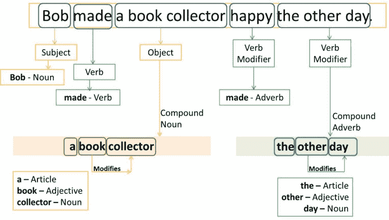
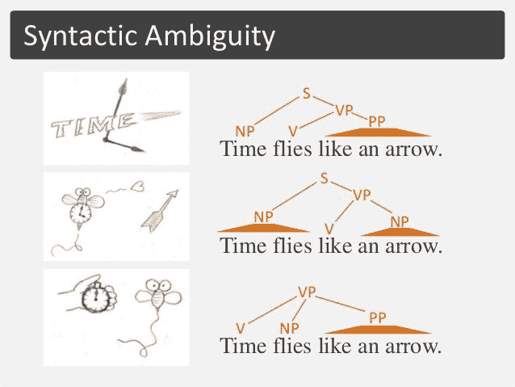
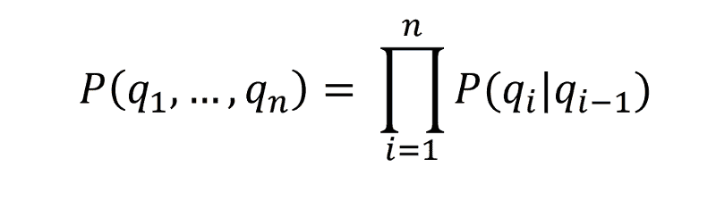
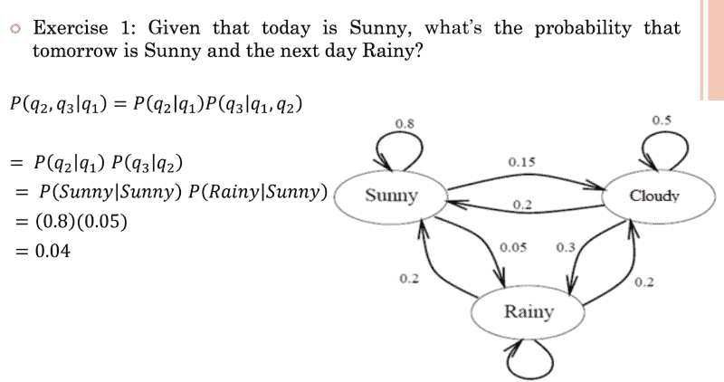
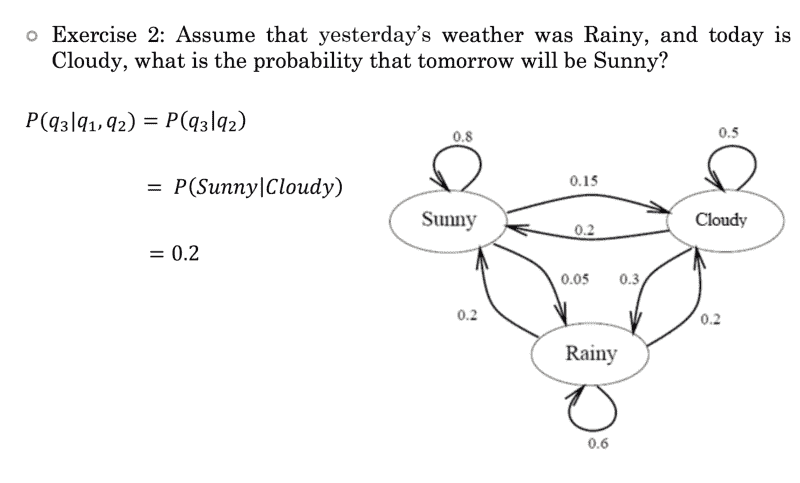
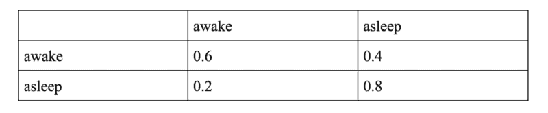
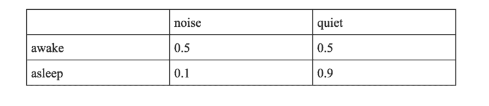
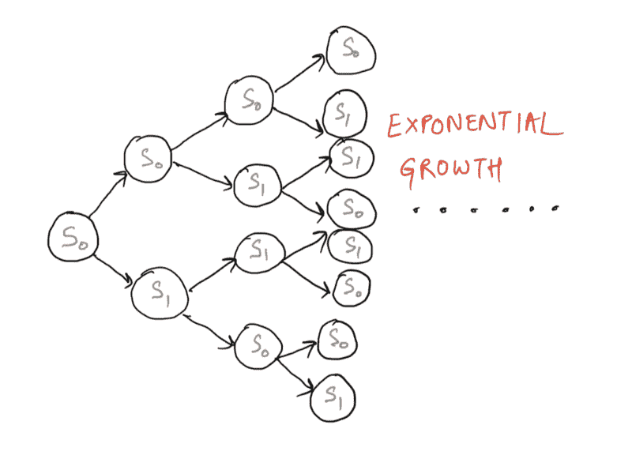

# 词性标注和隐马尔可夫模型简介

> 原文：<https://www.freecodecamp.org/news/an-introduction-to-part-of-speech-tagging-and-the-hidden-markov-model-953d45338f24/>

由 divya 性腺

# 词性标注和隐马尔可夫模型简介

*由[萨钦马尔霍特拉](https://medium.com/@sachinmalhotra)和[达薇亚戈达亚尔](https://medium.com/@divyagodayal)*



Source: [https://english.stackexchange.com/questions/218058/parts-of-speech-and-functions-bob-made-a-book-collector-happy-the-other-day](https://english.stackexchange.com/questions/218058/parts-of-speech-and-functions-bob-made-a-book-collector-happy-the-other-day)

让我们回到没有语言交流的时代。我们唯一能做的就是手语。这就是我们平时在家和狗狗交流的方式吧？当我们告诉他，“我们爱你，吉米，”他摇着尾巴回应。这并不意味着他知道我们实际在说什么。相反，他的反应仅仅是因为他比语言更理解情感和手势的语言。

我们人类比这个星球上的任何动物都更了解自然语言的许多细微差别。这就是为什么当我们说“我爱你，亲爱的”和“我们做爱吧，亲爱的”时，我们的意思是不同的。因为我们理解这两个短语之间的基本区别，所以我们的反应非常不同。我们想教给机器的正是自然语言理解中的这些非常复杂的东西。

这意味着当你未来的机器狗听到“我爱你，吉米”时，它会知道爱是一个动词。他也会意识到这是我们表达的一种情绪，他会以某种方式回应。也许当你告诉你的伴侣“我们做爱吧”的时候，这只狗就不会干涉你的事情了？。

这只是一个例子，说明教机器人用我们知道的语言交流可以让事情变得更容易。

在这个例子中突出的主要用例是理解在不同的上下文中“爱”这个词的不同用法是多么重要。

### 词性标注

从很小的时候起，我们就已经习惯于识别词性标签。例如，阅读一个句子，并能够识别哪些词充当名词、代词、动词、副词等等。所有这些都被称为词性标签。

让我们看看维基百科对它们的定义:

> 在语料库语言学中，**词性标注** ( **词性标注**或**词性标注**或 **POST** )，也称为**语法标注**或**词类消歧**，是根据单词的定义和上下文，即单词与短语、句子或段落中相邻和相关单词的关系，将文本(语料库)中的单词标记为对应于特定词性的过程。这种方法的一种简化形式通常是教学龄儿童识别名词、动词、形容词、副词等。

识别词性标签比简单地将单词映射到它们的词性标签要复杂得多。这是因为词性标注不是通用的。根据不同的上下文，一个单词在不同的句子中有不同的词性标记是很有可能的。这就是为什么不可能有 POS 标签的通用映射。

如您所见，不可能手动找出给定语料库的不同词性标签。新类型的上下文和新单词不断出现在各种语言的词典中，手动词性标注本身是不可扩展的。这就是我们依赖基于机器的 POS 标记的原因。

在进一步讨论词性标注是如何完成的之前，我们应该看看为什么词性标注是必要的，以及它可以用在什么地方。

### 为什么要词性标注？

词性标注本身并不能解决任何特定的自然语言处理问题。然而，这是作为简化许多不同问题的先决条件而做的事情。让我们考虑在各种 NLP 任务中词性标注的一些应用。

#### 文本到语音转换

让我们看看下面这个句子:

```
They refuse to permit us to obtain the refuse permit.
```

单词`refuse`在这个句子中使用了两次，在这里有两种不同的意思。*拒绝(/* rəˈfyo͞oz/)is 是一个动词，意思是“否认”，而*拒绝(/* ˈrefˌyo͞os/)是一个名词，意思是“垃圾”(也就是说，它们不是同音词)。因此，我们需要知道使用的是哪个单词，以便正确地读出文本。(因此，文本到语音转换系统通常会执行词性标注。)

看看 [NLTK](https://www.nltk.org/) 包为这个句子生成的词性标签。

```
>>> text = word_tokenize("They refuse to permit us to obtain the refuse permit")>>> nltk.pos_tag(text)[('They', 'PRP'), ('refuse', 'VBP'), ('to', 'TO'), ('permit', 'VB'), ('us', 'PRP'),('to', 'TO'), ('obtain', 'VB'), ('the', 'DT'), ('refuse', 'NN'), ('permit', 'NN')]
```

从 NLTK 包提供的结果可以看出，*拒绝和拒绝*的 POS 标签是不同的。为我们的文本到语音转换器使用这两种不同的 POS 标签可以产生不同的声音。

类似地，让我们看看词性标注的另一个经典应用:词义消歧。

#### 词义消歧

我们来谈谈这个叫彼得的孩子。由于他的母亲是神经科学家，所以没有送他去上学。他的生活缺乏科学和数学。

一天，她做了一个实验，让他坐着上数学课。尽管他之前没有任何学科知识，彼得认为他在第一次考试中取得了成功。他的母亲随后从测试中选取了一个例子，并发表如下。(向她致敬！)


Word-sense Disambiguation example — My son Peter’s first Maths problem.

单词经常作为不同的词类出现在不同的意义上。例如:

*   她看见一只熊。
*   你的努力将会结出果实。

以上句子中的单词 **bear** 有完全不同的意思，但更重要的是一个是名词，一个是动词。如果你能用词类标签标注单词，基本的词义消歧是可能的。

词义消歧(WSD)是指当一个词有多种含义时，确定该词在句子中使用的是哪种含义。

试着想想这句话的多重含义:

**光阴似箭**

下面是对给定句子的各种解释。每个单词的意思和词性可能会有所不同。



Part-of-speech tags define the meaning of a sentence based on the context

我们可以清楚地看到，对于给定的句子，可能有多种解释。不同的解释为单词产生不同种类的词性标记。这些信息，如果我们可以得到，可以帮助我们找到这句话的确切版本/解释，然后我们可以从那里继续前进。

上面的例子告诉我们，一个句子可以有三个不同的词性标记序列，这三个不同的词性标记序列有相同的可能性。这意味着无论何时出现，知道给定的句子所传达的特定含义是非常重要的。这是词义消歧，因为我们试图找出顺序。

这些只是我们需要 POS 标记的众多应用中的两个。还有其他需要词性标注的应用，比如问答、语音识别、机器翻译等等。

现在我们已经对词性标注的不同应用有了一个基本的了解，让我们来看看我们如何为语料库中的所有单词分配词性标注。

### POS 标签的类型

词性标注算法分为两个不同的类别:

*   **基于规则的 POS 标签**
*   **随机 POS 标签**

E. Brill 的 tagger 是第一个也是最广泛使用的英语 POS-tagger 之一，它采用了基于规则的算法。让我们首先来看一个关于基于规则的标记的简要概述。

#### 基于规则的标记

自动词性标注是自然语言处理的一个领域，其中统计技术比基于规则的方法更成功。

典型的基于规则的方法使用上下文信息来给未知或模糊的单词分配标签。通过分析单词、其前一个单词、后一个单词以及其他方面的语言特征来消除歧义。

例如，如果前面的词是一个冠词，那么这个词必须是一个名词。这些信息以规则的形式编码。

规则的示例:

> 如果一个模糊/未知的单词 X 前面是限定词，后面是名词，将其标记为形容词。

手动定义一组规则是一个极其麻烦的过程，并且根本不可伸缩。所以我们需要一些自动的方法来做这件事。

Brill 的标记器是一个基于规则的标记器，它遍历训练数据，找出最能定义数据并最大限度地减少词性标记错误的标记规则集。关于 Brill 的标签，这里要注意的最重要的一点是，规则不是手工制作的，而是使用提供的语料库找到的。唯一需要的特征工程是一组**规则模板**,模型可以用它来提出新的特征。

现在让我们继续，看看随机词性标注。

#### 随机词性标注

术语“随机标注者”可以指解决词性标注问题的任何数量的不同方法。任何以某种方式包含了频率或概率的模型都可以被恰当地称为随机模型。

最简单的随机标记器仅仅基于单词与特定标记一起出现的概率来消除单词的歧义。换句话说，在单词的训练集中最频繁遇到的标签是分配给该单词的歧义实例的标签。这种方法的问题是，虽然它可能为给定的单词产生有效的标签，但它也可能产生不可接受的标签序列。

词频方法的替代方法是计算给定标签序列出现的概率。这有时被称为 *n-gram* 方法，指的是给定单词的最佳标签是由它与 n 个前面的标签一起出现的概率来确定的。这种方法比之前定义的方法更有意义，因为它基于上下文考虑单个单词的标签。

可以引入随机标记器的下一级复杂性结合了前两种方法，使用标记序列概率和词频测量。这就是所谓的**隐马尔可夫模型**。

在继续讨论什么是**隐*马尔可夫模型之前，让我们先来看看什么是马尔可夫模型。这将有助于更好地理解 HMMs 中术语**隐藏**的含义。***

#### *马尔可夫模型*

*假设只有三种天气情况，即*

*   *下雨的*
*   *快活的*
*   *多云的*

*现在，因为我们上面介绍的年轻朋友，彼得，是一个小孩子，他喜欢在外面玩。他喜欢阳光明媚的天气，因为他所有的朋友都会在阳光明媚的时候出来玩。*

*他讨厌多雨的天气，原因很明显。*

*每天，他的妈妈在早上(他通常出去玩的时候)观察天气，像往常一样，彼得起床后就走到她面前，让她告诉他天气会怎么样。因为她是一个负责任父母，她想尽可能准确地回答这个问题。但是她唯一拥有的是几天来对天气状况的一系列观察。*

*她如何根据过去 N 天的天气预测今天的天气？*

*假设你有一个序列。大概是这样的:*

*`Sunny, Rainy, Cloudy, Cloudy, Sunny, Sunny, Sunny, Rainy`*

*所以，任何一天的天气都可以是这三种状态中的任何一种。*

*假设我们决定使用马尔可夫链模型来解决这个问题。现在使用我们现有的数据，我们可以用标记的概率来构建下面的状态图。*

**

*为了计算给定 N 次先前观测的今天天气的概率，我们将使用马尔可夫性质。*

**

*马尔可夫链本质上是已知的最简单的马尔可夫模型，即它服从马尔可夫性质。*

*马尔可夫性质表明，未来随机变量的分布仅取决于其在当前状态下的分布，而先前的状态对未来状态没有任何影响。*

*关于马尔可夫链工作的更详细的解释，请参考[这个](https://towardsdatascience.com/introduction-to-markov-chains-50da3645a50d)链接。*

*此外，看看下面的例子，看看如何使用上面的公式计算当前状态的概率，同时考虑到马尔可夫性。*

**

*在下面的示例中应用 Markov 属性。*

**

*我们可以清楚地看到，根据马尔可夫性质，`tomorrow's`天气晴朗的概率只取决于`today's`天气，而不取决于`yesterday's`。*

*现在让我们来看看隐马尔可夫模型中隐藏了什么。*

### *隐马尔可夫模型*

*又是小屁孩彼得，这次他要纠缠他的新看护人——也就是你。(Ooopsy！！)*

*作为一名看护人，你最重要的任务之一就是哄彼得上床睡觉，确保他熟睡。一旦你给他盖好被子，你要确保他真的睡着了，而不是在搞恶作剧。*

*但是，你不能再进入这个房间，因为那肯定会吵醒彼得。所以你要决定的只是房间里可能发出的噪音。要么房间里很安静，要么房间里有 T2 噪音。这些是你的州。*

*彼得的母亲在让你做这个噩梦之前说:*

> *愿声音与你同在:)*

*他妈妈给了你下面的状态图。该图有一些状态、观察和概率。*

*

Hello Caretaker, this might help. ~Peters mother. Have fun !* 

*请注意，房间里的声音和彼得睡着没有直接关系。*

*从状态图中我们可以看到两种概率。*

*   *一个是**发射**概率，代表在给定特定状态下进行某些观察的概率。比如我们有`P(noise | awake) = 0.5`。这是一个发射概率。*
*   *另一个是**跃迁**概率，它表示给定特定状态下跃迁到另一个状态的概率。比如我们有`P(asleep | awake) = 0.4`。这是一个转移概率。*

*马尔可夫性质也适用于这个模型。所以不要把事情弄得太复杂。马尔科夫，你的救世主说:*

> *不要过多地探究历史…*

*适用于我们在此考虑的例子的马尔可夫性质是，彼得处于某一状态的概率仅取决于前一状态。*

*但是马尔可夫性有一个明显的缺陷。如果彼得已经醒了一个小时，那么他睡着的概率比醒了 5 分钟的概率要高。所以，历史很重要。因此，基于马尔可夫状态机的模型并不完全正确。这只是一种简化。*

*尽管马尔可夫性质是错误的，但它使得这个问题非常容易处理。*

*我们通常观察到孩子醒着和睡着的时间更长。如果彼得现在醒着，他保持清醒的概率要高于他入睡的概率。因此，上图中的 0.6 和 0.4。`P(awake | awake) = 0.6 and P(asleep | awake) = 0.4`*

*

The Transition probabilities matrix.* *

The Emission probabilities matrix.* 

*在实际尝试使用 HMMs 解决手头的问题之前，让我们将这个模型与词性标注任务联系起来。*

#### *词性标注的 HMMs*

*我们知道，要使用隐马尔可夫模型来建模任何问题，我们需要一组观察值和一组可能的状态。HMM 中的状态是隐藏的。*

*在词性标注问题中，**观察值**是给定序列中的单词本身。*

*至于隐藏的**状态**，这些将是单词的 POS 标签。*

***转移概率**有点像`P(VP | NP)`也就是说，假设前一个标签是名词短语，那么当前单词具有动词短语标签的概率是多少。*

***排放概率**将会是`P(john | NP) or P(will | VP)`也就是说，假设标签是一个名词短语，那么这个词是约翰的概率是多少。*

*请注意，这只是问题的一个非正式模型，以提供如何使用 HMM 对词性标注问题建模的基本理解。*

#### *我们如何解决这个问题？*

*回到我们照顾彼得的问题上来。*

*我们被激怒了吗？？。*

*我们的问题是，我们有一个初始状态:当你把彼得盖到床上时，他是醒着的。之后，你记录了一系列的观察结果，即在不同的时间步**噪音**或**安静、**。使用这些观察值和初始状态，你想知道在 N 个时间步之后，彼得是醒着还是睡着了。*

*我们从初始状态开始画出所有可能的跃迁。随着我们不断前进，会出现指数数量的分支。所以模型**在几个时间步长后呈指数增长**。即使不考虑任何观察。看看下面这个指数级膨胀的模型。*

*

S0 is Awake and S1 is Asleep. Exponential growth through the model because of the transitions.* 

*如果我们有一组状态，我们可以计算序列的概率。但是我们没有州。我们有的只是一系列的观察。这就是这个模型被称为**隐藏**马尔可夫模型的原因——因为随着时间的推移，实际状态是隐藏的。*

*所以，看守人，如果你已经到了这一步，这意味着你至少对如何构造问题有了相当好的理解。现在剩下的就是使用某种算法/技术来实际解决问题。现在，**祝贺你升级了！***

*在这个两部分系列的[下一篇文章](https://medium.freecodecamp.org/a-deep-dive-into-part-of-speech-tagging-using-viterbi-algorithm-17c8de32e8bc)中，我们将看到如何使用一个定义良好的算法，称为**维特比算法**，来解码给定模型的给定观察序列。那里见！*