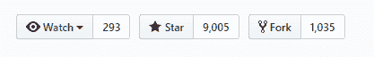
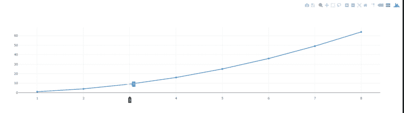
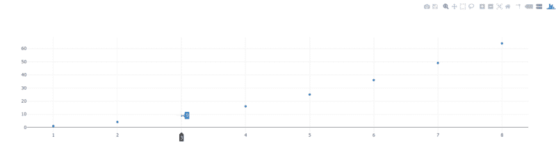
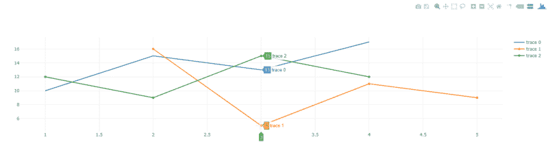
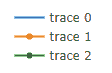
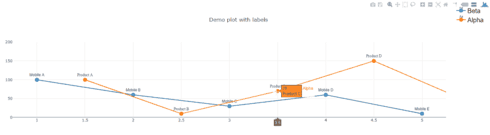
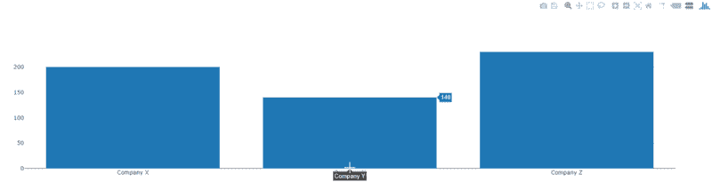
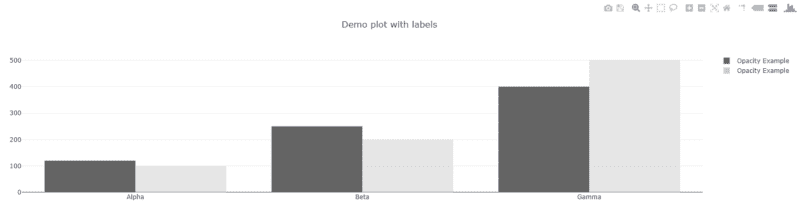
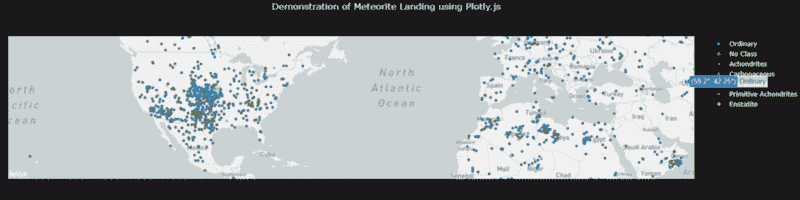

# 开源图形库 plotly.js 简介

> 原文：<https://www.freecodecamp.org/news/an-introduction-to-plotly-js-an-open-source-graphing-library-c036a1876e2e/>

作者:普拉文·杜比

# 开源图形库 plotly.js 简介


Source: [Unsplash](https://unsplash.com)

Plotly.js 是一个非常适合使用图形和图表的 JavaScript 应用程序的库。考虑在您的下一个数据可视化项目中使用它有几个原因:

1.  Plotly.js 使用 D3.js (SVG)和 WebGL 进行图形渲染
2.  Plotly.js 是一个包含 d3.js 和 stack.gl 模块的“一体化包”
3.  它与 JSON 模式一起工作
4.  Plotly.js 支持基本、统计、科学、金融和地图图表。

此外，其开源 Github 上的 9000 多颗星星是其社区增长的有力指标。



### 用法和示例

让我们看看设置和几个例子，以便更好地实际理解。

首先，从文件的 CDN 中包含该文件。

```
<head><!-- Include Plotly.js --><script src="https://cdn.plot.ly/plotly-latest.min.js"></script></head>
```

接下来，让我们绘制一个显示数字及其平方的小图:



生成此图的代码如下:

```
<head>   <!-- Include Plotly.js -->   <script src="https://cdn.plot.ly/plotly-latest.min.js"></script></head>
```

```
<body>  <div id="myDiv">      <!-- Plotly chart will be drawn inside this DIV -->  </div>
```

```
<script>    var trace = {        x: [1, 2, 3, 4, 5, 6, 7, 8],        y: [1, 4, 9, 16, 25, 36, 49, 64],        mode: 'line'    };
```

```
var data = [ trace ];   Plotly.newPlot('myDiv', data);
```

```
</script></body>
```

基本设置可以通过文件包含、DOM 元素和绘图脚本来完成。

在`<he` ad >中包含了 Plotly.js 库之后，我们定义了一个`empty` < div >来绘制图形。

`Plotly.new()` 在`<d` iv >元素中绘制一个新的绘图，覆盖任何现有的 *g* 绘图，在本例中是我们 `used` myDiv。输入将 `be a` < div >元素和一些数据。

注意跟踪变量中包含了`mode`。它可以是`"lines"`、`"markers"`、`"text"`与`"+"`或`"none"`的任意组合。

例子有`"lines"`、`"markers"`、`"lines+markers"`、`"lines+markers+text"`、`"none"`。

这里我们用了`markers`。请注意，您仅获得图形坐标中标记的点，而看不到穿过所有点的连接线。



现在只需向`data`变量添加值，即可绘制多条线:

```
<head>   <!-- Include Plotly.js -->   <script src="https://cdn.plot.ly/plotly-latest.min.js"></script></head><body>  <div id="myDiv">  <!-- Plotly chart will be drawn inside this DIV --></div>  <script>    var trace1 = {        x: [1, 2, 3, 4],        y: [10, 15, 13, 17],        mode: 'lines',        type: 'scatter'      };
```

```
var trace2 = {        x: [2, 3, 4, 5],        y: [16, 5, 11, 9],        mode: 'marker',        type: 'scatter'      };
```

```
var trace3 = {        x: [1, 2, 3, 4],        y: [12, 9, 15, 12],        mode: 'lines+markers',        type: 'scatter'      };
```

```
var data = [trace1, trace2, trace3];
```

```
Plotly.newPlot('myDiv', data);  </script></body>
```



图表中的图例链接到图表绘图区中以图形方式显示的数据。

到目前为止，我们还没有任何标签，图例如下:



让我们通过使用`text`、`textfont`、`textpostion`等选项来更新它们，以便定制我们的数据标签。这些应该与单独的数据集一起传递。

```
<head>   <!-- Include Plotly.js -->   <script src="https://cdn.plot.ly/plotly-latest.min.js"></script></head>
```

```
<body>  <div id="myDiv"><!-- Plotly chart will be drawn inside this DIV --></div>  <script>    var trace1 = {          x: [1, 2, 3, 4, 5],          y: [100, 60, 30, 60, 10],          mode: 'lines+markers+text',          type: 'scatter',          name: 'Beta',          text: ['Mobile A', 'Mobile B', 'Mobile C', 'Mobile D', 'Mobile E'],          textposition: 'top center',          textfont: {          family:  'Raleway, sans-serif'        },        marker: { size: 12 }      };
```

```
var trace2 = {        x: [1.5, 2.5, 3.5, 4.5, 5.5],        y: [100, 10, 70, 150, 40],        mode: 'lines+markers+text',        type: 'scatter',        name: 'Alpha',        text: ['Product A', 'Product B', 'Product C', 'Product D', 'Product E'],        textfont : {          family:'Times New Roman'        },        textposition: 'bottom center',        marker: { size: 12 }      };
```

```
var data = [ trace1, trace2 ];
```

```
var layout = {        xaxis: {          range: [ 0.75, 5.25 ]        },        yaxis: {          range: [0, 200]        },        legend: {          y: 0.5,          yref: 'paper',          font: {            family: 'Arial, sans-serif',            size: 20,            color: 'black',          }        },        title:'Data Labels on the Plot'      };
```

```
Plotly.newPlot('myDiv', data, layout);  </script></body>
```



标题和注释等其他可视属性的布局将在一个通常称为`layout`的对象中定义。

现在我们已经看到了一些线条的例子，让我们使用`'bar'`作为类型快速绘制一个条形图。

```
var data = [{  x: ['Company X', 'Company Y', 'Company Z'],  y: [200, 140, 230],  type: 'bar'}];
```

```
Plotly.newPlot('myDiv', data);
```



您也可以通过将`scatter`更改为`bar`来更改上述产品和手机数据中的`type` 。

```
var trace = {        x: [1.5, 2.5, 3.5, 4.5, 5.5],        y: [100, 10, 70, 150, 40],        mode: 'lines+markers+text',        type: 'bar',        name: 'Alpha',        text: ['Product A', 'Product B', 'Product C', 'Product D', 'Product E'],        textfont : {          family:'Times New Roman'        },        textposition: 'top',        marker: { size: 12 }      };
```

下面是一个改变条的不透明度的例子:

```
var trace2 = {          x: ['Alpha', 'Beta', 'Gamma'],          y: [100, 200, 500],          type: 'bar',          name: 'Opacity Example',          marker: {            color: 'rgb(204,204,204)',            opacity: 0.5          }};
```



我们已经创建了一些基本的散点图，并讨论了几个可以轻松调整以获得同一图表的不同变化的选项。

让我们继续用几行代码绘制一个流星数据集。

我使用的数据集来自 [bcdunbar 的 github](https://raw.githubusercontent.com/bcdunbar/datasets/master/meteorites_subset.csv) ，我将尝试把整个过程分解成多个步骤。

让我们开始吧。

#### 第一步。初始设置

在 HTML 文件中添加 plotly.js。这包括 JavaScript 文件、空的`div`元素和脚本占位符。

```
<html><head>  <!-- Include Plotly.js file from CDN --&gt;  <script src="https://cdn.plot.ly/plotly-latest.min.js"></script></head><body><!-- DIV will be used for charts --><div id="mapDiv"></div>  <script>  // JS code for plot  </script></div></body></html>
```

#### 第二步。资料组

由于我们的数据集是 CSV 格式的，我们可以使用`Plotly.d3.csv`。它从一个 AJAX 调用中内部读取 CSV 数据。

用于绘图的包装代码:

```
Plotly.d3.csv('https://raw.githubusercontent.com/bcdunbar/datasets/master/meteorites_subset.csv', function(err, rows){
```

```
Plotly.plot('mapDiv', data, layout);
```

```
});
```

#### 第三步。访问令牌

从[这里](https://www.mapbox.com/help/how-access-tokens-work/)获取我们将使用的地图框访问令牌。

`Plotly.plot`需要两个主要的东西:`data`和`layout`，它们定义了将使用什么类型的数据以及如何在屏幕上绘制。

#### 第四步。地图布局

```
var layout = {  title: 'Demonstration of Meteorite Landing using Plotly.js',  font: { color: 'white'  },  dragmode: 'zoom',   mapbox: {    center: {  lat: 38.03697222,   lon: -90.70916722    },     style: 'light',     zoom: 2  },   paper_bgcolor: '#191A1A',   plot_bgcolor: '#191A1A',   showlegend: true,  annotations: [{  x: 0,  y: 0,    text: 'NASA',    showarrow: false  }]};
```

注意，我们使用`mapbox` 来定义所有的地图配置，包括中心、缩放级别、颜色和图例。

接下来，使用以下命令添加我们在步骤 3 中创建的令牌:

```
Plotly.setPlotConfig({    mapboxAccessToken: 'your token here'});
```

#### 第五步。过程数据

我们需要做的最后一件事是从源 CSV 添加我们的数据对象:

```
var classArray = unpack(rows, 'class');  var classes = [...new Set(classArray)];
```

```
function unpack(rows, key) {    return rows.map(function(row) { return row[key]; });  }
```

```
var data = classes.map(function(classes) {    var rowsFiltered = rows.filter(function(row) {        return (row.class === classes);    });    return {       type: 'scattermapbox',       name: classes,       lat: unpack(rowsFiltered, 'reclat'),       lon: unpack(rowsFiltered, 'reclong')    };  });
```

现在我们有了数据、布局、令牌和地图…以下是最终结果:



这是一个使用 plotly.js 一步步绘制地图数据集的绘图演示。您可以在 [Plotly](https://plot.ly/javascript/) 文档中找到许多示例来开始使用。

希望这给了你一个很好的介绍 Plotly js。

**请务必在下面留下您的反馈，**和代码可以在我的 [Github](https://github.com/edubey/plotly-demo) 上找到。