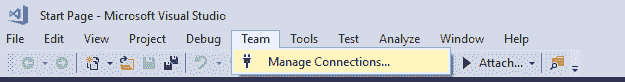
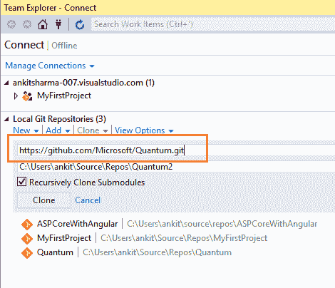
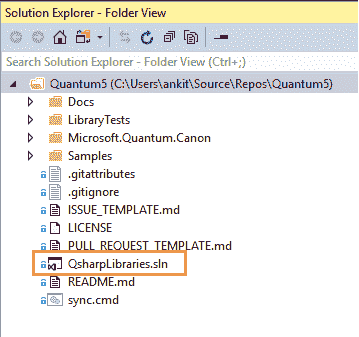
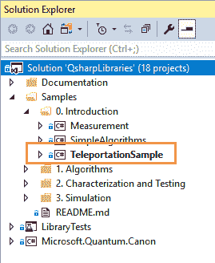
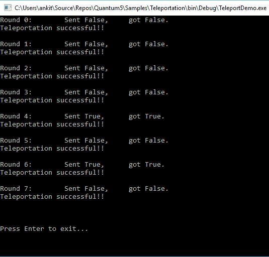

# Q#简介——微软的量子计算语言

> 原文：<https://www.freecodecamp.org/news/an-introduction-to-q-64beaff53a00/>

在本文中，我将向您介绍 Q# —微软为量子计算开发的新编程语言。我们将借助代码片段介绍 Q#数据类型、表达式和语句。

#### 先决条件

关于量子计算的概述，请访问我之前的文章:[量子计算介绍](http://ankitsharmablogs.com/introduction-quantum-computing/)。在那里，我还描述了如何在 Visual Studio 2017 中安装量子开发工具包(QDK)。

### Q#是什么？

根据微软的说法:

> Q#是一种用于量子计算的可扩展、多范例、特定领域的编程语言。

那么，这些术语实际上是什么意思呢？让我们深入细节。

*   可扩展的
    Q#允许我们编写可以在不同计算能力的机器上执行的代码。我们可以用它在本地机器上模拟几个量子位，或者甚至在企业级应用中模拟几千个量子位。
*   **多范例**
    Q#是一种多范例编程语言。它支持函数式和命令式编程风格。如果你是编程范例的新手，我建议你参考这里的。
*   **特定领域**
    Q#是一种针对量子计算的编程语言。它将用于编写在量子处理器上执行的算法和代码片段。

### Q#开发入门

本文将假设您已经安装了 Visual Studio 2017 的 QDK。如果没有，那么你可以[查看我之前的文章](http://ankitsharmablogs.com/introduction-quantum-computing/)以获取指导。

在您成功安装 QDK 后，我们需要验证 Visual Studio 2017 是否安装了 Q#开发所需的所有依赖项。为此，我们将从微软提供的 GitHub 中克隆并执行 quantum 示例程序。

打开 VS 2017，导航至团队>>管理连接。



在 Local Git Repositories 下选择 Clone，输入 URL:[https://github.com/Microsoft/Quantum.git](https://github.com/Microsoft/Quantum.git)，点击“Clone”。



该存储库将被克隆到您的本地计算机上，Visual Studio 将切换到解决方案资源管理器。它将显示所有克隆的库和样本。



现在，打开*qsharpblibraries . SLN*解决方案。

如果出现“安装缺少的功能**”**弹出框，请单击“安装”安装必要的功能。这将下载并安装 F#和一些示例使用的其他工具。确保您已连接到互联网。


要执行一个样本程序，右击“样本> 0 中的*传送样本*项目。QsharpLibrari es 解决方案的介绍文件夹“*，然后点击“设为启动项目”，按 F5。*



如果你能看到类似下图的输出屏幕，那么恭喜你，你的 VS 2017 已经可以进行 Q#开发了。



请注意，您的输出屏幕可能会有所不同，因为被传送的数据是随机的。但它应该发送 8 轮数据，所有都被成功传送。

### Q#型模型

让我们了解一下 Q#提供的各种类型模型有哪些:

#### 原语类型

*   Int: —它表示 64 位有符号整数。注意大写的 I。这与 C#中小写“I”的 *int* 形成对比。
*   Double: —表示双精度浮点数。与 C#中的 *double* 相比，它还有一个大写字母“D”。
*   Bool: —表示布尔类型，可以接受两个值— *真*或*假。*
*   量子位:这代表量子位。量子比特是量子计算机中处理信息的基本单位，类似于经典计算机*中的一个*比特*。*
*   泡利:此类型用于表示旋转的基本操作，并指定测量的基础。
*   结果:—这代表测量的结果。这可以取两个可能的值*零*或*一*
*   范围:—这表示整数序列。
*   字符串:—它表示一系列 Unicode 字符。

#### 数组类型

我们可以创建任何有效的 Q#原始类型的数组类型。Q#不支持矩形多维数组。相反，它只支持交错数组。

`Int[], Qubit[][]`

默认情况下，Q#中的所有变量都是不可变的。它们的值在绑定后不能更改。因此，为了创建一个可以设置值的数组，我们将使用`mutable`关键字:

`mutable myArr = new Int [5];`

这将创建一个大小为 5 的整数数组`myArr`。新数组的元素被初始化为依赖于类型的默认值。在这种情况下，它将是 0，整数类型的默认值。

作为参数传递的数组是不可变的。Q#中的所有数组都是从零开始的。也就是说，数组`arr`的第一个元素总是`arr[0]`。

#### 元组类型

元组类型表示任何给定原始类型的值的元组。表示为`(T1, T2, T3,…)`，其中`T1`、`T2`、`T3`为原始类型。Q#元组是不可变的。一旦创建了元组，我们就不能更改它的内容。

一个元组表达式可以包含多个基本类型的值。因此，`(Int, Double, Result)`类型的元组是有效的元组。

我们也可以用单个元素创建一个元组，就像`(2)`。这就是所谓的单一元组，它被认为等于所包含类型的值。这个属性被称为单一元组等价。

例如，`(2)`是一个类型为`Int`的单元组，但它被认为等同于整数 2。

我们可以创建任何原始类型的用户定义类型。我们还可以创建一个用户定义类型的数组，或者将它包含在一个元组中。用户定义的类型不能相互循环依赖。因此，不可能创建递归类型结构。

用户定义的类型是`base`类型的子类型。这意味着它可以用在任何需要`base`类型值的地方。

#### 操作类型

Q# *操作*是一个可调用的例程，它包含执行量子操作的 Q#代码。在 Q#中，操作是量子执行的基本单位。*操作*只能以元组的形式将单个值作为输入。它返回单个值作为输出，在冒号后指定，并且可以是一个元组。

一个操作有一个包含操作实现的主体部分。它还可以有伴随、受控和受控伴随截面。这些用于指定适当操作的特定变体。操作的参数被指定为括号内的元组。操作的返回类型在冒号后指定。

请参考下面的操作示例:

```
operation AddInteger(a: Int, b: Int): Int {  
    body {  
        mutable c = 0;  
        set c = a + b;  
        return (c);  
    }  
}
```

这里，我们有一个操作`AddInteger`，它将一个元组`(Int, Int)`作为输入。在对输入整数执行加法运算后，它返回一个类型为`Int`的输出。

#### 功能类型

Q#函数是量子算法中使用的经典子例程，只能包含经典代码(但不包含量子运算)。与 Q#操作类似，函数也将单个值作为输入，并返回单个值作为输出。两者都可以是元组。函数不能分配量子位或调用操作。

让我们看一个示例函数。

```
function ProductNumber(a: Double, b: Double): Double {  
    mutable c = 0.0;  
    set c = a * b;  
    return (c);  
}
```

这里，我们定义了一个函数`ProductNumber`，它将一个元组`(Double, Double)`作为输入，并在执行输入值的乘积后返回一个类型为`Double`的输出。另外，注意*函数*没有主体部分，就像*操作的情况一样。*

### Q#中的表达式

我们来看看 Q#里提供的各种表情。

#### 数值表达式

Q#提供了两种类型的数值表达式:

*   整数:用 Int 表示
*   浮点数:用 Double 表示

为了表示十六进制整数，我们使用“0x”前缀。

我们还可以对数值表达式执行二元运算，形成一个新的数值表达式。如果两个输入表达式都是浮点数，新表达式的类型将是`Double`，或者如果两个都是整数，新表达式的类型将是`Int`。

除了二进制运算，数值表达式还支持模、幂、按位与、按位或、按位异或和按位求补运算。

#### 量子位表达式

量子位表达式是与量子位值或量子位阵列元素绑定的符号。Q#不提供任何对量子位文字的支持。

#### 泡利表达式

正如我们前面所讨论的，原始类型`Pauli`可以取四个可能的值:`PauliI`、`PauliX`、`PauliY`和`PauliZ`。这些都是有效的泡利表达式。我们还可以创建一个泡利类型的数组，数组元素被认为是有效的泡利表达式。

两个可能的结果值`Zero`和`One`是有效的结果表达式。需要注意的重要一点是，`One`不同于整数 1，`Zero`不同于整数 0。另外，它们之间没有直接的转换。

这与 C#形成对比，在 C #中，布尔型`true`被认为与整数 1 相同，布尔型`false`被认为与整数 0 相同。

#### 范围表达式

范围表达式表示为`start..step..stop`，其中`start`、`step`、`stop`均为整数。范围表达式可以取值为`start`、`start+step`、`start+step+step`等，直到通过`stop`为止。

如果在一个范围表达式中只提到了`start`和`stop`，那么它将把步长的值隐式地设置为 1。

让我们借助一个例子来理解这一点:

*   `1..3` —表示范围`1,2,3`。这就产生了`1`、`1+1`、`1+1+1`
*   `1..2..6`表示范围`1,3,5`，或`1`、`1+2`、`1+2+2`
*   `8..-2..3`表示范围`8,6,4`或`8`、`8+(-2)`、`8+(-2)+(-2)`

#### 数组表达式

在 Q#中，数组可以表示为一组元素表达式，用分号分隔，并用方括号括起来。与 C#类似，Q#中数组的所有元素应该具有相同的类型。

所以，`[1;2;3]`是有效数组，但是`[1;2.5;Zero]`是无效数组。

我们也可以使用'+'操作符来连接两个相同类型的数组。

所以，`[2;4;6] + [8;10;12]`会给`[2;4;6;8;10;12]`作为输出。

为了找到数组的长度，我们使用了`Length`内置函数。

例如，如果`myArr`是一个有 5 个元素的整数数组，那么`Length(myArr`将返回`5`作为输出。

### Q#语句

Q#中的符号可以是可变的，也可以是不可变的。

不可变符号在被绑定后不能被改变。我们使用 let 关键字来定义和绑定一个不可变的符号。

`let i=8;`

这将把符号`i`绑定为一个值为 8 的整数。如果我们试图重置一个不可变表达式的值，我们将会得到一个编译时错误。

因此在这种情况下,`set i=10;`会给出一个错误。

可变符号值在绑定后可以更改。我们使用`mutable`关键字来定义和绑定一个可变符号。

`mutable i=8;`

这将把符号`i`绑定为一个值为 8 的整数。

为了改变可变符号的值，我们使用`set`关键字:

`set i=10;`

这将把变量`i`的值更新为 10

#### for 循环

Q#允许 for 循环在整数范围内迭代。for 语句由关键字`for`组成，后跟一个标识符、关键字`in`、一个范围表达式和一个语句块。

范围由范围中的第一个和最后一个整数指定，例如:`1..5`表示范围 1、2、3、4 和 5。如果需要+1 以外的步骤，那么三个整数..在它们之间被使用。

所以，`1..2..10`是范围 1，3，5，7，9。该范围包括两端。

```
for(num in 1..2..10)  
{  
   //Do something  
}
```

顾名思义，这个循环将一直重复，直到操作成功。这个循环基于量子“重复直到成功”模式。它由关键字`repeat`及其语句块、关键字`until`、布尔表达式、关键字`fixup`及其语句块组成。

执行 repeat 块中的语句，然后计算布尔条件。如果布尔条件评估为真，则循环终止。否则，将执行修正块，并再次重复循环。

修复块始终是必需的，即使没有要完成的修复，在这种情况下它将为空。

```
repeat {  
    //do something  
}  
until boolean condition  
fixup {  
    // do something  
}
```

Q#支持条件执行的 if 语句，类似于 C#。if 语句由关键字`if`组成，后跟一个布尔表达式和语句块。if 块可能有一个可选的 else 块，由关键字`else`表示。

```
if (num % 2 == 0) {  
    return true;  
} else {  
    return false;  
}
```

条件语句可以由一系列 if-elseif-else 链组成。else-if 子句由关键字`elif`表示。

```
if (num == 1) {  
    //do something  
}  
elif(num == 2) {  
    //do something  
}  
else {  
    //do something  
}
```

### 结论

在本文中，我们学习了 Q#编程语言的基础知识。我们还安装了 QDK，并用 Visual Studio 2017 验证了 Q#执行环境。请在评论区发表您的宝贵反馈，并关注更多关于量子计算的信息。

这里可以随时参考我之前的文章[。](http://ankitsharmablogs.com/)

你也可以在 [C#角](http://www.c-sharpcorner.com/article/an-introduction-to-q/)找到这篇文章

*最初发表于 2018 年 1 月 16 日[ankitsharmablogs.com](http://ankitsharmablogs.com/an-introduction-to-q/)。*