# 强化学习导论

> 原文：<https://www.freecodecamp.org/news/an-introduction-to-reinforcement-learning-4339519de419/>

托马斯·西蒙尼尼

强化学习是机器学习的一种重要类型，其中代理通过执行动作并查看结果来学习如何在环境中行为。

近年来，我们已经看到这个迷人的研究领域有了很大的进步。例子包括 2014 年的 [DeepMind 和深度 Q 学习架构](https://deepmind.com/research/dqn/)、2016 年的[击败围棋冠军 AlphaGo](https://deepmind.com/research/alphago/) 、2017 年的 [OpenAI 和 PPO](https://blog.openai.com/openai-baselines-ppo/) 等等。

在这一系列文章中，我们将重点学习目前用于解决强化学习问题的不同架构。这些将包括 Q 学习、深度 Q 学习、政策梯度、演员评论和 PPO。

在第一篇文章中，您将了解到:

*   什么是强化学习，奖励是中心思想
*   强化学习的三种方法
*   深度强化学习中的“深”是什么意思

在开始实现深度强化学习代理之前，掌握这些元素非常重要。

强化学习背后的思想是，代理人将通过与环境交互并因执行动作而获得奖励来从环境中学习。

从与环境的互动中学习来自我们的自然经验。想象你是一个住在客厅的孩子。你看到一个壁炉，你走近它。

很温暖，很积极，你感觉很好*(积极奖励+1)。*你明白火是一种积极的东西。

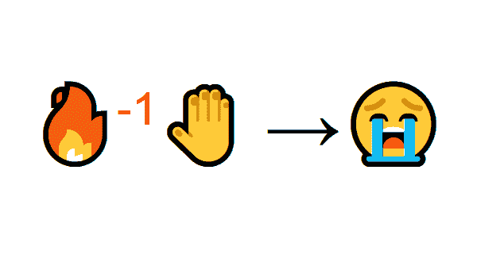

但是当你试着去触摸火焰时。哎哟！它灼伤你的手*(负奖励-1)* 。你刚刚明白，当你离火足够远时，火是积极的，因为它产生温暖。但是离它太近，你就会被烧伤。

这就是人类学习的方式，通过互动。强化学习只是一种从行动中学习的计算方法。

### 强化学习过程

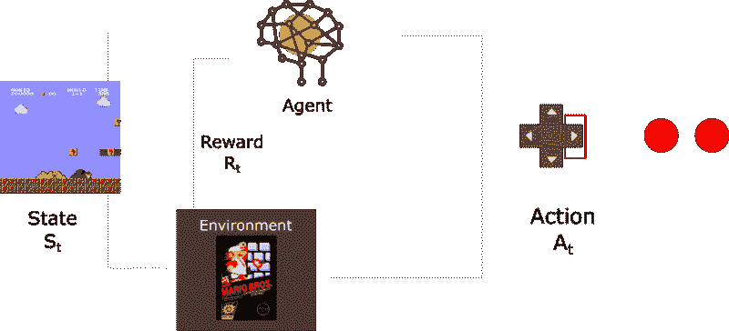

让我们想象一个代理学习玩超级马里奥兄弟作为工作示例。强化学习(RL)过程可以建模为一个循环，其工作方式如下:

*   我们的代理从**环境**接收**状态 S0** (在我们的例子中，我们从超级马里奥兄弟(环境)接收游戏的第一帧(状态))
*   基于那个**状态 S0，**代理采取一个**动作 A0** (我们的代理将向右移动)
*   环境过渡到一个**新的** **状态 S1** (新帧)
*   环境给代理一些**奖励 R1** (没死:+1)

这个 RL 循环输出一系列的**状态、动作和奖励。**

代理人的目标是最大化期望的累积报酬。

#### 奖励假说的中心思想

为什么代理人的目标是期望累积报酬最大化？

强化学习是基于奖励假设的思想。所有目标都可以用期望累积报酬最大化来描述。

这就是为什么在强化学习中，为了获得最佳行为，我们需要最大化预期的累积回报。

每个时间步长 t 的累积奖励可以写成:

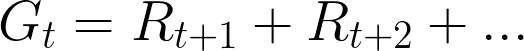

这相当于:

Thanks to [Pierre-Luc Bacon](https://twitter.com/pierrelux) for the correction

然而，在现实中，我们不能只是像那样增加奖励。更早到来的回报(在游戏开始时)更有可能发生，因为它们比长期的未来回报更可预测。

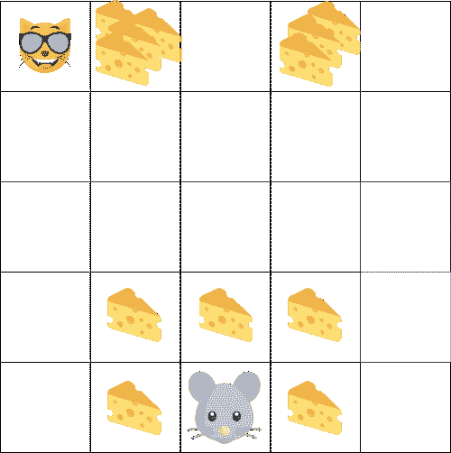

假设你的代理人是这只小老鼠，你的对手是猫。你的目标是在被猫吃掉之前吃掉最多的奶酪。

正如我们在图中看到的，吃我们附近的奶酪比吃猫附近的奶酪的可能性更大(我们离猫越近，越危险)。

这样一来，猫附近的奖励，即使它更大(奶酪更多)，也会打折扣。我们不确定能不能吃到它。

为了减少奖励，我们这样进行:

我们定义一个叫做伽玛的贴现率。它必须介于 0 和 1 之间。

*   伽玛越大，折扣越小。这意味着学习代理更关心长期回报。
*   另一方面，伽玛越小，折扣越大。这意味着我们的代理人更关心短期回报(最接近的奶酪)。

我们的折现累积预期回报是:

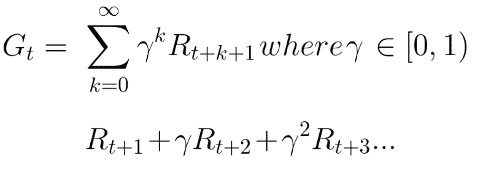

Thanks to [Pierre-Luc Bacon](https://twitter.com/pierrelux) for the correction

简单来说，每个奖励将按时间步长的指数乘以 gamma。随着时间步长的增加，猫离我们越来越近，所以未来的奖励发生的可能性越来越小。

### 零星的或连续的任务

任务是强化学习问题的一个实例。我们可以有两种类型的任务:间断的和连续的。

#### **情景任务**

在这种情况下，我们有一个起点和一个终点**(一个终止状态)。这创建了一集**:一个状态、动作、奖励和新状态的列表。

例如，想想《超级马里奥兄弟》,一集开始于一个新马里奥的发布，结束于:当你被杀或者你到达关卡的终点。

Beginning of a new episode

#### 连续任务

这些是永远持续的任务(没有终止状态)。在这种情况下，代理必须学习如何选择最佳行动，同时与环境进行交互。

例如，进行自动股票交易的代理。对于这个任务，没有起点和终点状态。代理人一直在跑，直到我们决定阻止他。

### 蒙特卡洛与 TD 学习方法

我们有两种学习方式:

*   在剧集结束时收集奖励**，然后计算**最大预期未来奖励** : *蒙特卡罗方法***
*   估算**每一步的回报** : *时差学习*

#### 蒙特卡洛

当一集结束时(代理人达到一个“终结状态”)，代理人查看总的累积奖励，看它做得如何。在蒙特卡洛方法中，奖励只有在游戏结束时**才能得到。**

然后，我们用增加的知识开始一个新的游戏。代理每次迭代都会做出更好的决策。

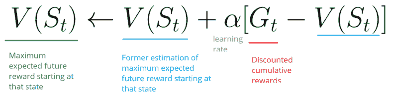

让我们举个例子:

如果我们以迷宫环境为例:

*   我们总是从同一个起点出发。
*   如果猫吃了我们或者我们移动超过 20 步，我们就终止这一集。
*   在这一集的最后，我们有一个状态、动作、奖励和新状态的列表。
*   代理将合计总奖励 Gt(以查看其表现)。
*   然后，它将根据上面的公式更新 V(st)。
*   然后用这个新知识开始新的游戏。

通过播放越来越多的剧集，代理人将学会越来越好地扮演角色。

#### 时间差异学习:在每个时间步学习

另一方面，TD Learning 不会等到一集结束时才更新**最大预期未来回报估计:它会针对该体验中出现的非终端状态 St 更新其值估计 V。**

这种方法称为 TD(0)或**一步 TD(在任何单个步骤后更新值函数)。**

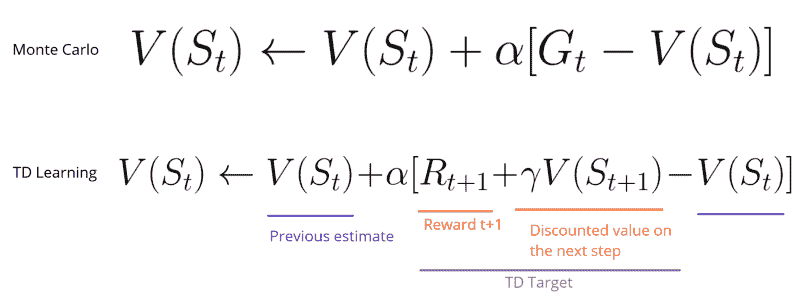

TD 方法**只等到下一个时间步来更新估计值。**在时间 t+1，他们立即**使用观察到的回报 Rt+1 和当前估计 V(St+1)形成 TD 目标。**

TD 目标是一个估计值:事实上，您可以通过向一个单步目标更新它来更新先前的估计值 V(St) **。**

### 勘探/开采权衡

在研究解决强化学习问题的不同策略之前，我们必须讨论一个非常重要的话题:探索/利用的权衡。

*   探索就是寻找更多关于环境的信息。
*   剥削是利用已知信息来获取最大回报。

记住，我们的 RL 代理的目标是最大化期望的累积回报。然而，我们可能会陷入一个常见的陷阱。

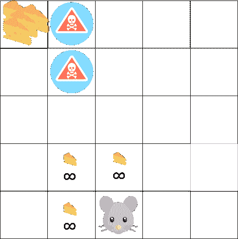

在这个游戏中，我们的老鼠可以拥有无限量的小奶酪(每个+1)。但是在迷宫的顶端有一个巨大的奶酪(+1000)。

然而，如果我们只着眼于回报，我们的代理人将永远不会达到奶酪的巨额金额。相反，它只会剥削最近的奖励来源，即使这个来源很小(剥削)。

但是，如果我们的代理做一点点的探索，它可以找到大的回报。

这就是我们所说的探索/开发权衡。我们必须定义一个有助于处理这种权衡的规则。我们将在以后的文章中看到处理它的不同方法。

### 强化学习的三种方法

现在我们已经定义了强化学习的主要元素，让我们继续讨论解决强化学习问题的三种方法。这些是基于价值、基于策略和基于模型的。

#### 基于价值

在基于价值的 RL 中，目标是优化价值函数 *V(s)* 。

价值函数是一个告诉我们代理人在每个状态下将获得的最大预期未来回报的函数。

每个状态的值是从该状态开始，代理人在未来可以期望积累的奖励总额。

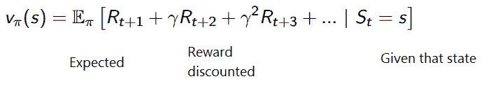

代理将使用这个值函数来选择每个步骤要选择的状态。代理采用具有最大值的状态。

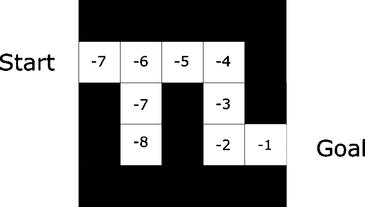

在迷宫的例子中，每一步我们将取最大值:-7，然后-6，然后-5(以此类推)来达到目标。

#### 基于策略

在基于策略的 RL 中，我们希望直接优化策略函数 *π(s)* 而不使用值函数。

策略是在给定时间定义代理行为的东西。

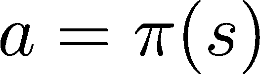

action = policy(state)

我们学习一个政策函数。这让我们可以将每个状态映射到最佳的对应动作。

我们有两种政策:

*   确定性:处于给定状态的策略将总是返回相同的动作。
*   随机:输出动作的分布概率**。**

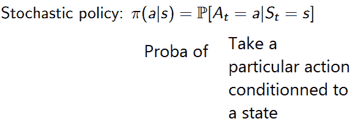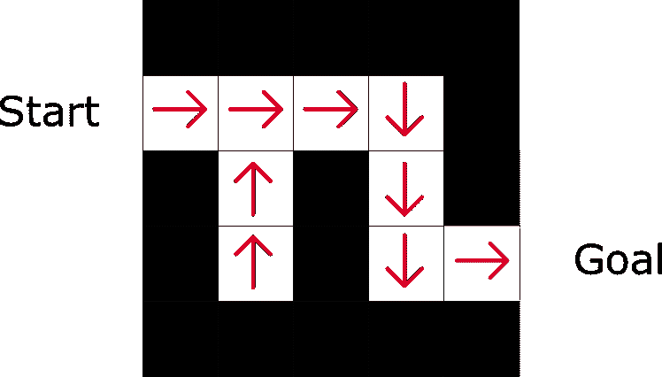

正如我们在这里看到的，策略直接指出了每个步骤要采取的最佳行动。

#### 基于模型

在基于模型的 RL 中，我们对环境进行建模。这意味着我们创造了一个环境行为的模型。

问题是每个环境都需要不同的模型表示。这就是为什么我们不会在接下来的文章中谈论这种类型的强化学习。

### 引入深度强化学习

深度强化学习引入了深度神经网络来解决强化学习问题——因此得名“深度”。

例如，在下一篇文章中，我们将研究 Q 学习(经典强化学习)和深度 Q 学习。

你会发现不同之处在于，在第一种方法中，我们使用传统算法来创建一个 Q 表，帮助我们找到对每个状态采取什么行动。

在第二种方法中，我们将使用一个神经网络(基于状态:q 值来近似奖励)。

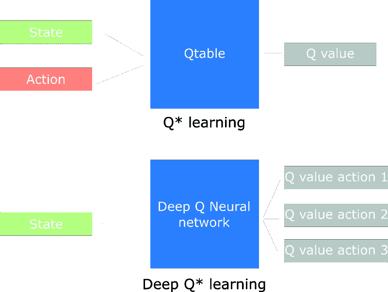

Schema inspired by the Q learning notebook by Udacity

恭喜你。这篇文章里有很多信息。一定要真正掌握材料再继续。在进入有趣的部分之前，掌握这些元素很重要:创建玩视频游戏的 AI。

重要:本文是关于深度强化学习的免费系列博文的第一部分。欲了解更多信息和资源，[查看教学大纲。](https://simoninithomas.github.io/Deep_reinforcement_learning_Course/)

下一次，我们将研究一个学习玩冰湖游戏的 Q 学习代理。

FrozenLake

如果你喜欢我的文章，请点击？下面是你喜欢文章的次数，所以其他人会在媒体上看到它。别忘了跟着我！

如果你有任何想法，评论，问题，欢迎在下面评论或者给我发邮件:hello@simoninithomas.com，或者发推特给我。

干杯！

#### **深度强化学习课程:**

> 我们正在用 Tensorflow 制作深度强化学习课程的**视频版？在这里，我们将重点放在 tensorflow h [ere 的实现部分。](https://youtu.be/q2ZOEFAaaI0)**

*第一部分:[强化学习简介](https://www.freecodecamp.org/news/an-introduction-to-reinforcement-learning-4339519de419/www.freecodecamp.org/news/an-introduction-to-reinforcement-learning-4339519de419/)*

*第二部分:[用 Q-Learning](https://www.freecodecamp.org/news/diving-deeper-into-reinforcement-learning-with-q-learning-c18d0db58efe/)* 深入强化学习

*第三部分:[深度 Q-Learning 入门:来玩毁灭战士](https://www.freecodecamp.org/news/an-introduction-to-deep-q-learning-lets-play-doom-54d02d8017d8/)*

第 3 部分+: [深度 Q 学习的改进:决斗双 DQN，优先体验重放，固定 Q 目标](https://www.freecodecamp.org/news/improvements-in-deep-q-learning-dueling-double-dqn-prioritized-experience-replay-and-fixed-58b130cc5682/)

第 4 部分:[关于厄运和翻转的政策梯度的介绍](https://www.freecodecamp.org/news/an-introduction-to-policy-gradients-with-cartpole-and-doom-495b5ef2207f/)

第五部分:[优势演员介绍评论方法:我们来玩刺猬索尼克吧！](https://www.freecodecamp.org/news/an-intro-to-advantage-actor-critic-methods-lets-play-sonic-the-hedgehog-86d6240171d/)

第 6 部分:[刺猬索尼克 2 和 3 的近似策略优化(PPO)](https://towardsdatascience.com/proximal-policy-optimization-ppo-with-sonic-the-hedgehog-2-and-3-c9c21dbed5e?gi=30cae83cd9a5)

第七部分:[好奇心驱动的学习变得简单第一部分](https://towardsdatascience.com/curiosity-driven-learning-made-easy-part-i-d3e5a2263359)