# 软件架构手册

> 原文：<https://www.freecodecamp.org/news/an-introduction-to-software-architecture-patterns/>

大家好！在这本手册中，你将了解到软件架构这个庞大而复杂的领域。

当我第一次开始我的编码之旅时，我发现这是一个既令人困惑又令人畏惧的领域。所以我会尽量避免你的困惑。

在这本手册中，我将试着给你一个简单、浅显、易懂的软件架构介绍。

我们将讨论什么是软件世界中的架构，一些你应该理解的主要概念，以及一些当今最广泛使用的架构模式。

对于每个主题，我会给出一个简短的理论介绍。然后，我将分享一些代码示例，让您更清楚地了解它们是如何工作的。我们开始吧！

## 目录

*   [什么是软件架构](#what-is-software-architecture)？
*   [需要了解的重要软件架构概念](#important-software-architecture-concepts-to-know)
    *   [什么是客户端-服务器模式](#whats-the-client-server-model)？
    *   [什么是 API](#what-are-apis)？
    *   [什么是模块化](#what-is-modularity)？
*   您的基础设施是什么样的？
    *   [单片架构](#monolithic-architecture)
    *   [微服务架构](#microservices-architecture)
    *   [什么是前端(BFF)](#what-is-back-end-for-front-end-bff-) 的后端？
    *   [如何使用负载平衡器和水平缩放](#how-to-use-load-balancers-and-horizontal-scaling)
*   [您的基础设施位于何处](#where-your-infrastructure-lives)
    *   [就地托管](#on-premise-hosting)
    *   [传统服务器提供商](#traditional-server-providers)
    *   [托管在云上](#hosting-on-the-cloud)
        *   [传统](#traditional)
        *   [弹性](#elastic)
        *   [无服务器](#serverless)
        *   [许多其他服务](#lots-of-other-services)
*   [了解不同的文件夹结构](#different-folder-structures-to-know)
    *   [全在一处的文件夹结构](#all-in-one-place-folder-structure)
    *   [层文件夹结构](#layers-folder-structure)
    *   [MVC 文件夹结构](#mvc-folder-structure)
*   [结论](#conclusion)

# 什么是软件架构？

根据[这个来源](https://www.sei.cmu.edu/our-work/software-architecture/):

> 系统的软件架构代表了与整个系统结构和行为相关的设计决策。

这很普通，对吧？绝对的。这也正是我在研究软件架构时感到困惑的地方。这是一个包含很多内容的话题，这个术语用来谈论许多不同的事情。

最简单的说法是，软件架构指的是你在创建软件的过程中如何组织东西。这里的“东西”可以指:

*   **实现细节**(即你的回购的文件夹结构)
*   **实现** **设计**决策(你使用服务器端还是客户端渲染？关系数据库还是非关系数据库？)
*   您选择的**技术**(您的 API 使用 REST 还是 GraphQl？用 Django 的 Python 还是用 Express 的 Node 做你的后端？)
*   **系统** **设计**决策(比如您的系统是一个整体还是分为多个微服务？)
*   **基础设施**决策(您是在本地还是在云提供商上托管您的软件？)

有很多不同的选择和可能性。更复杂的是，在这 5 个部分中，不同的模式可以组合在一起。这意味着，我可以有一个使用 REST 或 GraphQL 的 monolith API，一个基于微服务的应用程序，托管在内部或云上，等等。

为了更好地解释这种混乱，首先我们要解释一些基本的通用概念。然后我们将讨论其中的一些部分，解释当今构建应用程序最常用的架构模式或选择。

# 需要了解的重要软件架构概念

## 什么是客户机-服务器模型？

**客户机-服务器**是在资源或服务**提供者**(服务器)和服务或资源请求者(客户机)之间构建应用程序的任务或工作负载的模型。

简单来说，客户端是请求某种信息或执行动作的应用程序，服务器是根据客户端所做的发送信息或执行动作的程序。

客户端通常由运行在 web 或移动应用程序上的前端应用程序代表(尽管也存在其他平台，后端应用程序也可以充当客户端)。服务器通常是后端应用程序。

为了举例说明这一点，想象你正在进入你最喜欢的社交网络。当你在浏览器上输入网址并按回车键时，你的浏览器就像客户端应用程序一样**向社交网络服务器发送请求**，而**通过向你发送网站内容来响应**。

如今，大多数应用程序都使用客户机-服务器模型。要记住的最重要的概念是,**客户机请求资源或服务**,服务器执行的**。**

另一个需要知道的重要概念是，客户机和服务器是同一个系统的一部分，但是它们各自都是独立的应用程序。这意味着它们可以单独开发、托管和执行。

如果你不熟悉前端和后端的区别，[这里有一篇很酷的文章解释它](https://www.freecodecamp.org/news/frontend-vs-backend-whats-the-difference/)。这里是[的另一篇文章](https://www.freecodecamp.org/news/how-the-web-works-part-ii-client-server-model-the-structure-of-a-web-application-735b4b6d76e3/)，它扩展了客户端-服务器的概念。

## 什么是 API？

我们刚刚提到，客户端和服务器是相互通信以请求和响应事物的实体。这两个部分通常通过 API(应用程序编程接口)进行通信。

API 只不过是一组定义好的规则，用来建立一个应用程序如何与另一个应用程序通信。这就像两个部分之间的契约说“如果你发送 A，我将总是响应 b。如果你发送 C，我将总是响应 D ...”诸如此类。

有了这组规则，客户机就确切地知道为了完成某项任务它需要什么，服务器也确切地知道当必须执行某项动作时客户机将需要什么。

API 有不同的实现方式。最常用的是 REST、SOAP 和 GraphQl。

关于 API 如何通信，通常使用 HTTP 协议，内容以 JSON 或 XML 格式交换。但是其他协议和内容格式也是完全可能的。

如果你想扩展这个话题，[这里有一篇好文章](https://www.freecodecamp.org/news/http-request-methods-explained/)供你阅读。

## 什么是模块化？

当我们谈论软件架构中的“模块化”时，我们指的是将大的东西分成小块的实践。这种分解事物的做法是为了简化大型应用程序或代码库。

模块化具有以下优势:

*   它有利于划分关注点和特性，这有助于项目的可视化、理解和组织。
*   当项目被清晰地组织和细分时，它往往更容易维护，更不容易出错。
*   如果你的项目被细分成许多不同的部分，那么每个部分都可以被单独和独立地处理和修改，这通常是非常有用的。

我知道这听起来有点普通，但是模块化或者细分事物的实践是软件架构的一个非常重要的部分。所以请记住这个概念——当我们看一些例子时，它会变得更加清晰和明显。；)

如果你想了解更多关于这个主题的信息，我最近写了一篇关于 JS 中模块使用的文章，你可能会觉得有用。

# 你的基础设施是什么样的？

好了，现在让我们进入正题。我们将开始讨论组织软件应用程序的许多不同方式，从如何组织项目背后的基础设施开始。

为了让这一切不那么抽象，我们将使用一个假想的应用程序，我们称之为 Notflix。🤔🤫🥸

旁注:请记住，这个例子可能不是最现实的，我将假设/强迫一些情况，以呈现某些概念。这里的想法是通过一个例子帮助你理解核心架构概念，而不是执行真实世界的分析。

## 整体建筑

因此，Notflix 将是一个典型的视频流应用程序，用户可以在其中观看电影、连续剧、纪录片等。用户将能够在网络浏览器、移动应用和电视应用中使用该应用。

我们的应用程序中包含的主要服务将是**身份验证**(这样人们就可以创建帐户、登录等等)、**支付**(这样人们就可以订阅和访问内容...因为你不认为这一切都是免费的，对吗？😑)当然还有**流媒体**(这样人们就可以真正看到他们在支付什么)。

我们架构的快速草图可能是这样的:

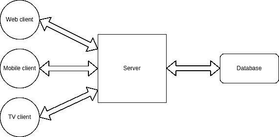

A classic monolithic architecture

在左侧，我们有三个不同的前端应用程序，它们将在该系统中充当客户端。例如，它们可以用 React 和 React-native 开发。

我们有一个单一的服务器，它将接收来自所有三个客户端应用程序的请求，在必要时与数据库通信，并相应地响应每个前端。比方说，后端可以用 Node 和 Express 开发。

这种架构被称为整体架构，因为只有一个服务器应用程序负责系统的所有功能。在我们的例子中，如果一个用户想要认证、付费或者观看我们的电影，所有的请求都将被发送到同一个服务器应用程序。

单片设计的主要优点是简单。它的功能和所需的设置很简单，也很容易理解，这就是为什么大多数应用程序都是这样开始的。

## 微服务架构

结果发现 Notflix 完全颠覆了它。我们刚刚发布了最新一季的“陌生人暴徒”，这是一部关于青少年说唱歌手的精彩科幻系列片，我们的电影“特工 404”(关于一名秘密特工潜入一家公司，假装是高级程序员，但实际上对代码一无所知)正在打破所有记录...

我们每个月都有来自世界各地的成千上万的新用户，这对我们的业务来说很好，但对我们的单片应用来说就没那么好了。

最近，我们一直在经历服务器响应时间的延迟，即使我们已经**垂直扩展了**服务器(投入更多的 RAM 和 GPU ),可怜的东西似乎无法承受它所承受的负载。

此外，我们一直在我们的系统中开发新功能(如读取用户偏好并推荐适合用户档案的电影的推荐工具)，我们的代码库开始看起来庞大且非常复杂。

深入分析这个问题，我们发现占用资源最多的功能是流媒体，而身份验证和支付等其他服务的负载并不是很大。

为了解决这个问题，我们将实现一个类似于下面这样的**微服务架构**:

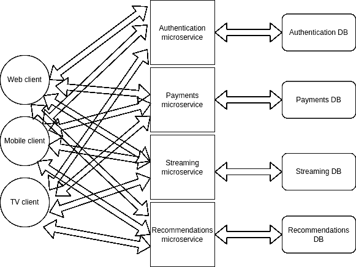

Our first microservices implementation

因此，如果你是所有这些的新手，你可能会想“到底什么是微服务”，对不对？嗯，我们可以将其定义为将服务器端功能划分为许多小型服务器的概念，这些小型服务器只负责一个或几个特定的功能。

以我们的例子为例，以前我们只有一台服务器负责所有功能(整体架构)。实施微服务后，我们将有一台服务器负责身份验证，另一台负责支付，另一台负责流媒体，最后一台负责推荐。

当用户想要登录时，客户端应用程序将与认证服务器通信，当用户想要支付时，与支付服务器通信，当用户想要观看某些内容时，与流媒体服务器通信。

所有这些通信都是通过 API 进行的，就像普通的单片服务器一样(或者通过其他通信系统，如 [Kafka](https://kafka.apache.org/) 或 [RabbitMQ](https://www.rabbitmq.com/) )。唯一的区别是，现在我们有不同的服务器负责不同的操作，而不是一个单独的服务器来完成所有的操作。

这听起来有点复杂，确实如此，但是微服务为我们提供了以下好处:

*   您可以根据需要扩展特定的服务，而不是一次性扩展整个后端。按照我们的例子，当我们开始遇到性能问题时，我们垂直扩展了我们的整个服务器——但实际上，需要更多资源的功能只是流。现在，我们已经将流功能分离到一台服务器中，我们可以只扩展那台服务器，而不去管其他服务器，只要它们能正常工作。
*   特性将会更加**松散耦合**，这意味着我们将能够独立开发和部署它们。
*   每台服务器的**代码库**将会更小**更简单**。这对从一开始就和我们一起工作的开发人员来说很好，对新开发人员来说也更容易更快理解。

微服务是一种架构，设置和管理起来更复杂，这就是为什么它只对非常大的项目有意义。大多数项目将从整体开始，仅在出于性能原因需要时才迁移到微服务。

如果你想了解更多关于微服务的知识，[这里有一个非常好的解释](https://www.youtube.com/watch?v=CdBtNQZH8a4)。

### 什么是后端对前端(BFF)？

实施微服务时出现的一个问题是，与前端应用程序的通信变得更加复杂。现在，我们有许多服务器负责不同的事情，这意味着前端应用程序需要跟踪这些信息，以知道向谁发出请求。

通常这个问题可以通过在前端应用和微服务之间实现一个中间层来解决。这一层会接收所有的前端请求，重定向到对应的微服务，接收微服务响应，然后将响应重定向到对应的前端 app。

BFF 模式的好处是，我们可以获得微服务架构的好处，而不会使与前端应用程序的通信过于复杂。

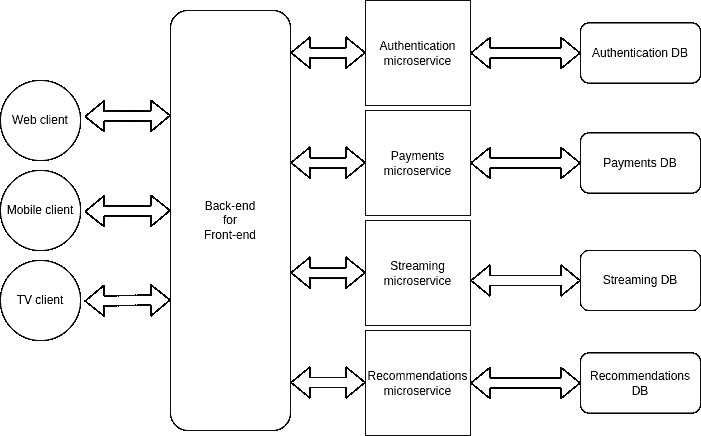

Our BFF implementation

如果你想了解更多，这里有一个解释 BFF 模式的视频。

### 如何使用负载平衡器和水平扩展

因此，我们的流媒体应用程序一直在以指数速度增长。全球有数百万用户全天候观看我们的电影，比我们预期的更快，我们又开始遇到性能问题。

我们再次发现流媒体服务是压力最大的服务，我们已经尽我们所能对该服务器进行了纵向扩展。进一步将该服务细分为更多的微服务没有意义，因此我们决定**横向扩展**该服务。

之前我们提到过**垂直扩展**意味着向单个服务器/计算机添加更多资源(RAM、磁盘空间、GPU 等等)。**另一方面，水平扩展**意味着设置更多的服务器来执行相同的任务。

我们现在有三台服务器，而不是一台服务器负责流媒体。然后，客户机执行的请求将在这三个服务器之间平衡，以便所有服务器都能处理可接受的负载。

这种请求分配通常由一个叫做**负载平衡器**的东西来执行。负载平衡器充当我们服务器的 **[反向代理](https://www.strongdm.com/blog/difference-between-proxy-and-reverse-proxy#:~:text=A%20traditional%20forward%20proxy%20server,on%20behalf%20of%20multiple%20servers.)** ，在客户端请求到达服务器之前拦截它们，并将请求重定向到相应的服务器。

虽然典型的客户端-服务器连接可能如下所示:

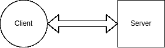

This is what we had before

使用负载平衡器，我们可以将客户端请求分布在多个服务器上:

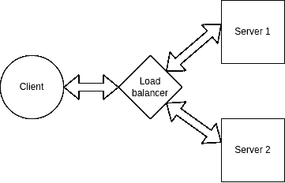

This is what we want now

您应该知道，水平伸缩对于数据库也是可能的，就像对于服务器一样。实现这一点的一种方法是使用源-副本模型，在这种模型中，一个特定的源数据库将接收所有的写查询，并沿着一个或多个副本数据库复制它的数据。副本数据库将接收并响应所有读取查询。

数据库复制的优点是:

*   更好的性能:该模型提高了性能，允许并行处理更多的查询。
*   可靠性和可用性:如果您的一个数据库服务器被破坏或由于任何原因无法访问，数据仍然保存在其他数据库中。

因此，在实施负载平衡器、水平扩展和数据库复制后，我们的架构可能如下所示:

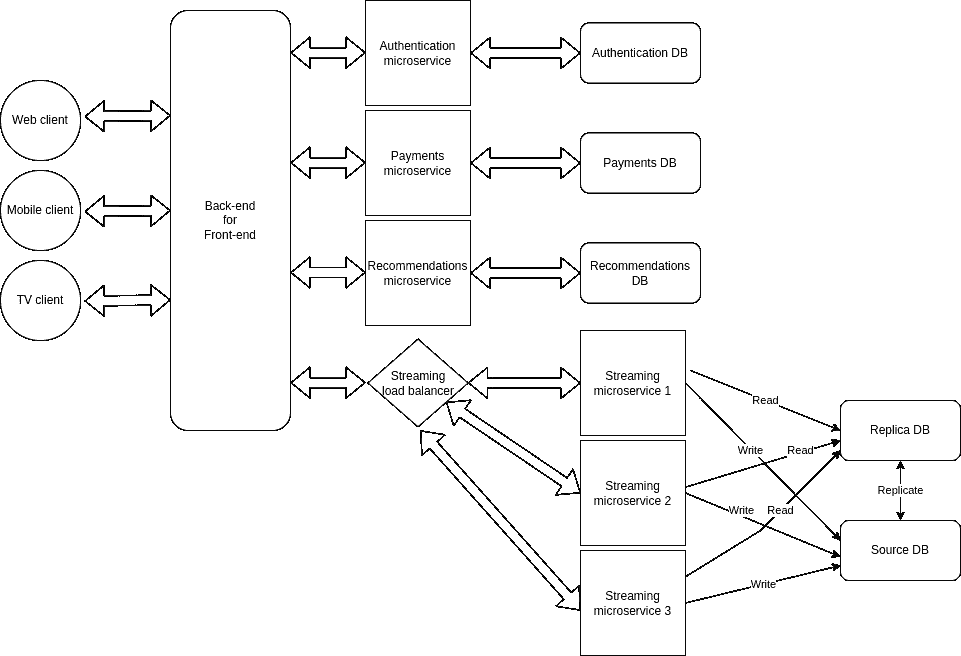

Our horizontally scaled architecture

如果你有兴趣了解更多，这里有一个关于负载平衡器的很棒的视频解释。

旁注:当我们谈论微服务、负载平衡器和扩展时，我们可能总是在谈论后端应用。对于前端应用程序来说，它们通常都是作为一个整体开发的，尽管也有一个奇怪有趣的东西叫做[微前端](https://www.youtube.com/watch?v=w58aZjACETQ)。🧐

# 您的基础设施所在的位置

既然我们对如何组织应用程序基础设施有了基本的概念，接下来要考虑的是我们将把所有这些东西放在哪里。

正如我们将要看到的，在决定托管应用程序的位置和方式时，主要有三种选择:本地托管、传统服务器提供商托管或云托管。

## 内部托管

本地意味着您拥有运行应用程序的硬件。在过去，这是托管应用程序最传统的方式。公司过去有专门的房间来放置服务器，有专门的团队来设置和维护硬件。

这个选项的好处是公司可以完全控制硬件。坏的方面是它需要空间、时间和金钱。

想象一下，如果您想要横向扩展某个服务器，这将意味着购买更多的设备，设置它，不断地监督它，修复任何损坏的东西...如果您以后需要缩减服务器的规模，通常情况下，您无法在购买这些东西后将其退回。🥲

对于大多数公司来说，拥有本地服务器意味着将大量资源投入到与公司目标不直接相关的任务中。


How we imagined our server room at Notflix


How it ended up

在处理非常敏感或隐私的信息时，本地服务器仍然有意义。例如，想想运行发电厂的软件，或者私人银行信息。许多这样的组织决定拥有本地服务器，作为完全控制其软件和硬件的一种方式。

## 传统服务器提供商

对大多数公司来说，传统的服务器提供商是一个更舒适的选择。这些公司有自己的服务器，他们只是租用这些服务器。您决定您的项目需要什么样的硬件，并为此支付月费(或基于其他条件的一些金额)。

这个选项的好处在于，您再也不需要担心任何与硬件相关的事情。供应商会负责，作为一家软件公司，你只需要担心你的主要目标，软件。

另一件很酷的事情是，向上或向下扩展很容易，而且没有风险。如果您需要更多硬件，您需要付费。如果你不再需要它，你就停止支付。

众所周知的服务器提供商的一个例子是 [hostinger](https://www.hostinger.com) 。

## 在云上托管

如果你接触技术已经有一段时间了，你可能不止一次听到“云”这个词。起初，这听起来很抽象，有点不可思议，但实际上它的背后只不过是亚马逊、谷歌和微软等公司拥有的巨大数据中心。

在某个时候，这些公司发现他们拥有并没有一直使用的强大计算能力。由于所有这些硬件无论你是否使用都是有成本的，明智的做法是将计算能力商业化给其他人。

这就是云计算。使用不同的服务，如 **AWS** (亚马逊网络服务)**谷歌云**或微软 **Azure** ，我们能够在这些公司的数据中心托管我们的应用程序，并利用所有这些计算能力。


What a "cloud" might actually look like

当开始了解云服务时，注意到有许多不同的方式可以使用它们是很重要的:

### 传统的

第一种方法是像使用传统服务器提供商一样使用它们。你选择你想要的硬件，然后按月支付。

### 弹性的

第二种方法是利用大多数提供商提供的“弹性”计算。“弹性”意味着应用程序的硬件容量会根据应用程序的使用情况自动增加或减少。

例如，您可以从拥有 8gb 内存和 500gb 磁盘空间的服务器开始。如果您的服务器开始收到越来越多的请求，而这些容量已经不足以提供良好的性能，系统可以自动执行垂直或水平扩展。

最棒的是，您可以预先配置所有这些，而不必再次担心。随着服务器自动伸缩，您只需为消耗的资源付费。

### 无服务器

使用云计算的另一种方式是无服务器架构。

按照这种模式，您不会有一个接收所有请求并对其做出响应的服务器。相反，您将拥有映射到一个访问点(类似于 API 端点)的独立函数。

这些函数将在每次收到请求时执行，并执行您为它们编写的任何操作(连接到数据库、执行 CRUD 操作或您可以在常规服务器中执行的任何其他操作)。

无服务器架构的好处在于，您可以完全忘记服务器维护和扩展。您只需要在需要时执行一些功能，每个功能都可以根据需要自动缩放。

作为客户，您只需为函数执行的次数和每次执行持续的处理时间付费。

如果你想了解更多，这里有一个关于无服务器模式的[解释。](https://www.youtube.com/watch?v=vxJobGtqKVM)

### 许多其他服务

您可能会看到弹性和无服务器服务是如何为建立软件基础设施提供一个非常简单和方便的选择。

除了与服务器相关的服务，云提供商还提供大量其他解决方案，如关系和非关系数据库、文件存储服务、缓存服务、认证服务、机器学习和数据处理服务、监控和性能分析等。一切都托管在云中。

通过像 [Terraform](https://www.terraform.io/) 或 AWS [云形成](https://aws.amazon.com/es/cloudformation/)这样的工具，我们甚至可以将基础设施设置为代码。也就是说，我们可以编写一个脚本，在几分钟内设置好服务器、数据库以及我们在云上可能需要的任何东西。

从工程的角度来看，这是令人兴奋的，对于我们这些开发人员来说非常方便。如今，云计算提供了一套非常完整的解决方案，可以轻松适应从微小的项目到地球上最大的数字产品。这就是为什么现在越来越多的软件项目选择在云中托管他们的基础设施。

如前所述，最常用和最知名的云提供商是 [AWS](https://aws.amazon.com/) 、[谷歌云](https://cloud.google.com/)和 [Azure](https://azure.microsoft.com/) 。尽管也有其他选择，如 IBM 的[、数字海洋的](https://www.ibm.com/cloud)、数字海洋的和甲骨文的[。](https://www.oracle.com/cloud/)

这些提供商中的大多数提供相同类型的服务，尽管它们可能有不同的名称。例如，无服务器功能在 AWS 上称为“lambdas”，在 Google cloud 上称为“云功能”。

# 要知道不同的文件夹结构

好了，到目前为止，我们已经看到了架构是如何指代基础架构组织和托管的。现在让我们来看一些代码，以及架构如何引用文件夹结构和代码模块化。

## 全在一处的文件夹结构

为了说明为什么文件夹结构很重要，让我们构建一个虚拟的 API 示例。我们会有一个模拟的兔子数据库🐰🐰API 将对其执行 [CRUD](https://www.freecodecamp.org/news/crud-operations-explained/) 操作。我们将用 Node 和 Express 来构建它。

这是我们的第一种方法，完全没有文件夹结构。我们的回购将由`node modules`文件夹、`app.js`、`package-lock.json`和`package.json`文件组成。

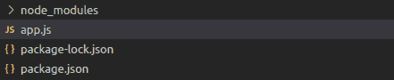

在我们的 app.js 文件中，我们将有我们的微型服务器、我们的模拟数据库和两个端点:

```
// App.js
const express = require('express');

const app = express()
const port = 7070

// Mock DB
const db = [
    { id: 1, name: 'John' },
    { id: 2, name: 'Jane' },
    { id: 3, name: 'Joe' },
    { id: 4, name: 'Jack' },
    { id: 5, name: 'Jill' },
    { id: 6, name: 'Jak' },
    { id: 7, name: 'Jana' },
    { id: 8, name: 'Jan' },
    { id: 9, name: 'Jas' },
    { id: 10, name: 'Jasmine' },
]

/* Routes */
app.get('/rabbits', (req, res) => {
    res.json(db)
})

app.get('/rabbits/:idx', (req, res) => {
    res.json(db[req.params.idx])
})

app.listen(port, () => console.log(`⚡️[server]: Server is running at http://localhost:${port}`)) 
```

如果我们测试端点，我们会看到它们工作得非常好:

```
http://localhost:7070/rabbits

# [
#   {
#     "id": 1,
#     "name": "John"
#   },
#   {
#     "id": 2,
#     "name": "Jane"
#   },
#   {
#     "id": 3,
#     "name": "Joe"
#   },
#   ....
# ]

###

http://localhost:7070/rabbits/1

# {
#   "id": 2,
#   "name": "Jane"
# } 
```

那么这有什么问题呢？没什么，实际上，它工作得很好。只有当代码库变得更大、更复杂，并且我们开始向 API 添加新特性时，问题才会出现。

类似于我们之前在解释单片架构时谈到的，一开始将所有东西放在一个地方是很好也很容易的。但是当事情开始变得越来越大和复杂时，这是一种令人困惑和难以遵循的方法。

遵循模块化原则，一个更好的想法是为我们需要执行的不同职责和操作准备不同的文件夹和文件。

为了更好地说明这一点，让我们在 API 中添加新的特性，并看看我们如何在层架构的帮助下采用模块化的方法。

## 层文件夹结构

分层体系结构是关于将关注点和职责划分到不同的文件夹和文件中，并且只允许某些文件夹和文件之间的直接通信。

您的项目应该有多少层，每层应该有什么名称，以及它应该处理什么操作，这些都是需要讨论的问题。让我们来看看我认为对我们的例子来说什么是好的方法。

我们的应用程序将有五个不同的层，它们将按以下方式排序:

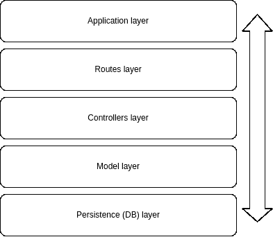

Application layers

*   应用层将有我们的服务器的基本设置和到我们的路由的连接(下一层)。
*   routes 层将定义我们所有的路由和到控制器的连接(下一层)。
*   控制器层将拥有我们想要在每个端点中执行的实际逻辑，以及到模型层的连接(下一层，你明白了...)
*   模型层将保存与模拟数据库交互的逻辑。
*   最后，持久层是我们的数据库所在的地方。

您可以看到这种方法更加结构化，并且关注点划分更加清晰。这听起来可能像许多样板文件。但是在设置好之后，这个架构将允许我们清楚地知道每个东西在哪里，哪些文件夹和文件负责我们的应用程序执行的每个动作。

要记住的一件重要的事情是，在这些类型的架构中**在各层之间有一个定义好的通信流**，必须遵循它才能有意义。

这意味着一个请求首先要通过第一层，然后是第二层，第三层等等。任何请求都不应该跳过层次，因为那会扰乱架构的逻辑以及它给我们带来的组织和模块化的好处。

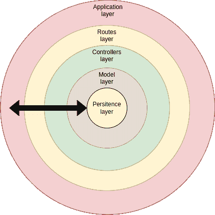

Another way to picture our architecture

现在让我们看一些代码。使用层架构，我们的文件夹结构可能如下所示:

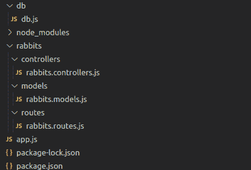

*   我们有一个名为`db`的新文件夹来保存我们的数据库文件。
*   另一个名为`rabbits`的文件夹将保存与该实体相关的路线、控制器和模型。
*   设置我们的服务器并连接到路线。

```
// App.js
const express = require('express');

const rabbitRoutes = require('./rabbits/routes/rabbits.routes')

const app = express()
const port = 7070

/* Routes */
app.use('/rabbits', rabbitRoutes)

app.listen(port, () => console.log(`⚡️[server]: Server is running at http://localhost:${port}`)) 
```

*   `rabbits.routes.js`保存与该实体相关的每个端点，并将它们链接到相应的控制器(当请求到达该端点时，我们希望执行的功能)。

```
// rabbits.routes.js
const express = require('express')
const bodyParser = require('body-parser')

const jsonParser = bodyParser.json()

const { listRabbits, getRabbit, editRabbit, addRabbit, deleteRabbit } = require('../controllers/rabbits.controllers')

const router = express.Router()

router.get('/', listRabbits)

router.get('/:id', getRabbit)

router.put('/:id', jsonParser, editRabbit)

router.post('/', jsonParser, addRabbit)

router.delete('/:id', deleteRabbit)

module.exports = router 
```

*   `rabbits.controllers.js`保存每个端点对应的逻辑。这里是我们编程的地方，函数应该把什么作为输入，它应该执行什么过程，它应该返回什么。😉此外，每个控制器链接到相应的模型函数(它将执行数据库相关的操作)。

```
// rabbits.controllers.js
const { getAllItems, getItem, editItem, addItem, deleteItem } = require('../models/rabbits.models')

const listRabbits = (req, res) => {
    try {
        const resp = getAllItems()
        res.status(200).send(resp)

    } catch (err) {
        res.status(500).send(err)
    }
}

const getRabbit = (req, res) => {
    try {
        const resp = getItem(parseInt(req.params.id))
        res.status(200).send(resp)

    } catch (err) {
        res.status(500).send(err)
    }
}

const editRabbit = (req, res) => {
    try {
        const resp = editItem(req.params.id, req.body.item)
        res.status(200).send(resp)
    } catch (err) {
        res.status(500).send(err)
    }
}

const addRabbit = (req, res) => {
    try {
        console.log( req.body.item )
        const resp = addItem(req.body.item)
        res.status(200).send(resp)
    } catch (err) {
        res.status(500).send(err)
    }
}

const deleteRabbit = (req, res) => {
    try {
        const resp = deleteItem(req.params.idx)
        res.status(200).send(resp)
    } catch (err) {
        res.status(500).send(err)
    }
}

module.exports = { listRabbits, getRabbit, editRabbit, addRabbit, deleteRabbit } 
```

*   `rabbits.models.js`是我们定义将在数据库上执行 CRUD 操作的函数的地方。每个功能代表不同类型的操作(读取一个、读取全部、编辑、删除等等)。这个文件连接到我们的数据库。

```
// rabbits.models.js
const db = require('../../db/db')

const getAllItems = () => {
    try {
        return db
    } catch (err) {
        console.error("getAllItems error", err)
    }
}

const getItem = id => {
    try {
        return db.filter(item => item.id === id)[0]
    } catch (err) {
        console.error("getItem error", err)
    }
}

const editItem = (id, item) => {
    try {
        const index = db.findIndex(item => item.id === id)
        db[index] = item
        return db[index]
    } catch (err) {
        console.error("editItem error", err)
    }
}

const addItem = item => {
    try {
        db.push(item)
        return db
    } catch (err) {
        console.error("addItem error", err)
    }
}

const deleteItem = id => {
    try {
        const index = db.findIndex(item => item.id === id)
        db.splice(index, 1)
        return db
        return db
    } catch (err) {
        console.error("deleteItem error", err)
    }
}

module.exports = { getAllItems, getItem, editItem, addItem, deleteItem } 
```

*   最后，`db.js`托管我们的模拟数据库。在一个真实的项目中，这是您实际的数据库连接可能所在的位置。

```
// db.js
const db = [
    { id: 1, name: 'John' },
    { id: 2, name: 'Jane' },
    { id: 3, name: 'Joe' },
    { id: 4, name: 'Jack' },
    { id: 5, name: 'Jill' },
    { id: 6, name: 'Jak' },
    { id: 7, name: 'Jana' },
    { id: 8, name: 'Jan' },
    { id: 9, name: 'Jas' },
    { id: 10, name: 'Jasmine' },
]

module.exports = db 
```

正如我们所看到的，在这个架构下有更多的文件夹和文件。但结果是，我们的代码库更加结构化，组织更加清晰。每样东西都有自己的位置，不同文件之间的通信也有明确的定义。

这种组织极大地方便了新特性的添加、代码修改和错误修复。

一旦你熟悉了文件夹的结构，并且知道在哪里可以找到每样东西，你会发现使用这些更短更小的文件非常方便，而不必在一两个大文件中滚动，所有的东西都放在一起。

我也支持为应用程序中的每个主要实体(在我们的例子中是兔子)建立一个文件夹。这允许更清楚地理解每个文件涉及的内容。

假设我们现在想添加新功能来添加/编辑/删除猫和狗。我们将为它们创建新的文件夹，每个文件夹都有自己的路线、控制器和模型文件。这个想法是将关注点分开，让每样东西都有自己的位置。👌👌

## MVC 文件夹结构

MVC 是一种架构模式，代表**模型视图控制器**。我们可以说 MVC 架构就像是对层架构的简化，也包含了应用程序的前端(UI)。

在这种架构下，我们只有三个主要层:

*   视图层将负责呈现 UI。
*   控制器层将负责定义路由和每条路由的逻辑。
*   模型层将负责与我们的数据库交互。

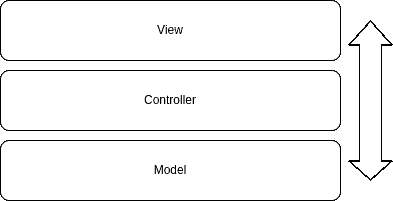

和以前一样，每一层只和下一层交互，所以我们有一个清晰的交流流程。


Another way of picturing our architecture

有许多框架允许你实现开箱即用的 MVC 架构(例如 [Django](https://www.djangoproject.com/) 或 [Ruby on Rails](https://rubyonrails.org/) )。为了用 Node 和 Express 做到这一点，我们需要一个像 [EJS](https://ejs.co/) 这样的模板引擎。

如果你不熟悉模板引擎，它们只是一种在利用变量、循环、条件等编程特性的同时轻松呈现 HTML 的方式(非常类似于我们在 React 中对 JSX 所做的)。

正如我们马上要看到的，我们将为我们想要呈现的每种页面创建 EJS 文件，从每个控制器中，我们将呈现这些文件作为我们的响应，并将相应的响应作为变量传递给它们。

我们的文件夹结构将如下所示:

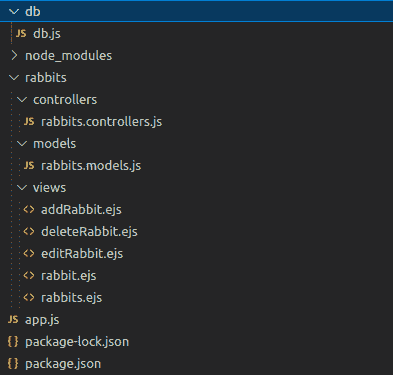

*   请注意，我们去掉了之前的大部分文件夹，保留了`db`、`controllers`和`models`文件夹。
*   我们添加了一个`views`文件夹，对应于我们想要呈现的每个页面/响应。
*   `db.js`和`models.js`文件保持完全相同。
*   我们的`app.js`应该是这样的:

```
// App.js
const express = require("express");
var path = require('path');

const rabbitControllers = require("./rabbits/controllers/rabbits.controllers")

const app = express()
const port = 7070

// Ejs config
app.set("view engine", "ejs")
app.set('views', path.join(__dirname, './rabbits/views'))

/* Controllers */
app.use("/rabbits", rabbitControllers)

app.listen(port, () => console.log(`⚡️[server]: Server is running at http://localhost:${port}`)) 
```

*   `rabbits.controllers.js`更改定义路线，连接到相应的模型功能，并为每个请求呈现相应的视图。请注意，在 render 方法中，我们将请求响应作为参数传递给视图。😉

```
// rabbits.controllers.js
const express = require('express')
const bodyParser = require('body-parser')

const jsonParser = bodyParser.json()

const { getAllItems, getItem, editItem, addItem, deleteItem } = require('../models/rabbits.models')

const router = express.Router()

router.get('/', (req, res) => {
    try {
        const resp = getAllItems()
        res.render('rabbits', { rabbits: resp })

    } catch (err) {
        res.status(500).send(err)
    }
})

router.get('/:id', (req, res) => {
    try {
        const resp = getItem(parseInt(req.params.id))
        res.render('rabbit', { rabbit: resp })

    } catch (err) {
        res.status(500).send(err)
    }
})

router.put('/:id', jsonParser, (req, res) => {
    try {
        const resp = editItem(req.params.id, req.body.item)
        res.render('editRabbit', { rabbit: resp })

    } catch (err) {
        res.status(500).send(err)
    }
})

router.post('/', jsonParser, (req, res) => {
    try {
        const resp = addItem(req.body.item)
        res.render('addRabbit', { rabbits: resp })

    } catch (err) {
        res.status(500).send(err)
    }
})

router.delete('/:id', (req, res) => {
    try {
        const resp = deleteItem(req.params.idx)
        res.render('deleteRabbit', { rabbits: resp })

    } catch (err) {
        res.status(500).send(err)
    }
})

module.exports = router
```

*   最后，在视图文件中，我们将收到的变量作为参数，并将其呈现为 HTML。

```
<!-- Rabbits view -->
<!DOCTYPE html>
<html lang="en">
    <body>
        <header>All rabbits</header>
        <main>
            <ul>
                <% rabbits.forEach(function(rabbit) { %>
                    <li>
                        Id: <%= rabbit.id %>
                        Name: <%= rabbit.name %>
                    </li>
                <% }) %>
            </ul>
        </main>
    </body>
</html>
```

```
<!-- Rabbit view -->
<!DOCTYPE html>
<html lang="en">
    <body>
        <header>Rabbit view</header>
        <main>
                <p>
                    Id: <%= rabbit.id %>
                    Name: <%= rabbit.name %>
                </p>
        </main>
    </body>
</html>
```

现在，我们可以进入浏览器，点击 [`http://localhost:7070/rabbits`](http://localhost:7070/rabbits) ，得到:

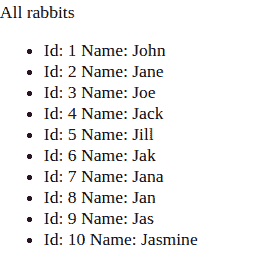

或`[http://localhost:7070/rabbits](http://localhost:7070/rabbits)/2`并得到:


而这就是 MVC！


# 结论

我希望所有这些例子能帮助你理解当我们在软件世界中提到“架构”时，我们在谈论什么。

正如我在开始时所说的，这是一个庞大而复杂的话题，通常包含许多不同的内容。

在这里，我们介绍了基础设施模式和系统、托管选项和云提供商，最后介绍了一些您可以在项目中使用的常见且有用的文件夹结构。

我们已经了解了垂直和水平扩展、整体应用和微服务、弹性和无服务器云计算...很多事情。但这只是冰山一角！所以继续学习，自己做研究。💪💪

一如既往，我希望你喜欢这本手册，并学到一些新东西。如果你愿意，你也可以在 [LinkedIn](https://www.linkedin.com/in/germancocca/) 或 [Twitter](https://twitter.com/CoccaGerman) 上关注我。
和[这里有一首小小的告别曲](https://www.youtube.com/watch?v=PDilu87kQCk)送给你，因...为什么不呢？🤷‍♂️


干杯，下期再见！✌️