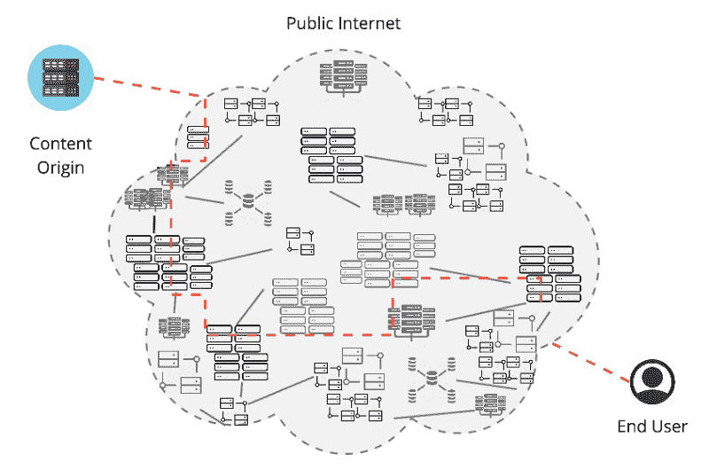
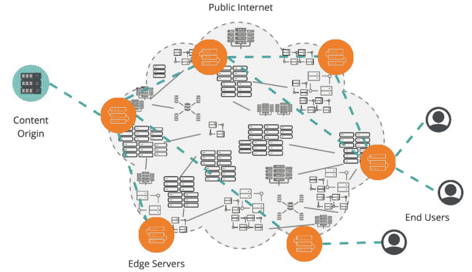
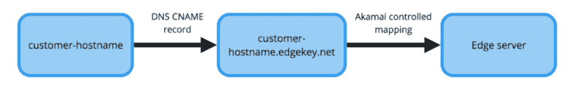
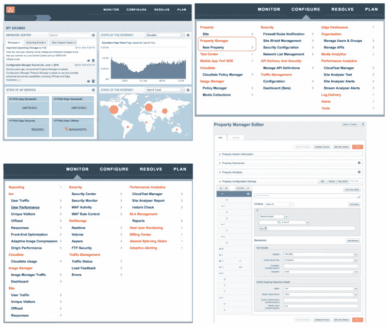
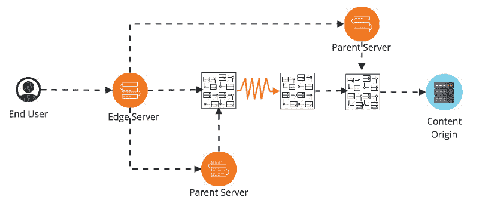
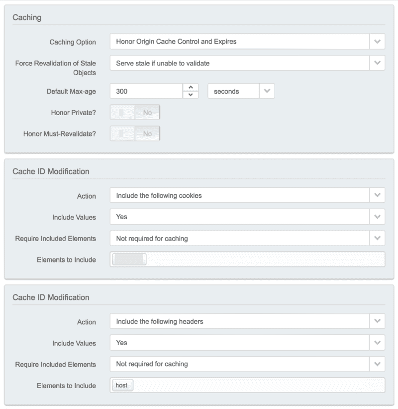

# Akamai 内容传送网络简介

> 原文：<https://www.freecodecamp.org/news/an-introduction-to-the-akamai-content-delivery-network-806aa16d8781/>

Akamai 是世界领先的内容交付网络(CDN)提供商之一。通过 [Akamai 智能平台](https://www.akamai.com/uk/en/solutions/intelligent-platform/)提供了许多产品来帮助提高性能、可用性、安全性和洞察力。

其他 CDN 包括 Cloudflare、Fastly、MaxCDN、Incapsula 和 Rackspace。

在这里，我们将了解什么是 CDN，然后是 Akamai 实施的一些细节，包括:

*   Akamai 智能平台和边缘服务器
*   Akamai 界面和属性管理器
*   路由性能
*   贮藏

#### 什么是 CDN？

用户在公共互联网上请求内容可能看起来很简单，连接到保存内容的服务器(“内容源”)并将其返回给用户，但实际上非常复杂。

Hidden complexity of connecting to the content origin

该连接可能需要通过许多互联网服务提供商(ISP)、对等点和数据中心，跨越竞争网络，并且苦于没有一致可用的路由。

可以从不同的全球位置使用许多不同的设备类型和带宽，请求不同的内容类型。

这可能会导致速度和可用性的波动、安全挑战以及用户和内容来源之间发生的事情的不可见性。

CDN 将更多控制权放在内容提供商手中，有助于改善最终用户体验。

它通过充当并行高性能网络来实现这一点，并维护自己的高度分布式服务器网络。通过分散在许多物理和网络位置，但作为一个网络进行优化，为用户请求提供了更多的控制和可靠性。

随着业务的增长，通过扩展来满足对内容源的更高要求也面临着挑战。我们还将了解如何使用 CDN 工具来减少源上的负载，不仅有助于提高性能，还可以通过减少源必须扩展的高度来降低成本。

#### Akamai 智能平台

Akamai 维护着一个超过 240，000 台“边缘服务器”的全球网络。这些位于互联网的“边缘”，尽可能靠近最终用户。为了实现这一点，许多边缘服务器甚至直接位于 ISP 或移动数据塔中，以更大程度地减少在移动到 Akamai 网络之前连接到用户的 ISP 之间的延迟。

Akamai network of Edge Servers

当用户发出请求时，Akamai 会将其动态映射到最近的可用边缘服务器。在使用 Akamai 网络内所有其他边缘服务器之间的最佳可用路由从源获取内容之前，边缘服务器应用内容提供商指定的商业规则。业务规则在每个边缘服务器上复制。

然后，任何可用并配置为缓存的内容都会缓存在边缘服务器上，以供将来连接到该节点的请求使用。稍后我们将更详细地讨论这一点。

通过在 DNS 中添加从主机名(比如“community.akamai.com”)指向 akamai 边缘主机名“community . Akamai . com . edgekey . net”的 [CNAME](https://medium.freecodecamp.org/why-cant-a-domain-s-root-be-a-cname-8cbab38e5f5c) 记录，向 Akamai 添加站点，其中 Akamai 控制的边缘服务器映射接管分配最佳可用边缘服务器。如果你[找到](https://en.wikipedia.org/wiki/Dig_(command))一个主机名并看到‘edge key . net ’,那么你就知道 Akamai 正在被内容提供商使用。

Entering the Akamai network

#### Akamai 接口

Akamai’s [Luna Control Center](https://www.akamai.com/uk/en/solutions/intelligent-platform/control-center/) and Property Manager

Akamai 提供了一个名为“ [Luna 控制中心](https://www.akamai.com/uk/en/solutions/intelligent-platform/control-center/)”的 web GUI、几个[API](https://developer.akamai.com/api/)和一个 [CLI](https://developer.akamai.com/cli) 。

正如在 *Monitor* 选项卡中看到的，许多报告和分析工具可用于生成 CDN 级别的洞察。来自边缘服务器的日志也可以根据请求提供。

在*配置*选项卡中，我们将重点介绍属性管理器，并将其他选项留给以后的文章。

一个*属性*，有时也被称为*配置*，是控制边缘服务器如何响应用户请求的主要方式。属性将一系列*规则*应用于一组*主机名*，并且您一次只能将一个属性应用于任何给定的主机名。规则由*标准/匹配条件*和*行为*组成。关于这一点的另一个例子将在后面讨论缓存时看到。每个属性的默认规则必须指定一个有效的*内容提供商* ( *CP)代码*来对服务进行计费和报告。规则是“最后一场比赛获胜”。

存在一个属性管理器 API(和 [CLI](https://developer.akamai.com/legacy/cli/packages/property-manager.html) ),有一个很棒的[概念词汇表](https://developer.akamai.com/api/core_features/property_manager/v1.html#papiconcepts)。

当对属性进行更改时，首先创建一个新版本，允许在先前属性保持活动的同时进行更改和测试。新版本可以首先在 Akamai staging 网络上激活，在生产中激活之前，开发人员可以指向他们的本地机器来运行测试。生产激活大约需要 10 分钟才能将新版本全面部署到所有边缘服务器，快速回退选项在几分钟内即可回滚。

#### 路线性能

除了提供数量不断增加的分布式边缘服务器之外，为了能够从尽可能接近每个用户的地方提供缓存内容，可以优化到内容源的路由。在 Akamai 的案例中，这是通过 [SureRoute](https://developer.akamai.com/legacy/learn/Optimization/SureRoute.html) 实现的。

SureRoute view of possible routes to the Content Origin

Akamai 的服务器网络(用户首先连接到边缘服务器和该服务器的任何后续父服务器)*覆盖*到原点的默认路由。默认路由可能在几个不同的 ISP 和网络之间传递，这些 ISP 和网络可能并不总是彼此对等。如上所述，有损链路(或其他此类降级)可能意味着不明显的路由是最佳选择。

最佳路线分两步找到。

*   首先，Akamai 服务器不断地相互探测，并以较低的速度探测所有 Akamai 客户的来源。这些用于在每个边缘服务器/起点配对之间计算和分发*候选路线*的集中列表。
*   其次，为了将这些原始候选路线缩小到单个最佳选项，每个客户将静态的 *SureRoute 测试对象*放置在他们的特定起点处，其大小与他们的平均预期内容相似。*获取该对象的竞赛*在每个边缘服务器和源之间周期性地运行，从而具有最低延迟和/或分组丢失率的记录可以保持最新。

这意味着，对于发送到边缘服务器的每个请求，可以使用该时间点的最快和最可靠的路由到达起点。

#### 贮藏

边缘服务器上的缓存可以大大减少最终用户的延迟。

随着组织规模的扩大，缓存对于减少内容源的负载以提高性能和降低成本也变得越来越重要。

如对“[Akamai 边缘服务器是否共享缓存内容](https://community.akamai.com/customers/s/question/0D50f00005RtpwrCAB/do-akamai-edge-servers-share-cached-content-or-go-to-origin?language=en_US)”的回答中所述，边缘服务器被分组到网络“区域”中。如果特定边缘服务器的缓存未被填充，则它将向其区域中的其他边缘服务器发送本地请求，并且如果对等体有内容，则它将在自己缓存之前提供响应。

如果所有本地对等体的缓存都是空的(或陈旧的),则请求将被转发到边缘的父服务器，在父服务器的对等体之间将进行相同的本地检查。如果在整个路线上没有缓存任何内容，那么它将返回原点，并使用其响应重新填充缓存。

Cache ID Modification behaviours

使用的标准缓存密钥由主机名(域)、路径和查询字符串组成。可以对此进行修改，以减少基数和/或对缓存清除进行更多控制。这可能是通过仅包括特定的查询参数，从而排除诸如产品 id 之类的东西，添加某些 cookies、标题或用户定义的变量的值。

匹配条件(例如，如果存在“*x*”cookie)可以与“绕过缓存”行为相结合，以创建高级场景，例如为会话中的用户或不同位置的用户缓存不同的内容。

诸如 [ModHeader](https://chrome.google.com/webstore/detail/modheader/idgpnmonknjnojddfkpgkljpfnnfcklj) 之类的浏览器扩展可用于查看 [Akamai Pragma 头文件](https://community.akamai.com/customers/s/article/Using-Akamai-Pragma-headers-to-investigate-or-troubleshoot-Akamai-content-delivery?language=en_US)，以便在本地调查缓存行为。

#### 最后的想法

使用 CDN 为内容提供商提供了更多的控制，并且上述工具提供了[好处](https://www.akamai.com/uk/en/cdn/what-are-the-benefits-of-a-cdn.jsp)，这在大规模工作时变得越来越重要。

虽然这里讨论了 Akamai 的特定产品，但其他 CDN 提供商也有类似的大规模工作概念。

其他 Akamai 细节可能会在未来的帖子中涉及，请随时[关注](https://medium.com/@dfrase)或阅读建议的后续主题，如:

*   通过[证书](https://www.akamai.com/uk/en/solutions/intelligent-platform/secure-cdn.jsp) [管理](https://developer.akamai.com/api/core_features/certificate_provisioning_system/v2.html)和网络应用防火墙( [WAF](https://www.akamai.com/uk/en/resources/waf.jsp) s)增强安全性
*   [图像管理器](https://developer.akamai.com/image-manager)，用于优化图像传输
*   [Cloudlets](https://developer.akamai.com/cloudlets) 在资产管理激活周期之外提供粒度控制，有多种类型可用于不同的用例
*   全球流量管理( [GTM](https://www.akamai.com/uk/en/products/web-performance/global-traffic-management.jsp) )用于基于 DNS 的负载平衡
*   [mPulse](https://www.akamai.com/uk/en/products/web-performance/mpulse-real-user-monitoring.jsp) 利用真实用户指标(RUM)进行性能监控

感谢阅读？

您还可以享受:

*   [亚马逊弹性容器服务入门指南](https://medium.com/p/807d8c4960fd?source=user_profile---------11------------------)
*   [如何向现有的 React 应用程序增加流量](https://medium.freecodecamp.org/incrementally-add-flow-type-checking-react-261fee015f80)
*   [CSS 网格渐进增强](https://medium.freecodecamp.org/progressive-enhancement-with-css-grid-8138d4c7508c)